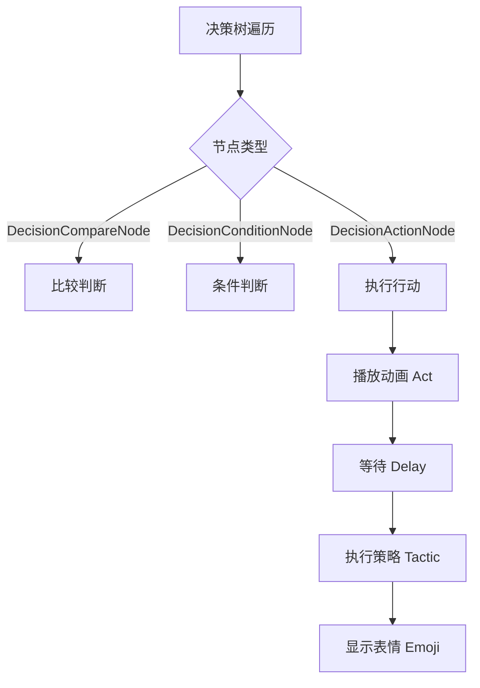
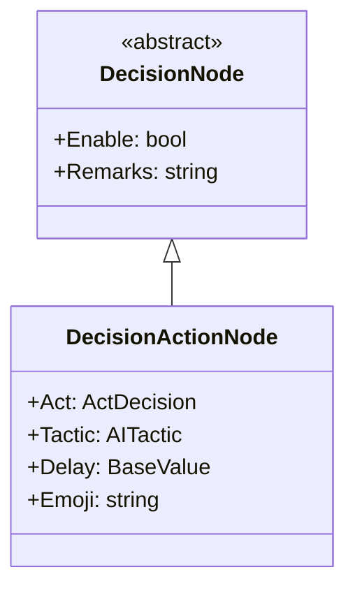

# DecisionActionNode.cs 文档

## 📄 文件信息表

| 属性 | 值 |
|------|------|
| 文件路径 | `Assets/Scripts/Code/Module/Config/DecisionTree/DecisionActionNode.cs` |
| 命名空间 | `TaoTie` |
| 类类型 | 决策节点类 |
| 依赖模块 | Nino.Core, Sirenix.OdinInspector |
| 继承 | `DecisionNode` |
| 序列化 | NinoType |

---

## 🏗️ 类说明

**DecisionActionNode** 是决策树的叶子节点，用于执行具体的 AI 行动。

### 核心职责

- 定义 AI 要执行的动作类型
- 指定决策策略（出价策略）
- 配置延迟执行时间
- 设置表情动画

### 在决策树中的位置

```
DecisionNode (基类)
└── DecisionActionNode (行动节点 - 叶子节点)
```

---

## 📊 字段表

| 字段名 | 类型 | 访问修饰符 | 说明 |
|--------|------|------------|------|
| `Enable` | `bool` | `public` | 是否启用（继承自 DecisionNode） |
| `Remarks` | `string` | `public` | 策划备注（仅编辑器） |
| `Act` | `ActDecision` | `public` | 动画类型 |
| `Tactic` | `AITactic` | `public` | 决策策略（出价策略） |
| `Delay` | `BaseValue` | `public` | 延迟执行时间（毫秒） |
| `Emoji` | `string` | `public` | 表情名 |

---

## 🔧 方法说明

（继承自 `DecisionNode`，无额外方法）

### 字段说明

#### Act (动画类型)

使用 `ActDecision` 枚举定义角色动画：
- `NoActDecision`: 保持当前动作
- `Action_Jump/Run/Walk/Punch`: 基础动作
- `Dance_1~4`: 舞蹈动作
- `Emoji_*`: 表情动作
- `Interaction_*`: 交互动作
- `Reaction_*`: 反应动作
- `Stand_Idle1~6`: 待机动作

#### Tactic (决策策略)

使用 `AITactic` 枚举定义出价策略：
- `Sidelines`: 观望
- `LowWeight`: 喊低价
- `MediumWeight`: 喊中价
- `HighWeight`: 喊高价
- `AllIn`: 梭哈
- `Random`: 钱够则随机
- `RandomLow`: 钱够则只随机低价
- `LeaveWalk`: 离场
- `LeaveRun`: 跑路

#### Delay (延迟时间)

使用 `BaseValue` 类型支持动态延迟：
- `SingleValue`: 固定延迟
- `RandomAuctionTime`: 配置表随机时间
- `OperatorValue`: 计算延迟

#### Emoji (表情)

通过 Odin Inspector 下拉选择表情名：
- `Emoji_Aghast`: 震惊
- `Emoji_Angry`: 生气
- `Emoji_Applaud`: 鼓掌
- `Emoji_Cheer`: 欢呼
- `Emoji_Cry`: 哭泣
- 等等...

---

## 🔄 Mermaid 流程图

### 决策树执行流程



### 节点结构



---

## 💡 使用示例

### 基础行动节点

```csharp
// 创建行动节点：出高价，跑步动画
var actionNode = new DecisionActionNode
{
    Act = ActDecision.Action_Run,
    Tactic = AITactic.HighWeight,
    Delay = new SingleValue(500),  // 延迟 500ms
    Emoji = "Emoji_Smile1"
};
```

### 在决策树中使用

```csharp
// 完整的决策树示例
var decisionTree = new ConfigAIDecisionTree
{
    Type = "AggressiveBidder",
    Node = new DecisionCompareNode
    {
        LeftValue = new FormulaValue { Formula = "Budget" },
        CompareMode = CompareMode.Greater,
        RightValue = new SingleValue(1000),
        True = new DecisionActionNode
        {
            Act = ActDecision.Action_Run,
            Tactic = AITactic.HighWeight,
            Delay = new RandomAuctionTime(),
            Emoji = "Emoji_Cheer"
        },
        False = new DecisionActionNode
        {
            Act = ActDecision.Stand_Idle1,
            Tactic = AITactic.Sidelines,
            Delay = new SingleValue(1000)
        }
    }
};
```

### 在配置表中使用

```yaml
# ConfigAIDecisionTree 配置示例
Type: "AggressiveBidderAI"
Node:
  Type: DecisionCompareNode
  LeftValue:
    Type: FormulaValue
    Formula: "Budget"
  CompareMode: Greater
  RightValue:
    Type: SingleValue
    Value: 1000
  True:
    Type: DecisionActionNode
    Act: Action_Run
    Tactic: HighWeight
    Delay:
      Type: RandomAuctionTime  # 随机延迟
    Emoji: Emoji_Cheer
  False:
    Type: DecisionActionNode
    Act: Stand_Idle1
    Tactic: Sidelines
    Delay:
      Type: SingleValue
      Value: 1000
```

### 延迟执行

```csharp
// 使用配置表中的随机延迟
var delayedAction = new DecisionActionNode
{
    Act = ActDecision.Action_Walk,
    Tactic = AITactic.MediumWeight,
    Delay = new RandomAuctionTime()  // 从配置表读取 [min, max]
};

// 或使用固定延迟
var fixedDelayAction = new DecisionActionNode
{
    Act = ActDecision.Dance_1,
    Tactic = AITactic.AllIn,
    Delay = new SingleValue(2000)  // 固定 2 秒延迟
};
```

---

## 📝 使用场景

### 竞价策略

```yaml
# 激进型 AI
Type: "AggressiveAI"
Node:
  Type: DecisionActionNode
  Act: Action_Run
  Tactic: HighWeight  # 喊高价
  Delay:
    Type: MinAuctionTime  # 最快出价
  Emoji: Emoji_Nice

# 保守型 AI
Type: "ConservativeAI"
Node:
  Type: DecisionActionNode
  Act: Stand_Idle1
  Tactic: LowWeight  # 喊低价
  Delay:
    Type: RandomAuctionTime  # 随机延迟
  Emoji: Emoji_Smile1
```

### 表情反馈

```yaml
# 获胜时
Type: "WinReaction"
Node:
  Type: DecisionActionNode
  Act: Dance_1
  Tactic: Sidelines
  Delay:
    Type: SingleValue
    Value: 0
  Emoji: Emoji_Cheer

# 失败时
Type: "LoseReaction"
Node:
  Type: DecisionActionNode
  Act: Reaction_Knockout
  Tactic: LeaveRun
  Delay:
    Type: SingleValue
    Value: 500
  Emoji: Emoji_Cry
```

---

## ⚠️ 注意事项

### Delay 值类型

- `Delay` 是 `BaseValue` 类型，支持多态
- 必须正确初始化，避免空引用
- 默认值为 `new RandomAuctionTime()`

### 编辑器配置

- `Remarks` 字段仅在 Unity 编辑器中显示
- `Emoji` 字段使用 Odin Inspector 的下拉选择
- 确保配置的值在枚举范围内

---

## 🔗 相关文档链接

- [DecisionNode.cs.md](./DecisionNode.cs.md) - 决策节点基类
- [ActDecision.cs.md](./ActDecision.cs.md) - 动画类型枚举
- [AITactic.cs.md](./AITactic.cs.md) - 决策策略枚举
- [DecisionCompareNode.cs.md](./DecisionCompareNode.cs.md) - 比较节点
- [ConfigAIDecisionTree.cs.md](./ConfigAIDecisionTree.cs.md) - AI 决策树配置

---

*最后更新：2026-03-02*
