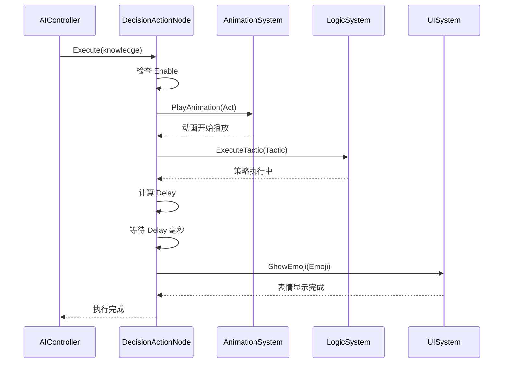

# DecisionActionNode.cs 注解文档

## 文件基本信息

| 属性 | 值 |
|------|------|
| **文件名** | DecisionActionNode.cs |
| **路径** | Assets/Scripts/Code/Module/Config/DecisionTree/DecisionActionNode.cs |
| **所属模块** | 框架层 → Code/Module/Config/DecisionTree |
| **文件职责** | 定义执行动作决策节点，触发 AI 行为和执行策略 |

---

## 类/结构体说明

### DecisionActionNode

| 属性 | 说明 |
|------|------|
| **职责** | 决策树的叶子节点，执行具体的 AI 动作和策略 |
| **泛型参数** | 无 |
| **继承关系** | 继承 `DecisionNode` |
| **实现的接口** | 无 |

**设计模式**: 命令模式 + 策略模式

```csharp
// 动作节点示例
var actionNode = new DecisionActionNode
{
    Act = ActDecision.Action_Punch,      // 出拳动画
    Tactic = AITactic.HighWeight,        // 高价策略
    Delay = new RandomAuctionTime(),     // 随机延迟
    Emoji = "1"                          // 表情
};
```

---

## 字段与属性

### Act

| 属性 | 值 |
|------|------|
| **类型** | `ActDecision` |
| **访问级别** | `public` |
| **说明** | 动画/动作类型，定义 AI 执行的视觉表现 |

**Nino 序列化**: `[NinoMember(10)]`

**Odin Inspector**: `[LabelText("动画类型")]`

**枚举值** (部分):
| 值 | 说明 |
|----|------|
| `NoActDecision` | 无动作，保持当前状态 |
| `Action_Jump` | 跳跃 |
| `Action_Punch` | 出拳 |
| `Action_Run` | 跑步 |
| `Action_Walk` | 走路 |
| `Dance_1` ~ `Dance_4` | 舞蹈动作 |
| `Emoji_*` | 表情动作 |
| `Interaction_*` | 交互动作 |
| `Reaction_*` | 受击/反应动作 |
| `Stand_Idle1` ~ `Stand_Idle6` | 待机动作 |

---

### Tactic

| 属性 | 值 |
|------|------|
| **类型** | `AITactic` |
| **访问级别** | `public` |
| **说明** | AI 策略类型，定义 AI 的决策逻辑 |

**Nino 序列化**: `[NinoMember(11)]`

**Odin Inspector**: `[LabelText("决策类型")]`

**枚举值**:
| 值 | 说明 |
|----|------|
| `Sidelines` | 观望，不参与 |
| `LowWeight` | 喊低价 |
| `MediumWeight` | 喊中价 |
| `HighWeight` | 喊高价 |
| `AllIn` | 梭哈，全押 |
| `Random` | 钱够则随机 |
| `RandomLow` | 钱够则只随机低价 |
| `LeaveWalk` | 离场（走路） |
| `LeaveRun` | 跑路（跑步） |

---

### Delay

| 属性 | 值 |
|------|------|
| **类型** | `BaseValue` |
| **访问级别** | `public` |
| **默认值** | `new RandomAuctionTime()` |
| **说明** | 延迟执行时间（毫秒），支持动态计算 |

**Nino 序列化**: `[NinoMember(12)]`

**Odin Inspector**: `[LabelText("延迟执行出价时间 (ms)")]`

**用途**:
- 模拟人类反应时间
- 增加 AI 行为的自然度
- 避免所有 AI 同时行动

**示例值**:
```csharp
// 固定延迟
Delay = new SingleValue { Value = 1000 };  // 1 秒

// 随机延迟
Delay = new RandomAuctionTime { Min = 500, Max = 1500 };  // 0.5-1.5 秒
```

---

### Emoji

| 属性 | 值 |
|------|------|
| **类型** | `string` |
| **访问级别** | `public` |
| **说明** | 表情名称，用于显示 AI 情绪 |

**Nino 序列化**: `[NinoMember(13)]`

**Odin Inspector**: `[LabelText("表情名")]`

**Odin Dropdown**: `[ValueDropdown("@"+nameof(OdinDropdownHelper)+"."+nameof(OdinDropdownHelper.GetEmoji)+"()")]`

**可选值**:
| 值 | 说明 |
|----|------|
| `""` | 无表情 |
| `"0"` ~ `"6"` | 表情 ID（0-6） |

---

## Nino 序列化特性

### NinoType

```csharp
[NinoType(false)]
```

**说明**: 标记为 Nino 可序列化类型。

### NinoMember

```csharp
[NinoMember(10)]  // Act
[NinoMember(11)]  // Tactic
[NinoMember(12)]  // Delay
[NinoMember(13)]  // Emoji
```

**说明**: 显式指定成员序列化顺序。

---

## Odin Inspector 集成

### Act 下拉菜单

```csharp
[NinoMember(10)][LabelText("动画类型")]
public ActDecision Act;
```

**效果**: Inspector 中显示为 "动画类型"，使用 `ActDecision` 枚举的下拉菜单。

### Tactic 下拉菜单

```csharp
[NinoMember(11)][LabelText("决策类型")]
public AITactic Tactic;
```

**效果**: Inspector 中显示为 "决策类型"，使用 `AITactic` 枚举的下拉菜单（带中文标签）。

### Emoji 下拉菜单

```csharp
#if UNITY_EDITOR
[ValueDropdown("@"+nameof(OdinDropdownHelper)+"."+nameof(OdinDropdownHelper.GetEmoji)+"()")]
#endif
[NinoMember(13)][LabelText("表情名")]
public string Emoji;
```

**效果**: Inspector 中显示下拉菜单，选项来自 `OdinDropdownHelper.GetEmoji()`:
```
- 无 ("")
- 0 ("0")
- 1 ("1")
- 2 ("2")
- 3 ("3")
- 4 ("4")
- 5 ("5")
- 6 ("6")
```

---

## 动作执行流程



---

## 使用示例

### 示例 1: 简单攻击动作

```csharp
// 攻击动作
var attackAction = new DecisionActionNode
{
    Act = ActDecision.Action_Punch,
    Tactic = AITactic.HighWeight,
    Remarks = "出拳攻击，高价策略"
};
```

### 示例 2: 逃跑动作

```csharp
// 逃跑动作
var fleeAction = new DecisionActionNode
{
    Act = ActDecision.Action_Run,
    Tactic = AITactic.LeaveRun,
    Delay = new SingleValue { Value = 200 },  // 200ms 后执行
    Remarks = "跑步逃跑"
};
```

### 示例 3: 拍卖 AI 动作

```csharp
// 拍卖 AI：低价竞标
var bidAction = new DecisionActionNode
{
    Act = ActDecision.Emoji_Nice,
    Tactic = AITactic.LowWeight,
    Delay = new RandomAuctionTime { Min = 500, Max = 1500 },
    Emoji = "1",
    Remarks = "微笑表情，低价竞标，随机延迟 0.5-1.5 秒"
};
```

### 示例 4: 待机动作

```csharp
// 待机动作
var idleAction = new DecisionActionNode
{
    Act = ActDecision.Stand_Idle1,
    Tactic = AITactic.Sidelines,
    Remarks = "待机动作 1，观望策略"
};
```

### 示例 5: 交互动作

```csharp
// 交互动作：拾取物品
var pickupAction = new DecisionActionNode
{
    Act = ActDecision.Interaction_Pickup,
    Tactic = AITactic.Sidelines,
    Delay = new SingleValue { Value = 500 },
    Remarks = "拾取物品"
};
```

### 示例 6: 完整决策树

```csharp
// 完整的拍卖 AI 决策树
var auctionAI = new ConfigAIDecisionTree
{
    Type = "Auction",
    Node = new DecisionConditionNode
    {
        Condition = "HasEnoughMoney",
        True = new DecisionCompareNode
        {
            LeftValue = new CurrentMoneyValue(),
            CompareMode = CompareMode.Greater,
            RightValue = new FormulaValue("CurrentPrice * 1.5"),
            True = new DecisionActionNode
            {
                Act = ActDecision.Emoji_Nice,
                Tactic = AITactic.LowWeight,
                Delay = new RandomAuctionTime { Min = 500, Max = 1500 },
                Emoji = "1",
                Remarks = "价格合理，微笑低价竞标"
            },
            False = new DecisionActionNode
            {
                Act = ActDecision.Emoji_Sigh,
                Tactic = AITactic.Sidelines,
                Remarks = "价格太高，叹气观望"
            }
        },
        False = new DecisionActionNode
        {
            Act = ActDecision.Emoji_Aghast,
            Tactic = AITactic.LeaveWalk,
            Emoji = "3",
            Remarks = "钱不够，震惊离场"
        }
    }
};
```

---

## ActDecision 枚举详解

### 动作分类

```
ActDecision
├── 无动作
│   └── NoActDecision
│
├── 基础动作
│   ├── Action_Jump      (跳跃)
│   ├── Action_Punch     (出拳)
│   ├── Action_Run       (跑步)
│   └── Action_Walk      (走路)
│
├── 舞蹈动作
│   ├── Dance_1 ~ Dance_4
│
├── 表情动作
│   ├── Emoji_Aghast     (震惊)
│   ├── Emoji_Angry      (生气)
│   ├── Emoji_Applaud    (鼓掌)
│   ├── Emoji_Be_Bashful (害羞)
│   ├── Emoji_Cheer      (欢呼)
│   ├── Emoji_Cry        (哭泣)
│   ├── Emoji_Gas        (喘气)
│   ├── Emoji_Hi         (打招呼)
│   ├── Emoji_Nice       (赞)
│   ├── Emoji_Pester     (纠缠)
│   ├── Emoji_Putter_Around (闲逛)
│   ├── Emoji_Showmanship (表演)
│   ├── Emoji_SideToSide  (左右摇摆)
│   ├── Emoji_Sigh        (叹气)
│   ├── Emoji_Smile1      (微笑 1)
│   └── Emoji_Smile2      (微笑 2)
│
├── 交互动作
│   ├── Interaction_Item_Put (放置物品)
│   ├── Interaction_Pickup   (拾取)
│   ├── Interaction_Shovel   (铲子)
│   └── Interaction_Sickle   (镰刀)
│
├── 受击反应
│   ├── Reaction_Agonize  (痛苦)
│   ├── Reaction_Knockout (击倒)
│   └── Reaction_Struck   (被击中)
│
└── 待机动作
    ├── Stand_Idle1 ~ Stand_Idle6
```

---

## AITactic 枚举详解

### 策略分类

```
AITactic
├── 观望类
│   ├── Sidelines    (观望)
│   └── LeaveWalk    (离场 - 走路)
│
├── 竞价类
│   ├── LowWeight    (喊低价)
│   ├── MediumWeight (喊中价)
│   ├── HighWeight   (喊高价)
│   └── AllIn        (梭哈)
│
├── 随机类
│   ├── Random       (钱够则随机)
│   └── RandomLow    (钱够则只随机低价)
│
└── 逃跑类
    └── LeaveRun     (跑路)
```

### 策略使用场景

| 策略 | 使用场景 | 风险 |
|------|----------|------|
| `Sidelines` | 观察局势，不急于行动 | 低 |
| `LowWeight` | 保守竞价，试探市场 | 低 |
| `MediumWeight` | 平衡策略 | 中 |
| `HighWeight` | 激进竞价，志在必得 | 高 |
| `AllIn` | 孤注一掷 | 极高 |
| `Random` | 随机策略，难以预测 | 中 |
| `LeaveWalk` | 优雅离场 | 低 |
| `LeaveRun` | 紧急逃跑 | 低 |

---

## 设计要点

### 为什么分离 Act 和 Tactic？

1. **关注点分离**:
   - `Act`: 视觉表现（动画）
   - `Tactic`: 逻辑决策（策略）

2. **灵活组合**:
   ```csharp
   // 同样的动作，不同策略
   new DecisionActionNode { Act = Action_Punch, Tactic = LowWeight };
   new DecisionActionNode { Act = Action_Punch, Tactic = HighWeight };
   
   // 同样的策略，不同动作
   new DecisionActionNode { Act = Emoji_Nice, Tactic = LowWeight };
   new DecisionActionNode { Act = Action_Punch, Tactic = LowWeight };
   ```

3. **独立扩展**: 新增动作或策略互不影响

### Delay 的设计意义

1. **自然度**: 模拟人类反应时间
2. **差异化**: 不同 AI 可以有不同反应速度
3. **策略性**: 快速反应 vs 深思熟虑
4. **防同步**: 避免多个 AI 同时行动

### Emoji 的设计意义

1. **情绪表达**: 增强 AI 拟人化
2. **视觉反馈**: 玩家更容易理解 AI 意图
3. **趣味性**: 增加游戏乐趣
4. **可选性**: 可以为空，不影响核心逻辑

---

## 相关文档

- [DecisionNode.cs.md](./DecisionNode.cs.md) - 决策节点基类
- [DecisionConditionNode.cs.md](./DecisionConditionNode.cs.md) - 条件判断节点
- [DecisionCompareNode.cs.md](./DecisionCompareNode.cs.md) - 数值比较节点
- [ActDecision.cs.md](./ActDecision.cs.md) - 动作枚举
- [AITactic.cs.md](./AITactic.cs.md) - 策略枚举
- [OdinDropdownHelper.cs.md](../OdinDropdownHelper.cs.md) - Odin 下拉菜单助手

---

*文档生成时间：2026-02-28 | OpenClaw AI 助手*
