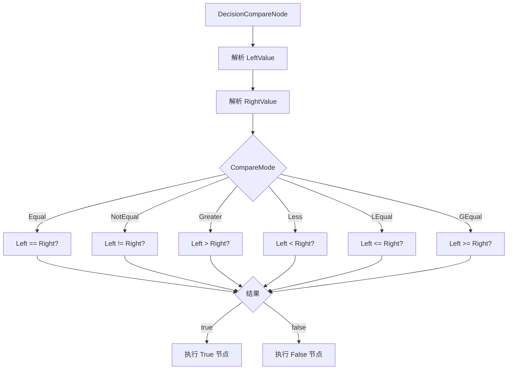
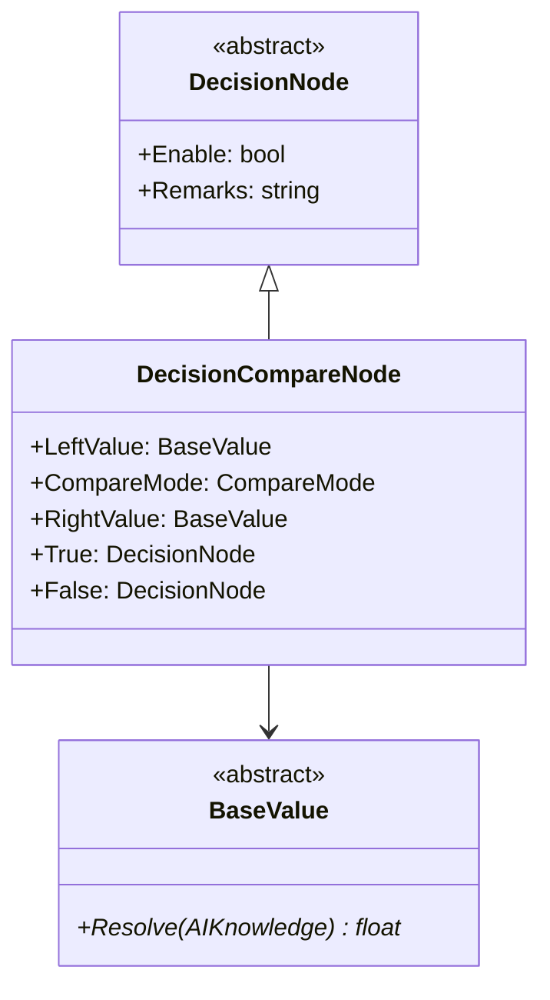

# DecisionCompareNode.cs 文档

## 📄 文件信息表

| 属性 | 值 |
|------|------|
| 文件路径 | `Assets/Scripts/Code/Module/Config/DecisionTree/DecisionCompareNode.cs` |
| 命名空间 | `TaoTie` |
| 类类型 | 决策节点类 |
| 依赖模块 | Nino.Core, Sirenix.OdinInspector |
| 继承 | `DecisionNode` |
| 序列化 | NinoType |

---

## 🏗️ 类说明

**DecisionCompareNode** 是决策树的比较分支节点，通过比较两个值的大小决定执行哪个分支。

### 核心职责

- 存储左右两个操作数（`BaseValue` 类型）
- 定义比较模式（等于、大于、小于等）
- 根据比较结果选择 True 或 False 分支

### 在决策树中的位置

```
DecisionNode (基类)
└── DecisionCompareNode (比较节点 - 分支节点)
    ├── LeftValue: BaseValue (左值)
    ├── CompareMode: CompareMode (比较模式)
    ├── RightValue: BaseValue (右值)
    ├── True: DecisionNode (比较为真时执行)
    └── False: DecisionNode (比较为假时执行)
```

---

## 📊 字段表

| 字段名 | 类型 | 访问修饰符 | 说明 |
|--------|------|------------|------|
| `Enable` | `bool` | `public` | 是否启用（继承自 DecisionNode） |
| `Remarks` | `string` | `public` | 策划备注（仅编辑器） |
| `LeftValue` | `BaseValue` | `public` | 左操作数（默认 `SingleValue()`） |
| `CompareMode` | `CompareMode` | `public` | 比较模式 |
| `RightValue` | `BaseValue` | `public` | 右操作数（默认 `SingleValue()`） |
| `True` | `DecisionNode` | `public` | 比较为真时执行的子节点 |
| `False` | `DecisionNode` | `public` | 比较为假时执行的子节点 |

---

## 🔧 方法说明

（继承自 `DecisionNode`，无额外方法）

### 字段说明

#### CompareMode (比较模式)

| 值 | 名称 | 标签 | 运算 |
|----|------|------|------|
| 0 | `Equal` | == | Left == Right |
| 1 | `NotEqual` | != | Left != Right |
| 2 | `Greater` | > | Left > Right |
| 3 | `Less` | < | Left < Right |
| 4 | `LEqual` | <= | Left <= Right |
| 5 | `GEqual` | >= | Left >= Right |

---

## 🔄 Mermaid 流程图

### 比较判断流程



### 节点结构



---

## 💡 使用示例

### 基础比较节点

```csharp
// 创建比较节点：如果 Cost > 100
var compareNode = new DecisionCompareNode
{
    LeftValue = new FormulaValue { Formula = "Cost" },
    CompareMode = CompareMode.Greater,
    RightValue = new SingleValue(100),
    True = new DecisionActionNode { Tactic = AITactic.HighWeight },
    False = new DecisionActionNode { Tactic = AITactic.LowWeight }
};
```

### 复杂表达式比较

```csharp
// 比较：(Cost * 1.5) > Budget
var complexCompare = new DecisionCompareNode
{
    LeftValue = new OperatorValue
    {
        Left = new FormulaValue { Formula = "Cost" },
        Op = LogicMode.Mul,
        Right = new SingleValue(1.5f)
    },
    CompareMode = CompareMode.Greater,
    RightValue = new FormulaValue { Formula = "Budget" },
    True = new DecisionActionNode { Tactic = AITactic.LeaveWalk },
    False = new DecisionActionNode { Tactic = AITactic.Sidelines }
};
```

### 在配置表中使用

```yaml
# ConfigAIDecisionTree 配置示例
Type: "SmartBidderAI"
Node:
  Type: DecisionCompareNode
  LeftValue:
    Type: FormulaValue
    Formula: "CurrentBid"
  CompareMode: Greater
  RightValue:
    Type: FormulaValue
    Formula: "Budget"
  True:
    Type: DecisionActionNode
    Tactic: LeaveWalk  # 超出预算，离场
  False:
    Type: DecisionActionNode
    Tactic: HighWeight  # 预算内，出高价
```

### 嵌套比较

```csharp
// 多层比较：100 < Cost < 500
var rangeCheck = new DecisionConditionNode
{
    Condition = "True",  // 总是进入 True 分支
    True = new DecisionCompareNode
    {
        LeftValue = new FormulaValue { Formula = "Cost" },
        CompareMode = CompareMode.Greater,
        RightValue = new SingleValue(100),
        True = new DecisionCompareNode
        {
            LeftValue = new FormulaValue { Formula = "Cost" },
            CompareMode = CompareMode.Less,
            RightValue = new SingleValue(500),
            True = new DecisionActionNode { Tactic = AITactic.MediumWeight },
            False = new DecisionActionNode { Tactic = AITactic.LowWeight }
        },
        False = new DecisionActionNode { Tactic = AITactic.LeaveWalk }
    },
    False = new DecisionActionNode { Tactic = AITactic.LeaveRun }
};
```

---

## 📝 使用场景

### 预算检查

```yaml
# 检查是否超出预算
Type: "BudgetCheck"
Node:
  Type: DecisionCompareNode
  LeftValue:
    Type: FormulaValue
    Formula: "CurrentBid"
  CompareMode: Greater
  RightValue:
    Type: FormulaValue
    Formula: "Budget"
  True:
    Type: DecisionActionNode
    Tactic: LeaveWalk
  False:
    Type: DecisionActionNode
    Tactic: HighWeight
```

### 血量判断

```yaml
# 检查血量是否低于 30%
Type: "HealthCheck"
Node:
  Type: DecisionCompareNode
  LeftValue:
    Type: OperatorValue
    Op: Div
    Left:
      Type: FormulaValue
      Formula: "Health"
    Right:
      Type: FormulaValue
      Formula: "MaxHealth"
  CompareMode: Less
  RightValue:
    Type: SingleValue
    Value: 0.3  # 30%
  True:
    Type: DecisionActionNode
    Tactic: LeaveRun  # 血少跑路
  False:
    Type: DecisionActionNode
    Tactic: AllIn  # 血多梭哈
```

### 时间判断

```yaml
# 检查是否超过出价冷却时间
Type: "CooldownCheck"
Node:
  Type: DecisionCompareNode
  LeftValue:
    Type: TimeSinceLastBid  # 距上次出价时间
  CompareMode: Greater
  RightValue:
    Type: MinAuctionTime  # 最小冷却时间
  True:
    Type: DecisionActionNode
    Tactic: LowWeight  # 冷却结束，可以出价
  False:
    Type: DecisionActionNode
    Tactic: Sidelines  # 冷却中，观望
```

---

## ⚠️ 注意事项

### 值类型

- `LeftValue` 和 `RightValue` 是 `BaseValue` 类型
- 支持多态：`SingleValue`, `FormulaValue`, `OperatorValue` 等
- 必须正确初始化，避免空引用

### 比较精度

- 比较使用 `float` 类型
- 注意浮点数精度问题
- 相等比较可能因精度问题失败

### 空值保护

- `True` 和 `False` 字段标记为 `[NotNull]`
- 使用前确保已正确赋值
- 默认值为 `new SingleValue()`

---

## 🔗 相关文档链接

- [DecisionNode.cs.md](./DecisionNode.cs.md) - 决策节点基类
- [DecisionActionNode.cs.md](./DecisionActionNode.cs.md) - 行动节点
- [DecisionConditionNode.cs.md](./DecisionConditionNode.cs.md) - 条件节点
- [CompareMode.cs.md](./CompareMode.cs.md) - 比较模式枚举
- [BaseValue.cs.md](../Value/BaseValue.cs.md) - 值基类
- [ConfigAIDecisionTree.cs.md](./ConfigAIDecisionTree.cs.md) - AI 决策树配置

---

*最后更新：2026-03-02*
