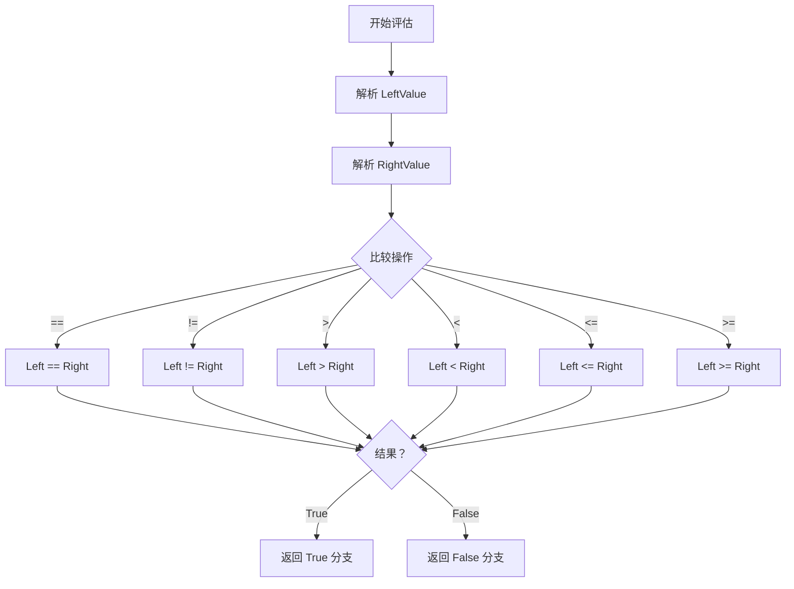

# DecisionCompareNode.cs 注解文档

## 文件基本信息

| 属性 | 值 |
|------|------|
| **文件名** | DecisionCompareNode.cs |
| **路径** | Assets/Scripts/Code/Module/Config/DecisionTree/DecisionCompareNode.cs |
| **所属模块** | 框架层 → Code/Module/Config/DecisionTree |
| **文件职责** | 定义数值比较决策节点，支持动态值计算和多种比较模式 |

---

## 类/结构体说明

### DecisionCompareNode

| 属性 | 说明 |
|------|------|
| **职责** | 比较两个数值（支持动态计算），根据比较结果选择执行分支 |
| **泛型参数** | 无 |
| **继承关系** | 继承 `DecisionNode` |
| **实现的接口** | 无 |

**设计模式**: 组合模式 + 策略模式

```csharp
// 比较节点示例
var node = new DecisionCompareNode
{
    LeftValue = new SingleValue { Value = 50f },      // 当前血量
    CompareMode = CompareMode.Greater,                 // >
    RightValue = new SingleValue { Value = 30f },     // 阈值
    True = new DecisionActionNode { Act = ActDecision.Action_Punch },
    False = new DecisionActionNode { Act = ActDecision.Action_Run }
};
```

---

## 字段与属性

### LeftValue

| 属性 | 值 |
|------|------|
| **类型** | `BaseValue` |
| **访问级别** | `public` |
| **默认值** | `new SingleValue()` |
| **说明** | 比较的左侧值，支持动态计算 |

**Nino 序列化**: `[NinoMember(10)]`

**非空约束**: `[NotNull]`

**用途**:
- 可以是固定值（SingleValue）
- 可以是公式计算值（FormulaValue）
- 可以是基于 AI 状态的动态值

**示例**:
```csharp
// 固定值
LeftValue = new SingleValue { Value = 50f };

// 动态值（基于 AI 知识库）
LeftValue = new HealthPercentValue();  // 当前血量百分比
```

---

### CompareMode

| 属性 | 值 |
|------|------|
| **类型** | `CompareMode` |
| **访问级别** | `public` |
| **说明** | 比较操作符 |

**Nino 序列化**: `[NinoMember(11)]`

**枚举值**:
| 值 | 操作符 | 说明 |
|----|--------|------|
| `Equal` | `==` | 等于 |
| `NotEqual` | `!=` | 不等于 |
| `Greater` | `>` | 大于 |
| `Less` | `<` | 小于 |
| `LEqual` | `<=` | 小于等于 |
| `GEqual` | `>=` | 大于等于 |

---

### RightValue

| 属性 | 值 |
|------|------|
| **类型** | `BaseValue` |
| **访问级别** | `public` |
| **默认值** | `new SingleValue()` |
| **说明** | 比较的右侧值，支持动态计算 |

**Nino 序列化**: `[NinoMember(12)]`

**非空约束**: `[NotNull]`

---

### True

| 属性 | 值 |
|------|------|
| **类型** | `DecisionNode` |
| **访问级别** | `public` |
| **说明** | 比较结果为真时执行的下一个决策节点 |

**Nino 序列化**: `[NinoMember(13)]`

**非空约束**: `[NotNull]`

---

### False

| 属性 | 值 |
|------|------|
| **类型** | `DecisionNode` |
| **访问级别** | `public` |
| **说明** | 比较结果为假时执行的下一个决策节点 |

**Nino 序列化**: `[NinoMember(14)]`

**非空约束**: `[NotNull]`

---

## Nino 序列化特性

### NinoType

```csharp
[NinoType(false)]
```

**说明**: 标记为 Nino 可序列化类型。

### NinoMember

```csharp
[NinoMember(10)]  // LeftValue
[NinoMember(11)]  // CompareMode
[NinoMember(12)]  // RightValue
[NinoMember(13)]  // True
[NinoMember(14)]  // False
```

**说明**: 显式指定成员序列化顺序。

---

## 比较评估机制

### 评估流程



### 代码实现示例

```csharp
public DecisionNode Evaluate(AIKnowledge knowledge)
{
    // 解析左右值
    float left = LeftValue.Resolve(knowledge);
    float right = RightValue.Resolve(knowledge);
    
    // 执行比较
    bool result = CompareMode switch
    {
        CompareMode.Equal => left == right,
        CompareMode.NotEqual => left != right,
        CompareMode.Greater => left > right,
        CompareMode.Less => left < right,
        CompareMode.LEqual => left <= right,
        CompareMode.GEqual => left >= right,
        _ => false
    };
    
    // 返回对应分支
    return result ? True : False;
}
```

---

## 使用示例

### 示例 1: 固定值比较

```csharp
// 血量是否高于 50
var healthCheck = new DecisionCompareNode
{
    LeftValue = new SingleValue { Value = 50f },
    CompareMode = CompareMode.Greater,
    RightValue = new SingleValue { Value = 30f },
    True = new DecisionActionNode
    {
        Act = ActDecision.Action_Punch,
        Remarks = "血量高于 30，攻击"
    },
    False = new DecisionActionNode
    {
        Act = ActDecision.Action_Run,
        Remarks = "血量低于 30，逃跑"
    }
};
```

### 示例 2: 动态值比较

```csharp
// 当前血量百分比是否高于 30%
var dynamicHealthCheck = new DecisionCompareNode
{
    LeftValue = new HealthPercentValue(),  // 动态计算：currentHP / maxHP * 100
    CompareMode = CompareMode.Greater,
    RightValue = new SingleValue { Value = 30f },
    True = new DecisionActionNode { Act = ActDecision.Action_Punch },
    False = new DecisionActionNode { Act = ActDecision.Action_Run }
};
```

### 示例 3: 公式值比较

```csharp
// 当前金钱是否大于 价格 * 1.5
var priceCheck = new DecisionCompareNode
{
    LeftValue = new CurrentMoneyValue(),  // 当前金钱
    CompareMode = CompareMode.Greater,
    RightValue = new FormulaValue("CurrentPrice * 1.5"),
    True = new DecisionActionNode
    {
        Act = ActDecision.Emoji_Nice,
        Tactic = AITactic.LowWeight,
        Remarks = "价格可接受，出价"
    },
    False = new DecisionActionNode
    {
        Act = ActDecision.Emoji_Sigh,
        Tactic = AITactic.Sidelines,
        Remarks = "价格太高，观望"
    }
};
```

### 示例 4: 距离比较

```csharp
// 距离目标是否小于 5 米
var distanceCheck = new DecisionCompareNode
{
    LeftValue = new DistanceToTargetValue(),  // 动态计算到目标的距离
    CompareMode = CompareMode.Less,
    RightValue = new SingleValue { Value = 5f },
    True = new DecisionActionNode
    {
        Act = ActDecision.Action_Punch,
        Remarks = "距离近，近战攻击"
    },
    False = new DecisionActionNode
    {
        Act = ActDecision.Action_Run,
        Remarks = "距离远，接近目标"
    }
};
```

### 示例 5: 复杂嵌套比较

```csharp
// 多层条件：血量>30 且 距离<5
var complexCheck = new DecisionConditionNode
{
    Condition = "HasTarget",
    True = new DecisionCompareNode
    {
        LeftValue = new HealthPercentValue(),
        CompareMode = CompareMode.Greater,
        RightValue = new SingleValue { Value = 30f },
        True = new DecisionCompareNode
        {
            LeftValue = new DistanceToTargetValue(),
            CompareMode = CompareMode.Less,
            RightValue = new SingleValue { Value = 5f },
            True = new DecisionActionNode { Act = ActDecision.Action_Punch },
            False = new DecisionActionNode { Act = ActDecision.Action_Walk }
        },
        False = new DecisionActionNode { Act = ActDecision.Action_Run }
    },
    False = new DecisionActionNode { Act = ActDecision.Stand_Idle1 }
};
```

---

## 与 DecisionConditionNode 对比

| 特性 | DecisionCompareNode | DecisionConditionNode |
|------|---------------------|----------------------|
| **比较类型** | 数值比较 | 字符串条件 |
| **灵活性** | 支持动态值计算 | 依赖预定义条件函数 |
| **配置复杂度** | 较高（需配置左右值） | 较低（只需条件名） |
| **适用场景** | 精确数值判断 | 状态/条件判断 |
| **可读性** | 直观（类似代码） | 依赖条件名语义 |

### 选择建议

**使用 DecisionCompareNode**:
- 需要精确数值比较
- 比较逻辑经常变化
- 需要动态计算值

**使用 DecisionConditionNode**:
- 条件逻辑复杂（如多个状态组合）
- 条件可复用
- 策划更易理解

---

## 设计要点

### BaseValue 多态设计

```csharp
public BaseValue LeftValue = new SingleValue();
public BaseValue RightValue = new SingleValue();
```

**优势**:
1. **灵活性**: 可以是固定值、公式值、动态值
2. **可扩展**: 新增值类型无需修改节点
3. **配置友好**: 策划可以选择不同类型的值

### CompareMode 枚举

```csharp
public enum CompareMode
{
    [LabelText("==")] Equal,
    [LabelText("!=")] NotEqual,
    [LabelText(">")] Greater,
    [LabelText("<")] Less,
    [LabelText("<=")] LEqual,
    [LabelText(">=")] GEqual,
}
```

**优势**:
1. **类型安全**: 避免字符串拼写错误
2. **编辑器友好**: 下拉菜单选择
3. **完整覆盖**: 包含所有常用比较操作符

### NotNull 约束

```csharp
[NotNull]
public BaseValue LeftValue;
[NotNull]
public BaseValue RightValue;
[NotNull]
public DecisionNode True;
[NotNull]
public DecisionNode False;
```

**意义**:
- 确保决策树完整性
- 避免运行时 null 引用
- 编辑器验证配置正确性

---

## 相关文档

- [DecisionNode.cs.md](./DecisionNode.cs.md) - 决策节点基类
- [DecisionConditionNode.cs.md](./DecisionConditionNode.cs.md) - 条件判断节点
- [DecisionActionNode.cs.md](./DecisionActionNode.cs.md) - 执行动作节点
- [BaseValue.cs.md](../Value/BaseValue.cs.md) - 值类型基类
- [CompareMode.cs.md](./CompareMode.cs.md) - 比较模式枚举

---

*文档生成时间：2026-02-28 | OpenClaw AI 助手*
