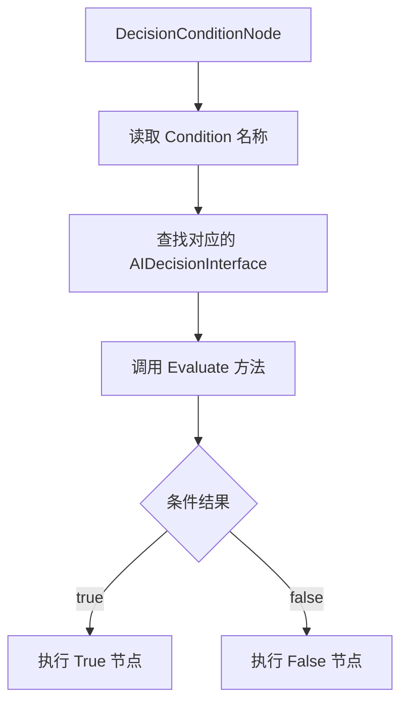
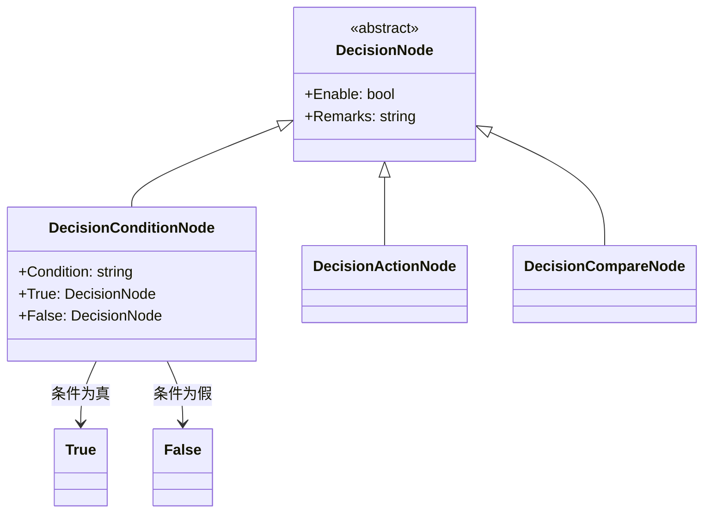

# DecisionConditionNode.cs 文档

## 📄 文件信息表

| 属性 | 值 |
|------|------|
| 文件路径 | `Assets/Scripts/Code/Module/Config/DecisionTree/DecisionConditionNode.cs` |
| 命名空间 | `TaoTie` |
| 类类型 | 决策节点类 |
| 依赖模块 | Nino.Core, Sirenix.OdinInspector |
| 继承 | `DecisionNode` |
| 序列化 | NinoType |

---

## 🏗️ 类说明

**DecisionConditionNode** 是决策树的条件分支节点，根据自定义条件字符串执行不同的子节点。

### 核心职责

- 存储条件字符串（如 "HasEnoughBudget"）
- 根据条件真假选择执行 True 或 False 分支
- 支持通过条件接口动态判断

### 在决策树中的位置

```
DecisionNode (基类)
└── DecisionConditionNode (条件节点 - 分支节点)
    ├── True: DecisionNode (条件为真时执行)
    └── False: DecisionNode (条件为假时执行)
```

---

## 📊 字段表

| 字段名 | 类型 | 访问修饰符 | 说明 |
|--------|------|------------|------|
| `Enable` | `bool` | `public` | 是否启用（继承自 DecisionNode） |
| `Remarks` | `string` | `public` | 策划备注（仅编辑器） |
| `Condition` | `string` | `public` | 条件名称（如 "HasEnoughBudget"） |
| `True` | `DecisionNode` | `public` | 条件为真时执行的子节点 |
| `False` | `DecisionNode` | `public` | 条件为假时执行的子节点 |

---

## 🔧 方法说明

（继承自 `DecisionNode`，无额外方法）

### 字段说明

#### Condition (条件名称)

通过 Odin Inspector 下拉选择可用的条件接口：
- 使用 `OdinDropdownHelper.GetAIDecisionInterface()` 获取列表
- 条件名称对应 `AIDecisionInterface` 的实现类
- 示例：`"HasEnoughBudget"`, `"IsLowHealth"`, `"CanAfford"`

#### True / False (分支节点)

- 必须赋值，标记为 `[NotNull]`
- 可以是任意 `DecisionNode` 子类
- 支持嵌套构建复杂决策树

---

## 🔄 Mermaid 流程图

### 条件判断流程



### 节点结构



---

## 💡 使用示例

### 基础条件节点

```csharp
// 创建条件节点：检查是否有足够预算
var conditionNode = new DecisionConditionNode
{
    Condition = "HasEnoughBudget",
    True = new DecisionActionNode
    {
        Act = ActDecision.Action_Run,
        Tactic = AITactic.HighWeight
    },
    False = new DecisionActionNode
    {
        Act = ActDecision.Stand_Idle1,
        Tactic = AITactic.Sidelines
    }
};
```

### 嵌套条件

```csharp
// 多层条件判断
var nestedCondition = new DecisionConditionNode
{
    Condition = "HasEnoughBudget",
    True = new DecisionConditionNode
    {
        Condition = "IsLowHealth",
        True = new DecisionActionNode
        {
            Tactic = AITactic.LeaveRun  # 血少跑路
        },
        False = new DecisionActionNode
        {
            Tactic = AITactic.AllIn  # 血多梭哈
        }
    },
    False = new DecisionActionNode
    {
        Tactic = AITactic.Sidelines  # 钱不够观望
    }
};
```

### 在配置表中使用

```yaml
# ConfigAIDecisionTree 配置示例
Type: "SmartBidderAI"
Node:
  Type: DecisionConditionNode
  Condition: HasEnoughBudget  # 条件名称
  True:
    Type: DecisionCompareNode
    LeftValue:
      Type: FormulaValue
      Formula: "Health"
    CompareMode: Less
    RightValue:
      Type: SingleValue
      Value: 30  # 血量低于 30%
    True:
      Type: DecisionActionNode
      Tactic: LeaveRun  # 跑路
    False:
      Type: DecisionActionNode
      Tactic: AllIn  # 梭哈
  False:
    Type: DecisionActionNode
    Tactic: Sidelines  # 钱不够观望
```

---

## 📝 条件接口

### AIDecisionInterface 示例

```csharp
// 条件接口定义示例
public interface AIDecisionInterface
{
    bool Evaluate(AIKnowledge knowledge);
}

// 实现示例
public class HasEnoughBudget : AIDecisionInterface
{
    public bool Evaluate(AIKnowledge knowledge)
    {
        return knowledge.Entity.GetComponent<NumericComponent>()
            .GetValue(ENumericType.Budget) >= 1000;
    }
}
```

### 可用条件列表

通过 `OdinDropdownHelper.GetAIDecisionInterface()` 获取：
- `HasEnoughBudget`: 预算充足
- `IsLowHealth`: 血量低
- `CanAfford`: 买得起
- `IsWinning`: 领先中
- `IsLastBidder`: 当前最高出价者
- 等等...

---

## ⚠️ 注意事项

### 条件注册

- 条件类必须实现 `AIDecisionInterface` 接口
- 需要在条件注册表中注册
- 条件名称必须与注册名匹配

### 空值检查

- `True` 和 `False` 字段标记为 `[NotNull]`
- 使用前确保已正确赋值
- 避免循环引用

### 性能

- 条件判断可能涉及复杂计算
- 避免在条件中执行耗时操作
- 考虑缓存条件结果

---

## 🔗 相关文档链接

- [DecisionNode.cs.md](./DecisionNode.cs.md) - 决策节点基类
- [DecisionActionNode.cs.md](./DecisionActionNode.cs.md) - 行动节点
- [DecisionCompareNode.cs.md](./DecisionCompareNode.cs.md) - 比较节点
- [ConfigAIDecisionTree.cs.md](./ConfigAIDecisionTree.cs.md) - AI 决策树配置
- [AIDecisionInterface.cs.md](../../../Game/Component/AI/Decision/AIDecisionInterface.cs.md) - 条件接口

---

*最后更新：2026-03-02*
