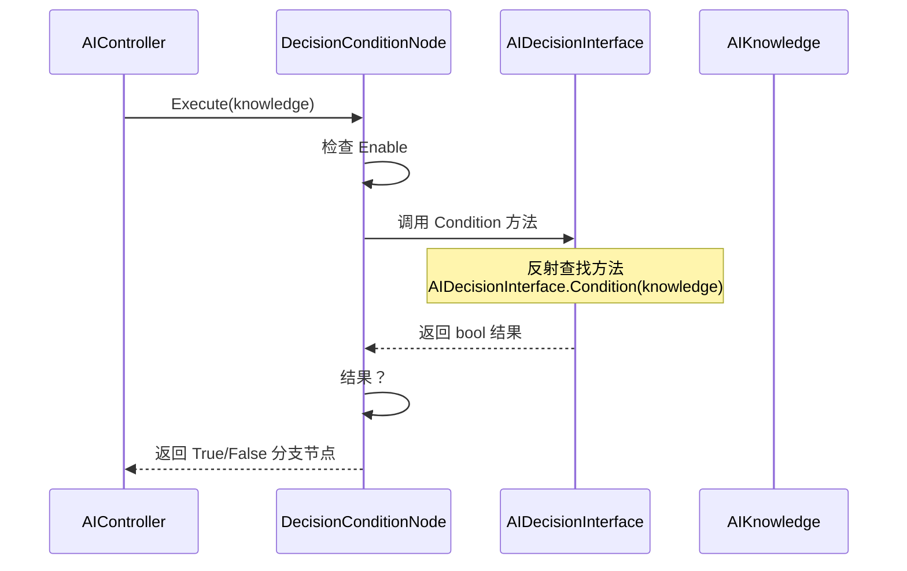
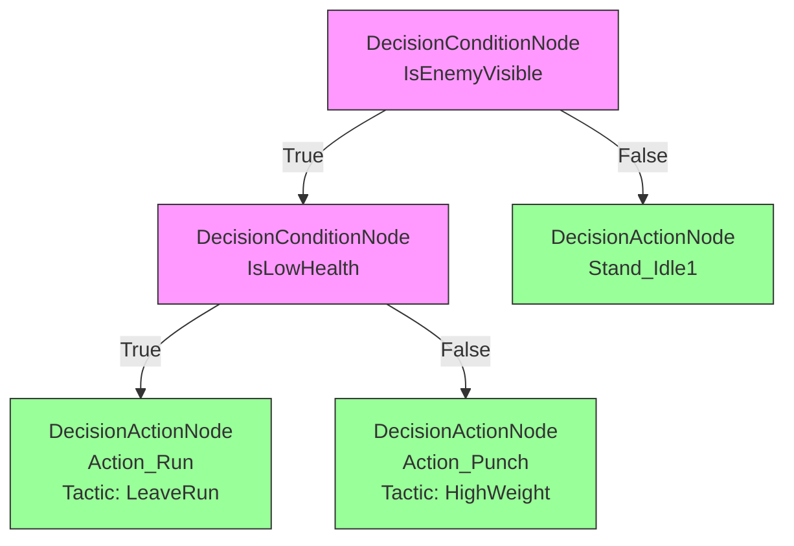

# DecisionConditionNode.cs 注解文档

## 文件基本信息

| 属性 | 值 |
|------|------|
| **文件名** | DecisionConditionNode.cs |
| **路径** | Assets/Scripts/Code/Module/Config/DecisionTree/DecisionConditionNode.cs |
| **所属模块** | 框架层 → Code/Module/Config/DecisionTree |
| **文件职责** | 定义条件判断决策节点，根据字符串条件选择执行分支 |

---

## 类/结构体说明

### DecisionConditionNode

| 属性 | 说明 |
|------|------|
| **职责** | 根据条件字符串的评估结果（真/假）选择执行 True 或 False 分支 |
| **泛型参数** | 无 |
| **继承关系** | 继承 `DecisionNode` |
| **实现的接口** | 无 |

**设计模式**: 组合模式 + 策略模式

```csharp
// 条件节点示例
var node = new DecisionConditionNode
{
    Condition = "IsEnemyVisible",
    True = new DecisionActionNode { Act = ActDecision.Action_Punch },
    False = new DecisionActionNode { Act = ActDecision.Stand_Idle1 }
};
```

---

## 字段与属性

### Condition

| 属性 | 值 |
|------|------|
| **类型** | `string` |
| **访问级别** | `public` |
| **说明** | 条件标识符，用于查找对应的条件评估函数 |

**Nino 序列化**: `[NinoMember(10)]`

**Odin Inspector**: `[ValueDropdown("@"+nameof(OdinDropdownHelper)+"."+nameof(OdinDropdownHelper.GetAIDecisionInterface)+"()")]`

**用途**:
- 标识要评估的条件类型
- 在运行时查找对应的条件评估方法
- 策划通过下拉菜单选择可用条件

**示例值**:
- `"IsEnemyVisible"` - 敌人是否在视野内
- `"HasEnoughMoney"` - 是否有足够金钱
- `"IsLowHealth"` - 是否低血量
- `"IsDistanceClose"` - 距离是否近

---

### True

| 属性 | 值 |
|------|------|
| **类型** | `DecisionNode` |
| **访问级别** | `public` |
| **说明** | 条件为真时执行的下一个决策节点 |

**Nino 序列化**: `[NinoMember(11)]`

**非空约束**: `[NotNull]`

**用途**: 条件满足时的决策分支

---

### False

| 属性 | 值 |
|------|------|
| **类型** | `DecisionNode` |
| **访问级别** | `public` |
| **说明** | 条件为假时执行的下一个决策节点 |

**Nino 序列化**: `[NinoMember(12)]`

**非空约束**: `[NotNull]`

**用途**: 条件不满足时的决策分支

---

## Nino 序列化特性

### NinoType

```csharp
[NinoType(false)]
```

**说明**: 标记为 Nino 可序列化类型。

### NinoMember

```csharp
[NinoMember(10)]  // Condition
[NinoMember(11)]  // True
[NinoMember(12)]  // False
```

**说明**: 显式指定成员序列化顺序。

---

## Odin Inspector 集成

### ValueDropdown 特性

```csharp
#if UNITY_EDITOR
[ValueDropdown("@"+nameof(OdinDropdownHelper)+"."+nameof(OdinDropdownHelper.GetAIDecisionInterface)+"()")]
#endif
public string Condition;
```

**功能**:
- 在 Unity Inspector 中显示下拉菜单
- 自动扫描 `AIDecisionInterface` 类的所有静态方法
- 显示方法名和 LabelText 特性定义的友好名称
- 支持 Tooltip 提示

**下拉选项来源**:
```csharp
// OdinDropdownHelper.GetAIDecisionInterface() 返回
[
    "距离检查 (DistanceCheck)   检查目标距离",
    "血量检查 (HealthCheck)     检查当前血量",
    "金钱检查 (MoneyCheck)      检查是否有足够金钱",
    // ... 更多条件
]
```

---

## 条件评估机制

### AIDecisionInterface 模式

```csharp
// 条件评估接口类（示例）
public static class AIDecisionInterface
{
    [LabelText("距离检查")]
    [Tooltip("检查目标距离是否小于阈值")]
    public static bool DistanceCheck(AIKnowledge knowledge)
    {
        return knowledge.DistanceToTarget < 5f;
    }
    
    [LabelText("血量检查")]
    [Tooltip("检查当前血量是否低于 30%")]
    public static bool IsLowHealth(AIKnowledge knowledge)
    {
        return knowledge.CurrentHP < knowledge.MaxHP * 0.3f;
    }
    
    [LabelText("金钱检查")]
    public static bool HasEnoughMoney(AIKnowledge knowledge)
    {
        return knowledge.Money >= knowledge.RequiredMoney;
    }
}
```

### 运行时评估流程



---

## 使用示例

### 示例 1: 简单条件判断

```csharp
// 敌人可见性判断
var visibilityCheck = new DecisionConditionNode
{
    Enable = true,
    Remarks = "检查敌人是否在视野内",
    Condition = "IsEnemyVisible",
    True = new DecisionActionNode
    {
        Act = ActDecision.Action_Punch,
        Tactic = AITactic.HighWeight
    },
    False = new DecisionActionNode
    {
        Act = ActDecision.Stand_Idle1,
        Tactic = AITactic.Sidelines
    }
};
```

### 示例 2: 嵌套条件判断

```csharp
// 多层条件判断
var combatDecision = new DecisionConditionNode
{
    Condition = "IsEnemyVisible",
    True = new DecisionConditionNode
    {
        Condition = "IsLowHealth",
        True = new DecisionActionNode
        {
            Act = ActDecision.Action_Run,
            Tactic = AITactic.LeaveRun,
            Remarks = "血量低，逃跑"
        },
        False = new DecisionActionNode
        {
            Act = ActDecision.Action_Punch,
            Tactic = AITactic.HighWeight,
            Remarks = "血量健康，攻击"
        }
    },
    False = new DecisionActionNode
    {
        Act = ActDecision.Stand_Idle1,
        Tactic = AITactic.Sidelines,
        Remarks = "没有敌人，待机"
    }
};
```

### 示例 3: 拍卖 AI 决策

```csharp
// 拍卖 AI 决策树
var auctionAI = new ConfigAIDecisionTree
{
    Type = "Auction",
    Node = new DecisionConditionNode
    {
        Condition = "HasEnoughMoney",
        Remarks = "检查是否有足够金钱参与拍卖",
        True = new DecisionConditionNode
        {
            Condition = "IsPriceReasonable",
            Remarks = "检查价格是否合理",
            True = new DecisionActionNode
            {
                Act = ActDecision.Emoji_Nice,
                Tactic = AITactic.LowWeight,
                Delay = new RandomAuctionTime { Min = 500, Max = 1500 },
                Remarks = "价格合理，出价"
            },
            False = new DecisionActionNode
            {
                Act = ActDecision.Emoji_Sigh,
                Tactic = AITactic.Sidelines,
                Remarks = "价格太高，观望"
            }
        },
        False = new DecisionActionNode
        {
            Act = ActDecision.Emoji_Aghast,
            Tactic = AITactic.LeaveWalk,
            Remarks = "钱不够，离场"
        }
    }
};
```

---

## 决策树可视化

### 树形结构



### JSON 表示

```json
{
  "$type": "DecisionConditionNode",
  "Condition": "IsEnemyVisible",
  "True": {
    "$type": "DecisionConditionNode",
    "Condition": "IsLowHealth",
    "True": {
      "$type": "DecisionActionNode",
      "Act": "Action_Run",
      "Tactic": "LeaveRun"
    },
    "False": {
      "$type": "DecisionActionNode",
      "Act": "Action_Punch",
      "Tactic": "HighWeight"
    }
  },
  "False": {
    "$type": "DecisionActionNode",
    "Act": "Stand_Idle1",
    "Tactic": "Sidelines"
  }
}
```

---

## 设计要点

### 为什么使用字符串条件？

1. **配置友好**: 策划可以直接在配置文件编辑
2. **解耦**: 条件逻辑与节点结构分离
3. **可扩展**: 新增条件只需添加方法，无需修改节点
4. **反射查找**: 运行时动态绑定条件评估函数

### True/False 分支设计

1. **二叉树结构**: 每个节点最多两个子节点
2. **递归执行**: 子节点可以是任何 DecisionNode
3. **灵活组合**: 可以嵌套任意深度

### NotNull 约束

```csharp
[NotNull]
public DecisionNode True;
[NotNull]
public DecisionNode False;
```

**意义**:
- 确保决策树完整性
- 避免运行时 null 引用
- 编辑器验证配置正确性

---

## 相关文档

- [DecisionNode.cs.md](./DecisionNode.cs.md) - 决策节点基类
- [DecisionCompareNode.cs.md](./DecisionCompareNode.cs.md) - 数值比较节点
- [DecisionActionNode.cs.md](./DecisionActionNode.cs.md) - 执行动作节点
- [OdinDropdownHelper.cs.md](../OdinDropdownHelper.cs.md) - Odin 下拉菜单助手
- [AIKnowledge.cs.md](../../Game/AI/AIKnowledge.cs.md) - AI 知识库类

---

*文档生成时间：2026-02-28 | OpenClaw AI 助手*
