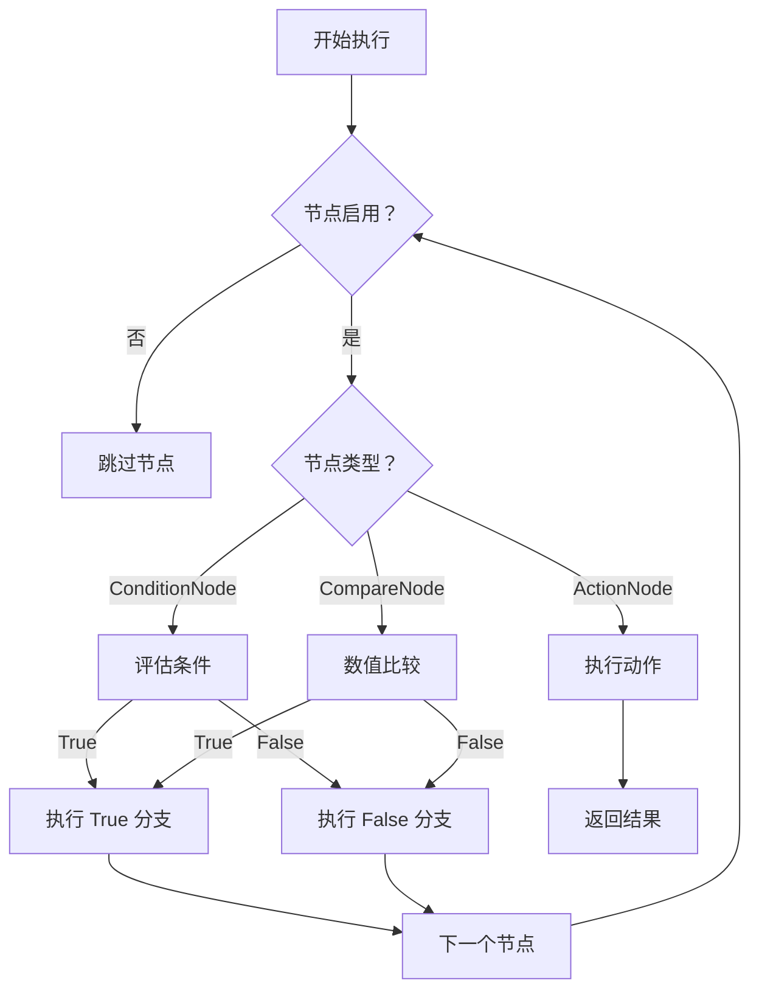

# DecisionNode.cs 注解文档

## 文件基本信息

| 属性 | 值 |
|------|------|
| **文件名** | DecisionNode.cs |
| **路径** | Assets/Scripts/Code/Module/Config/DecisionTree/DecisionNode.cs |
| **所属模块** | 框架层 → Code/Module/Config/DecisionTree |
| **文件职责** | 定义 AI 决策树节点的抽象基类，所有决策节点的父类 |

---

## 类/结构体说明

### DecisionNode

| 属性 | 说明 |
|------|------|
| **职责** | AI 决策树节点的抽象基类，提供通用属性和编辑器支持 |
| **泛型参数** | 无 |
| **继承关系** | 无（抽象类） |
| **实现的接口** | 无 |

**设计模式**: 抽象基类 + 组合模式

```csharp
// 所有决策节点都继承 DecisionNode
public class DecisionConditionNode : DecisionNode { }
public class DecisionCompareNode : DecisionNode { }
public class DecisionActionNode : DecisionNode { }
```

---

## 字段与属性

### Enable

| 属性 | 值 |
|------|------|
| **类型** | `bool` |
| **访问级别** | `public` |
| **默认值** | `true` |
| **说明** | 节点启用标志，false 时跳过此节点 |

**Nino 序列化**: `[NinoMember(1)]`

**用途**:
- 临时禁用某个决策节点而不删除
- 调试时快速切换决策逻辑
- A/B 测试不同决策策略

**使用示例**:
```csharp
// 禁用某个节点
node.Enable = false;

// 条件启用
if (debugMode)
{
    node.Enable = false;  // 调试时跳过复杂逻辑
}
```

---

### Remarks

| 属性 | 值 |
|------|------|
| **类型** | `string` |
| **访问级别** | `public` |
| **说明** | 策划备注，仅编辑器可用 |

**条件编译**: `#if UNITY_EDITOR`

**序列化**: `[SerializeField]`（Unity 序列化）

**Odin Inspector**: `[LabelText("策划备注")]`

**用途**:
- 策划填写设计意图说明
- 记录节点用途和注意事项
- 团队协作时的沟通工具

**编辑器显示**:
```
┌─────────────────────────────────────┐
│ ☑ Enable                            │
│ 策划备注：__________________________ │
│            此节点处理血量低于 30% 时的逃跑逻辑 │
└─────────────────────────────────────┘
```

---

## Nino 序列化特性

### NinoType

```csharp
[NinoType(false)]
```

**说明**: 标记为 Nino 可序列化类型，支持多态序列化。

**多态序列化**: Nino 可以正确序列化/反序列化 DecisionNode 的子类，保留实际类型信息。

```csharp
// 序列化多态节点
DecisionNode node = new DecisionConditionNode { ... };
byte[] bytes = Serializer.Serialize(node);

// 反序列化（正确恢复为 DecisionConditionNode）
DecisionNode restored = Deserializer.Deserialize<DecisionNode>(bytes);
Debug.Log(restored is DecisionConditionNode);  // True
```

### NinoMember

```csharp
[NinoMember(1)]  // Enable
```

**说明**: 显式指定成员序列化顺序和标识。

---

## 决策节点层次结构

```
DecisionNode (抽象)
├── DecisionConditionNode
│   └── 条件判断（字符串匹配）
│       ├── True → 下一个节点
│       └── False → 下一个节点
│
├── DecisionCompareNode
│   └── 数值比较（>, <, == 等）
│       ├── True → 下一个节点
│       └── False → 下一个节点
│
└── DecisionActionNode
    └── 执行动作（动画、策略等）
        └── 执行后返回结果
```

---

## 使用示例

### 示例 1: 创建条件节点

```csharp
var conditionNode = new DecisionConditionNode
{
    Enable = true,
    Remarks = "检查敌人是否在视野内",
    Condition = "IsEnemyVisible",
    True = new DecisionActionNode { Act = ActDecision.Action_Punch },
    False = new DecisionActionNode { Act = ActDecision.Stand_Idle1 }
};
```

### 示例 2: 创建比较节点

```csharp
var compareNode = new DecisionCompareNode
{
    Enable = true,
    Remarks = "血量是否高于 50%",
    LeftValue = new SingleValue { Value = 50f },
    CompareMode = CompareMode.Greater,
    RightValue = new SingleValue { Value = 30f },
    True = new DecisionActionNode { Act = ActDecision.Action_Punch },
    False = new DecisionActionNode { Act = ActDecision.Action_Run }
};
```

### 示例 3: 禁用节点

```csharp
// 创建决策树
var tree = new ConfigAIDecisionTree
{
    Type = "Test",
    Node = new DecisionConditionNode
    {
        Enable = false,  // 临时禁用
        Remarks = "调试中，暂时跳过此逻辑",
        Condition = "DebugCondition",
        True = new DecisionActionNode { Act = ActDecision.Action_Punch },
        False = new DecisionActionNode { Act = ActDecision.Action_Run }
    }
};
```

### 示例 4: 节点遍历

```csharp
// 递归遍历决策树
void TraverseNode(DecisionNode node, int depth = 0)
{
    if (!node.Enable)
    {
        Debug.Log($"{new string(' ', depth * 2)}[禁用] {node.GetType().Name}");
        return;
    }
    
    Debug.Log($"{new string(' ', depth * 2)}{node.GetType().Name}");
    
    if (node is DecisionConditionNode cond)
    {
        Debug.Log($"{new string(' ', depth * 2)}  条件：{cond.Condition}");
        TraverseNode(cond.True, depth + 1);
        TraverseNode(cond.False, depth + 1);
    }
    else if (node is DecisionCompareNode comp)
    {
        Debug.Log($"{new string(' ', depth * 2)}  比较：{comp.CompareMode}");
        TraverseNode(comp.True, depth + 1);
        TraverseNode(comp.False, depth + 1);
    }
}
```

---

## AI 决策树执行流程



---

## 设计要点

### 为什么使用抽象基类？

1. **统一接口**: 所有节点都有 `Enable` 和 `Remarks`
2. **多态支持**: 可以用 `DecisionNode` 类型存储任何节点
3. **扩展性**: 新节点类型只需继承即可
4. **序列化友好**: Nino 支持多态序列化

### Enable 的设计意义

1. **调试友好**: 无需删除节点即可禁用
2. **版本控制**: 保留设计历史
3. **A/B 测试**: 快速切换不同策略
4. **条件激活**: 根据游戏状态启用/禁用

### Remarks 的设计意义

1. **文档化**: 代码即文档
2. **团队协作**: 策划和程序沟通工具
3. **维护友好**: 快速理解节点用途
4. **仅编辑器**: 不影响运行时性能

---

## 相关文档

- [ConfigAIDecisionTree.cs.md](./ConfigAIDecisionTree.cs.md) - AI 决策树配置
- [DecisionConditionNode.cs.md](./DecisionConditionNode.cs.md) - 条件判断节点
- [DecisionCompareNode.cs.md](./DecisionCompareNode.cs.md) - 数值比较节点
- [DecisionActionNode.cs.md](./DecisionActionNode.cs.md) - 执行动作节点
- [Nino 序列化文档](https://github.com/ninochan/Nino) - Nino 序列化库

---

*文档生成时间：2026-02-28 | OpenClaw AI 助手*
