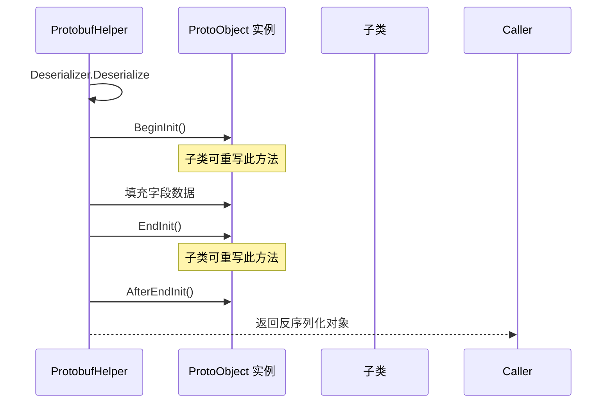

# ProtoObject.cs 注解文档

## 文件基本信息

| 属性 | 值 |
|------|-----|
| **文件名** | ProtoObject.cs |
| **路径** | Assets/Scripts/Code/Module/Config/ProtoObject.cs |
| **所属模块** | 框架层 → Code/Module/Config |
| **文件职责** | 定义 Protobuf 对象的基类和初始化接口，提供对象克隆能力 |

---

## 类/结构体说明

### ISupportInitialize 接口

| 属性 | 说明 |
|------|------|
| **职责** | 定义对象初始化的生命周期钩子 |
| **泛型参数** | 无 |
| **继承关系** | 无 |

**方法**:
| 方法 | 说明 |
|------|------|
| `BeginInit()` | 开始初始化时调用 |
| `EndInit()` | 结束初始化时调用 |

**用途**: 用于在反序列化完成后执行额外的初始化逻辑

---

### ProtoObject 抽象类

| 属性 | 说明 |
|------|------|
| **职责** | 所有 Protobuf 配置对象的基类，提供克隆和初始化支持 |
| **泛型参数** | 无 |
| **继承关系** | 继承 `Object`，实现 `ISupportInitialize` |
| **实现的接口** | `ISupportInitialize` |

**设计模式**: 原型模式（通过 Clone 方法）

```csharp
// 所有配置类都继承 ProtoObject
[Config]
public class LevelConfig : ProtoObject
{
    public int Id;
    public string Name;
}
```

---

### DisposeObject 抽象类

| 属性 | 说明 |
|------|------|
| **职责** | 支持资源释放的 Protobuf 对象基类 |
| **泛型参数** | 无 |
| **继承关系** | 继承 `Object`，实现 `IDisposable` 和 `ISupportInitialize` |
| **实现的接口** | `IDisposable`, `ISupportInitialize` |

**用途**: 用于需要手动释放资源的对象（如持有 Texture、AudioClip 等）

---

## 字段与属性

### ProtoObject

ProtoObject 没有额外字段，继承自 `Object` 类（ET 框架的核心对象类）。

### DisposeObject

DisposeObject 没有额外字段，提供空的 `Dispose()` 实现。

---

## 方法说明

### ProtoObject.Clone

**签名**:
```csharp
public object Clone()
```

**职责**: 创建当前对象的深拷贝

**核心逻辑**:
```
1. 使用 ProtobufHelper.ToBytes 将对象序列化为字节数组
2. 使用 ProtobufHelper.FromBytes 从字节数组反序列化为新对象
3. 返回新对象
```

**调用者**: 任何需要对象克隆的地方

**被调用者**: `ProtobufHelper.ToBytes()`, `ProtobufHelper.FromBytes()`

**使用示例**:
```csharp
var original = new LevelConfig { Id = 1, Name = "关卡 1" };
var clone = original.Clone() as LevelConfig;

// 修改克隆对象不影响原对象
clone.Name = "克隆关卡";
```

**特点**:
- ✅ 深拷贝：嵌套对象也会被复制
- ✅ 类型安全：返回类型与原对象相同
- ⚠️ 性能：涉及序列化和反序列化，不适合频繁调用

---

### ProtoObject.BeginInit

**签名**:
```csharp
public virtual void BeginInit()
```

**职责**: 开始初始化时的钩子方法（空实现）

**调用者**: `ProtobufHelper.FromBytes()`（反序列化前）

**用途**: 子类可以重写此方法，在反序列化前执行初始化逻辑

---

### ProtoObject.EndInit

**签名**:
```csharp
public virtual void EndInit()
```

**职责**: 结束初始化时的钩子方法（空实现）

**调用者**: `ProtobufHelper.FromBytes()`（反序列化后）

**用途**: 子类可以重写此方法，在反序列化完成后执行额外逻辑

**使用示例**:
```csharp
[Config]
public class LevelConfig : ProtoObject
{
    public int Id;
    public string Name;
    public List<int> EnemyIds;
    
    // 反序列化完成后构建缓存
    public override void EndInit()
    {
        base.EndInit();
        // 构建敌人 ID 的 HashSet 用于快速查找
        EnemyIdSet = new HashSet<int>(EnemyIds);
    }
    
    [HideInInspector]
    public HashSet<int> EnemyIdSet;
}
```

---

### ProtoObject.AfterEndInit

**签名**:
```csharp
public virtual void AfterEndInit()
```

**职责**: EndInit 之后的额外回调（空实现）

**用途**: 预留的扩展点，用于更复杂的初始化场景

---

### DisposeObject.Dispose

**签名**:
```csharp
public virtual void Dispose()
```

**职责**: 释放资源（空实现）

**调用者**: 使用 DisposeObject 的代码

**用途**: 子类重写此方法以释放特定资源

**使用示例**:
```csharp
public class TextureConfig : DisposeObject
{
    public Texture2D Texture;
    
    public override void Dispose()
    {
        base.Dispose();
        if (Texture != null)
        {
            UnityEngine.Object.Destroy(Texture);
            Texture = null;
        }
    }
}
```

---

### DisposeObject.BeginInit / EndInit

与 `ProtoObject` 相同，提供初始化钩子。

---

### DisposeObject.ToString

**签名**:
```csharp
public override string ToString()
```

**职责**: 返回对象类型名称

**返回值**: `this.GetType().Name`

**用途**: 调试和日志输出

---

## 对象生命周期

### 反序列化流程



### 克隆流程

```mermaid
flowchart TD
    A[调用 Clone] --> B[ProtobufHelper.ToBytes]
    B --> C[序列化为 byte[]]
    C --> D[ProtobufHelper.FromBytes]
    D --> E[反序列化为新对象]
    E --> F[调用 BeginInit]
    F --> G[填充字段]
    G --> H[调用 EndInit]
    H --> I[返回新对象]
```

---

## 使用示例

### 示例 1: 定义配置类

```csharp
[Config]  // 标记为配置类
public class LevelConfig : ProtoObject
{
    public int Id;                    // 关卡 ID
    public string Name;               // 关卡名称
    public int Difficulty;            // 难度等级
    public List<int> EnemyIds;        // 敌人 ID 列表
    public Vector3 SpawnPosition;     // 出生点位置
}
```

### 示例 2: 使用 EndInit 构建缓存

```csharp
[Config]
public class ItemConfig : ProtoObject
{
    public int Id;
    public string Name;
    public int Price;
    public List<int> Tags;
    
    // 反序列化后构建标签 HashSet
    public override void EndInit()
    {
        base.EndInit();
        TagSet = new HashSet<int>(Tags);
    }
    
    [HideInInspector]
    public HashSet<int> TagSet;
    
    // 快速检查是否包含某个标签
    public bool HasTag(int tagId)
    {
        return TagSet.Contains(tagId);
    }
}
```

### 示例 3: 对象克隆

```csharp
// 从配置创建实例
var template = ConfigManager.Instance.GetConfig<ItemConfig>(1);
var instance = template.Clone() as ItemConfig;

// 修改实例不影响模板
instance.Price = 100;  // 打折
Debug.Log(template.Price);  // 原价
```

### 示例 4: 释放资源

```csharp
// 使用 DisposeObject 的配置类
public class AtlasConfig : DisposeObject
{
    public SpriteAtlas Atlas;
    
    public override void Dispose()
    {
        base.Dispose();
        if (Atlas != null)
        {
            Resources.UnloadAsset(Atlas);
            Atlas = null;
        }
    }
}

// 使用
var atlasConfig = await ConfigManager.Instance.LoadOneConfig<AtlasConfig>();
// ... 使用 Atlas
atlasConfig.Dispose();  // 释放资源
```

---

## 设计要点

### 为什么使用序列化克隆？

1. **简单**: 无需手动实现每个字段的复制
2. **安全**: 确保深拷贝，避免引用共享问题
3. **通用**: 适用于所有继承 ProtoObject 的类

### 为什么不实现 ICloneable？

- `ICloneable` 的返回类型是 `object`，需要类型转换
- 自定义 `Clone()` 方法更清晰，文档更友好

### ISupportInitialize 的意义

- 提供反序列化生命周期钩子
- 允许在反序列化后执行额外初始化
- 与 .NET 标准接口兼容

---

## 相关文档

- [ProtobufHelper.cs.md](./ProtobufHelper.cs.md) - Protobuf 序列化工具（使用 Clone）
- [ConfigManager.cs.md](./ConfigManager.cs.md) - 配置管理器（加载 ProtoObject 子类）
- [Object.cs.md](../../Mono/Core/Object/Object.cs.md) - Object 基类（ProtoObject 的父类）

---

*文档生成时间：2026-02-28 | OpenClaw AI 助手*
