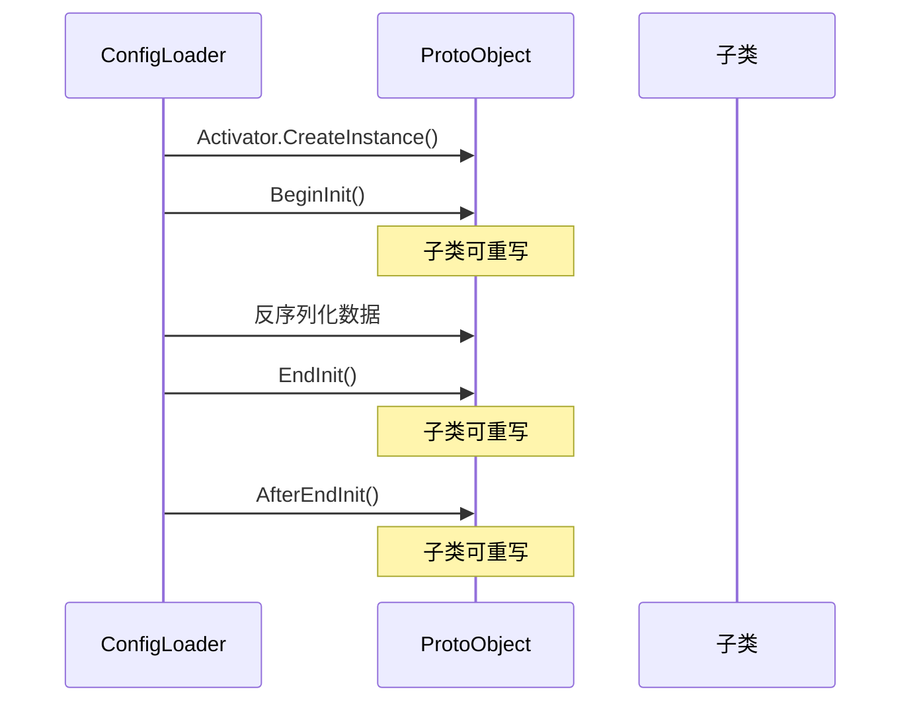
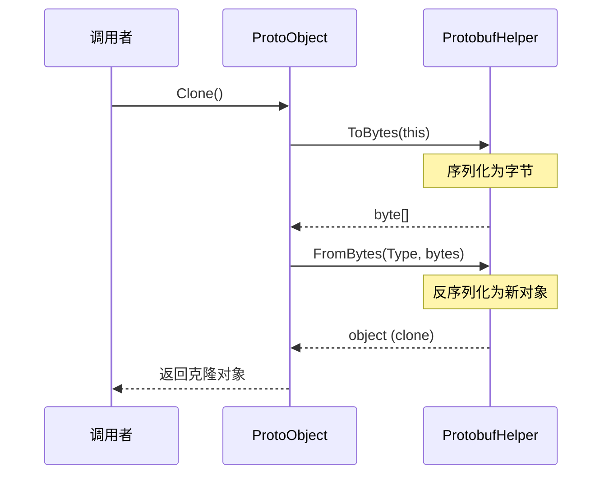

# ProtoObject.cs 注解文档

## 文件基本信息

| 属性 | 值 |
|------|-----|
| **文件名** | ProtoObject.cs |
| **路径** | Assets/Scripts/Code/Module/Config/ProtoObject.cs |
| **所属模块** | 框架层 → Config (配置系统) |
| **文件职责** | Protobuf 对象基类，提供序列化、克隆和生命周期管理功能 |

---

## 类/结构体说明

### ISupportInitialize

| 属性 | 说明 |
|------|------|
| **职责** | 初始化支持接口，定义初始化的开始和结束方法 |
| **泛型参数** | 无 |
| **继承关系** | 无 |
| **实现的接口** | 无 |

```csharp
public interface ISupportInitialize
{
    void BeginInit();
    void EndInit();
}
```

---

### ProtoObject

| 属性 | 说明 |
|------|------|
| **职责** | Protobuf 对象基类，提供序列化、克隆和生命周期管理 |
| **泛型参数** | 无 |
| **继承关系** | `Object`, `ISupportInitialize` |
| **实现的接口** | `ISupportInitialize` |

**设计模式**: 模板方法模式 - 定义初始化的生命周期

```csharp
public abstract class ProtoObject : Object, ISupportInitialize
{
    public object Clone();
    public virtual void BeginInit();
    public virtual void EndInit();
    public virtual void AfterEndInit();
}
```

---

### DisposeObject

| 属性 | 说明 |
|------|------|
| **职责** | 可释放对象基类，提供资源释放和生命周期管理 |
| **泛型参数** | 无 |
| **继承关系** | `Object`, `IDisposable`, `ISupportInitialize` |
| **实现的接口** | `IDisposable`, `ISupportInitialize` |

```csharp
public abstract class DisposeObject : Object, IDisposable, ISupportInitialize
{
    public virtual void Dispose();
    public virtual void BeginInit();
    public virtual void EndInit();
    public override string ToString();
}
```

---

## 字段与属性

这些类无实例字段，所有功能通过方法实现。

---

## 方法说明（按重要程度排序）

### Clone()

**签名**:
```csharp
public object Clone()
```

**职责**: 创建当前对象的深拷贝

**核心逻辑**:
```
1. 使用 ProtobufHelper 序列化为字节数组
2. 使用 ProtobufHelper 反序列化为新对象
3. 返回新对象
```

**调用者**: 需要复制配置对象的代码

**被调用者**: `ProtobufHelper.ToBytes()`, `ProtobufHelper.FromBytes()`

**使用示例**:
```csharp
// 克隆配置对象
var originalConfig = ItemConfigCategory.Instance.Get(1);
var clonedConfig = (ItemConfig)originalConfig.Clone();

// 修改克隆对象不影响原对象
clonedConfig.Name = "Modified Name";
```

---

### BeginInit()

**签名**:
```csharp
public virtual void BeginInit()
```

**职责**: 开始初始化 (生命周期钩子)

**核心逻辑**:
```
1. 空实现 (由子类重写)
```

**调用者**: 配置加载器

**被调用者**: 无

---

### EndInit()

**签名**:
```csharp
public virtual void EndInit()
```

**职责**: 结束初始化 (生命周期钩子)

**核心逻辑**:
```
1. 空实现 (由子类重写)
```

**调用者**: 配置加载器

**被调用者**: 无

---

### AfterEndInit()

**签名**:
```csharp
public virtual void AfterEndInit()
```

**职责**: 初始化完成后调用 (生命周期钩子)

**核心逻辑**:
```
1. 空实现 (由子类重写)
```

**调用者**: 配置加载器

**被调用者**: 无

---

### Dispose()

**签名**:
```csharp
public virtual void Dispose()
```

**职责**: 释放资源 (生命周期钩子)

**核心逻辑**:
```
1. 空实现 (由子类重写)
```

**调用者**: 资源管理系统

**被调用者**: 无

---

### ToString()

**签名**:
```csharp
public override string ToString()
```

**职责**: 返回对象类型名称

**核心逻辑**:
```
1. 返回类名
```

**调用者**: 调试、日志

---

## 对象生命周期

### 初始化流程



### 克隆流程



---

## 使用示例

### 示例 1: 定义配置类

```csharp
[Config]
public class ItemConfig : ProtoObject
{
    public int Id { get; set; }
    public string Name { get; set; }
    public int Type { get; set; }
    
    public override void BeginInit()
    {
        // 初始化前处理
        Name = Name?.Trim();
    }
    
    public override void EndInit()
    {
        // 初始化后处理
        if (string.IsNullOrEmpty(Name))
        {
            Name = "Unknown";
        }
    }
}
```

### 示例 2: 克隆配置对象

```csharp
// 获取原始配置
var config = ItemConfigCategory.Instance.Get(1);

// 克隆配置 (深拷贝)
var clonedConfig = (ItemConfig)config.Clone();

// 修改克隆对象
clonedConfig.Name = "Modified";

// 原始对象不受影响
Debug.Assert(config.Name != clonedConfig.Name);
```

### 示例 3: 使用 DisposeObject

```csharp
public class ResourceConfig : DisposeObject
{
    private Texture2D texture;
    
    public override void Dispose()
    {
        // 释放资源
        if (texture != null)
        {
            UnityEngine.Object.Destroy(texture);
            texture = null;
        }
    }
}

// 使用
var config = new ResourceConfig();
// ... 使用 config
config.Dispose();  // 释放资源
```

---

## 与其他模块的交互

```mermaid
graph TD
    subgraph ProtoObject["ProtoObject"]
        PO[ProtoObject]
        DO[DisposeObject]
        SI[ISupportInitialize]
    end
    
    subgraph Protobuf["序列化"]
        PH[ProtobufHelper]
    end
    
    subgraph Config["配置系统"]
        CM[ConfigManager]
        CL[ConfigLoader]
    end
    
    PO --> SI
    DO --> SI
    PO --> PH
    CM --> PO
    CL --> PO
    
    note right of PO "ProtoObject 提供配置对象的<br/>序列化、克隆和生命周期管理"
    
    style ProtoObject fill:#e1f5ff
    style Protobuf fill:#fff4e1
    style Config fill:#e8f5e9
```

---

## 阅读指引

### 建议的阅读顺序

1. **理解基类作用** - ProtoObject 是所有配置对象的基类
2. **看 Clone 方法** - 理解深拷贝实现
3. **了解生命周期** - 理解 BeginInit/EndInit/AfterEndInit
4. **查看 DisposeObject** - 了解可释放对象的用法

### 最值得学习的技术点

1. **Protobuf 克隆**: 通过序列化/反序列化实现深拷贝
2. **生命周期钩子**: 提供初始化的各个阶段钩子
3. **资源管理**: DisposeObject 提供资源释放模式

---

## 相关文档

- [ConfigAttribute.cs.md](./ConfigAttribute.cs.md) - 配置类标记特性
- [ConfigManager.cs.md](./ConfigManager.cs.md) - 配置管理器
- [ProtobufHelper.cs.md](./ProtobufHelper.cs.md) - Protobuf 序列化工具
- [IMerge.cs.md](./IMerge.cs.md) - 合并接口

---

*文档生成时间：2026-03-02 | OpenClaw AI 助手*
