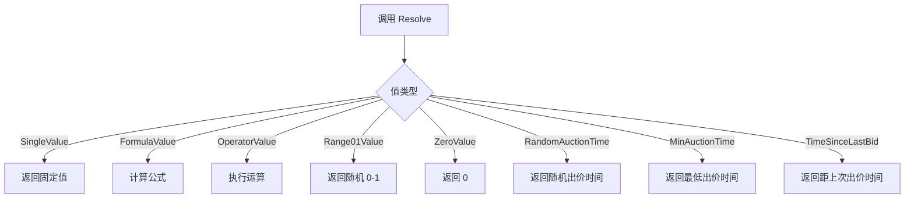
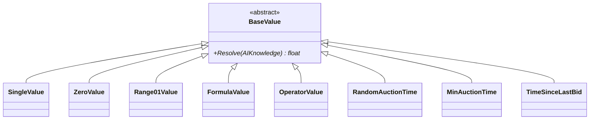

# BaseValue.cs 文档

## 📄 文件信息表

| 属性 | 值 |
|------|------|
| 文件路径 | `Assets/Scripts/Code/Module/Config/Value/BaseValue.cs` |
| 命名空间 | `TaoTie` |
| 类类型 | 抽象基类 |
| 依赖模块 | Nino.Core |
| 序列化 | NinoType |

---

## 🏗️ 类说明

**BaseValue** 是配置值系统的抽象基类，用于定义 AI 决策树中可解析的数值类型。

### 核心职责

- 定义值解析的标准接口 `Resolve`
- 作为所有配置值类型的基类
- 支持 Nino 序列化

### 设计模式

- **策略模式**: 不同的值类型实现不同的解析策略
- **多态**: 通过基类引用调用子类的解析方法

---

## 📊 字段表

| 字段名 | 类型 | 访问修饰符 | 说明 |
|--------|------|------------|------|
| (无实例字段) | - | - | 纯抽象基类 |

---

## 🔧 方法说明

### Resolve

```csharp
public abstract float Resolve(AIKnowledge knowledge)
```

解析值为具体的浮点数值。

**参数:**
- `knowledge`: AI 知识对象，包含实体、配置、状态等信息

**返回:** 解析后的浮点数值

**说明:**
- 这是一个抽象方法，必须由子类实现
- 不同的值类型有不同的解析逻辑
- 返回值用于 AI 决策树的比较和计算

---

## 🔄 Mermaid 流程图

### 值解析流程



### 继承关系



---

## 💡 使用示例

### 定义自定义值类型

```csharp
[NinoType(false)]
public partial class CustomValue : BaseValue
{
    [NinoMember(1)]
    public float Multiplier = 1.0f;
    
    public override float Resolve(AIKnowledge knowledge)
    {
        // 基于实体属性计算
        var numeric = knowledge.Entity.GetComponent<NumericComponent>();
        if (numeric != null)
        {
            return numeric.GetValue(ENumericType.Cost) * Multiplier;
        }
        return 0;
    }
}
```

### 在决策树中使用

```csharp
// 创建比较节点
var compareNode = new DecisionCompareNode
{
    LeftValue = new FormulaValue { Formula = "Cost" },
    CompareMode = CompareMode.Greater,
    RightValue = new SingleValue(100),
    True = new DecisionActionNode { Tactic = AITactic.HighWeight },
    False = new DecisionActionNode { Tactic = AITactic.LowWeight }
};

// 解析值进行比较
float leftVal = compareNode.LeftValue.Resolve(knowledge);
float rightVal = compareNode.RightValue.Resolve(knowledge);
bool result = leftVal > rightVal;
```

### 组合使用

```csharp
// 复杂的值计算：(Cost * 1.5) + Random(0-10)
var operatorValue = new OperatorValue
{
    Left = new OperatorValue
    {
        Left = new FormulaValue { Formula = "Cost" },
        Op = LogicMode.Mul,
        Right = new SingleValue(1.5f)
    },
    Op = LogicMode.Add,
    Right = new OperatorValue
    {
        Left = new Range01Value(),
        Op = LogicMode.Mul,
        Right = new SingleValue(10f)
    }
};

float result = operatorValue.Resolve(knowledge);
```

---

## 📝 子类列表

| 子类 | 说明 |
|------|------|
| `SingleValue` | 固定数值 |
| `ZeroValue` | 固定值 0 |
| `Range01Value` | 随机 0-1 值 |
| `FormulaValue` | 公式计算值 |
| `OperatorValue` | 运算操作值 |
| `RandomAuctionTime` | 随机出价时间 |
| `MinAuctionTime` | 最低出价时间 |
| `TimeSinceLastBid` | 距上次出价时间 |

---

## 🔗 相关文档链接

- [SingleValue.cs.md](./SingleValue.cs.md) - 固定值
- [FormulaValue.cs.md](./FormulaValue.cs.md) - 公式值
- [OperatorValue.cs.md](./OperatorValue.cs.md) - 运算值
- [DecisionCompareNode.cs.md](../DecisionTree/DecisionCompareNode.cs.md) - 比较节点
- [AIKnowledge.cs.md](../../Game/Component/AI/Knowledge/AIKnowledge.cs.md) - AI 知识类

---

*最后更新：2026-03-02*
