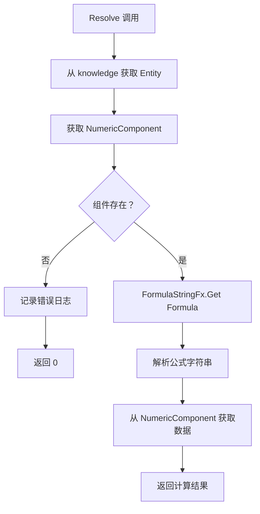
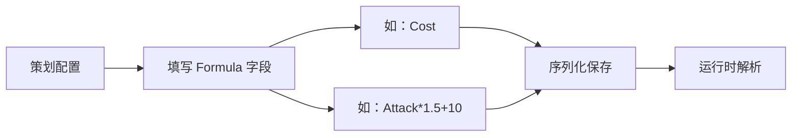

# FormulaValue.cs 文档

## 📄 文件信息表

| 属性 | 值 |
|------|------|
| 文件路径 | `Assets/Scripts/Code/Module/Config/Value/FormulaValue.cs` |
| 命名空间 | `TaoTie` |
| 类类型 | 配置值类 |
| 依赖模块 | Nino.Core |
| 继承 | `BaseValue` |
| 序列化 | NinoType |

---

## 🏗️ 类说明

**FormulaValue** 是一个基于公式字符串的动态值解析器，用于从实体的 NumericComponent 中获取计算后的数值。

### 核心职责

- 存储公式字符串
- 通过 `FormulaStringFx` 解析公式
- 从实体的数值组件中获取实际值

### 使用场景

- AI 决策树中需要动态获取实体属性
- 配置表中定义可变的数值条件
- 支持热配置无需重新编译

---

## 📊 字段表

| 字段名 | 类型 | 访问修饰符 | 说明 |
|--------|------|------------|------|
| `Formula` | `string` | `public` | 公式字符串（如 "Cost", "Attack*1.5"） |

---

## 🔧 方法说明

### Resolve

```csharp
public override float Resolve(AIKnowledge knowledge)
```

解析公式值为具体数值。

**参数:**
- `knowledge`: AI 知识对象，包含实体引用

**返回:** 
- 成功：公式计算后的浮点数值
- 失败：0（并记录错误日志）

**实现逻辑:**
```csharp
var numc = knowledge.Entity.GetComponent<NumericComponent>();
if (numc != null)
{
    return FormulaStringFx.Get(Formula).GetData(numc);
}
Log.Error($"获取{Formula}时，未找到 NumericComponent 组件");
return 0;
```

---

## 🔄 Mermaid 流程图

### 值解析流程



### 配置流程



---

## 💡 使用示例

### 基础使用

```csharp
// 创建公式值
var formulaValue = new FormulaValue
{
    Formula = "Cost"  // 获取实体的 Cost 属性
};

// 解析值
float cost = formulaValue.Resolve(knowledge);
```

### 在决策树中使用

```csharp
// 比较节点：如果 Cost > 100 则出高价
var compareNode = new DecisionCompareNode
{
    LeftValue = new FormulaValue { Formula = "Cost" },
    CompareMode = CompareMode.Greater,
    RightValue = new SingleValue(100),
    True = new DecisionActionNode 
    { 
        Tactic = AITactic.HighWeight,
        Act = ActDecision.Action_Run
    },
    False = new DecisionActionNode 
    { 
        Tactic = AITactic.LowWeight 
    }
};
```

### 复杂公式

```csharp
// 公式支持复杂表达式（由 FormulaStringFx 解析）
var complexFormula = new FormulaValue
{
    Formula = "Attack * 1.5 + Defense * 0.5 - Cost * 0.1"
};

float value = complexFormula.Resolve(knowledge);
```

### 在配置表中使用

```yaml
# ConfigAIDecisionTree 配置示例
Type: "BidderAI"
Node:
  Type: DecisionCompareNode
  LeftValue:
    Type: FormulaValue
    Formula: "CurrentBid"
  CompareMode: Greater
  RightValue:
    Type: FormulaValue
    Formula: "Budget * 0.8"
  True:
    Type: DecisionActionNode
    Tactic: HighWeight
  False:
    Type: DecisionActionNode
    Tactic: Sidelines
```

---

## 📝 公式语法

FormulaStringFx 支持的公式语法（由 NumericComponent 提供）：

| 语法 | 说明 |
|------|------|
| `Cost` | 获取 Cost 属性值 |
| `Attack` | 获取 Attack 属性值 |
| `Attack*1.5` | 属性乘以系数 |
| `Attack+10` | 属性加常数 |
| `Attack*2+Defense` | 组合运算 |

**注意:** 具体支持的公式语法取决于 `FormulaStringFx` 的实现。

---

## ⚠️ 错误处理

### 常见错误

1. **NumericComponent 不存在**
   ```
   Log.Error: 获取 Cost 时，未找到 NumericComponent 组件
   ```
   **解决:** 确保实体已添加 NumericComponent 组件

2. **公式语法错误**
   ```
   FormulaStringFx 解析失败
   ```
   **解决:** 检查公式字符串格式

### 防御性编程

```csharp
// 安全获取值
var formulaValue = new FormulaValue { Formula = "Cost" };
var numc = knowledge.Entity.GetComponent<NumericComponent>();

if (numc != null)
{
    float value = formulaValue.Resolve(knowledge);
    // 使用 value
}
else
{
    // 使用默认值
    float value = 0;
}
```

---

## 🔗 相关文档链接

- [BaseValue.cs.md](./BaseValue.cs.md) - 值基类
- [SingleValue.cs.md](./SingleValue.cs.md) - 固定值
- [OperatorValue.cs.md](./OperatorValue.cs.md) - 运算值
- [NumericComponent.cs.md](../../../Game/Component/Numeric/NumericComponent.cs.md) - 数值组件
- [FormulaStringFx.cs.md](../../../Game/Component/Numeric/FormulaStringFx.cs.md) - 公式解析器
- [DecisionCompareNode.cs.md](../DecisionTree/DecisionCompareNode.cs.md) - 比较节点

---

*最后更新：2026-03-02*
