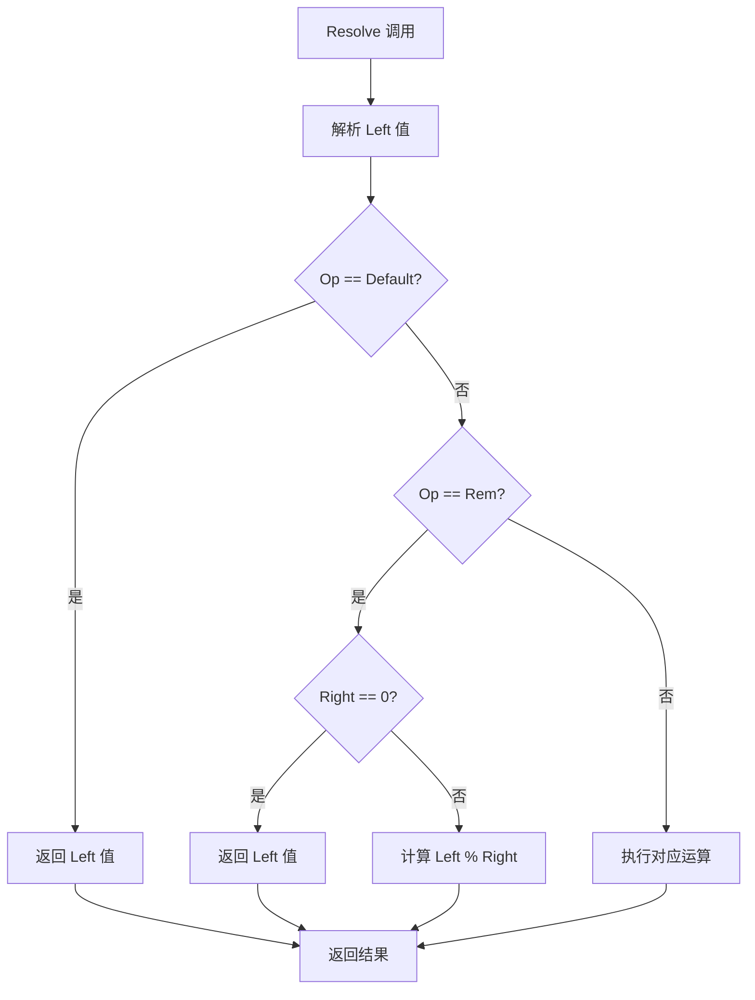

# OperatorValue.cs 文档

## 📄 文件信息表

| 属性 | 值 |
|------|------|
| 文件路径 | `Assets/Scripts/Code/Module/Config/Value/OperatorValue.cs` |
| 命名空间 | `TaoTie` |
| 类类型 | 配置值类 |
| 依赖模块 | Nino.Core, Sirenix.OdinInspector, UnityEngine |
| 继承 | `BaseValue` |
| 序列化 | NinoType |

---

## 🏗️ 类说明

**OperatorValue** 是一个复合值类型，支持对两个操作数进行数学运算。

### 核心职责

- 封装二元运算（加减乘除等）
- 支持嵌套表达式
- 将运算逻辑配置化

### 支持的运算

| 运算 | 枚举值 | 说明 |
|------|--------|------|
| 无操作 | `Default` | 返回左值 |
| 加法 | `Add` | Left + Right |
| 减法 | `Red` | Left - Right |
| 乘法 | `Mul` | Left * Right |
| 除法 | `Div` | Left / Right |
| 取余 | `Rem` | Left % Right |
| 次方 | `Pow` | Left ^ Right |

---

## 📊 字段表

| 字段名 | 类型 | 访问修饰符 | 说明 |
|--------|------|------------|------|
| `Left` | `BaseValue` | `public` | 左操作数（必填） |
| `Op` | `LogicMode` | `public` | 运算类型 |
| `Right` | `BaseValue` | `public` | 右操作数（Op != Default 时必填） |

---

## 🔧 方法说明

### Resolve

```csharp
public override float Resolve(AIKnowledge knowledge)
```

解析运算表达式为具体数值。

**参数:**
- `knowledge`: AI 知识对象

**返回:** 运算结果

**实现逻辑:**
```csharp
switch (Op)
{
    case LogicMode.Add:
        return Left.Resolve(knowledge) + Right.Resolve(knowledge);
    case LogicMode.Red:
        return Left.Resolve(knowledge) - Right.Resolve(knowledge);
    case LogicMode.Mul:
        return Left.Resolve(knowledge) * Right.Resolve(knowledge);
    case LogicMode.Div:
        return Left.Resolve(knowledge) / Right.Resolve(knowledge);
    case LogicMode.Rem:
        if (Right.Resolve(knowledge) == 0) return Left.Resolve(knowledge);
        return Left.Resolve(knowledge) % Right.Resolve(knowledge);
    case LogicMode.Pow:
        return (int) Mathf.Pow(Left.Resolve(knowledge), Right.Resolve(knowledge));
    case LogicMode.Default:
        return Left.Resolve(knowledge);
}
return 0;
```

---

## 🔄 Mermaid 流程图

### 运算解析流程



### 嵌套表达式示例

```mermaid
flowchart LR
    A[(Cost * 1.5) + Random(0-10)] --> B[OperatorValue Add]
    B --> C[Left: OperatorValue Mul]
    B --> D[Right: OperatorValue Mul]
    C --> E[FormulaValue Cost]
    C --> F[SingleValue 1.5]
    D --> G[Range01Value]
    D --> H[SingleValue 10]
```

---

## 💡 使用示例

### 基础运算

```csharp
// 加法：Cost + 10
var addOp = new OperatorValue
{
    Left = new FormulaValue { Formula = "Cost" },
    Op = LogicMode.Add,
    Right = new SingleValue(10)
};

// 乘法：Attack * 2
var mulOp = new OperatorValue
{
    Left = new FormulaValue { Formula = "Attack" },
    Op = LogicMode.Mul,
    Right = new SingleValue(2)
};

// 除法：Health / MaxHealth (百分比)
var divOp = new OperatorValue
{
    Left = new FormulaValue { Formula = "Health" },
    Op = LogicMode.Div,
    Right = new FormulaValue { Formula = "MaxHealth" }
};
```

### 嵌套表达式

```csharp
// (Cost * 1.5) + 10
var nestedOp = new OperatorValue
{
    Left = new OperatorValue
    {
        Left = new FormulaValue { Formula = "Cost" },
        Op = LogicMode.Mul,
        Right = new SingleValue(1.5f)
    },
    Op = LogicMode.Add,
    Right = new SingleValue(10)
};

// (Attack - Defense) * 2
var complexOp = new OperatorValue
{
    Left = new OperatorValue
    {
        Left = new FormulaValue { Formula = "Attack" },
        Op = LogicMode.Red,
        Right = new FormulaValue { Formula = "Defense" }
    },
    Op = LogicMode.Mul,
    Right = new SingleValue(2)
};
```

### 在决策树中使用

```csharp
// 如果 Cost * 1.5 > Budget，则离场
var compareNode = new DecisionCompareNode
{
    LeftValue = new OperatorValue
    {
        Left = new FormulaValue { Formula = "Cost" },
        Op = LogicMode.Mul,
        Right = new SingleValue(1.5f)
    },
    CompareMode = CompareMode.Greater,
    RightValue = new FormulaValue { Formula = "Budget" },
    True = new DecisionActionNode { Tactic = AITactic.LeaveRun },
    False = new DecisionActionNode { Tactic = AITactic.Sidelines }
};
```

### 在配置表中使用

```yaml
# ConfigAIDecisionTree 配置示例
Type: "AdvancedBidderAI"
Node:
  Type: DecisionCompareNode
  LeftValue:
    Type: OperatorValue
    Op: Mul
    Left:
      Type: FormulaValue
      Formula: "CurrentBid"
    Right:
      Type: SingleValue
      Value: 1.2  # 20% 溢价
  CompareMode: Less
  RightValue:
    Type: FormulaValue
    Formula: "Budget"
  True:
    Type: DecisionActionNode
    Tactic: HighWeight
  False:
    Type: DecisionActionNode
    Tactic: LeaveWalk
```

---

## 📝 特殊处理

### 除零保护

```csharp
// 除法运算自动处理除零情况
var divOp = new OperatorValue
{
    Left = new SingleValue(100),
    Op = LogicMode.Div,
    Right = new ZeroValue()  // 除数为 0
};

float result = divOp.Resolve(knowledge);  // 返回 100（被除数），不抛出异常
```

### 次方运算取整

```csharp
// Pow 运算结果会转换为 int
var powOp = new OperatorValue
{
    Left = new SingleValue(2),
    Op = LogicMode.Pow,
    Right = new SingleValue(3)
};

float result = powOp.Resolve(knowledge);  // 返回 8 (int)
```

---

## ⚠️ 注意事项

### 空值检查

- `Left` 和 `Right` 标记为 `[NotNull]`
- 使用前确保已正确赋值

### 性能

- 嵌套表达式会递归调用 `Resolve`
- 深度嵌套可能影响性能
- 建议保持表达式简洁

### 类型转换

- `Pow` 运算结果转换为 `int`
- 其他运算保持 `float` 精度

---

## 🔗 相关文档链接

- [BaseValue.cs.md](./BaseValue.cs.md) - 值基类
- [SingleValue.cs.md](./SingleValue.cs.md) - 固定值
- [FormulaValue.cs.md](./FormulaValue.cs.md) - 公式值
- [LogicMode.cs.md](./LogicMode.cs.md) - 运算模式枚举
- [DecisionCompareNode.cs.md](../DecisionTree/DecisionCompareNode.cs.md) - 比较节点

---

*最后更新：2026-03-02*
