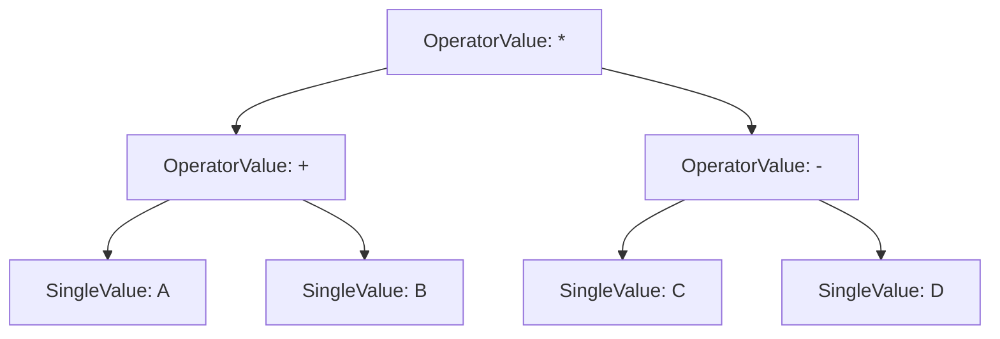

# OperatorValue.cs 注解文档

## 文件基本信息

| 属性 | 值 |
|------|------|
| **文件名** | OperatorValue.cs |
| **路径** | Assets/Scripts/Code/Module/Config/Value/OperatorValue.cs |
| **所属模块** | 框架层 → Code/Module/Config/Value |
| **文件职责** | 定义运算符值类型，支持加减乘除等数学运算 |

---

## 类/结构体说明

### OperatorValue

| 属性 | 说明 |
|------|------|
| **职责** | BaseValue 的运算实现，对两个值进行数学运算后返回结果 |
| **泛型参数** | 无 |
| **继承关系** | 继承 `BaseValue` |
| **实现的接口** | 无 |

**设计模式**: 组合模式 + 策略模式

```csharp
// 创建运算值：(A + B) * C
var result = new OperatorValue
{
    Left = new OperatorValue
    {
        Left = new SingleValue(10f),
        Op = LogicMode.Add,
        Right = new SingleValue(5f)
    },
    Op = LogicMode.Mul,
    Right = new SingleValue(2f)
};
float value = result.Resolve(knowledge);  // (10 + 5) * 2 = 30
```

---

## 字段与属性

### Left

| 属性 | 值 |
|------|------|
| **类型** | `BaseValue` |
| **访问级别** | `public` |
| **说明** | 运算符的左侧操作数 |

**Nino 序列化**: `[NinoMember(1)]`

**非空约束**: `[NotNull]`

**用途**: 可以是任何 BaseValue 子类（SingleValue、FormulaValue、另一个 OperatorValue 等）

---

### Op

| 属性 | 值 |
|------|------|
| **类型** | `LogicMode` |
| **访问级别** | `public` |
| **说明** | 运算操作符类型 |

**Nino 序列化**: `[NinoMember(2)]`

**可选值**:
| 值 | 说明 | 运算符 |
|----|------|--------|
| `Default` | 无 | 返回 Left |
| `Add` | 加 | `+` |
| `Red` | 减 | `-` |
| `Mul` | 乘 | `*` |
| `Div` | 除 | `/` |
| `Rem` | 取余 | `%` |
| `Pow` | 次方 | `^` |

---

### Right

| 属性 | 值 |
|------|------|
| **类型** | `BaseValue` |
| **访问级别** | `public` |
| **说明** | 运算符的右侧操作数 |

**Nino 序列化**: `[NinoMember(3)]`

**非空约束**: `[NotNull]`

**条件显示**: `[ShowIf("@Op != LogicMode.Default")]`

**说明**: 当 Op 为 Default 时，Right 字段在 Inspector 中隐藏（因为不需要）

---

## 方法说明

### Resolve

**签名**:
```csharp
public override float Resolve(AIKnowledge knowledge)
```

**职责**: 根据 Op 对 Left 和 Right 进行运算并返回结果

**核心逻辑**:
```
1. 根据 Op 类型执行对应运算
2. 递归调用 Left.Resolve(knowledge) 和 Right.Resolve(knowledge)
3. 返回运算结果
```

**调用者**: DecisionCompareNode, DecisionActionNode, 外层 OperatorValue

**参数**:
| 参数名 | 类型 | 说明 |
|--------|------|------|
| `knowledge` | `AIKnowledge` | AI 知识库，传递给子 Value |

**返回值**: `float` - 运算结果

---

## 运算逻辑详解

### Default（无运算）

```csharp
case LogicMode.Default:
    return Left.Resolve(knowledge);
```

**说明**: 直接返回 Left 的值，Right 被忽略

**用途**: 包装单个值，或作为默认状态

---

### Add（加法）

```csharp
case LogicMode.Add:
    return Left.Resolve(knowledge) + Right.Resolve(knowledge);
```

**示例**: `10 + 5 = 15`

---

### Red（减法）

```csharp
case LogicMode.Red:
    return Left.Resolve(knowledge) - Right.Resolve(knowledge);
```

**示例**: `10 - 5 = 5`

**注意**: 枚举名为 `Red` 而非 `Sub`，可能是命名习惯

---

### Mul（乘法）

```csharp
case LogicMode.Mul:
    return Left.Resolve(knowledge) * Right.Resolve(knowledge);
```

**示例**: `10 * 5 = 50`

---

### Div（除法）

```csharp
case LogicMode.Div:
    return Left.Resolve(knowledge) / Right.Resolve(knowledge);
```

**示例**: `10 / 5 = 2`

**注意**: 如果 Right 为 0，结果为 Infinity 或 NaN

---

### Rem（取余）

```csharp
case LogicMode.Rem:
    if (Right.Resolve(knowledge) == 0) return Left.Resolve(knowledge);
    return Left.Resolve(knowledge) % Right.Resolve(knowledge);
```

**示例**: `10 % 3 = 1`

**特殊处理**: 如果 Right 为 0，返回 Left（避免除零错误）

---

### Pow（次方）

```csharp
case LogicMode.Pow:
    return (int) Mathf.Pow(Left.Resolve(knowledge), Right.Resolve(knowledge));
```

**示例**: `10 ^ 2 = 100`

**注意**: 结果转换为 int，再隐式转换为 float

---

## Nino 序列化特性

### NinoType

```csharp
[NinoType(false)]
```

**说明**: 标记为 Nino 可序列化类型。

### NinoMember

```csharp
[NinoMember(1)]  // Left
[NinoMember(2)]  // Op
[NinoMember(3)]  // Right
```

**说明**: 显式指定成员序列化顺序。

---

## Odin Inspector 集成

### ShowIf 特性

```csharp
[NinoMember(3)][NotNull][ShowIf("@Op != LogicMode.Default")]
public BaseValue Right;
```

**效果**: 
- 当 Op == Default 时，Right 字段在 Inspector 中隐藏
- 当 Op != Default 时，Right 字段显示

**用途**: 简化配置界面，避免不必要的字段

---

## 使用示例

### 示例 1: 简单加法

```csharp
// 攻击力 = 基础攻击 + 装备加成
var attackDamage = new OperatorValue
{
    Left = new BaseAttackValue(),
    Op = LogicMode.Add,
    Right = new EquipmentBonusValue()
};
```

### 示例 2: 复合运算

```csharp
// 最终伤害 = (攻击力 * 2 + 力量) * 暴击系数
var finalDamage = new OperatorValue
{
    Left = new OperatorValue
    {
        Left = new OperatorValue
        {
            Left = new AttackValue(),
            Op = LogicMode.Mul,
            Right = new SingleValue(2f)
        },
        Op = LogicMode.Add,
        Right = new StrengthValue()
    },
    Op = LogicMode.Mul,
    Right = new CritMultiplierValue()
};
```

### 示例 3: 百分比计算

```csharp
// 当前血量百分比 = 当前血量 / 最大血量 * 100
var healthPercent = new OperatorValue
{
    Left = new OperatorValue
    {
        Left = new CurrentHPValue(),
        Op = LogicMode.Div,
        Right = new MaxHPValue()
    },
    Op = LogicMode.Mul,
    Right = new SingleValue(100f)
};
```

### 示例 4: 带取余的循环

```csharp
// 技能索引 = 当前技能数 % 技能总数（循环索引）
var skillIndex = new OperatorValue
{
    Left = new CurrentSkillCountValue(),
    Op = LogicMode.Rem,
    Right = new TotalSkillCountValue()
};
```

### 示例 5: 次方运算

```csharp
// 经验需求 = 等级 ^ 2 * 100
var expRequired = new OperatorValue
{
    Left = new OperatorValue
    {
        Left = new LevelValue(),
        Op = LogicMode.Pow,
        Right = new SingleValue(2f)
    },
    Op = LogicMode.Mul,
    Right = new SingleValue(100f)
};
```

---

## 运算树结构

### 示例：`(A + B) * (C - D)`



### JSON 表示

```json
{
  "$type": "OperatorValue",
  "Left": {
    "$type": "OperatorValue",
    "Left": { "$type": "SingleValue", "Value": 10 },
    "Op": "Add",
    "Right": { "$type": "SingleValue", "Value": 5 }
  },
  "Op": "Mul",
  "Right": {
    "$type": "OperatorValue",
    "Left": { "$type": "SingleValue", "Value": 3 },
    "Op": "Sub",
    "Right": { "$type": "SingleValue", "Value": 1 }
  }
}
```

**计算**: `(10 + 5) * (3 - 1) = 15 * 2 = 30`

---

## 与 FormulaValue 对比

| 特性 | OperatorValue | FormulaValue |
|------|---------------|--------------|
| **配置方式** | 树形结构 | 字符串公式 |
| **可读性** | 中（嵌套深时复杂） | 高（类似数学） |
| **性能** | 高（直接计算） | 中（需解析字符串） |
| **类型安全** | ✅ 高 | ⚠️ 中（字符串可能错误） |
| **调试** | 容易（逐层检查） | 较难（需解析后检查） |
| **推荐场景** | 简单到中等复杂度 | 复杂公式 |

---

## 设计要点

### 为什么使用递归结构？

1. **灵活性**: 可以表达任意复杂的运算
2. **可扩展**: 新增运算符只需修改 switch 语句
3. **可组合**: 可以嵌套任意深度
4. **类型安全**: 编译时检查结构正确性

### 除零保护

```csharp
case LogicMode.Rem:
    if (Right.Resolve(knowledge) == 0) return Left.Resolve(knowledge);
    return Left.Resolve(knowledge) % Right.Resolve(knowledge);
```

**说明**: 取余运算有除零保护，但除法没有。建议添加：

```csharp
case LogicMode.Div:
    float right = Right.Resolve(knowledge);
    if (right == 0)
    {
        Log.Warning("OperatorValue: 除零错误，返回 0");
        return 0;
    }
    return Left.Resolve(knowledge) / right;
```

### Pow 的 int 转换

```csharp
return (int) Mathf.Pow(Left.Resolve(knowledge), Right.Resolve(knowledge));
```

**说明**: 结果先转换为 int 再返回 float

**可能的问题**: 精度丢失

**建议**: 根据需求决定是否保留 float：
```csharp
return Mathf.Pow(Left.Resolve(knowledge), Right.Resolve(knowledge));
```

---

## 相关文档

- [BaseValue.cs.md](./BaseValue.cs.md) - 值类型基类
- [LogicMode.cs.md](./LogicMode.cs.md) - 逻辑模式枚举
- [SingleValue.cs.md](./SingleValue.cs.md) - 固定值实现
- [FormulaValue.cs.md](./FormulaValue.cs.md) - 公式运算值

---

*文档生成时间：2026-02-28 | OpenClaw AI 助手*
