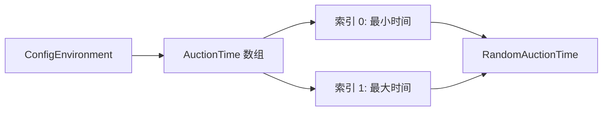

# RandomAuctionTime.cs 文档

## 📄 文件信息表

| 属性 | 值 |
|------|------|
| 文件路径 | `Assets/Scripts/Code/Module/Config/Value/RandomAuctionTime.cs` |
| 命名空间 | `TaoTie` |
| 类类型 | 配置值类 |
| 依赖模块 | Nino.Core, Sirenix.OdinInspector, UnityEngine |
| 继承 | `BaseValue` |
| 序列化 | NinoType |

---

## 🏗️ 类说明

**RandomAuctionTime** 是一个专用的值类型，用于从配置表中获取随机出价时间。

### 核心职责

- 从 `knowledge.Config.AuctionTime` 配置数组中读取范围
- 生成该范围内的随机时间值
- 用于 AI 出价延迟的随机化

### 配置依赖

依赖 `AIKnowledge.Config.AuctionTime` 数组：
- `AuctionTime[0]`: 最小出价时间
- `AuctionTime[1]`: 最大出价时间

---

## 📊 字段表

| 字段名 | 类型 | 访问修饰符 | 说明 |
|--------|------|------------|------|
| (无实例字段) | - | - | 无状态类 |

---

## 🔧 方法说明

### Resolve

```csharp
public override float Resolve(AIKnowledge knowledge)
```

解析值为配置范围内的随机出价时间。

**参数:**
- `knowledge`: AI 知识对象，包含配置引用

**返回:** [AuctionTime[0], AuctionTime[1]) 区间的随机浮点数

**实现逻辑:**
```csharp
return Random.Range(knowledge.Config.AuctionTime[0], knowledge.Config.AuctionTime[1]);
```

---

## 🔄 Mermaid 流程图

### 值解析流程

```mermaid
flowchart TD
    A[Resolve 调用] --> B[从 knowledge 获取 Config]
    B --> C[读取 AuctionTime[0] 和 [1]]
    C --> D[Random.Range min, max]
    D --> E[返回随机时间]
    
    style B fill:#e1f5ff
    style C fill:#fff3e1
    style D fill:#FFD700
```

### 配置依赖



---

## 💡 使用示例

### 基础使用

```csharp
// 创建随机出价时间
var randomTime = new RandomAuctionTime();

// 解析值（假设配置 AuctionTime = [1000, 3000]）
float delay = randomTime.Resolve(knowledge);  // 返回 1000-3000 之间的随机值
```

### 在决策树中使用

```csharp
// 行动节点使用随机延迟
var actionNode = new DecisionActionNode
{
    Act = ActDecision.Action_Run,
    Tactic = AITactic.HighWeight,
    Delay = new RandomAuctionTime()  // 随机延迟出价
};
```

### 在配置表中使用

```yaml
# ConfigAIDecisionTree 配置示例
Type: "RandomBidderAI"
Node:
  Type: DecisionActionNode
  Act: Action_Run
  Tactic: HighWeight
  Delay:
    Type: RandomAuctionTime  # 使用配置表中的随机时间范围
  Emoji: "Emoji_Smile1"
```

### 与其他值类型组合

```csharp
// 随机时间 + 固定偏移
var delayedTime = new OperatorValue
{
    Left = new RandomAuctionTime(),
    Op = LogicMode.Add,
    Right = new SingleValue(500)  # 额外延迟 500ms
};

// 随机时间 * 系数
var multipliedTime = new OperatorValue
{
    Left = new RandomAuctionTime(),
    Op = LogicMode.Mul,
    Right = new SingleValue(1.5f)  # 1.5 倍时间
};
```

---

## 📝 配置示例

### AIKnowledge 配置

```csharp
// AIKnowledge 中的配置结构
public class AIKnowledge
{
    public ConfigAIDecisionTreeCategory Config;
    // ...
}

// ConfigAIDecisionTreeCategory 中
public class ConfigAIDecisionTreeCategory
{
    public float[] AuctionTime = new float[] { 1000, 3000 };  // [min, max]
    // ...
}
```

### 配置表设置

在 Unity 编辑器中配置 `ConfigAIDecisionTreeCategory`：

```yaml
AuctionTime:
  - 1000  # 最小出价时间 (ms)
  - 3000  # 最大出价时间 (ms)
```

这样 `RandomAuctionTime.Resolve()` 将返回 1000-3000ms 之间的随机值。

---

## ⚠️ 注意事项

### 配置依赖

- 必须确保 `knowledge.Config.AuctionTime` 已正确配置
- 数组长度必须至少为 2
- 建议 `AuctionTime[0] < AuctionTime[1]`

### 空值保护

```csharp
// 建议在使用前检查配置
if (knowledge.Config?.AuctionTime?.Length >= 2)
{
    var randomTime = new RandomAuctionTime();
    float delay = randomTime.Resolve(knowledge);
}
else
{
    // 使用默认值
    float delay = 1000;
}
```

### 随机种子

- 使用 Unity 的全局随机种子
- 可通过 `Random.InitState(seed)` 控制可重复性

---

## 🔗 相关文档链接

- [BaseValue.cs.md](./BaseValue.cs.md) - 值基类
- [MinAuctionTime.cs.md](./MinAuctionTime.cs.md) - 最低出价时间
- [TimeSinceLastBid.cs.md](./TimeSinceLastBid.cs.md) - 距上次出价时间
- [AIKnowledge.cs.md](../../../Game/Component/AI/Knowledge/AIKnowledge.cs.md) - AI 知识类
- [DecisionActionNode.cs.md](../DecisionTree/DecisionActionNode.cs.md) - 行动节点

---

*最后更新：2026-03-02*
