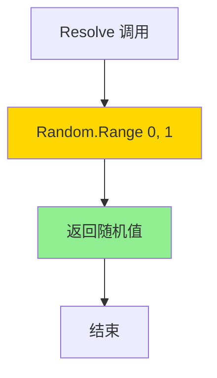
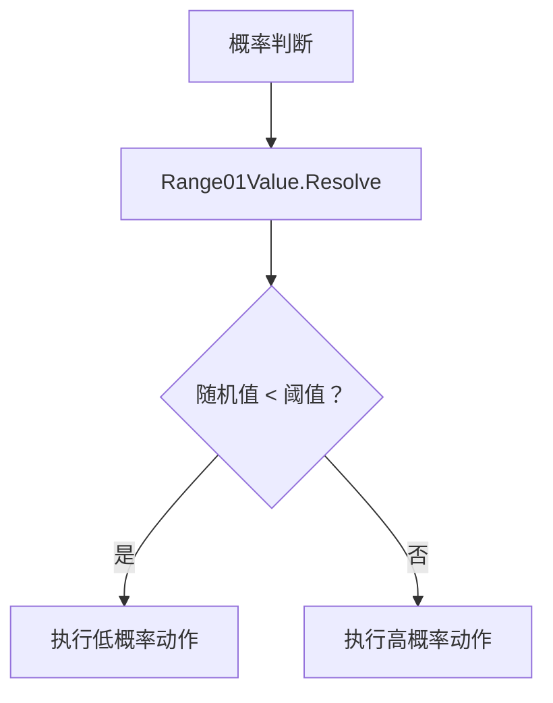

# Range01Value.cs 文档

## 📄 文件信息表

| 属性 | 值 |
|------|------|
| 文件路径 | `Assets/Scripts/Code/Module/Config/Value/Range01Value.cs` |
| 命名空间 | `TaoTie` |
| 类类型 | 配置值类 |
| 依赖模块 | Nino.Core, UnityEngine |
| 继承 | `BaseValue` |
| 序列化 | NinoType |

---

## 🏗️ 类说明

**Range01Value** 是一个随机值生成器，每次解析时返回 0 到 1 之间的随机浮点数。

### 核心职责

- 生成 [0, 1] 区间的随机值
- 用于概率判断和随机因子
- 提供可配置的随机性

### 使用场景

- AI 决策中的概率分支
- 随机出价策略
- 添加随机扰动

---

## 📊 字段表

| 字段名 | 类型 | 访问修饰符 | 说明 |
|--------|------|------------|------|
| (无实例字段) | - | - | 无状态类 |

---

## 🔧 方法说明

### Resolve

```csharp
public override float Resolve(AIKnowledge knowledge)
```

解析值为 0-1 之间的随机数。

**参数:**
- `knowledge`: AI 知识对象（未使用）

**返回:** [0, 1) 区间的随机浮点数

**实现逻辑:**
```csharp
return Random.Range(0f, 1f);
```

**注意:** 使用 Unity 的 `Random.Range`，每次调用返回不同的随机值。

---

## 🔄 Mermaid 流程图

### 值解析流程



### 概率决策流程



---

## 💡 使用示例

### 基础使用

```csharp
// 创建随机值
var randomValue = new Range01Value();

// 多次调用返回不同的随机值
float r1 = randomValue.Resolve(knowledge);  // 例如：0.347
float r2 = randomValue.Resolve(knowledge);  // 例如：0.892
float r3 = randomValue.Resolve(knowledge);  // 例如：0.156
```

### 概率判断

```csharp
// 30% 概率出高价
var randomValue = new Range01Value();
float chance = randomValue.Resolve(knowledge);

if (chance < 0.3f)
{
    // 30% 概率执行
    tactic = AITactic.HighWeight;
}
else
{
    // 70% 概率执行
    tactic = AITactic.LowWeight;
}
```

### 在决策树中使用

```csharp
// 使用 OperatorValue 实现概率判断
var probabilityCheck = new OperatorValue
{
    Left = new Range01Value(),  // 随机 0-1
    Op = LogicMode.Less,
    Right = new SingleValue(0.3f)  // 30% 阈值
};

// 注意：OperatorValue 的 Less 比较返回 float (0 或 1)
// 实际使用时需要配合 DecisionCompareNode
```

### 随机出价系数

```csharp
// 出价 = 基础价 * (0.8 + 随机 0-0.4)
var randomBidMultiplier = new OperatorValue
{
    Left = new SingleValue(0.8f),
    Op = LogicMode.Add,
    Right = new OperatorValue
    {
        Left = new Range01Value(),
        Op = LogicMode.Mul,
        Right = new SingleValue(0.4f)
    }
};

var finalBid = new OperatorValue
{
    Left = new FormulaValue { Formula = "BasePrice" },
    Op = LogicMode.Mul,
    Right = randomBidMultiplier
};
```

### 在配置表中使用

```yaml
# ConfigAIDecisionTree 配置示例
Type: "RandomBidderAI"
Node:
  Type: DecisionCompareNode
  LeftValue:
    Type: Range01Value  # 随机值
  CompareMode: Less
  RightValue:
    Type: SingleValue
    Value: 0.5  # 50% 概率
  True:
    Type: DecisionActionNode
    Tactic: Random  # 随机策略
  False:
    Type: DecisionActionNode
    Tactic: Sidelines  # 观望
```

---

## 📝 随机数特性

### Unity Random.Range

- **范围:** [min, max) - 包含最小值，不包含最大值
- **分布:** 均匀分布
- **种子:** 使用 Unity 全局随机种子
- **可重复性:** 可通过 `Random.InitState(seed)` 控制

### 使用建议

```csharp
// 如果需要可重复的随机序列
Random.InitState(42);
var randomValue = new Range01Value();
float r1 = randomValue.Resolve(knowledge);  // 固定种子下始终相同

// 如果需要真正的随机
// 无需额外操作，Unity 默认使用基于时间的种子
```

---

## ⚠️ 注意事项

### 性能

- 每次 `Resolve` 调用都会生成新的随机数
- 在循环中频繁调用可能影响性能
- 建议缓存结果如需多次使用

### 调试

- 随机值使调试变得困难
- 测试时可设置固定种子：`Random.InitState(12345)`

---

## 🔗 相关文档链接

- [BaseValue.cs.md](./BaseValue.cs.md) - 值基类
- [SingleValue.cs.md](./SingleValue.cs.md) - 固定值
- [OperatorValue.cs.md](./OperatorValue.cs.md) - 运算值
- [DecisionCompareNode.cs.md](../DecisionTree/DecisionCompareNode.cs.md) - 比较节点

---

*最后更新：2026-03-02*
