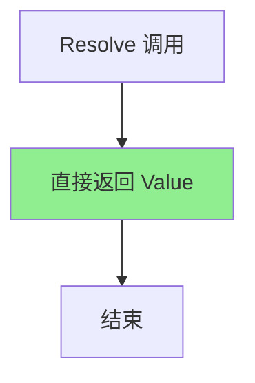
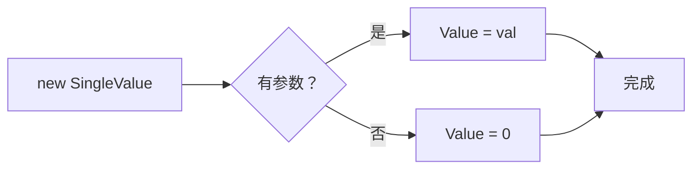

# SingleValue.cs 文档

## 📄 文件信息表

| 属性 | 值 |
|------|------|
| 文件路径 | `Assets/Scripts/Code/Module/Config/Value/SingleValue.cs` |
| 命名空间 | `TaoTie` |
| 类类型 | 配置值类 |
| 依赖模块 | Nino.Core |
| 继承 | `BaseValue` |
| 序列化 | NinoType |

---

## 🏗️ 类说明

**SingleValue** 是最简单的值类型，用于表示固定的浮点数值。

### 核心职责

- 存储固定的 float 值
- 在值解析时直接返回存储的值
- 作为其他运算值的基础操作数

### 使用场景

- 决策树中的固定阈值比较
- 运算操作的常量操作数
- 配置表中的固定数值

---

## 📊 字段表

| 字段名 | 类型 | 访问修饰符 | 说明 |
|--------|------|------------|------|
| `Value` | `float` | `public` | 固定的数值 |

---

## 🔧 方法说明

### 构造函数

```csharp
public SingleValue()
```

默认构造函数，初始化 `Value = 0`。

---

```csharp
public SingleValue(float val)
```

带参构造函数，初始化指定值。

**参数:**
- `val`: 初始值

---

### Resolve

```csharp
public override float Resolve(AIKnowledge knowledge)
```

解析值为具体数值。

**参数:**
- `knowledge`: AI 知识对象（未使用）

**返回:** `Value` 字段的值

**实现逻辑:**
```csharp
return Value;
```

**注意:** 此方法不依赖 `knowledge` 参数，始终返回固定值。

---

## 🔄 Mermaid 流程图

### 值解析流程



### 创建流程



---

## 💡 使用示例

### 基础使用

```csharp
// 默认构造函数（值为 0）
var zeroValue = new SingleValue();
float result = zeroValue.Resolve(knowledge);  // 返回 0

// 带参构造函数
var hundredValue = new SingleValue(100);
float result = hundredValue.Resolve(knowledge);  // 返回 100
```

### 在决策树中使用

```csharp
// 比较节点：如果 Cost > 100
var compareNode = new DecisionCompareNode
{
    LeftValue = new FormulaValue { Formula = "Cost" },
    CompareMode = CompareMode.Greater,
    RightValue = new SingleValue(100),  // 固定阈值 100
    True = new DecisionActionNode { Tactic = AITactic.HighWeight },
    False = new DecisionActionNode { Tactic = AITactic.LowWeight }
};
```

### 作为运算操作数

```csharp
// 计算：Cost * 1.5
var multiplyOp = new OperatorValue
{
    Left = new FormulaValue { Formula = "Cost" },
    Op = LogicMode.Mul,
    Right = new SingleValue(1.5f)  // 固定系数
};

// 计算：Attack + 10
var addOp = new OperatorValue
{
    Left = new FormulaValue { Formula = "Attack" },
    Op = LogicMode.Add,
    Right = new SingleValue(10)  // 固定加成
};
```

### 在配置表中使用

```yaml
# ConfigAIDecisionTree 配置示例
Type: "BidderAI"
Node:
  Type: DecisionCompareNode
  LeftValue:
    Type: FormulaValue
    Formula: "CurrentBid"
  CompareMode: Greater
  RightValue:
    Type: SingleValue
    Value: 500  # 固定阈值
  True:
    Type: DecisionActionNode
    Tactic: AllIn
  False:
    Type: DecisionActionNode
    Tactic: Sidelines
```

---

## 📝 与其他值类型的对比

| 值类型 | 特点 | 使用场景 |
|--------|------|----------|
| `SingleValue` | 固定值 | 阈值、常量 |
| `ZeroValue` | 固定为 0 | 清零、默认值 |
| `Range01Value` | 随机 0-1 | 概率、随机因子 |
| `FormulaValue` | 动态公式 | 实体属性 |
| `OperatorValue` | 运算组合 | 复杂计算 |

---

## ⚠️ 注意事项

### 序列化

```csharp
// Nino 序列化标记
[NinoType(false)]
[NinoMember(1)]
public float Value;
```

- 使用 Nino 序列化
- 字段序号为 1

### 性能

- `Resolve` 方法无计算开销，直接返回值
- 适合频繁调用的场景

### 默认值

- 默认构造函数创建的值是 0
- 注意与 `ZeroValue` 的区别（`ZeroValue` 是单例模式）

---

## 🔗 相关文档链接

- [BaseValue.cs.md](./BaseValue.cs.md) - 值基类
- [ZeroValue.cs.md](./ZeroValue.cs.md) - 零值
- [OperatorValue.cs.md](./OperatorValue.cs.md) - 运算值
- [DecisionCompareNode.cs.md](../DecisionTree/DecisionCompareNode.cs.md) - 比较节点
- [LogicMode.cs.md](./LogicMode.cs.md) - 逻辑运算模式

---

*最后更新：2026-03-02*
