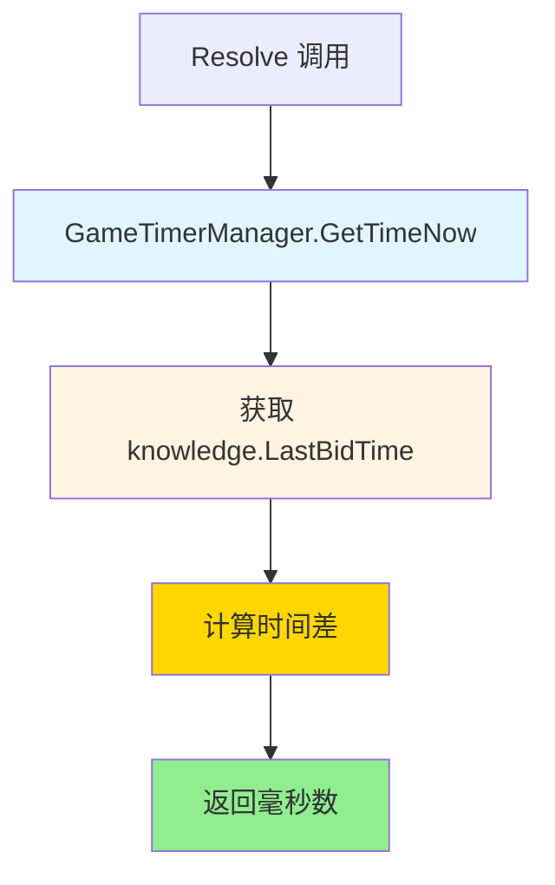

# TimeSinceLastBid.cs 文档

## 📄 文件信息表

| 属性 | 值 |
|------|------|
| 文件路径 | `Assets/Scripts/Code/Module/Config/Value/TimeSinceLastBid.cs` |
| 命名空间 | `TaoTie` |
| 类类型 | 配置值类 |
| 依赖模块 | Sirenix.OdinInspector |
| 继承 | `BaseValue` |

---

## 🏗️ 类说明

**TimeSinceLastBid** 是一个专用的值类型，用于计算距上次出价的时间间隔。

### 核心职责

- 获取当前游戏时间
- 从 `knowledge.LastBidTime` 读取上次出价时间
- 计算时间差（毫秒）

### 使用场景

- AI 决策中判断是否达到出价冷却时间
- 评估出价频率
- 时间相关的策略判断

---

## 📊 字段表

| 字段名 | 类型 | 访问修饰符 | 说明 |
|--------|------|------------|------|
| (无实例字段) | - | - | 无状态类 |

---

## 🔧 方法说明

### Resolve

```csharp
public override float Resolve(AIKnowledge knowledge)
```

解析值为距上次出价的时间间隔。

**参数:**
- `knowledge`: AI 知识对象，包含 `LastBidTime` 字段

**返回:** 距上次出价的毫秒数

**实现逻辑:**
```csharp
return GameTimerManager.Instance.GetTimeNow() - knowledge.LastBidTime;
```

---

## 🔄 Mermaid 流程图

### 值解析流程



### 时间线示意

```mermaid
gantt
    title 时间间隔计算
    dateFormat X
    axisFormat %s
    
    section 时间线
    LastBidTime : 0, 1000
    Now : 1000, 1500
    TimeSinceLastBid : 1000, 1500
```



---

## 💡 使用示例

### 基础使用

```csharp
// 创建时间间隔计算器
var timeSinceBid = new TimeSinceLastBid();

// 解析值（假设上次出价在 1000ms 前）
float elapsed = timeSinceBid.Resolve(knowledge);  // 返回 1000
```

### 在决策树中使用

```csharp
// 比较节点：检查是否超过最小出价间隔
var compareNode = new DecisionCompareNode
{
    LeftValue = new TimeSinceLastBid(),  // 已等待时间
    CompareMode = CompareMode.Greater,
    RightValue = new MinAuctionTime(),  // 最小出价时间
    True = new DecisionActionNode { Tactic = AITactic.LowWeight },
    False = new DecisionActionNode { Tactic = AITactic.Sidelines }
};
```

### 在配置表中使用

```yaml
# ConfigAIDecisionTree 配置示例
Type: "CooldownBidderAI"
Node:
  Type: DecisionCompareNode
  LeftValue:
    Type: TimeSinceLastBid  # 距上次出价时间
  CompareMode: Greater
  RightValue:
    Type: MinAuctionTime  # 最小冷却时间
  True:
    Type: DecisionActionNode
    Tactic: LowWeight  # 冷却结束，可以出价
  False:
    Type: DecisionActionNode
    Tactic: Sidelines  # 冷却中，继续观望
```

### 与其他值类型组合

```csharp
// 检查是否超过最小时间的 1.5 倍
var extendedCooldown = new OperatorValue
{
    Left = new MinAuctionTime(),
    Op = LogicMode.Mul,
    Right = new SingleValue(1.5f)
};

var compareNode = new DecisionCompareNode
{
    LeftValue = new TimeSinceLastBid(),
    CompareMode = CompareMode.Greater,
    RightValue = extendedCooldown,
    True = new DecisionActionNode { Tactic = AITactic.HighWeight },
    False = new DecisionActionNode { Tactic = AITactic.LowWeight }
};
```

---

## 📝 AIKnowledge 结构

```csharp
public class AIKnowledge
{
    public Entity Entity;
    public ConfigAIDecisionTreeCategory Config;
    public long LastBidTime;  // 上次出价时间戳（毫秒）
    // ...
}
```

### 时间戳更新

```csharp
// 出价时更新 LastBidTime
knowledge.LastBidTime = GameTimerManager.Instance.GetTimeNow();

// 下次计算 TimeSinceLastBid 时
// Resolve 返回：GetTimeNow() - LastBidTime
```

---

## ⚠️ 注意事项

### 时间单位

- 返回值单位为**毫秒**
- `GameTimerManager.GetTimeNow()` 返回毫秒级时间戳

### 初始值

- 如果从未出价，`LastBidTime` 可能为 0
- 此时 `TimeSinceLastBid` 返回当前时间（可能很大）

```csharp
// 建议检查是否已出过价
if (knowledge.LastBidTime > 0)
{
    var timeSinceBid = new TimeSinceLastBid();
    float elapsed = timeSinceBid.Resolve(knowledge);
}
else
{
    // 首次出价，无冷却限制
    float elapsed = float.MaxValue;
}
```

### 负值处理

- 正常情况下不会出现负值
- 如果 `LastBidTime` 大于当前时间，可能返回负数
- 建议添加保护逻辑

---

## 🔗 相关文档链接

- [BaseValue.cs.md](./BaseValue.cs.md) - 值基类
- [MinAuctionTime.cs.md](./MinAuctionTime.cs.md) - 最低出价时间
- [RandomAuctionTime.cs.md](./RandomAuctionTime.cs.md) - 随机出价时间
- [AIKnowledge.cs.md](../../../Game/Component/AI/Knowledge/AIKnowledge.cs.md) - AI 知识类
- [GameTimerManager.cs.md](../../../Mono/Module/Timer/GameTimerManager.cs.md) - 游戏时间管理器
- [DecisionCompareNode.cs.md](../DecisionTree/DecisionCompareNode.cs.md) - 比较节点

---

*最后更新：2026-03-02*
