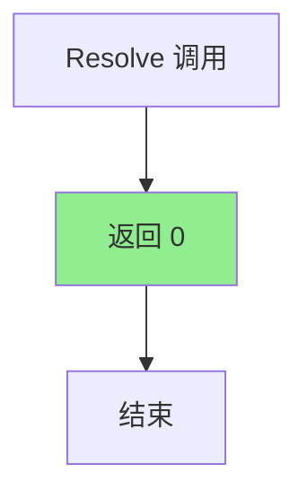

# ZeroValue.cs 文档

## 📄 文件信息表

| 属性 | 值 |
|------|------|
| 文件路径 | `Assets/Scripts/Code/Module/Config/Value/ZeroValue.cs` |
| 命名空间 | `TaoTie` |
| 类类型 | 配置值类 |
| 依赖模块 | Nino.Core |
| 继承 | `BaseValue` |
| 序列化 | NinoType |

---

## 🏗️ 类说明

**ZeroValue** 是一个特殊的值类型，始终返回值 0。用于需要固定零值的场景。

### 核心职责

- 提供固定的零值
- 作为 `BaseValue` 的简化实现
- 用于重置、清零或默认值场景

### 设计特点

- 无字段，纯行为类
- 解析方法直接返回 0
- 可视为 `SingleValue(0)` 的优化版本

---

## 📊 字段表

| 字段名 | 类型 | 访问修饰符 | 说明 |
|--------|------|------------|------|
| (无实例字段) | - | - | 无状态类 |

---

## 🔧 方法说明

### Resolve

```csharp
public override float Resolve(AIKnowledge knowledge)
```

解析值为 0。

**参数:**
- `knowledge`: AI 知识对象（未使用）

**返回:** `0`

**实现逻辑:**
```csharp
return 0;
```

---

## 🔄 Mermaid 流程图

### 值解析流程



---

## 💡 使用示例

### 基础使用

```csharp
// 创建零值
var zeroValue = new ZeroValue();
float result = zeroValue.Resolve(knowledge);  // 始终返回 0
```

### 在决策树中使用

```csharp
// 比较节点：检查属性是否为 0
var compareNode = new DecisionCompareNode
{
    LeftValue = new FormulaValue { Formula = "Health" },
    CompareMode = CompareMode.Equal,
    RightValue = new ZeroValue(),  // 检查是否为 0
    True = new DecisionActionNode { Tactic = AITactic.LeaveRun },
    False = new DecisionActionNode { Tactic = AITactic.Sidelines }
};
```

### 作为运算操作数

```csharp
// 重置值：Value * 0 = 0
var resetOp = new OperatorValue
{
    Left = new FormulaValue { Formula = "Cost" },
    Op = LogicMode.Mul,
    Right = new ZeroValue()  // 乘以 0
};

float result = resetOp.Resolve(knowledge);  // 始终为 0
```

### 在配置表中使用

```yaml
# ConfigAIDecisionTree 配置示例
Type: "BidderAI"
Node:
  Type: DecisionCompareNode
  LeftValue:
    Type: FormulaValue
    Formula: "RemainingBudget"
  CompareMode: Equal
  RightValue:
    Type: ZeroValue  # 检查预算是否为 0
  True:
    Type: DecisionActionNode
    Tactic: LeaveWalk
  False:
    Type: DecisionActionNode
    Tactic: Sidelines
```

---

## 📝 与 SingleValue 的对比

| 特性 | ZeroValue | SingleValue(0) |
|------|-----------|----------------|
| 字段数 | 0 | 1 (Value) |
| 序列化大小 | 更小 | 稍大 |
| 性能 | 略优 | 正常 |
| 语义 | 明确表示零值 | 通用固定值 |
| 使用场景 | 清零、默认值 | 任意固定值 |

**建议:** 当需要固定值 0 时，优先使用 `ZeroValue` 以获得更好的语义和性能。

---

## 🔗 相关文档链接

- [BaseValue.cs.md](./BaseValue.cs.md) - 值基类
- [SingleValue.cs.md](./SingleValue.cs.md) - 固定值
- [OperatorValue.cs.md](./OperatorValue.cs.md) - 运算值
- [DecisionCompareNode.cs.md](../DecisionTree/DecisionCompareNode.cs.md) - 比较节点

---

*最后更新：2026-03-02*
