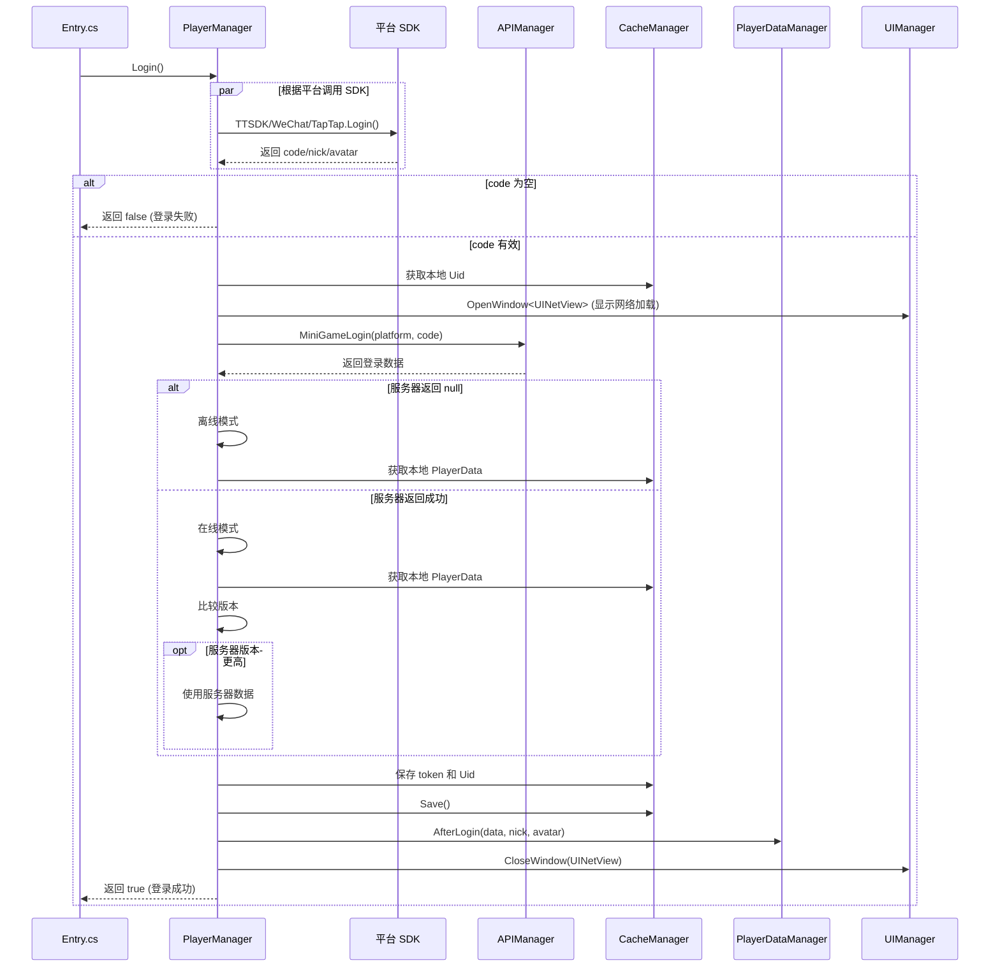

# PlayerManager.cs 注解文档

## 文件基本信息

| 属性 | 值 |
|------|-----|
| **文件名** | PlayerManager.cs |
| **路径** | Assets/Scripts/Code/Module/Player/PlayerManager.cs |
| **所属模块** | 框架层 → Code/Module/Player |
| **文件职责** | 玩家管理器，负责玩家登录、登出、在线状态管理 |

---

## 类/结构体说明

### PlayerManager

| 属性 | 说明 |
|------|------|
| **职责** | 管理玩家登录流程，支持多平台登录（抖音/微信/快手/B 站等） |
| **泛型参数** | 无 |
| **继承关系** | 无继承 |
| **实现的接口** | `IManager` |

**设计模式**: 单例模式 + 多平台适配

```csharp
// 单例实现
public static PlayerManager Instance { get; private set; }

// 通过 ManagerProvider 注册
ManagerProvider.RegisterManager<PlayerManager>();
```

---

## 字段与属性（按重要程度排序）

| 名称 | 类型 | 访问级别 | 说明 |
|------|------|----------|------|
| `Instance` | `PlayerManager` | `public static` | 单例实例，全局访问点 |
| `Uid` | `int` | `public` | 玩家 ID（登录后设置） |
| `OnLine` | `bool` | `public` | 是否在线（网络模式/离线模式） |

---

## 方法说明（按重要程度排序）

### Init()

**签名**:
```csharp
public void Init()
```

**职责**: 初始化玩家管理器

**核心逻辑**:
```
1. 设置单例 Instance = this
```

**调用者**: ManagerProvider.RegisterManager<PlayerManager>()

---

### Destroy()

**签名**:
```csharp
public void Destroy()
```

**职责**: 销毁玩家管理器

**核心逻辑**:
```
1. 设置 Instance = null
```

**调用者**: ManagerProvider.RemoveManager<PlayerManager>()

---

### Login(bool jump)

**签名**:
```csharp
public async ETTask<bool> Login(bool jump = false)
```

**职责**: 玩家登录流程，支持多平台适配

**核心逻辑**:
```
1. 根据平台调用对应 SDK 登录
   - 抖音：TTSDK.TT.Login()
   - TapTap: TapTapMiniGame.Tap.Login()
   - 微信/B 站：WeChatWASM.WX.Login()
   - 支付宝：AlipaySdk.AlipaySDK.API.GetAuthCode()
   - 快手：KSWASM.KS.Login()
   - OPPO: QGMiniGame.QG.Login()
   - 小游戏主机：minihost.TJ.Login()
   - 4399: H5Game.API.Login()
   - 编辑器/开发模式：显示登录 UI
2. 获取 code/nick/avatar
3. 如果 code 为空且 jump=false，返回 false（登录失败）
4. 从缓存获取本地 Uid
5. 显示网络加载 UI
6. 调用 APIManager.MiniGameLogin() 服务器登录
7. 处理登录结果：
   - 失败 → 离线模式，使用本地缓存数据
   - 成功 → 在线模式，同步服务器数据
8. 处理数据版本冲突（服务器版本 > 本地版本 → 使用服务器数据）
9. 缓存 token 和 Uid
10. 调用 PlayerDataManager.AfterLogin()
11. 关闭网络加载 UI
12. 返回 true（登录成功）
```

**调用者**: Entry.cs（游戏启动时）

**被调用者**: 各平台 SDK, `APIManager.MiniGameLogin()`, `PlayerDataManager.AfterLogin()`

**平台宏定义**:
```csharp
UNITY_WEBGL_TT        // 抖音小游戏
UNITY_WEBGL_TAPTAP    // TapTap
UNITY_WEBGL_WeChat    // 微信小游戏
UNITY_WEBGL_BILIGAME  // B 站游戏
UNITY_WEBGL_ALIPAY    // 支付宝
UNITY_WEBGL_KS        // 快手小游戏
UNITY_WEBGL_QG        // OPPO 小游戏
UNITY_WEBGL_MINIHOST  // 小游戏主机
UNITY_WEBGL_4399      // 4399 小游戏
```

---

## 登录流程详解

### 完整登录流程图



### 多平台登录代码结构

```csharp
// 抖音小游戏
#if UNITY_WEBGL_TT
ETTask<string> res = ETTask<string>.Create(true);
TTSDK.TT.Login(
    (code, anonymousCode, isLogin) => { res.SetResult(code); },  // 成功回调
    (errMsg) => { res.SetResult(null); }  // 失败回调
);
platform = LoginPlatform.TikTok;
code = await res;

// 微信小游戏
#elif UNITY_WEBGL_WeChat
ETTask<string> res = ETTask<string>.Create(true);
WeChatWASM.WX.Login(new WeChatWASM.LoginOption()
{
    success = (data) => { res.SetResult(data.code); },
    fail = (data) => { res.SetResult(null); }
});
platform = LoginPlatform.WeChat;
code = await res;

// 编辑器模式
#else
ETTask<string> res = ETTask<string>.Create(true);
await UIManager.Instance.OpenWindow<UILoginWin, ETTask<string>>(
    UILoginWin.PrefabPath, res, UILayerNames.TipLayer
);
code = await res;
#endif
```

---

## 数据同步策略

### 本地 vs 服务器数据

```csharp
// 获取本地缓存数据
PlayerData localData = CacheManager.Instance.GetValue<PlayerData>(CacheKeys.PlayerData);

// 服务器登录
var data = await APIManager.Instance.MiniGameLogin(platform, code);

if (data == null)
{
    // 离线模式
    OnLine = false;
    localData = CacheManager.Instance.GetValue<PlayerData>(CacheKeys.PlayerData);
}
else
{
    // 在线模式
    JsonHelper.TryFromJson(data.data, out PlayerData serverData);
    
    if (localData != null)
    {
        // 比较版本号
        if (serverData != null && serverData.Version > localData.Version)
        {
            localData = serverData;  // 使用服务器数据
        }
        // 否则使用本地数据（本地更新）
    }
    else
    {
        localData = serverData;  // 首次登录
    }
    
    OnLine = true;
    Uid = data.uid;
}
```

### 版本号机制

| 场景 | 版本号比较 | 使用数据 |
|------|-----------|---------|
| 首次登录 | 无本地数据 | 服务器数据 |
| 正常同步 | 服务器 Version > 本地 Version | 服务器数据 |
| 本地有更新 | 本地 Version >= 服务器 Version | 本地数据 |
| 离线模式 | 无法连接服务器 | 本地缓存数据 |

---

## 阅读指引

### 建议的阅读顺序

1. **理解登录管理器作用** - 为什么需要 PlayerManager
2. **看字段定义** - 了解 Uid/OnLine 状态
3. **重点看 Login 方法** - 理解多平台登录流程
4. **了解数据同步** - 理解本地 vs 服务器数据同步

### 最值得学习的技术点

1. **多平台适配**: 统一的登录接口适配 9+ 平台
2. **异步 SDK 调用**: ETTask 包装回调式 SDK
3. **版本冲突解决**: 通过 Version 字段解决数据冲突
4. **离线模式**: 网络失败时使用本地缓存
5. **平台宏定义**: 编译时决定支持的平台

---

## 使用示例

### 示例 1: 游戏启动时登录

```csharp
// Entry.cs 中
ManagerProvider.RegisterManager<PlayerManager>();
var res = await PlayerManager.Instance.Login(true);  // jump=true 允许跳过

if (!res)
{
    // 登录失败，显示重试框
    var task = await UIManager.Instance.OpenBox<UIMsgBoxWin, MsgBoxPara>(...);
    if (await task)
    {
        await PlayerManager.Instance.Login();  // 重试
    }
    else
    {
        BridgeHelper.Quit();  // 退出游戏
    }
}
```

### 示例 2: 检查登录状态

```csharp
// 检查是否已登录
if (PlayerManager.Instance.Uid != 0)
{
    // 已登录，可以访问玩家数据
    var nickName = PlayerDataManager.Instance.NickName;
}
else
{
    // 未登录，需要重新登录
    await PlayerManager.Instance.Login();
}

// 检查是否在线
if (PlayerManager.Instance.OnLine)
{
    // 在线模式，可以同步数据
    await APIManager.Instance.SyncData();
}
else
{
    // 离线模式，使用本地数据
    Log.Info("离线模式");
}
```

---

## 登录平台枚举

```csharp
public enum LoginPlatform
{
    Dev,         // 开发模式
    TikTok,      // 抖音
    WeChat,      // 微信
    TapTap,      // TapTap
    Bilibili,    // B 站
    KuaiShou,    // 快手
    QuickGame,   // OPPO
    AliPay,      // 支付宝
    MiniHost,    // 小游戏主机
    _4399,       // 4399
}
```

---

## 缓存键值

| 键名 | 类型 | 说明 |
|------|------|------|
| `CacheKeys.LastToken` | string | 上次登录 token |
| `CacheKeys.Account` | string | 玩家 Uid |
| `CacheKeys.PlayerData` | PlayerData | 玩家数据 |

---

## 注意事项

### ⚠️ 登录超时处理

登录 SDK 可能超时，建议添加超时保护：

```csharp
// 推荐：添加超时
var loginTask = PlayerManager.Instance.Login();
var timeoutTask = TimerManager.Instance.WaitAsync(30000);  // 30 秒超时

if (await Task.WhenAny(loginTask, timeoutTask) == timeoutTask)
{
    Log.Error("登录超时");
    // 处理超时
}
```

### ⚠️ 离线模式限制

离线模式下部分功能可能不可用：

```csharp
if (!PlayerManager.Instance.OnLine)
{
    // 离线模式，限制某些功能
    Log.Warning("离线模式，无法使用排行榜功能");
    return;
}
```

---

## 相关文档

- [PlayerDataManager.cs.md](./PlayerDataManager.cs.md) - 玩家数据管理
- [SDKManager.cs.md](./SDKManager.cs.md) - 平台 SDK 管理
- [APIManager.cs.md](../Net/APIManager.cs.md) - 网络 API 管理
- [CacheManager.cs.md](./CacheManager.cs.md) - 缓存管理
- [Entry.cs.md](../Entry.cs.md) - 游戏入口（调用 Login）

---

*文档生成时间：2026-02-27 | OpenClaw AI 助手*
