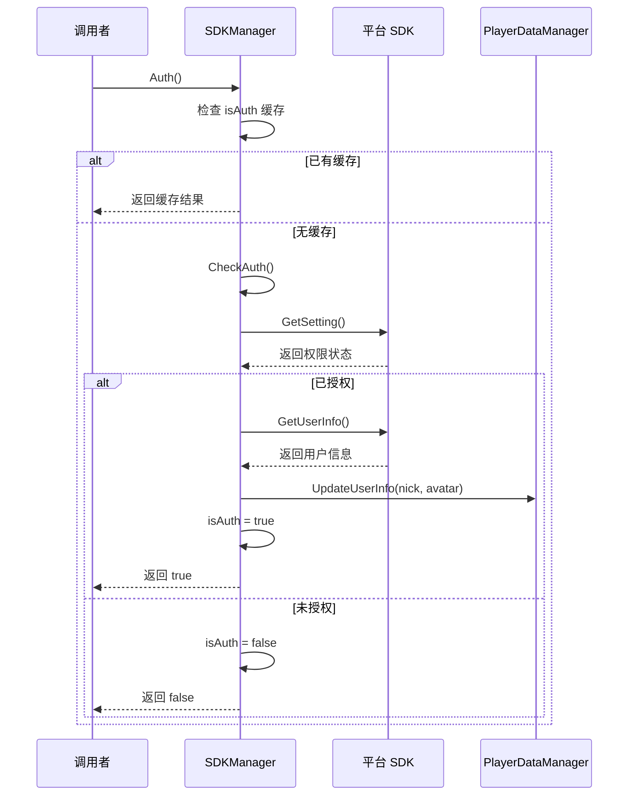

# SDKManager.cs 注解文档

## 文件基本信息

| 属性 | 值 |
|------|------|
| **文件名** | SDKManager.cs |
| **路径** | Assets/Scripts/Code/Module/Player/SDKManager.cs |
| **所属模块** | 框架层 → Code/Module/Player |
| **文件职责** | 平台 SDK 管理，处理多平台登录授权、用户信息获取 |

---

## 类/结构体说明

### SDKManager

| 属性 | 说明 |
|------|------|
| **职责** | 管理各小游戏平台 SDK，统一授权接口 |
| **泛型参数** | 无 |
| **继承关系** | 无继承 |
| **实现的接口** | `IManager` |

**设计模式**: 单例模式 + 多平台适配

```csharp
// 单例实现
public static SDKManager Instance { get; private set; }

// 通过 ManagerProvider 注册
ManagerProvider.RegisterManager<SDKManager>();
```

---

## 字段与属性

| 名称 | 类型 | 访问级别 | 说明 |
|------|------|----------|------|
| `Instance` | `SDKManager` | `public static` | 单例实例 |
| `isAuth` | `bool?` | `private` | 是否已授权（缓存） |
| `canSliderBar` | `bool` | `private` | 是否支持侧边栏 |

---

## 方法说明（按重要程度排序）

### Init()

**签名**:
```csharp
public void Init()
```

**职责**: 初始化 SDK 管理器，检查各平台能力

**核心逻辑**:
```
1. 初始化 canSliderBar = false
2. 根据平台调用对应 SDK 检查侧边栏能力：
   - TapTap: GetLeaderBoardManager()
   - 抖音：TTSDK.TT.CheckScene(SideBar)
   - 快手：KSWASM.KS.CheckSliderBarIsAvailable()
   - 微信/B 站：WeChatWASM.WX.CheckScene("sidebar")
3. 设置单例 Instance = this
```

**调用者**: ManagerProvider.RegisterManager<SDKManager>()

---

### Auth()

**签名**:
```csharp
public async ETTask<bool> Auth()
```

**职责**: 请求用户授权，获取用户信息

**返回**: `true` = 授权成功，`false` = 授权失败/取消

**核心逻辑**:
```
1. 检查 isAuth 缓存，如果已有结果直接返回
2. 调用 CheckAuth() 执行授权流程
3. 缓存结果 isAuth = res
4. 返回结果
```

**调用者**: 需要用户信息的场景

**使用示例**:
```csharp
// 请求授权
bool success = await SDKManager.Instance.Auth();
if (success)
{
    // 授权成功，可以获取用户信息
    Log.Info("授权成功");
}
else
{
    // 授权失败或用户取消
    Log.Info("授权失败");
}
```

---

### IsAuth()

**签名**:
```csharp
public bool IsAuth()
```

**职责**: 检查是否已授权（不触发授权流程）

**返回**: `true` = 已授权，`false` = 未授权

**使用示例**:
```csharp
// 检查授权状态
if (SDKManager.Instance.IsAuth())
{
    // 已授权，可以获取用户信息
}
else
{
    // 未授权，需要先授权
    await SDKManager.Instance.Auth();
}
```

---

### CheckAuth()

**签名**:
```csharp
private async ETTask<bool> CheckAuth()
```

**职责**: 执行实际授权流程（多平台适配）

**核心逻辑**:
```
1. 根据平台调用对应 SDK 授权接口：
   
   **抖音 (UNITY_WEBGL_TT)**:
   - TTSDK.TT.GetUserInfoAuth()
   - 如果未授权，打开设置面板 TTSDK.TT.OpenSettingsPanel()
   - 获取用户信息 TTSDK.TT.GetUserInfo()
   
   **TapTap (UNITY_WEBGL_TAPTAP)**:
   - TapTapMiniGame.Tap.GetSetting()
   - 检查 scope.userInfo 权限
   - TapTapMiniGame.Tap.GetUserInfo()
   
   **微信/B 站 (UNITY_WEBGL_WeChat/BILIGAME)**:
   - WeChatWASM.WX.GetSetting()
   - 检查 scope.userInfo 权限
   - WeChatWASM.WX.GetUserInfo()
   
   **支付宝 (UNITY_WEBGL_ALIPAY)**:
   - AlipaySdk.AlipaySDK.API.GetAuthCode()
   - AlipaySdk.AlipaySDK.API.GetAuthUserInfo()
   
   **快手 (UNITY_WEBGL_KS)**:
   - KSWASM.KS.GetSetting()
   - KSWASM.KS.GetUserInfo()
   
   **小游戏主机 (UNITY_WEBGL_MINIHOST)**:
   - minihost.TJ.GetSetting()
   - minihost.TJ.GetUserInfo()

2. 获取昵称和头像
3. 调用 PlayerDataManager.Instance.UpdateUserInfo()
4. 返回授权结果
```

**调用者**: `Auth()`

---

## 平台支持

### 支持的平台

| 平台 | 宏定义 | SDK |
|------|--------|-----|
| 抖音小游戏 | UNITY_WEBGL_TT | TTSDK |
| TapTap | UNITY_WEBGL_TAPTAP | TapTapMiniGame |
| 微信小游戏 | UNITY_WEBGL_WeChat | WeChatWASM |
| B 站游戏 | UNITY_WEBGL_BILIGAME | WeChatWASM |
| 支付宝 | UNITY_WEBGL_ALIPAY | AlipaySdk |
| 快手小游戏 | UNITY_WEBGL_KS | KSWASM |
| OPPO 小游戏 | UNITY_WEBGL_QG | QGMiniGame |
| 小游戏主机 | UNITY_WEBGL_MINIHOST | minihost |

---

## 授权流程

### 完整流程图



---

## 阅读指引

### 建议的阅读顺序

1. **理解 SDK 管理器作用** - 为什么需要 SDKManager
2. **看 Auth 方法** - 理解授权流程
3. **看 CheckAuth** - 理解多平台适配
4. **了解平台差异** - 各平台 SDK 调用方式

### 最值得学习的技术点

1. **多平台适配**: 统一的接口适配 8+ 平台
2. **授权缓存**: isAuth 避免重复授权
3. **异步流程**: ETTask 处理异步授权
4. **能力检测**: Init 时检查平台能力（侧边栏等）

---

## 使用示例

### 示例 1: 基础授权

```csharp
// 检查是否已授权
if (!SDKManager.Instance.IsAuth())
{
    // 请求授权
    bool success = await SDKManager.Instance.Auth();
    
    if (success)
    {
        // 授权成功
        Log.Info("授权成功");
    }
    else
    {
        // 授权失败
        Log.Info("授权失败");
    }
}
else
{
    // 已授权，可以直接使用
    Log.Info("已授权");
}
```

### 示例 2: 获取用户信息

```csharp
// 授权后获取用户信息
await SDKManager.Instance.Auth();

// 从 PlayerDataManager 获取
string nick = PlayerDataManager.Instance.NickName;
string avatar = PlayerDataManager.Instance.Avatar;
```

### 示例 3: 检查平台能力

```csharp
// 检查是否支持侧边栏
if (SDKManager.Instance.CanUseSliderBar())
{
    // 显示侧边栏入口
    ShowSliderBarButton();
}
```

---

## 注意事项

### ⚠️ 授权时机

建议在需要用户信息时才授权，而不是启动时强制授权：

```csharp
// ❌ 不推荐：启动时强制授权
void Start()
{
    SDKManager.Instance.Auth().Coroutine();  // 可能吓到用户
}

// ✅ 推荐：需要时再授权
void OnClickAvatar()
{
    // 用户点击头像时才请求授权
    SDKManager.Instance.Auth().Coroutine();
}
```

### ⚠️ 授权失败处理

授权可能失败（用户取消、网络问题等），需要友好提示：

```csharp
bool success = await SDKManager.Instance.Auth();
if (!success)
{
    // 显示友好提示
    await UIManager.Instance.OpenBox<UIMsgBoxWin, MsgBoxPara>(
        UIMsgBoxWin.PrefabPath,
        new MsgBoxPara
        {
            Content = "获取用户信息失败，部分功能可能受限",
            ConfirmText = "知道了"
        }
    );
}
```

---

## 相关文档

- [PlayerManager.cs.md](./PlayerManager.cs.md) - 玩家管理器
- [PlayerDataManager.cs.md](./PlayerDataManager.cs.md) - 玩家数据管理
- [APIManager.cs.md](../Net/APIManager.cs.md) - 网络 API

---

*文档生成时间：2026-02-27 | OpenClaw AI 助手*
