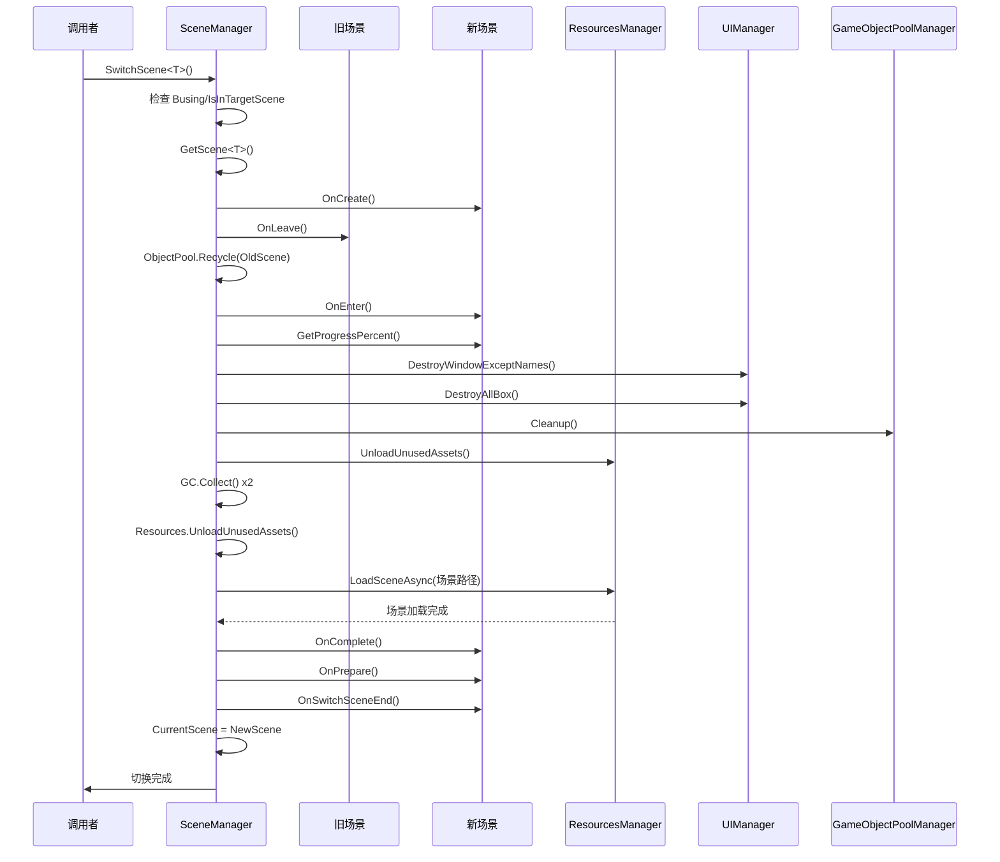

# SceneManager.cs 注解文档

## 文件基本信息

| 属性 | 值 |
|------|-----|
| **文件名** | SceneManager.cs |
| **路径** | Assets/Scripts/Code/Module/Scene/SceneManager.cs |
| **所属模块** | 框架层 → Code/Module/Scene |
| **文件职责** | 场景管理系统，负责场景异步加载、切换、进度管理和资源清理 |

---

## 类/结构体说明

### SceneManager

| 属性 | 说明 |
|------|------|
| **职责** | 调度和控制场景异步加载、进度管理、Loading 界面展示、GC 和资源卸载 |
| **泛型参数** | 无 |
| **继承关系** | 无继承 |
| **实现的接口** | `IManager` |

**设计模式**: 单例模式 + 状态机 + 队列任务

```csharp
// 单例实现
public static SceneManager Instance { get; private set; }

// 通过 ManagerProvider 注册
ManagerProvider.RegisterManager<SceneManager>();
```

---

## 字段与属性（按重要程度排序）

| 名称 | 类型 | 访问级别 | 说明 |
|------|------|----------|------|
| `Instance` | `SceneManager` | `public static` | 单例实例，全局访问点 |
| `CurrentScene` | `IScene` | `public` | 当前场景实例 |
| `currentSceneOp` | `SceneHandle` | `private` | 当前场景的资源句柄（用于卸载） |
| `Busing` | `bool` | `public` | 是否正在加载场景（防止重复切换） |
| `waitFinishTask` | `Queue<ETTask>` | `private readonly` | 等待加载完成的任务队列 |

---

## 方法说明（按重要程度排序）

### Init()

**签名**:
```csharp
public void Init()
```

**职责**: 初始化场景管理器

**核心逻辑**:
```
1. 设置单例 Instance = this
```

**调用者**: ManagerProvider.RegisterManager<SceneManager>()

---

### Destroy()

**签名**:
```csharp
public void Destroy()
```

**职责**: 销毁场景管理器，卸载当前场景

**核心逻辑**:
```
1. 卸载当前场景资源 currentSceneOp?.UnloadAsync()
2. 清空任务队列
3. 设置 Instance = null
```

**调用者**: ManagerProvider.RemoveManager<SceneManager>()

---

### SwitchScene<T>(bool needClean)

**签名**:
```csharp
public async ETTask SwitchScene<T>(bool needClean = true) where T : class, IScene
```

**职责**: 切换到指定场景

**核心逻辑**:
```
1. 检查是否正在加载（Busing）→ 是则返回
2. 检查是否已在目标场景 → 是则返回
3. 设置 Busing = true
4. 获取可保留资源列表 ignoreClean
5. 调用 InnerSwitchScene<T>() 执行实际切换
6. 清理 loading 界面资源
7. 设置 Busing = false
```

**调用者**: Entry.cs（游戏启动时）, 任何需要切换场景的代码

**被调用者**: `InnerSwitchScene<T>()`, `GameObjectPoolManager.CleanupWithPathArray()`

**使用示例**:
```csharp
// 切换到引导场景
await SceneManager.Instance.SwitchScene<GuideScene>();

// 切换到家园场景（不清理资源）
await SceneManager.Instance.SwitchScene<HomeScene>(needClean: false);
```

---

### SwitchMapScene(string typeName, bool needClean)

**签名**:
```csharp
public async ETTask SwitchMapScene(string typeName, bool needClean = true)
```

**职责**: 切换到指定 Map 场景（通过场景名称）

**核心逻辑**:
```
1. 检查是否正在加载
2. 通过场景名称获取配置 LevelConfigCategory.Instance.TryGetByName()
3. 设置 Busing = true
4. 调用 InnerSwitchScene<MapScene>(config.Id)
5. 清理资源
6. 设置 Busing = false
```

**调用者**: 需要切换地图场景的代码

**使用示例**:
```csharp
// 切换到"家园"地图
await SceneManager.Instance.SwitchMapScene("家园");
```

---

### InnerSwitchScene<T>(needClean, id, ignoreClean)

**签名**:
```csharp
async ETTask InnerSwitchScene<T>(bool needClean = false, int id = 0, List<string> ignoreClean = null) 
    where T : class, IScene
```

**职责**: 内部场景切换流程（核心方法）

**核心逻辑**:
```
1. 创建新场景实例 GetScene<T>()
2. 如果存在旧场景：
   - 调用 OnLeave()
   - 回收到对象池
3. 如果是 MapScene，设置 ConfigId
4. 获取进度权重（cleanup/loadScene/prepare）
5. 调用 OnEnter() 进入场景
6. 等待资源管理器加载完成
7. 清理 UI（保留场景指定窗口）
8. 清理 ImageLoaderManager 缓存
9. 如果需要清理：
   - 清理 GameObjectPool
   - 卸载未使用资源
10. GC 两次（清干净）
11. 异步加载目标场景 ResourcesManager.LoadSceneAsync()
12. 卸载旧场景
13. 调用 OnComplete() 场景加载完成
14. 调用 OnPrepare() 预加载资源
15. 设置进度 100%
16. 等待 500ms（避免跳太快）
17. 设置 CurrentScene = scene
18. 调用 OnSwitchSceneEnd()
19. 完成加载 FinishLoad()
20. 启动引导检查 GuidanceManager.CheckGroupStart()
```

**调用者**: `SwitchScene<T>()`, `SwitchMapScene()`

**进度分配**:
```csharp
scene.GetProgressPercent(out float cleanup, out float loadScene, out float prepare);
float total = cleanup + loadScene + prepare;

// 按 90% 分配（留 10% 缓冲）
cleanup = cleanup / total * 0.9f;
loadScene = loadScene / total * 0.9f;
prepare = prepare / total * 0.9f;
```

---

### GetScene<T>()

**签名**:
```csharp
async ETTask<IScene> GetScene<T>() where T : class, IScene
```

**职责**: 从对象池获取场景实例并初始化

**核心逻辑**:
```
1. 从对象池获取实例 ObjectPool.Instance.Fetch<T>()
2. 调用 OnCreate() 初始化
3. 返回场景实例
```

**调用者**: `InnerSwitchScene<T>()`, `PreloadScene<T>()`

---

### PreloadScene<T>()

**签名**:
```csharp
public async ETTask PreloadScene<T>() where T : class, IScene
```

**职责**: 预加载场景（不切换，只加载资源）

**核心逻辑**:
```
1. 获取场景实例 GetScene<T>()
2. 调用 ResourcesManager.PreLoadScene()
```

**调用者**: 需要提前加载场景资源的代码

---

### GetCurrentScene<T>()

**签名**:
```csharp
public T GetCurrentScene<T>() where T : IScene
```

**职责**: 获取当前场景实例（类型转换）

**使用示例**:
```csharp
// 获取当前场景（如果是 HomeScene）
var homeScene = SceneManager.Instance.GetCurrentScene<HomeScene>();
if (homeScene != null)
{
    // 访问 HomeScene 特有方法
    homeScene.RefreshUI();
}
```

---

### IsInTargetScene<T>()

**签名**:
```csharp
public bool IsInTargetScene<T>() where T : IScene
```

**职责**: 检查是否在指定类型的场景中

**使用示例**:
```csharp
// 检查是否在引导场景
if (SceneManager.Instance.IsInTargetScene<GuideScene>())
{
    // 引导场景特殊逻辑
}
```

---

### WaitLoadOver()

**签名**:
```csharp
public ETTask WaitLoadOver()
```

**职责**: 等待场景加载完成

**核心逻辑**:
```
1. 创建任务 ETTask.Create()
2. 加入等待队列
3. 返回任务（由 FinishLoad 完成）
```

**调用者**: 需要等待场景加载完成的代码

---

### FinishLoad()

**签名**:
```csharp
private void FinishLoad()
```

**职责**: 完成加载，通知所有等待任务

**核心逻辑**:
```
1. 遍历 waitFinishTask 队列
2. 完成所有任务 task.SetResult()
```

**调用者**: `InnerSwitchScene<T>()`（加载完成时）

---

## 场景切换流程

### 完整流程图



### 进度条更新流程

```
0% ──────────────────────────────────────── 100%
│    │         │         │         │      │
│    │         │         │         │      └─ OnSwitchSceneEnd
│    │         │         │         └─ prepare (预加载)
│    │         │         └─ loadScene (场景加载)
│    │         └─ cleanup (资源清理)
│    └─ OnEnter + 等待资源
└─ 开始
```

---

## 阅读指引

### 建议的阅读顺序

1. **理解场景管理作用** - 为什么需要 SceneManager
2. **看字段定义** - 了解 CurrentScene/Busing 等状态
3. **重点看 SwitchScene** - 理解场景切换入口
4. **深入 InnerSwitchScene** - 理解完整切换流程
5. **了解进度管理** - 理解进度条更新机制

### 最值得学习的技术点

1. **异步场景切换**: 完整的异步加载流程
2. **进度管理**: 分阶段更新进度条
3. **资源清理**: GC + UnloadUnusedAssets 组合清理
4. **对象池**: 场景实例使用对象池复用
5. **队列任务**: WaitLoadOver 机制等待加载完成
6. **防重复切换**: Busing 标志防止并发切换

---

## IScene 接口

### 场景接口定义

```csharp
public interface IScene
{
    // 生命周期
    ETTask OnCreate();           // 创建
    ETTask OnEnter();            // 进入
    ETTask OnComplete();         // 场景加载完成
    ETTask OnPrepare(float start, float end);  // 预加载
    ETTask OnLeave();            // 离开
    ETTask OnSwitchSceneEnd();   // 切换结束
    
    // 进度
    void GetProgressPercent(out float cleanup, out float loadScene, out float prepare);
    ETTask SetProgress(float value);
    
    // 资源
    string GetScenePath();       // 场景路径
    string[] GetDontDestroyWindow();  // 保留的 UI 窗口
    List<string> GetScenesChangeIgnoreClean();  // 保留的资源
    
    // 其他
    string GetName();
}
```

### 场景实现示例

```csharp
public class HomeScene : IScene
{
    public async ETTask OnCreate()
    {
        // 创建场景实例
    }
    
    public async ETTask OnEnter()
    {
        // 进入场景，打开 Loading UI
        await UIManager.Instance.OpenWindow<UILoadingView>(...);
    }
    
    public void GetProgressPercent(out float cleanup, out float loadScene, out float prepare)
    {
        cleanup = 0.2f;      // 清理 20%
        loadScene = 0.65f;   // 加载 65%
        prepare = 0.15f;     // 准备 15%
    }
    
    public async ETTask OnPrepare(float start, float end)
    {
        // 预加载资源
        await GameObjectPoolManager.GetInstance().PreLoadGameObjectAsync(...);
    }
    
    public async ETTask OnLeave()
    {
        // 离开场景，清理资源
    }
    
    public string GetScenePath()
    {
        return "Scenes/HomeScene";
    }
    
    public string[] GetDontDestroyWindow()
    {
        return new string[] { "UITopView" };  // 保留顶部 UI
    }
    
    // ... 其他方法
}
```

---

## 使用示例

### 示例 1: 切换场景

```csharp
// 切换到引导场景
await SceneManager.Instance.SwitchScene<GuideScene>();

// 切换到家园场景（清理资源）
await SceneManager.Instance.SwitchScene<HomeScene>(needClean: true);

// 切换到家园场景（不清理资源，快速切换）
await SceneManager.Instance.SwitchScene<HomeScene>(needClean: false);
```

### 示例 2: 切换地图场景

```csharp
// 通过场景名称切换
await SceneManager.Instance.SwitchMapScene("家园");
await SceneManager.Instance.SwitchMapScene("关卡 1-1");
```

### 示例 3: 检查当前场景

```csharp
// 检查是否在引导场景
if (SceneManager.Instance.IsInTargetScene<GuideScene>())
{
    // 引导场景逻辑
}

// 获取当前场景
var currentScene = SceneManager.Instance.GetCurrentScene<HomeScene>();
if (currentScene != null)
{
    currentScene.RefreshUI();
}
```

### 示例 4: 等待加载完成

```csharp
// 等待场景加载完成后执行
SceneManager.Instance.WaitLoadOver().Coroutine();

// 或者异步等待
await SceneManager.Instance.WaitLoadOver();
```

---

## 相关文档

- [IScene.cs.md](./IScene.cs.md) - 场景接口定义
- [LoadingScene.cs.md](./LoadingScene.cs.md) - 加载场景
- [ResourcesManager.cs.md](../Resource/ResourcesManager.cs.md) - 资源管理器
- [GameObjectPoolManager.cs.md](../Resource/GameObjectPoolManager.cs.md) - 对象池管理
- [Entry.cs.md](../Entry.cs.md) - 游戏入口（调用 SwitchScene）

---

*文档生成时间：2026-02-27 | OpenClaw AI 助手*
