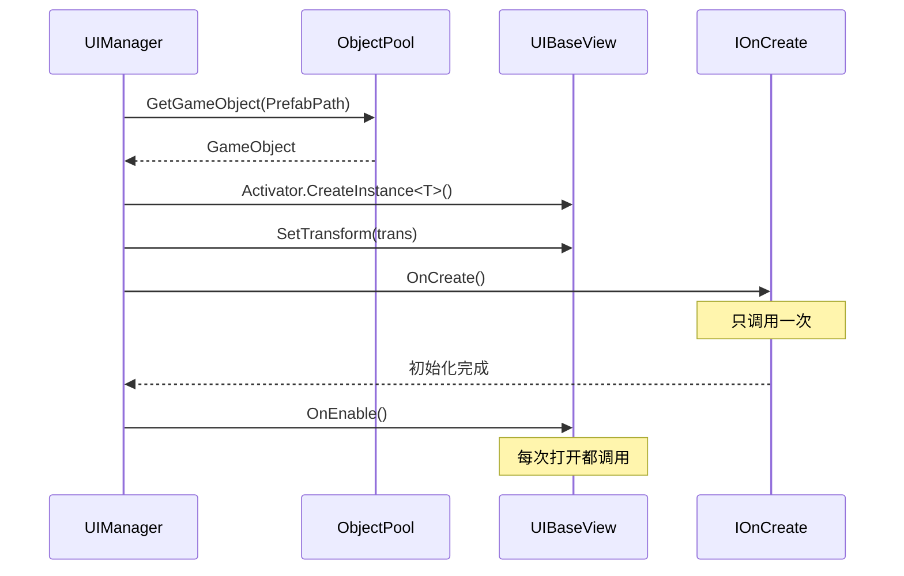

# IOnCreate.cs 注解文档

## 文件基本信息

| 属性 | 值 |
|------|-----|
| **文件名** | IOnCreate.cs |
| **路径** | Assets/Scripts/Code/Module/UI/IOnCreate.cs |
| **所属模块** | 框架层 → Code/Module/UI |
| **文件职责** | 定义 UI 窗口创建时的生命周期接口 |

---

## 类/结构体说明

### IOnCreate (接口)

| 属性 | 说明 |
|------|------|
| **职责** | 无参数创建接口 |
| **泛型参数** | 无 |
| **继承关系** | 无 |
| **实现的接口** | 无 |

```csharp
public interface IOnCreate
{
    public void OnCreate();
}
```

---

### IOnCreate<P1> (接口)

| 属性 | 说明 |
|------|------|
| **职责** | 带单个参数的创建接口 |
| **泛型参数** | P1 - 第一个初始化参数 |
| **继承关系** | 无 |
| **实现的接口** | 无 |

```csharp
public interface IOnCreate<P1>
{
    public void OnCreate(P1 p1);
}
```

---

### IOnCreate<P1, P2> (接口)

| 属性 | 说明 |
|------|------|
| **职责** | 带两个参数的创建接口 |
| **泛型参数** | P1, P2 - 初始化参数 |
| **继承关系** | 无 |
| **实现的接口** | 无 |

```csharp
public interface IOnCreate<P1, P2>
{
    public void OnCreate(P1 p1, P2 p2);
}
```

---

### IOnCreate<P1, P2, P3> (接口)

| 属性 | 说明 |
|------|------|
| **职责** | 带三个参数的创建接口 |
| **泛型参数** | P1, P2, P3 - 初始化参数 |
| **继承关系** | 无 |
| **实现的接口** | 无 |

```csharp
public interface IOnCreate<P1, P2, P3>
{
    public void OnCreate(P1 p1, P2 p2, P3 p3);
}
```

---

### IOnCreate<P1, P2, P3, P4> (接口)

| 属性 | 说明 |
|------|------|
| **职责** | 带四个参数的创建接口 |
| **泛型参数** | P1, P2, P3, P4 - 初始化参数 |
| **继承关系** | 无 |
| **实现的接口** | 无 |

```csharp
public interface IOnCreate<P1, P2, P3, P4>
{
    public void OnCreate(P1 p1, P2 p2, P3 p3, P4 p4);
}
```

---

## 接口详解

### OnCreate() 生命周期

**调用时机**: UI 窗口首次创建时（只调用一次）

**调用者**: `UIManager.InnerOpenWindowGetGameObject()`

**调用流程**:
```csharp
// UIManager.InnerOpenWindowGetGameObject
view.SetTransform(trans);
(view as IOnCreate)?.OnCreate();  // ← 调用 OnCreate
if (view is II18N i18n)
    I18NManager.Instance.RegisterI18NEntity(i18n);
```

**与 Unity MonoBehaviour 的区别**:

| 特性 | Unity Awake/Start | IOnCreate.OnCreate |
|------|------------------|-------------------|
| 调用时机 | MonoBehaviour 生命周期 | UI 框架自定义生命周期 |
| 参数支持 | 无 | 支持 0-4 个参数 |
| 异步支持 | 否 | 可通过 ETTask 扩展 |
| 调用次数 | 一次 | 一次 |

---

## 使用示例

### 示例 1: 无参数 OnCreate

```csharp
public class UILoadingView : UIBaseView, IOnCreate
{
    public static string PrefabPath = "UI/UILoadingView";
    
    private Slider progressBar;
    private Text tipText;
    
    public void OnCreate()
    {
        // 初始化组件引用
        progressBar = GetTransform().Find("ProgressBar").GetComponent<Slider>();
        tipText = GetTransform().Find("TipText").GetComponent<Text>();
        
        // 设置初始状态
        progressBar.value = 0;
        tipText.text = "加载中...";
    }
}
```

---

### 示例 2: 带单个参数的 OnCreate

```csharp
public class UIAuctionView : UIBaseView, IOnCreate<int>
{
    public static string PrefabPath = "UI/UIAuctionView";
    
    private int levelId;
    
    public void OnCreate(int p1)
    {
        // 接收关卡 ID 参数
        levelId = p1;
        
        // 根据关卡 ID 加载配置
        var config = LevelConfigCategory.Instance.Get(levelId);
        // ...
    }
}

// 打开窗口时传递参数
await UIManager.Instance.OpenWindow<UIAuctionView, int>(
    UIAuctionView.PrefabPath,
    levelId  // ← 传递给 OnCreate
);
```

---

### 示例 3: 带多个参数的 OnCreate

```csharp
public class UIMsgBoxWin : UIBaseView, IOnCreate<MsgBoxPara>
{
    public static string PrefabPath = "UI/UIMsgBoxWin";
    
    private MsgBoxPara para;
    private Text contentText;
    private Button confirmBtn;
    private Button cancelBtn;
    
    public void OnCreate(MsgBoxPara p1)
    {
        // 接收消息框参数
        para = p1;
        
        // 获取组件
        contentText = GetTransform().Find("Content").GetComponent<Text>();
        confirmBtn = GetTransform().Find("ConfirmBtn").GetComponent<Button>();
        cancelBtn = GetTransform().Find("CancelBtn").GetComponent<Button>();
        
        // 设置内容
        contentText.text = para.Content;
        
        // 绑定按钮事件
        confirmBtn.onClick.AddListener(() => 
        {
            para.ConfirmCallback?.Invoke(this);
            CloseSelf().Coroutine();
        });
        
        cancelBtn.onClick.AddListener(() => 
        {
            para.CancelCallback?.Invoke(this);
            CloseSelf().Coroutine();
        });
    }
}

// 打开消息框
await UIManager.Instance.OpenBox<UIMsgBoxWin, MsgBoxPara>(
    UIMsgBoxWin.PrefabPath,
    new MsgBoxPara
    {
        Content = "确定要退出吗？",
        ConfirmText = "确定",
        CancelText = "取消",
        ConfirmCallback = (win) => { /* 确定逻辑 */ },
        CancelCallback = (win) => { /* 取消逻辑 */ }
    }
);
```

---

## 生命周期位置

### UI 窗口完整生命周期

```
创建 → OnCreate() → OnEnable() → [Update()] → OnDisable() → [OnEnable()] → OnDestroy()
       ↑只调用一次    ↑每次打开   ↑每帧     ↑每次关闭   ↑可多次    ↑只调用一次
```

### 与 OpenWindow 的关系



---

## 阅读指引

### 建议的阅读顺序

1. **理解接口作用** - OnCreate 是 UI 首次创建时的初始化
2. **看无参数版本** - IOnCreate 基础接口
3. **看泛型版本** - 理解参数传递机制
4. **了解调用时机** - 与 OnEnable 的区别

### 最值得学习的技术点

1. **接口重载**: 支持 0-4 个参数的泛型重载
2. **生命周期分离**: OnCreate(创建) vs OnEnable(打开)
3. **参数传递**: OpenWindow 的参数传递给 OnCreate/OnEnable
4. **空值安全**: `(view as IOnCreate)?.OnCreate()` 可选实现

---

## 最佳实践

### ✅ 推荐做法

```csharp
// 在 OnCreate 中初始化组件引用
public void OnCreate()
{
    // 获取组件（只执行一次）
    button = GetTransform().Find("Button").GetComponent<Button>();
    text = GetTransform().Find("Text").GetComponent<Text>();
    
    // 绑定事件（只绑定一次）
    button.onClick.AddListener(OnButtonClick);
}

// 在 OnEnable 中更新数据
public void OnEnable()
{
    // 更新文本（每次打开都更新）
    text.text = GetData();
}
```

### ❌ 避免做法

```csharp
// ❌ 不要在 OnCreate 中做耗时操作
public void OnCreate()
{
    // 错误：阻塞 UI 初始化
    var data = LoadDataFromDisk();
}

// ✅ 正确：使用异步
public class UILoadingView : UIBaseView, IOnCreate
{
    public async ETTask OnCreateAsync()
    {
        // 异步加载
        await LoadDataAsync();
    }
}

// ❌ 不要在 OnCreate 中修改频繁变化的数据
public void OnCreate()
{
    // 错误：数据只设置一次，下次打开不会更新
    text.text = PlayerManager.Instance.NickName;
}

// ✅ 正确：在 OnEnable 中更新
public void OnEnable()
{
    text.text = PlayerManager.Instance.NickName;
}
```

---

## 相关文档

- [UIManager.cs.md](./UIManager.cs.md) - UI 管理器（调用者）
- [UIBaseView.cs.md](./UIBaseView.cs.md) - UI 视图基类
- [IOnEnable.cs.md](./IOnEnable.cs.md) - 启用接口
- [IOnDisable.cs.md](./IOnDisable.cs.md) - 禁用接口
- [IOnDestroy.cs.md](./IOnDestroy.cs.md) - 销毁接口

---

*文档生成时间：2026-02-27 | OpenClaw AI 助手*
