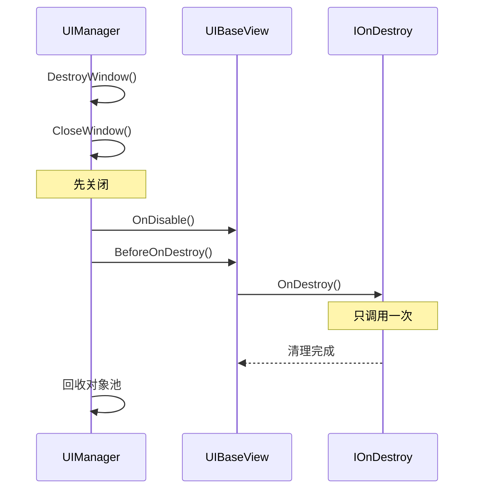

# IOnDestroy.cs 注解文档

## 文件基本信息

| 属性 | 值 |
|------|-----|
| **文件名** | IOnDestroy.cs |
| **路径** | Assets/Scripts/Code/Module/UI/IOnDestroy.cs |
| **所属模块** | 框架层 → Code/Module/UI |
| **文件职责** | 定义 UI 窗口销毁时的生命周期接口 |

---

## 类/结构体说明

### IOnDestroy (接口)

| 属性 | 说明 |
|------|------|
| **职责** | 定义 UI 窗口销毁时的清理方法 |
| **泛型参数** | 无 |
| **继承关系** | 无 |
| **实现的接口** | 无 |

```csharp
public interface IOnDestroy
{
    public void OnDestroy();
}
```

---

## 接口详解

### OnDestroy() 生命周期

**调用时机**: UI 窗口销毁时（只调用一次）

**调用者**: `UIBaseContainer.BeforeOnDestroy()`

**调用流程**:
```csharp
// UIBaseContainer.BeforeOnDestroy
public void BeforeOnDestroy()
{
    if (this is IUpdate)
    {
        TimerManager.Instance.Remove(ref timerId);  // 移除 Update 定时器
    }
    if (components != null)
    {
        // 递归销毁所有子组件
        foreach (var component in components)
        {
            component.BeforeOnDestroy();
            if (component is II18N i18n)
                I18NManager.Instance?.RemoveI18NEntity(i18n);
            if (component is IOnDestroy a) a.OnDestroy();  // ← 调用 OnDestroy
        }
    }
    // ...
}
```

**与 Unity MonoBehaviour.OnDestroy 的区别**:

| 特性 | Unity OnDestroy | IOnDestroy.OnDestroy |
|------|----------------|---------------------|
| 调用时机 | MonoBehaviour 销毁时 | UI 框架销毁时 |
| 参数支持 | 无 | 无 |
| 调用顺序 | Unity 内部决定 | UI 框架控制 |

---

## 生命周期位置

### 完整 UI 生命周期

```
创建 → OnCreate() → OnEnable() → [Update()] → OnDisable() → [OnEnable()] → OnDestroy()
       ↑只调用一次    ↑每次打开   ↑每帧     ↑每次关闭   ↑可多次    ↑只调用一次
```

### 调用顺序



---

## 使用示例

### 示例 1: 基础 OnDestroy

```csharp
public class UILoadingView : UIBaseView, IOnCreate, IOnDestroy
{
    private Slider progressBar;
    
    public void OnCreate()
    {
        // 初始化
        progressBar = GetTransform().Find("ProgressBar").GetComponent<Slider>();
    }
    
    public void OnDestroy()
    {
        // 清理：虽然 Unity 会自动清理，但显式清理是好习惯
        progressBar = null;
    }
}
```

---

### 示例 2: 清理事件监听

```csharp
public class UIEventView : UIBaseView, IOnCreate, IOnDestroy
{
    private Button closeButton;
    
    public void OnCreate()
    {
        closeButton = GetTransform().Find("CloseBtn").GetComponent<Button>();
        // 绑定事件
        closeButton.onClick.AddListener(OnCloseClick);
        
        // 订阅全局事件
        Messager.Instance.AddListener(MessageId.OnGameEvent, OnGameEvent);
    }
    
    public void OnDestroy()
    {
        // 解绑按钮事件
        closeButton.onClick.RemoveListener(OnCloseClick);
        
        // 取消订阅全局事件
        Messager.Instance.RemoveListener(MessageId.OnGameEvent, OnGameEvent);
    }
    
    private void OnCloseClick() { }
    private void OnGameEvent() { }
}
```

---

### 示例 3: 清理资源引用

```csharp
public class UIResourceView : UIBaseView, IOnCreate, IOnEnable, IOnDestroy
{
    private Sprite loadedSprite;
    private AudioClip loadedAudio;
    private GameObject effectInstance;
    
    public void OnEnable()
    {
        // 加载资源（每次打开都加载）
        loadedSprite = ResourceHelper.LoadSprite("icon.png");
        loadedAudio = ResourceHelper.LoadAudio("click.wav");
        effectInstance = CreateEffect("FX_Open");
    }
    
    public void OnDisable()
    {
        // 关闭时销毁临时效果
        if (effectInstance != null)
        {
            GameObject.Destroy(effectInstance);
            effectInstance = null;
        }
    }
    
    public void OnDestroy()
    {
        // 销毁时清理所有资源引用
        loadedSprite = null;
        loadedAudio = null;
        effectInstance = null;
    }
}
```

---

### 示例 4: 复杂组件清理

```csharp
public class UIComplexView : UIBaseView, IOnCreate, IOnDestroy
{
    private List<GameObject> pooledObjects;
    private Timer timer;
    private CoroutineLock coroutineLock;
    
    public void OnCreate()
    {
        pooledObjects = new List<GameObject>();
        timer = TimerManager.Instance.NewTimer(OnTimerTick, 1000, true);
    }
    
    public void OnDestroy()
    {
        // 清理定时器
        if (timer != null)
        {
            TimerManager.Instance.Remove(timer);
            timer = null;
        }
        
        // 清理对象池
        foreach (var obj in pooledObjects)
        {
            GameObject.Destroy(obj);
        }
        pooledObjects.Clear();
        
        // 释放协程锁
        if (coroutineLock != null)
        {
            coroutineLock.Dispose();
            coroutineLock = null;
        }
    }
    
    private void OnTimerTick() { }
}
```

---

## 阅读指引

### 建议的阅读顺序

1. **理解接口作用** - OnDestroy 是最终清理
2. **对比 OnCreate** - 理解对称关系
3. **看使用场景** - 事件清理、资源释放
4. **了解调用时机** - 在 OnDisable 之后

### 最值得学习的技术点

1. **最终清理**: OnDestroy 是最后一次清理机会
2. **事件解绑**: 避免内存泄漏的关键
3. **资源释放**: 显式释放引用，帮助 GC
4. **递归销毁**: 子组件也会调用 OnDestroy

---

## 最佳实践

### ✅ 推荐做法

```csharp
// ✅ 解绑事件监听
public void OnDestroy()
{
    button.onClick.RemoveListener(OnClick);
    Messager.Instance.RemoveListener(eventId, OnEvent);
}

// ✅ 清理定时器
public void OnDestroy()
{
    TimerManager.Instance.Remove(ref timerId);
}

// ✅ 清理协程锁
public void OnDestroy()
{
    coroutineLock?.Dispose();
}

// ✅ 清空集合引用
public void OnDestroy()
{
    list.Clear();
    dictionary.Clear();
    list = null;
    dictionary = null;
}
```

### ❌ 避免做法

```csharp
// ❌ 不要在 OnDestroy 中访问已销毁的对象
public void OnDestroy()
{
    // 错误：可能访问已销毁的 GameObject
    gameObject.name = "Destroyed";
}

// ❌ 不要在 OnDestroy 中打开新窗口
public void OnDestroy()
{
    // 错误：可能导致未知问题
    UIManager.Instance.OpenWindow<OtherView>(...);
}

// ❌ 不要依赖 OnDestroy 做临时清理
public void OnDestroy()
{
    // 错误：临时数据应该在 OnDisable 中清理
    temporaryData = null;
}
```

---

## OnDisable vs OnDestroy

| 特性 | OnDisable | OnDestroy |
|------|-----------|-----------|
| **调用次数** | 多次（每次关闭） | 一次（销毁时） |
| **用途** | 临时清理、保存状态 | 最终清理、释放资源 |
| **窗口状态** | 窗口隐藏，可能复用 | 窗口销毁，不复用 |
| **清理内容** | 临时数据、动画、音效 | 事件监听、定时器、引用 |

---

## 相关文档

- [IOnCreate.cs.md](./IOnCreate.cs.md) - 创建接口
- [IOnEnable.cs.md](./IOnEnable.cs.md) - 启用接口
- [IOnDisable.cs.md](./IOnDisable.cs.md) - 禁用接口
- [UIBaseContainer.cs.md](./UIBaseContainer.cs.md) - UI 容器基类

---

*文档生成时间：2026-02-27 | OpenClaw AI 助手*
