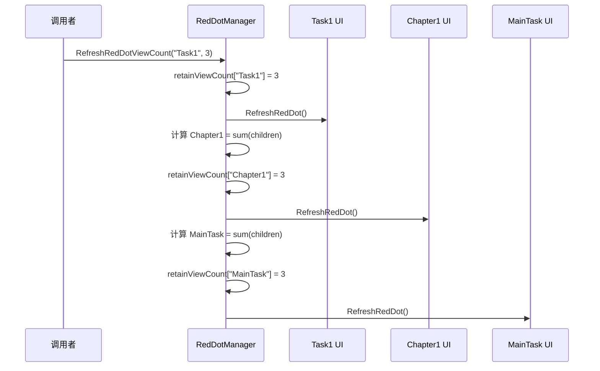
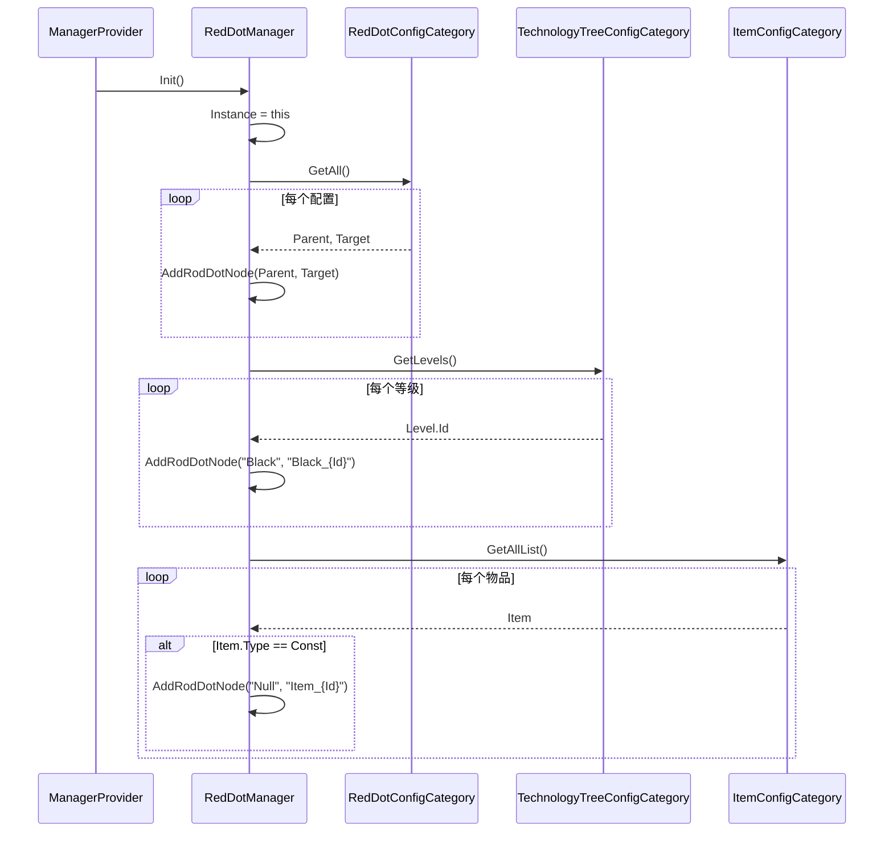

# RedDotManager.cs 注解文档

## 文件基本信息

| 属性 | 值 |
|------|-----|
| **文件名** | RedDotManager.cs |
| **路径** | Assets/Scripts/Code/Module/UI/RedDot/RedDotManager.cs |
| **所属模块** | 框架层 → Code/Module/UI/RedDot |
| **文件职责** | 红点系统核心管理器，管理红点树结构、计数和 UI 刷新 |

---

## 类/结构体说明

### RedDotManager

| 属性 | 说明 |
|------|------|
| **职责** | 管理全局红点系统：红点树结构、计数统计、UI 组件注册与刷新 |
| **泛型参数** | 无 |
| **继承关系** | 无 |
| **实现的接口** | `IManager` |

**设计模式**: 单例模式 + 树形结构 + 观察者模式

```csharp
// 获取单例
var manager = RedDotManager.Instance;

// 刷新红点计数
RedDotManager.Instance.RefreshRedDotViewCount("MainTask", 5);
```

---

## 字段与属性（按重要程度排序）

| 名称 | 类型 | 访问级别 | 说明 |
|------|------|----------|------|
| `Instance` | `RedDotManager` | `public static` | 单例实例 |
| `redDotNodeParentsDict` | `UnOrderMultiMap<string, string>` | `private` | 红点树结构：父节点 → 子节点列表 |
| `toParentDict` | `Dictionary<string, string>` | `private` | 子节点 → 父节点映射 |
| `retainViewCount` | `Dictionary<string, int>` | `private` | 红点计数缓存：目标 ID → 数量 |
| `redDotMonoViewDict` | `MultiMap<string, UIRedDot>` | `private` | UI 组件注册：目标 ID → UIRedDot 列表 |

---

## 数据结构：红点树

```
示例红点树结构:

                    Root
                   /    \
              MainTask  DailyTask
                 |
            ┌────┴────┐
        Chapter1   Chapter2
           |
        ┌──┴──┐
     Task1  Task2

当 Task1 计数变化时:
1. 更新 Task1 计数
2. 累加到 Chapter1
3. 累加到 MainTask
4. 刷新所有相关 UI
```

---

## 方法说明（按重要程度排序）

### Init

**签名**:
```csharp
public void Init()
```

**职责**: 初始化红点系统，从配置表加载红点树结构

**核心逻辑**:
```
1. 设置 Instance = this
2. 从 RedDotConfigCategory 加载配置，添加红点节点
3. 从 TechnologyTreeConfigCategory 添加科技树红点
4. 从 ItemConfigCategory 添加物品红点
```

**配置表示例**:
```csharp
// RedDotConfigCategory
{
    { Parent: "Root", Target: "MainTask" },
    { Parent: "MainTask", Target: "Chapter1" },
    { Parent: "Chapter1", Target: "Task1" },
}
```

---

### Destroy

**签名**:
```csharp
public void Destroy()
```

**职责**: 销毁红点系统，清理所有数据

**核心逻辑**:
```
1. 清空所有字典和 MultiMap
2. 设置 Instance = null
```

---

### AddUIRedDotComponent

**签名**:
```csharp
public void AddUIRedDotComponent(string target, UIRedDot uiRedDotComponent)
```

**职责**: 注册 UI 红点组件到指定目标

**核心逻辑**:
```
1. 将 UIRedDot 添加到 redDotMonoViewDict[target]
```

**使用示例**:
```csharp
// 通常由 UIRedDot.OnCreate 自动调用
RedDotManager.Instance.AddUIRedDotComponent("MainTask", uiRedDot);
```

---

### RemoveUIRedDotComponent

**签名**:
```csharp
public void RemoveUIRedDotComponent(string target, UIRedDot uiRedDotComponent)
```

**职责**: 从目标移除 UI 红点组件

**核心逻辑**:
```
1. 从 redDotMonoViewDict[target] 移除组件
```

**使用示例**:
```csharp
// 通常由 UIRedDot.OnDestroy 自动调用
RedDotManager.Instance.RemoveUIRedDotComponent("MainTask", uiRedDot);
```

---

### GetRedDotViewCount

**签名**:
```csharp
public int GetRedDotViewCount(string target)
```

**职责**: 获取指定目标的红点计数

**返回值**:
- `count > 0`: 有红点，数量为 count
- `count == 0`: 无红点

**使用示例**:
```csharp
var count = RedDotManager.Instance.GetRedDotViewCount("MainTask");
if (count > 0)
{
    Log.Info($"有 {count} 个新任务");
}
```

---

### RefreshRedDotViewCount ⭐

**签名**:
```csharp
public void RefreshRedDotViewCount(string target, int count)
```

**职责**: 刷新红点计数，并自动向上层节点传播

**核心逻辑**:
```
1. 检查是否是叶子节点（非叶子节点不能直接设置计数）
2. 更新 retainViewCount[target] = count
3. 刷新该目标的所有 UI 组件
4. 向上遍历父节点:
   - 累加所有子节点的计数
   - 更新父节点计数
   - 刷新父节点的 UI 组件
   - 继续向上直到根节点
```

**使用示例**:
```csharp
// 更新任务红点
RedDotManager.Instance.RefreshRedDotViewCount("Task1", 3);

// 自动传播:
// Task1 = 3
// Chapter1 = Task1 + Task2 = 3 + 0 = 3
// MainTask = Chapter1 + Chapter2 = 3 + 0 = 3
```

**传播流程图**:


---

### AddRodDotNode (私有)

**签名**:
```csharp
private void AddRodDotNode(string parent, string target)
```

**职责**: 添加红点树节点

**核心逻辑**:
```
1. 检查 parent 和 target 不为空
2. 检查 target 未重复
3. 添加到 toParentDict[target] = parent
4. 初始化 retainViewCount[target] = 0
5. 添加到 redDotNodeParentsDict[parent].Add(target)
```

**错误处理**:
- target 为空 → Log.Error
- parent 为空 → Log.Error
- target 已存在 → Log.Error

---

### RemoveRedDotNode (私有)

**签名**:
```csharp
private void RemoveRedDotNode(string target)
```

**职责**: 移除红点树节点（仅支持叶子节点）

**核心逻辑**:
```
1. 获取父节点
2. 检查是否是叶子节点（非叶子节点不能移除）
3. 从 toParentDict 移除
4. 从父节点的子节点列表移除
```

---

### IsLeafNode (私有)

**签名**:
```csharp
private bool IsLeafNode(string target)
```

**职责**: 检查是否是叶子节点

**核心逻辑**:
```
1. 如果 redDotNodeParentsDict 不包含 target，说明没有子节点
2. 返回 true（是叶子节点）
```

---

## 生命周期流程图

### 初始化流程



---

### 刷新流程（含向上传播）

```mermaid
flowchart TD
    A[RefreshRedDotViewCount<br/>target, count] --> B{是叶子节点？}
    B -->|否 | C[Log.Error]
    B -->|是 | D[retainViewCount[target] = count]
    D --> E[刷新 target 的 UI]
    E --> F{有父节点？}
    F -->|否 | G[结束]
    F -->|是 | H[获取所有子节点]
    H --> I[累加子节点计数]
    I --> J[retainViewCount[parent] = sum]
    J --> K[刷新 parent 的 UI]
    K --> L[parent = parent 的父节点]
    L --> F
```

---

## 与其他模块的交互

```mermaid
graph TB
    subgraph RedDot["红点系统"]
        RDM[RedDotManager]
        URD[UIRedDot]
        UNRD[UINumRedDot]
    end
    
    subgraph Config["配置表"]
        RDConfig[RedDotConfigCategory]
        TTConfig[TechnologyTreeConfigCategory]
        ItemConfig[ItemConfigCategory]
    end
    
    subgraph UI["UI 系统"]
        UBC[UIBaseContainer]
    end
    
    RDM --> RDConfig
    RDM --> TTConfig
    RDM --> ItemConfig
    
    URD --> RDM
    UNRD --> RDM
    
    URD --|> UBC
    UNRD --|> URD
    
    note right of RDM "RedDotManager 管理红点<br/>树结构和计数，自动<br/>刷新相关 UI 组件"
    
    style RedDot fill:#e1f5ff
    style Config fill:#fff4e1
    style UI fill:#e8f5e9
```

---

## 学习重点与陷阱

### ✅ 学习重点

1. **树形结构**: 红点系统基于树形结构，子节点计数变化会向上传播
2. **叶子节点**: 只有叶子节点可以直接设置计数，父节点计数由子节点累加
3. **UI 注册**: UIRedDot 组件通过 target 与红点节点绑定
4. **自动刷新**: 计数变化时自动刷新所有相关 UI，无需手动调用

### ⚠️ 陷阱与注意事项

| 问题 | 说明 | 解决方案 |
|------|------|----------|
| **刷新父节点** | 直接刷新父节点会报错 | 只能刷新叶子节点，父节点自动累加 |
| **target 不一致** | UI 注册的 target 与树结构不一致 | 确保 target 与 RedDotConfigCategory 配置一致 |
| **计数未清零** | 任务完成后计数未清零 | 完成任务后调用 RefreshRedDotViewCount(target, 0) |
| **循环引用** | 红点树形成环 | 配置时避免 A→B→A 的循环 |
| **内存泄漏** | UI 销毁后未从 Manager 移除 | UIRedDot.OnDestroy 会自动处理 |

---

## 最佳实践

### 配置红点树

```csharp
// 在 RedDotConfigCategory 配置表中定义
{
    // 根节点 → 一级节点
    { Parent: "Root", Target: "MainTask" },
    { Parent: "Root", Target: "DailyTask" },
    { Parent: "Root", Target: "Activity" },
    
    // 一级节点 → 二级节点
    { Parent: "MainTask", Target: "Chapter1" },
    { Parent: "MainTask", Target: "Chapter2" },
    
    // 二级节点 → 叶子节点
    { Parent: "Chapter1", Target: "Task1_1" },
    { Parent: "Chapter1", Target: "Task1_2" },
    { Parent: "Chapter2", Target: "Task2_1" },
}
```

### 更新红点计数

```csharp
// ✅ 正确：更新叶子节点
RedDotManager.Instance.RefreshRedDotViewCount("Task1_1", 3);

// ❌ 错误：更新父节点会报错
RedDotManager.Instance.RefreshRedDotViewCount("Chapter1", 3); // Error!
```

### 任务完成时清除红点

```csharp
public class TaskManager : IManager
{
    public async ETTask CompleteTask(int taskId)
    {
        // 完成任务逻辑
        await DoCompleteTask(taskId);
        
        // 清除红点
        RedDotManager.Instance.RefreshRedDotViewCount($"Task_{taskId}", 0);
    }
}
```

### 批量更新红点

```csharp
// 当多个任务状态变化时
public void RefreshAllTaskRedDots()
{
    var taskCounts = TaskManager.Instance.GetUncompletedTaskCounts();
    
    foreach (var kvp in taskCounts)
    {
        // kvp.Key = chapterId, kvp.Value = uncompleted count
        RedDotManager.Instance.RefreshRedDotViewCount($"Chapter_{kvp.Key}", kvp.Value);
    }
}
```

---

## 完整示例：任务系统红点集成

```csharp
// 任务管理器
public class TaskManager : IManager, IUpdate
{
    private Dictionary<int, TaskData> tasks;
    private Dictionary<int, int> chapterUncompletedCounts;
    
    public void Init()
    {
        tasks = new Dictionary<int, TaskData>();
        chapterUncompletedCounts = new Dictionary<int, int>();
        
        // 加载任务配置
        LoadTasks();
        
        // 初始化红点计数
        RefreshChapterRedDots();
    }
    
    public void Update()
    {
        // 检查任务进度
        CheckTaskProgress();
    }
    
    private void LoadTasks()
    {
        // 从配置加载任务
        foreach (var config in TaskConfigCategory.Instance.GetAll())
        {
            tasks[config.Id] = new TaskData
            {
                Id = config.Id,
                ChapterId = config.ChapterId,
                Progress = 0,
                Target = config.Target,
                IsCompleted = false
            };
            
            // 初始化红点（叶子节点）
            RedDotManager.Instance.RefreshRedDotViewCount($"Task_{config.Id}", 0);
        }
    }
    
    public async ETTask CompleteTask(int taskId)
    {
        if (!tasks.ContainsKey(taskId)) return;
        
        var task = tasks[taskId];
        task.IsCompleted = true;
        
        // 更新章节未完成任务数
        UpdateChapterCount(task.ChapterId);
        
        // 清除任务红点
        RedDotManager.Instance.RefreshRedDotViewCount($"Task_{taskId}", 0);
        
        // 发放奖励
        await GiveTaskRewards(taskId);
    }
    
    private void UpdateChapterCount(int chapterId)
    {
        // 计算章节未完成任务数
        int uncompleted = tasks.Values.Count(t => 
            t.ChapterId == chapterId && !t.IsCompleted);
        
        chapterUncompletedCounts[chapterId] = uncompleted;
        
        // 刷新章节红点（会自动传播到父节点）
        RedDotManager.Instance.RefreshRedDotViewCount($"Chapter_{chapterId}", uncompleted);
    }
    
    private void RefreshChapterRedDots()
    {
        foreach (var chapterId in chapterUncompletedCounts.Keys)
        {
            UpdateChapterCount(chapterId);
        }
    }
    
    private void CheckTaskProgress()
    {
        // 检查任务进度，更新红点
        foreach (var task in tasks.Values)
        {
            if (!task.IsCompleted)
            {
                int progress = GetTaskProgress(task.Id);
                if (progress >= task.Target)
                {
                    // 任务可完成，显示红点
                    RedDotManager.Instance.RefreshRedDotViewCount($"Task_{task.Id}", 1);
                }
            }
        }
    }
    
    private int GetTaskProgress(int taskId)
    {
        // 获取任务进度逻辑
        return 0;
    }
    
    private async ETTask GiveTaskRewards(int taskId)
    {
        // 发放奖励逻辑
        await TimerManager.Instance.WaitAsync(100);
    }
}

// UI 侧
public class TaskUIView : UIBaseView, IOnCreate
{
    private UINumRedDot chapter1RedDot;
    private UINumRedDot chapter2RedDot;
    private UIRedDot task1RedDot;
    private UIRedDot task2RedDot;
    
    public void OnCreate()
    {
        // 章节红点（显示未完成任务数）
        chapter1RedDot = AddComponent<UINumRedDot, string>("btnChapter1/redDot", "Chapter_1");
        chapter2RedDot = AddComponent<UINumRedDot, string>("btnChapter2/redDot", "Chapter_2");
        
        // 任务红点（仅显示是否有可完成任务）
        task1RedDot = AddComponent<UIRedDot, string>("btnTask1/redDot", "Task_1");
        task2RedDot = AddComponent<UIRedDot, string>("btnTask2/redDot", "Task_2");
    }
}
```

---

## 红点树示例

### 完整红点树结构

```
Root
├── MainTask (主线任务)
│   ├── Chapter1 (第一章)
│   │   ├── Task1_1 (任务 1-1)
│   │   ├── Task1_2 (任务 1-2)
│   │   └── Task1_3 (任务 1-3)
│   ├── Chapter2 (第二章)
│   │   ├── Task2_1 (任务 2-1)
│   │   └── Task2_2 (任务 2-2)
│   └── Chapter3 (第三章)
│       └── Task3_1 (任务 3-1)
├── DailyTask (每日任务)
│   ├── Daily1 (每日 1)
│   ├── Daily2 (每日 2)
│   └── Daily3 (每日 3)
├── Activity (活动)
│   ├── Event1 (活动 1)
│   └── Event2 (活动 2)
└── Bag (背包)
    ├── Items (道具)
    ├── Equips (装备)
    └── Gifts (礼包)
```

### 计数传播示例

```
初始状态:
Task1_1 = 1, Task1_2 = 0, Task1_3 = 0
→ Chapter1 = 1
→ MainTask = 1

Task1_2 也完成后:
Task1_1 = 1, Task1_2 = 1, Task1_3 = 0
→ Chapter1 = 2
→ MainTask = 2

所有 Chapter1 任务完成后:
Task1_1 = 0, Task1_2 = 0, Task1_3 = 0
→ Chapter1 = 0
→ MainTask = Chapter2 + Chapter3 (假设都是 0) = 0
→ Root 红点消失
```

---

## 相关文档

- [UIRedDot.cs.md](./UIRedDot.cs.md) - UI 红点组件
- [UINumRedDot.cs.md](./UINumRedDot.cs.md) - 数字红点组件
- [UIBaseContainer.cs.md](../UIBaseContainer.cs.md) - UI 容器基类

---

*文档由 OpenClaw AI 助手自动生成 | 基于静态代码分析*
