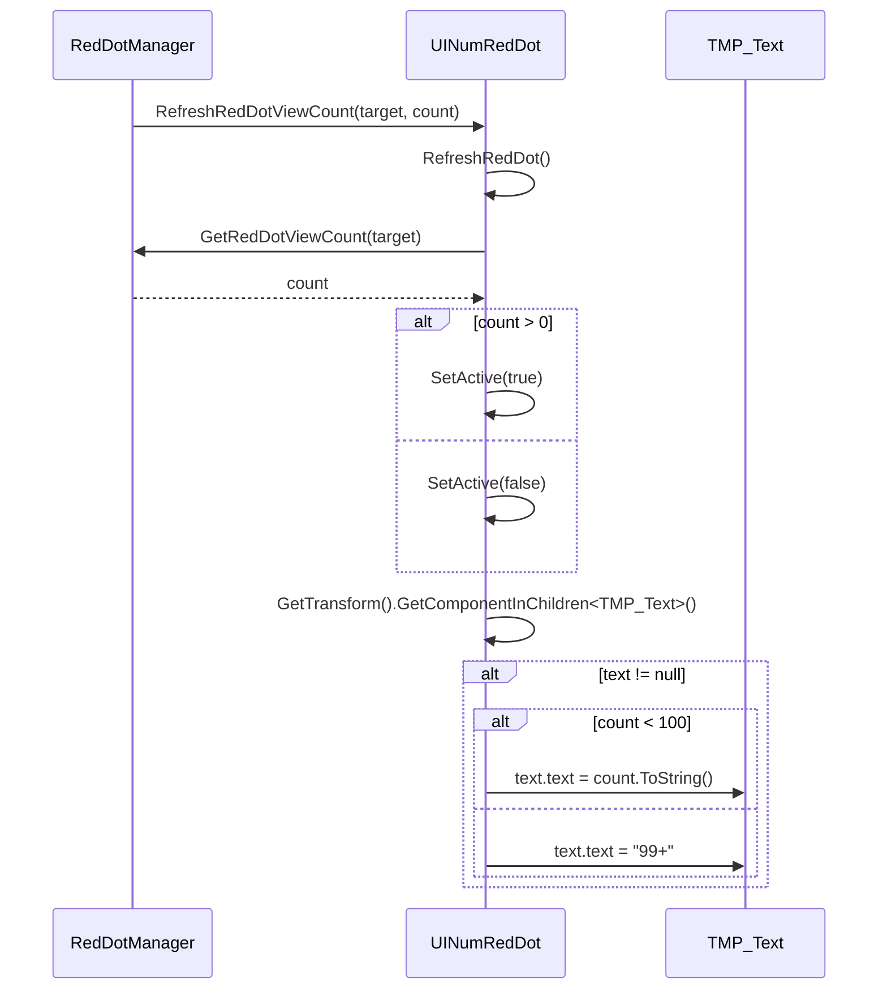

# UINumRedDot.cs 注解文档

## 文件基本信息

| 属性 | 值 |
|------|-----|
| **文件名** | UINumRedDot.cs |
| **路径** | Assets/Scripts/Code/Module/UI/RedDot/UINumRedDot.cs |
| **所属模块** | 框架层 → Code/Module/UI/RedDot |
| **文件职责** | 数字红点组件，显示具体数量的红点（超过 99 显示"99+"） |

---

## 类/结构体说明

### UINumRedDot

| 属性 | 说明 |
|------|------|
| **职责** | 继承自 UIRedDot，重写 RefreshRedDot 方法，支持显示具体数量 |
| **泛型参数** | 无 |
| **继承关系** | `UINumRedDot : UIRedDot` |
| **实现的接口** | 无（继承父类的 IOnCreate<string>, IOnCreate, IOnDestroy） |

**设计模式**: 模板方法模式（重写父类的 RefreshRedDot）

```csharp
// 使用示例
var numRedDot = uiView.AddComponent<UINumRedDot, string>("redDot/numText", "MainTask");
// 需要 UI 结构中包含 TMPro.TMP_Text 组件用于显示数字
```

---

## 字段与属性

**无新增字段**，继承自 UIRedDot 的 `target` 字段。

---

## 方法说明

### RefreshRedDot (重写)

**签名**:
```csharp
public override void RefreshRedDot()
```

**职责**: 刷新红点显示状态和数字

**核心逻辑**:
```
1. 从 RedDotManager 获取目标计数
2. 如果 count > 0，显示红点；否则隐藏
3. 查找子代中的 TMPro.TMP_Text 组件
4. 如果找到文本组件:
   - count < 100: 显示具体数字
   - count >= 100: 显示 "99+"
```

**UI 结构要求**:
```
RedDot (UINumRedDot)
└── numText (TMPro.TMP_Text)  ← 必须包含此组件
```

**使用示例**:
```csharp
// 自动刷新（由 RedDotManager 触发）
// 当 count = 5 时，显示 "5"
// 当 count = 99 时，显示 "99"
// 当 count = 150 时，显示 "99+"
```

---

## 与 UIRedDot 的对比

| 特性 | UIRedDot | UINumRedDot |
|------|----------|-------------|
| **显示内容** | 仅显示/隐藏 | 显示具体数字 |
| **UI 要求** | 任意 UI | 需要包含 TMPro.TMP_Text |
| **数量上限** | 无 | 99（超过显示 99+） |
| **性能开销** | 低 | 略高（需要查找文本组件） |
| **使用场景** | 简单红点 | 需要显示数量的红点 |

---

## 生命周期流程图

### 刷新流程



---

## UI 结构示例

### 推荐的 Prefab 结构

```
TaskRedDot (UINumRedDot)
├── redDot_bg (Image)        ← 红点背景
└── numText (TMP_Text)       ← 数字文本
```

### Unity 中的设置

1. **创建 GameObject**:
   - 名称：`TaskRedDot`
   - 添加组件：无需额外组件（UINumRedDot 继承自 UIBaseContainer）

2. **添加子对象**:
   - 创建 `numText` GameObject
   - 添加 `TextMeshProUGUI` 组件
   - 设置字体、大小、颜色等

3. **在代码中使用**:
```csharp
var numRedDot = AddComponent<UINumRedDot, string>("TaskRedDot", "MainTask");
```

---

## 与其他模块的交互

```mermaid
graph TB
    subgraph RedDot["红点组件"]
        URD[UIRedDot]
        UNRD[UINumRedDot]
    end
    
    subgraph Manager["管理器"]
        RDM[RedDotManager]
    end
    
    subgraph TMPro["TextMeshPro"]
        TMP[TMP_Text]
    end
    
    UNRD --|> URD
    UNRD --> RDM
    UNRD --> TMP
    
    note right of UNRD "UINumRedDot 在 UIRedDot<br/>基础上增加数字显示功能"
    
    style RedDot fill:#e1f5ff
    style Manager fill:#fff4e1
    style TMPro fill:#e8f5e9
```

---

## 学习重点与陷阱

### ✅ 学习重点

1. **继承关系**: UINumRedDot 继承自 UIRedDot，复用大部分逻辑
2. **文本查找**: 使用 `GetComponentInChildren<TMPro.TMP_Text>()` 查找文本
3. **数字格式化**: <100 显示具体数字，>=100 显示"99+"
4. **UI 结构**: 必须包含 TMP_Text 子组件

### ⚠️ 陷阱与注意事项

| 问题 | 说明 | 解决方案 |
|------|------|----------|
| **缺少 TMP_Text** | 红点能显示但数字不出现 | 确保 Prefab 中包含 TMP_Text 子组件 |
| **路径错误** | GetComponentInChildren 找不到文本 | 确保文本是红点的子代（可以是孙代） |
| **字体缺失** | 数字显示为方块 | 检查 TextMeshPro 字体资源是否正确导入 |
| **性能问题** | 每帧查找文本组件 | RefreshRedDot 仅在状态变化时调用，性能影响小 |

---

## 最佳实践

### 标准使用方式

```csharp
public class TaskUIView : UIBaseView, IOnCreate
{
    private UINumRedDot taskNumRedDot;
    
    public void OnCreate()
    {
        // 添加数字红点
        taskNumRedDot = AddComponent<UINumRedDot, string>("btnTask/redDot", "MainTask");
    }
}
```

### 自定义数字上限

```csharp
// 如果需要自定义上限（如 999+），可以继承 UINumRedDot
public class CustomNumRedDot : UINumRedDot
{
    private const int MAX_DISPLAY = 999;
    
    public override void RefreshRedDot()
    {
        var count = RedDotManager.Instance.GetRedDotViewCount(target);
        this.SetActive(count > 0);
        
        var text = GetTransform().GetComponentInChildren<TMPro.TMP_Text>();
        if (text != null)
        {
            if (count < MAX_DISPLAY)
            {
                text.text = count.ToString();
            }
            else
            {
                text.text = $"{MAX_DISPLAY - 1}+";
            }
        }
    }
}
```

### 无数字时隐藏文本

```csharp
// 如果希望数量为 1 时不显示数字（仅显示红点）
public class SmartNumRedDot : UINumRedDot
{
    public override void RefreshRedDot()
    {
        var count = RedDotManager.Instance.GetRedDotViewCount(target);
        this.SetActive(count > 0);
        
        var text = GetTransform().GetComponentInChildren<TMPro.TMP_Text>();
        if (text != null)
        {
            if (count <= 1)
            {
                text.gameObject.SetActive(false);
            }
            else
            {
                text.gameObject.SetActive(true);
                text.text = count < 100 ? count.ToString() : "99+";
            }
        }
    }
}
```

---

## 完整示例：背包界面红点

```csharp
public class BagUIView : UIBaseView, IOnCreate, IOnEnable
{
    private UINumRedDot itemCountRedDot;      // 道具数量红点
    private UINumRedDot equipCountRedDot;     // 装备数量红点
    private UIRedDot giftRedDot;              // 礼包红点（无需数字）
    
    public void OnCreate()
    {
        // 添加数字红点
        itemCountRedDot = AddComponent<UINumRedDot, string>("btnBag/itemRedDot", "BagItems");
        equipCountRedDot = AddComponent<UINumRedDot, string>("btnBag/equipRedDot", "BagEquips");
        
        // 添加普通红点
        giftRedDot = AddComponent<UIRedDot, string>("btnBag/giftRedDot", "BagGifts");
    }
    
    public void OnEnable()
    {
        // 刷新所有红点
        itemCountRedDot.RefreshRedDot();
        equipCountRedDot.RefreshRedDot();
        giftRedDot.RefreshRedDot();
    }
    
    // 当获得新道具时
    private void OnItemAcquired(int itemId, int count)
    {
        // 更新 RedDotManager 中的计数
        var currentCount = BagManager.Instance.GetNewItemItemCount();
        RedDotManager.Instance.RefreshRedDotViewCount("BagItems", currentCount);
        
        // UINumRedDot 会自动刷新显示
        // 如果 count = 5，显示 "5"
        // 如果 count = 150，显示 "99+"
    }
}
```

---

## UI Prefab 示例

### Unity Hierarchy 结构

```
Canvas
└── BagUI
    └── btnBag
        └── itemRedDot (UINumRedDot)
            ├── redDot_bg (Image)
            │   └── 红色圆形背景
            └── numText (TextMeshProUGUI)
                └── 白色数字文本
```

### TextMeshProUGUI 设置建议

| 属性 | 推荐值 | 说明 |
|------|--------|------|
| Font Size | 18-24 | 根据红点大小调整 |
| Color | White (#FFFFFF) | 白色数字在红色背景上清晰 |
| Alignment | Center | 居中对齐 |
| Auto Size | 启用 | 自动调整大小适应数字 |
| Overflow | Overflow | 允许超出边界 |

---

## 相关文档

- [UIRedDot.cs.md](./UIRedDot.cs.md) - 红点基类
- [RedDotManager.cs.md](./RedDotManager.cs.md) - 红点管理器
- [UIBaseContainer.cs.md](../UIBaseContainer.cs.md) - UI 容器基类

---

*文档由 OpenClaw AI 助手自动生成 | 基于静态代码分析*
