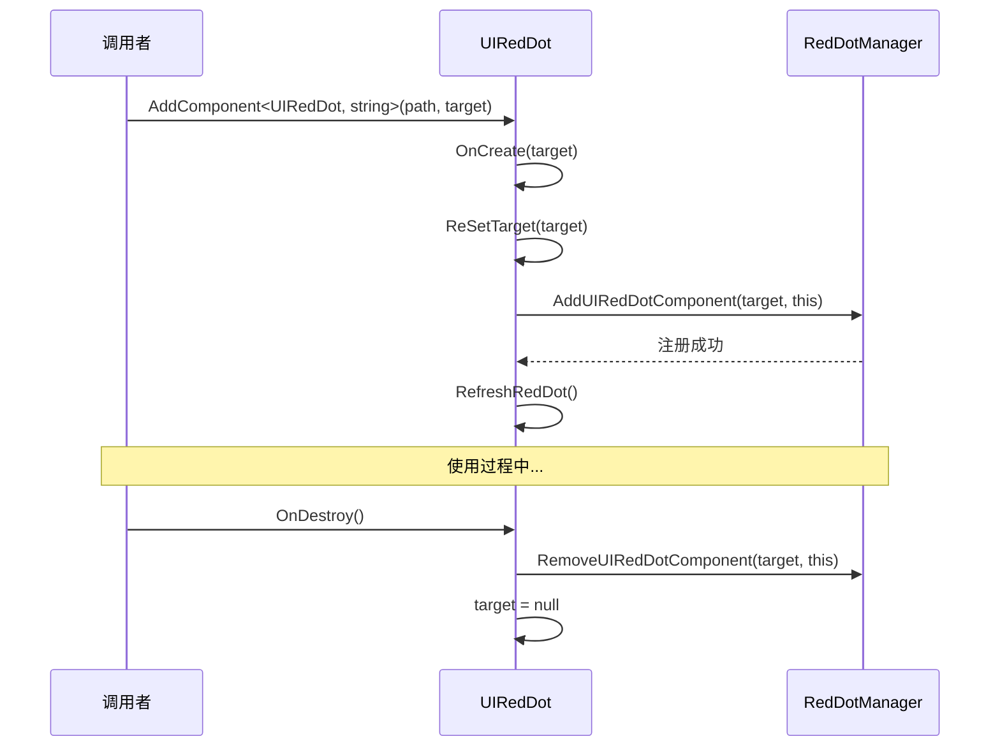
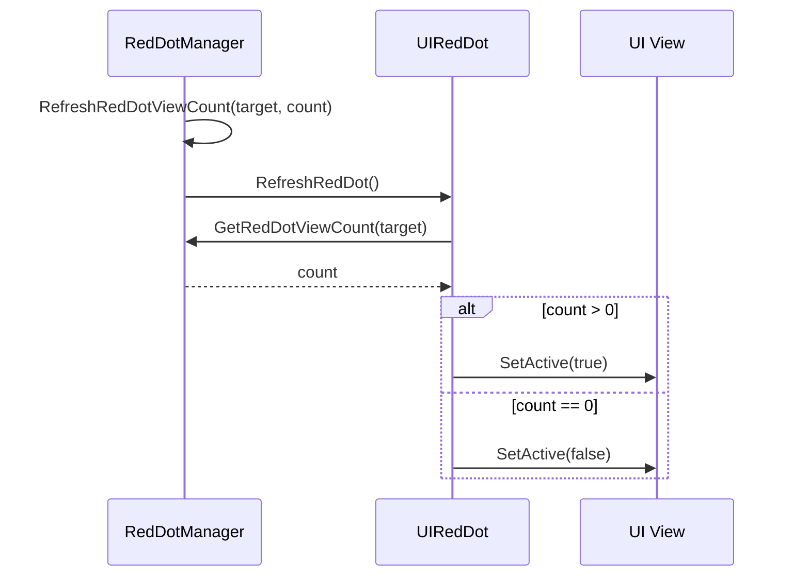

# UIRedDot.cs 注解文档

## 文件基本信息

| 属性 | 值 |
|------|-----|
| **文件名** | UIRedDot.cs |
| **路径** | Assets/Scripts/Code/Module/UI/RedDot/UIRedDot.cs |
| **所属模块** | 框架层 → Code/Module/UI/RedDot |
| **文件职责** | UI 红点组件基类，负责红点的显示/隐藏控制 |

---

## 类/结构体说明

### UIRedDot

| 属性 | 说明 |
|------|------|
| **职责** | 继承自 UIBaseContainer，实现红点组件的基本功能：目标绑定、红点刷新、生命周期管理 |
| **泛型参数** | 无 |
| **继承关系** | `UIRedDot : UIBaseContainer` |
| **实现的接口** | `IOnCreate<string>`, `IOnCreate`, `IOnDestroy` |

**设计模式**: 观察者模式（监听 RedDotManager 的状态变化）

```csharp
// 使用示例
var redDot = uiView.AddComponent<UIRedDot>("redDot", "MainTask");
// "redDot" 是 UI 路径，"MainTask" 是红点目标 ID
```

---

## 字段与属性

| 名称 | 类型 | 访问级别 | 说明 |
|------|------|----------|------|
| `target` | `string` | `protected` | 红点目标 ID，用于在 RedDotManager 中注册 |

---

## 方法说明

### OnCreate (无参数)

**签名**:
```csharp
public void OnCreate()
```

**职责**: 生命周期回调，空实现

**说明**: 当通过 `AddComponent<UIRedDot>(path)` 创建时调用，无特殊逻辑

---

### OnCreate (带参数)

**签名**:
```csharp
public void OnCreate(string p1)
```

**职责**: 带参数的创建回调，初始化红点目标

**核心逻辑**:
```
1. 调用 ReSetTarget(p1)
```

**使用示例**:
```csharp
// 创建时指定红点目标 ID
var redDot = AddComponent<UIRedDot, string>("redDot", "MainTask");
```

---

### OnDestroy

**签名**:
```csharp
public void OnDestroy()
```

**职责**: 销毁时清理，从 RedDotManager 移除注册

**核心逻辑**:
```
1. 如果 target 不为空
2. 调用 RedDotManager.Instance.RemoveUIRedDotComponent(target, this)
3. 设置 target = null
```

**说明**: 确保组件销毁时不会留下无效的注册信息

---

### ReSetTarget

**签名**:
```csharp
public void ReSetTarget(string p1)
```

**职责**: 重新设置红点目标，支持动态切换监听目标

**核心逻辑**:
```
1. 如果新目标与旧目标相同，直接返回
2. 如果旧目标不为空，从 RedDotManager 移除旧注册
3. 设置 target = p1
4. 如果新目标不为空:
   - 添加到 RedDotManager
   - 调用 RefreshRedDot()
5. 如果新目标为空:
   - 隐藏红点 SetActive(false)
```

**使用示例**:
```csharp
// 动态切换监听目标
redDot.ReSetTarget("DailyTask"); // 从 MainTask 切换到 DailyTask
redDot.ReSetTarget(null);        // 取消监听并隐藏
```

---

### RefreshRedDot

**签名**:
```csharp
public virtual void RefreshRedDot()
```

**职责**: 刷新红点显示状态

**核心逻辑**:
```
1. 调用 RedDotManager.Instance.GetRedDotViewCount(target)
2. 如果数量 > 0，显示红点；否则隐藏
```

**说明**: 
- 使用 `virtual` 关键字，允许子类重写（如 UINumRedDot）
- 根据 RedDotManager 中的计数决定显示/隐藏

**使用示例**:
```csharp
// 手动刷新（通常由 RedDotManager 自动调用）
redDot.RefreshRedDot();
```

---

## 生命周期流程图

### 创建与销毁流程



### 红点刷新流程



---

## 与其他模块的交互

```mermaid
graph TB
    subgraph RedDot["红点组件"]
        URD[UIRedDot]
        UNRD[UINumRedDot]
    end
    
    subgraph Manager["管理器"]
        RDM[RedDotManager]
    end
    
    subgraph UI["UI 基类"]
        UBC[UIBaseContainer]
    end
    
    URD --|> UBC
    URD --> RDM
    UNRD --|> URD
    
    note right of URD "UIRedDot 监听 RedDotManager<br/>的状态变化，自动显示/隐藏"
    
    style RedDot fill:#e1f5ff
    style Manager fill:#fff4e1
    style UI fill:#e8f5e9
```

---

## 学习重点与陷阱

### ✅ 学习重点

1. **目标绑定**: 通过 `target` 字符串与 RedDotManager 中的红点节点绑定
2. **自动刷新**: RedDotManager 更新计数时自动调用 RefreshRedDot()
3. **动态切换**: ReSetTarget 支持运行时切换监听目标
4. **生命周期管理**: OnDestroy 中自动清理注册，避免内存泄漏

### ⚠️ 陷阱与注意事项

| 问题 | 说明 | 解决方案 |
|------|------|----------|
| **target 为空** | 创建时未指定 target，红点永不显示 | 使用 `AddComponent<UIRedDot, string>(path, target)` |
| **重复注册** | 多次调用 ReSetTarget 同一目标 | ReSetTarget 内部有去重检查 |
| **忘记销毁** | 手动移除组件但未调用 OnDestroy | UIBaseContainer 会自动调用 |
| **target 拼写错误** | 与 RedDotManager 中的目标 ID 不一致 | 确保 target 与配置表一致 |

---

## 最佳实践

### 标准使用方式

```csharp
public class MainUIView : UIBaseView, IOnCreate
{
    private UIRedDot taskRedDot;
    
    public void OnCreate()
    {
        // 绑定任务红点
        taskRedDot = AddComponent<UIRedDot, string>("btnTask/redDot", "MainTask");
    }
}
```

### 动态切换监听目标

```csharp
public class TabView : UIBaseView, IOnCreate
{
    private UIRedDot tabRedDot;
    
    public void OnCreate()
    {
        tabRedDot = AddComponent<UIRedDot, string>("tab1/redDot", "Tab1");
    }
    
    public void SwitchTab(int tabId)
    {
        // 切换监听目标
        tabRedDot.ReSetTarget($"Tab{tabId}");
    }
}
```

### 手动刷新（特殊场景）

```csharp
// 通常不需要手动刷新，RedDotManager 会自动通知
// 但在某些特殊场景下可能需要强制刷新
public void ForceRefresh()
{
    taskRedDot.RefreshRedDot();
}
```

---

## 完整示例：任务界面红点

```csharp
public class TaskUIView : UIBaseView, IOnCreate, IOnEnable, IOnDestroy
{
    private UIRedDot mainTaskRedDot;    // 主线任务红点
    private UIRedDot dailyTaskRedDot;   // 每日任务红点
    private UIRedDot activityRedDot;    // 活动红点
    
    public void OnCreate()
    {
        // 添加红点组件
        mainTaskRedDot = AddComponent<UIRedDot, string>("btnMainTask/redDot", "MainTask");
        dailyTaskRedDot = AddComponent<UIRedDot, string>("btnDailyTask/redDot", "DailyTask");
        activityRedDot = AddComponent<UIRedDot, string>("btnActivity/redDot", "Activity");
    }
    
    public void OnEnable()
    {
        // 刷新红点状态
        mainTaskRedDot.RefreshRedDot();
        dailyTaskRedDot.RefreshRedDot();
        activityRedDot.RefreshRedDot();
    }
    
    public void OnDestroy()
    {
        // 自动清理，无需手动处理
    }
    
    // 完成任务时，RedDotManager 会自动刷新相关红点
    private async void OnTaskCompleted(int taskId)
    {
        // 更新任务状态
        await TaskManager.Instance.CompleteTask(taskId);
        
        // RedDotManager 会检测到任务状态变化并自动刷新红点
        // 无需手动调用 RefreshRedDot()
    }
}
```

---

## 相关文档

- [UINumRedDot.cs.md](./UINumRedDot.cs.md) - 数字红点组件
- [RedDotManager.cs.md](./RedDotManager.cs.md) - 红点管理器
- [UIBaseContainer.cs.md](../UIBaseContainer.cs.md) - UI 容器基类

---

*文档由 OpenClaw AI 助手自动生成 | 基于静态代码分析*
