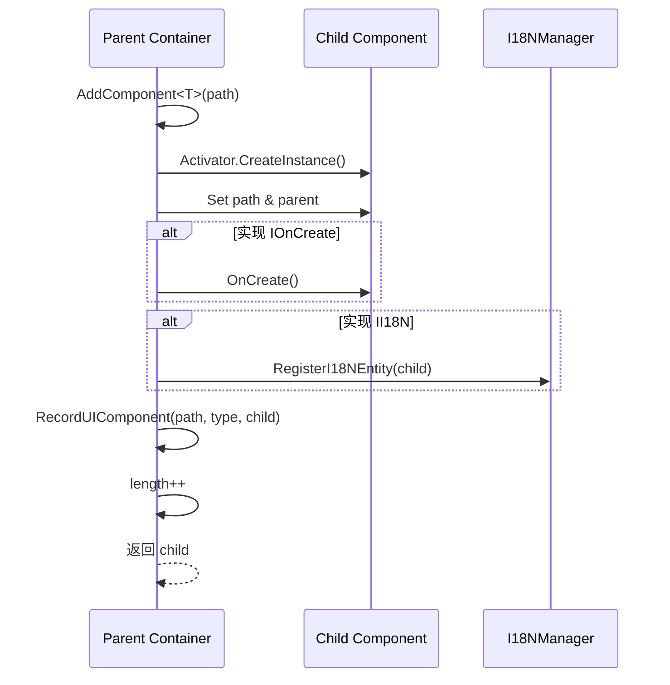
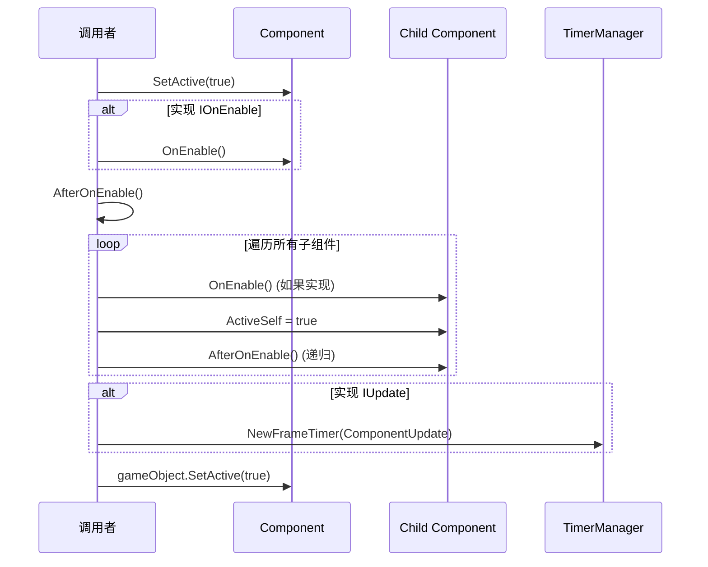
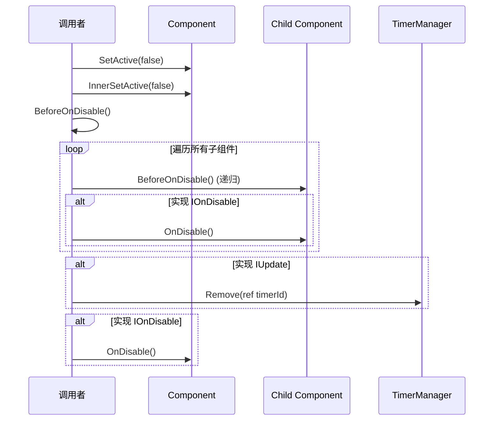
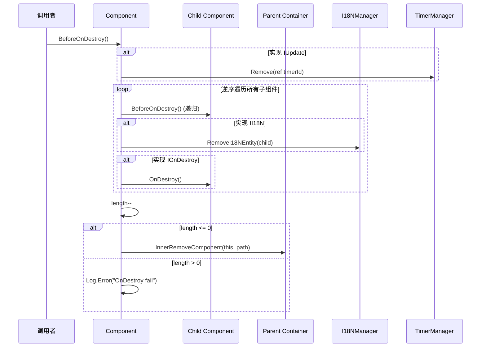

# UIBaseContainer.cs 注解文档

## 文件基本信息

| 属性 | 值 |
|------|-----|
| **文件名** | UIBaseContainer.cs |
| **路径** | Assets/Scripts/Code/Module/UI/UIBaseContainer.cs |
| **所属模块** | 框架层 → Code/Module/UI |
| **文件职责** | UI 容器基类，所有 UI 组件的根类，提供组件生命周期管理和层级容器功能 |

---

## 类/结构体说明

### UIBaseContainer

| 属性 | 说明 |
|------|------|
| **职责** | UI 系统的根容器类，提供组件添加/获取/移除、生命周期管理、Transform 懒加载等功能 |
| **泛型参数** | 无 |
| **继承关系** | 无继承（抽象类） |
| **实现的接口** | 无直接实现，但支持 `IOnCreate`, `IOnEnable`, `IOnDisable`, `IOnDestroy`, `IUpdate` 等接口 |

**设计模式**: 组合模式 + 责任链模式 + 懒加载

```csharp
// 所有 UI 组件都应继承此类
public class MyUIComponent : UIBaseContainer
{
    public override void OnCreate() { ... }
    public override void OnEnable() { ... }
    public override void OnDisable() { ... }
    public override void OnDestroy() { ... }
}
```

---

## 字段与属性（按重要程度排序）

| 名称 | 类型 | 访问级别 | 说明 |
|------|------|----------|------|
| `components` | `UnOrderDoubleKeyDictionary<string, Type, UIBaseContainer>` | `private` | 双键字典存储子组件 [path][type] → component |
| `parent` | `UIBaseContainer` | `private` | 父容器引用，形成 UI 树 |
| `gameObject` | `GameObject` | `private` | 关联的 Unity GameObject |
| `transform` | `Transform` | `private` | 关联的 Transform 组件（懒加载） |
| `parentTransform` | `Transform` | `private` | 父容器的 Transform（懒加载） |
| `path` | `string` | `private` | 在父容器下的相对路径 |
| `length` | `int` | `private` | 子组件数量计数器 |
| `timerId` | `long` | `private` | Update 定时器 ID（如果实现 IUpdate） |
| `ActiveSelf` | `bool` | `public` | 当前激活状态 |
| `isShake` | `bool` | `private` | shake 动画进行中标志 |
| `isScale` | `bool` | `private` | scale 动画进行中标志 |

---

## 方法说明（按重要程度排序）

### SetGameObject / GetGameObject

**签名**:
```csharp
public void SetGameObject(GameObject obj)
public GameObject GetGameObject()
```

**职责**: 设置/获取关联的 GameObject，GetGameObject 支持懒加载

**核心逻辑**:
```
GetGameObject():
1. 如果 gameObject 为 null
2. 调用 GetTransform() 获取 Transform
3. 返回 transform.gameObject
```

**使用示例**:
```csharp
var go = myComponent.GetGameObject();
go.SetActive(true);
```

---

### SetTransform / GetTransform / GetRectTransform

**签名**:
```csharp
public void SetTransform(Transform trans)
public Transform GetTransform()
public RectTransform GetRectTransform()
```

**职责**: 设置/获取 Transform 组件，支持懒加载和路径查找

**核心逻辑**:
```
GetTransform():
1. 调用 ActivatingComponent()
2. 如果 transform 为 null:
   - 获取父 Transform
   - 尝试从 ReferenceCollector 获取
   - 如果失败，使用 parentTransform.Find(path)
   - 编辑器模式下自动注册到 ReferenceCollector
3. 返回 transform
```

**使用示例**:
```csharp
var rect = myComponent.GetRectTransform();
rect.anchoredPosition = Vector2.zero;
```

---

### AddComponent<T>

**签名**:
```csharp
public T AddComponent<T>(string path = "") where T : UIBaseContainer
```

**职责**: 添加子组件，支持泛型和路径参数

**核心逻辑**:
```
1. 通过 Activator.CreateInstance 创建组件实例
2. 设置 component.path = path
3. 设置 component.parent = this
4. 如果组件实现 IOnCreate，调用 OnCreate()
5. 如果组件实现 II18N，注册到 I18NManager
6. 调用 RecordUIComponent 记录到 components 字典
7. length++
8. 返回组件实例
```

**使用示例**:
```csharp
// 添加按钮组件
var button = AddComponent<UIButton>("btnSubmit");

// 添加文本组件
var text = AddComponent<UIText>("txtTitle");

// 添加自定义组件
var myComp = AddComponent<MyCustomComponent>("subPanel/myComp");
```

---

### AddComponent<T, A> (带参数版本)

**签名**:
```csharp
public T AddComponent<T, A>(string path, A a) where T : UIBaseContainer, IOnCreate<A>
public T AddComponent<T, A, B>(string path, A a, B b) where T : UIBaseContainer, IOnCreate<A, B>
public T AddComponent<T, A, B, C>(string path, A a, B b, C c) where T : UIBaseContainer, IOnCreate<A, B, C>
```

**职责**: 添加带初始化参数的子组件

**使用示例**:
```csharp
// 带 1 个参数
var comp = AddComponent<MyComponent, string>("path", "paramValue");

// 带 2 个参数
var comp = AddComponent<MyComponent, string, int>("path", "text", 42);
```

---

### GetComponent<T>

**签名**:
```csharp
public T GetComponent<T>(string path = "") where T : UIBaseContainer
```

**职责**: 获取已添加的子组件

**核心逻辑**:
```
1. 如果 components 为 null，返回 null
2. 获取类型 TypeInfo<T>.Type
3. 从双键字典中查找 [path][type]
4. 返回找到的组件或 null
```

**使用示例**:
```csharp
var button = GetComponent<UIButton>("btnSubmit");
button.SetEnable(true);
```

---

### RemoveComponent<T>

**签名**:
```csharp
public void RemoveComponent<T>(string path = "") where T : UIBaseContainer
```

**职责**: 移除并销毁指定组件

**核心逻辑**:
```
1. 获取组件实例
2. 调用 BeforeOnDisable()
3. 调用 IOnDisable.OnDisable() (如果实现)
4. 调用 BeforeOnDestroy()
5. 如果实现 II18N，从 I18NManager 移除
6. 调用 IOnDestroy.OnDestroy() (如果实现)
7. 从 components 字典移除
```

**使用示例**:
```csharp
RemoveComponent<UIButton>("btnTemp");
```

---

### RemoveAllComponent

**签名**:
```csharp
public void RemoveAllComponent(string path = "")
```

**职责**: 移除指定路径下的所有类型组件

**核心逻辑**:
```
1. 获取该路径下的所有组件
2. 对每个组件执行完整的销毁流程
3. 从 components 移除该路径的字典
```

---

### SetActive (多个重载)

**签名**:
```csharp
public void SetActive(bool active)
public void SetActive<P1>(bool active, P1 p1)
public void SetActive<P1, P2>(bool active, P1 p1, P2 p2)
public void SetActive<P1, P2, P3>(bool active, P1 p1, P2 p2, P3 p3)
public void SetActive<P1, P2, P3, P4>(bool active, P1 p1, P2 p2, P3 p3, P4 p4)
```

**职责**: 设置组件激活状态，触发相应的生命周期回调

**核心逻辑**:
```
SetActive(true):
1. 调用 IOnEnable.OnEnable() (如果实现)
2. 调用 AfterOnEnable()
   - 遍历所有子组件，递归调用 OnEnable
   - 如果实现 IUpdate，注册每帧定时器
3. 设置 gameObject.SetActive(true)

SetActive(false):
1. 设置 gameObject.SetActive(false)
2. 调用 BeforeOnDisable()
   - 遍历所有子组件，递归调用 OnDisable
   - 如果实现 IUpdate，移除定时器
3. 调用 IOnDisable.OnDisable() (如果实现)
```

**使用示例**:
```csharp
// 简单激活
myComponent.SetActive(true);

// 带参数激活（调用带参数的 OnEnable）
myComponent.SetActive(true, param1, param2);
```

---

### BeforeOnDestroy

**签名**:
```csharp
public void BeforeOnDestroy()
```

**职责**: 销毁前清理，递归销毁所有子组件

**核心逻辑**:
```
1. 如果实现 IUpdate，移除定时器
2. 如果 components 不为 null:
   - 逆序遍历所有子组件
   - 对每个组件递归调用 BeforeOnDestroy
   - 如果实现 II18N，从 I18NManager 移除
   - 调用 IOnDestroy.OnDestroy()
3. length--
4. 如果 length <= 0，通知父容器移除自身
```

---

### Walk

**签名**:
```csharp
void Walk(Action<UIBaseContainer> callback)
```

**职责**: 遍历所有子组件（无序）

**使用示例**:
```csharp
// 内部使用，递归启用/禁用所有子组件
Walk((component) =>
{
    if (component is IOnEnable a) a.OnEnable();
    component.ActiveSelf = true;
});
```

---

### Shake

**签名**:
```csharp
public async ETTask Shake(int force = 1, int during = 1000, float hz = 50)
```

**职责**: 播放 UI 震动动画

**核心逻辑**:
```
1. 如果正在震动，直接返回
2. 记录起始时间和起始位置
3. 每帧更新位置：pos = startPos + force * sin(time * hz) / attenuation
4. 震动结束后恢复原位置
```

**使用示例**:
```csharp
// 震动 1 秒，力度 1
await myComponent.Shake(force: 1, during: 1000);

// 强烈震动 2 秒
await myComponent.Shake(force: 3, during: 2000, hz: 60);
```

---

### ScaleTo

**签名**:
```csharp
public async ETTask ScaleTo(Vector3 scale, int during = 500, EasingFunction.Ease easing = EasingFunction.Ease.Linear)
```

**职责**: 播放 UI 缩放动画，支持缓动函数

**核心逻辑**:
```
1. 如果正在缩放，直接返回
2. 记录起始时间和起始缩放
3. 每帧根据缓动函数计算插值
4. 使用 Vector3.Lerp 更新 localScale
5. 动画结束后设置为最终值
```

**使用示例**:
```csharp
// 放大到 1.2 倍，500ms，线性
await myComponent.ScaleTo(new Vector3(1.2f, 1.2f, 1.2f), during: 500);

// 缩小到 0.8 倍，300ms，弹性缓动
await myComponent.ScaleTo(Vector3.one * 0.8f, during: 300, easing: EasingFunction.Ease.InOutQuad);
```

---

## 生命周期流程图

### 组件创建流程



---

### 激活/禁用流程





---

### 销毁流程



---

## 与其他模块的交互

```mermaid
graph TB
    subgraph UI["UIBaseContainer"]
        BC[UIBaseContainer]
    end
    
    subgraph Managers["管理器"]
        UM[UIManager]
        TM[TimerManager]
        I18N[I18NManager]
        RC[ReferenceCollector]
    end
    
    subgraph Interfaces["生命周期接口"]
        IOC[IOnCreate]
        IOE[IOnEnable]
        IOD[IOnDisable]
        IODest[IOnDestroy]
        IU[IUpdate]
        II18N[II18N]
    end
    
    BC --> UM
    BC --> TM
    BC --> I18N
    BC --> RC
    
    BC ..> IOC
    BC ..> IOE
    BC ..> IOD
    BC ..> IODest
    BC ..> IU
    BC ..> II18N
    
    note right of BC "UIBaseContainer 是所有 UI<br/>组件的根类，提供统一的<br/>生命周期管理和组件系统"
    
    style UI fill:#e1f5ff
    style Managers fill:#fff4e1
    style Interfaces fill:#e8f5e9
```

---

## 学习重点与陷阱

### ✅ 学习重点

1. **组件树结构**: 所有 UI 组件形成树状结构，通过 parent 和 components 维护
2. **懒加载机制**: Transform 在首次访问时才查找，避免初始化开销
3. **生命周期管理**: 严格遵循 OnCreate → OnEnable → OnDisable → OnDestroy 的顺序
4. **双键字典**: 使用 [path][type] 双重索引，支持同一路径下多种类型的组件
5. **Update 支持**: 实现 IUpdate 接口自动注册每帧定时器，无需手动管理

### ⚠️ 陷阱与注意事项

| 问题 | 说明 | 解决方案 |
|------|------|----------|
| **路径错误** | path 填写错误导致找不到 Transform | 确保 path 与 Hierarchy 中的名称一致 |
| **重复添加** | 同一路径和类型添加多次 | 先 GetComponent 检查是否存在 |
| **内存泄漏** | 组件未正确移除 | 在父容器销毁前确保子组件已移除 |
| **Update 泄漏** | 实现 IUpdate 但未正确移除 | 确保 BeforeOnDisable 中移除定时器 |
| **I18N 泄漏** | II18N 组件未从 I18NManager 移除 | 确保 OnDestroy 中调用 RemoveI18NEntity |
| **异步动画冲突** | 同时调用多个 Shake/ScaleTo | 检查 isShake/isScale 标志 |

---

## 最佳实践

### 创建自定义 UI 组件

```csharp
public class MyCustomButton : UIBaseContainer, IOnCreate, IOnEnable, IOnDisable, IOnDestroy
{
    private UIButton button;
    private UIText text;
    
    public void OnCreate()
    {
        // 添加子组件
        button = AddComponent<UIButton>("btn");
        text = AddComponent<UIText>("btn/txtLabel");
    }
    
    public void OnEnable()
    {
        // 设置初始状态
        button.SetEnable(true);
        text.SetText("Click Me");
    }
    
    public void OnDisable()
    {
        // 清理状态
        button.SetEnable(false);
    }
    
    public void OnDestroy()
    {
        // 释放资源
        Log.Info("MyCustomButton destroyed");
    }
}

// 使用
var myButton = uiView.AddComponent<MyCustomButton>("myPanel/myButton");
myButton.SetActive(true);
```

### 实现 IUpdate

```csharp
public class RotatingIcon : UIBaseContainer, IOnCreate, IUpdate
{
    private float rotationSpeed = 180f;
    
    public void OnCreate()
    {
        // 初始化
    }
    
    public void Update()
    {
        // 每帧旋转
        var rect = GetRectTransform();
        rect.localEulerAngles += Vector3.forward * rotationSpeed * Time.deltaTime;
    }
}

// 使用
var icon = uiView.AddComponent<RotatingIcon>("icon");
icon.SetActive(true); // 自动开始每帧 Update
icon.SetActive(false); // 自动停止 Update
```

### 使用动画

```csharp
public class AnimatedPopup : UIBaseView
{
    public async ETTask Show()
    {
        SetActive(true);
        
        // 先放大
        await ScaleTo(Vector3.one * 1.2f, during: 200, easing: EasingFunction.Ease.OutBack);
        
        // 再震动
        await Shake(force: 2, during: 300, hz: 60);
        
        // 恢复正常大小
        await ScaleTo(Vector3.one, during: 200, easing: EasingFunction.Ease.OutQuad);
    }
}
```

---

## 相关文档

- [UIBaseView.cs](./UIBaseView.cs.md) - UI 视图基类
- [UIManager.cs](./UIManager.cs.md) - UI 管理器
- [IOnCreate.cs](./IOnCreate.cs.md) - 创建接口
- [IOnEnable.cs](./IOnEnable.cs.md) - 启用接口
- [IOnDisable.cs](./IOnDisable.cs.md) - 禁用接口
- [IOnDestroy.cs](./IOnDestroy.cs.md) - 销毁接口

---

*文档由 OpenClaw AI 助手自动生成 | 基于静态代码分析*
