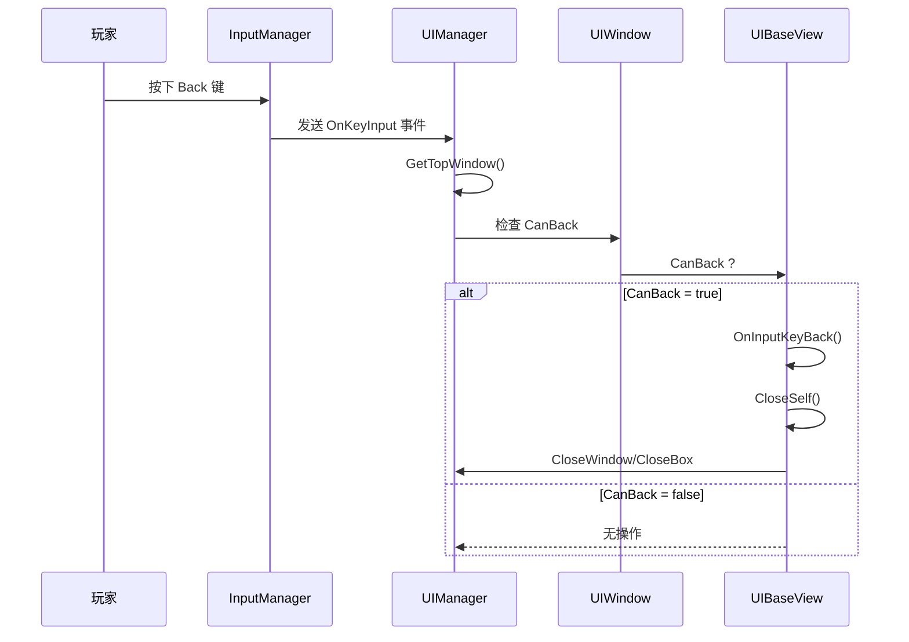

# UIBaseView.cs 注解文档

## 文件基本信息

| 属性 | 值 |
|------|-----|
| **文件名** | UIBaseView.cs |
| **路径** | Assets/Scripts/Code/Module/UI/UIBaseView.cs |
| **所属模块** | 框架层 → Code/Module/UI |
| **文件职责** | 所有 UI 视图的基类，提供基础功能和 Back 键处理 |

---

## 类/结构体说明

### UIBaseView

| 属性 | 说明 |
|------|------|
| **职责** | UI 视图基类，所有 UI 窗口都应继承此类 |
| **泛型参数** | 无 |
| **继承关系** | 继承自 `UIBaseContainer` |
| **实现的接口** | 无（但可通过扩展实现 IOnCreate/IOnEnable 等） |

```csharp
public class UIBaseView : UIBaseContainer
{
    // 基础 UI 视图类
}
```

**继承体系**:
```
UIBaseContainer (UI 容器，组件管理)
    ↑
UIBaseView (UI 视图基类，Back 键处理)
    ↑
具体 UI 类 (UILoadingView, UIAuctionView, etc.)
```

---

## 字段与属性（按重要程度排序）

| 名称 | 类型 | 访问级别 | 说明 |
|------|------|----------|------|
| `CanBack` | `bool` | `public virtual` | 是否允许 Back 键返回（默认 false） |
| `CloseSelf()` | `ETTask` | `public virtual async` | 关闭自身窗口 |
| `OnInputKeyBack()` | `ETTask` | `public virtual` | Back 键按下时的处理 |

**继承自 UIBaseContainer 的重要成员**:
| 名称 | 类型 | 说明 |
|------|------|------|
| `gameObject` | `GameObject` | 关联的 GameObject |
| `transform` | `Transform` | 关联的 Transform |
| `ActiveSelf` | `bool` | 自身激活状态 |
| `SetGameObject()` | `void` | 设置 GameObject |
| `GetGameObject()` | `GameObject` | 获取 GameObject |
| `SetTransform()` | `void` | 设置 Transform |
| `GetTransform()` | `Transform` | 获取 Transform |
| `GetRectTransform()` | `RectTransform` | 获取 RectTransform |

---

## 方法说明（按重要程度排序）

### CanBack (属性)

**签名**:
```csharp
public virtual bool CanBack => false;
```

**职责**: 标识窗口是否允许通过 Back 键关闭

**核心逻辑**:
```
默认返回 false
子类可重写返回 true
```

**调用者**: `UIManager.OnKeyInput()`

**使用示例**:
```csharp
// 默认不允许 Back
public class UILobbyView : UIBaseView
{
    // CanBack = false (默认)
}

// 允许 Back 键关闭
public class UIPopupView : UIBaseView
{
    public override bool CanBack => true;
}
```

---

### CloseSelf()

**签名**:
```csharp
public virtual async ETTask CloseSelf()
```

**职责**: 关闭自身窗口

**核心逻辑**:
```
1. 尝试作为 Box 关闭（CloseBox）
2. 如果 CloseBox 返回 false（不是 Box）
3. 作为 Window 关闭（CloseWindow）
```

**调用者**: `OnInputKeyBack()`, 子类自定义关闭逻辑

**被调用者**: `UIManager.Instance.CloseBox()`, `UIManager.Instance.CloseWindow()`

**使用示例**:
```csharp
// 在 UI 窗口内部关闭自身
public class UIMsgBoxWin : UIBaseView
{
    private void OnConfirmClick()
    {
        // 调用回调
        para.ConfirmCallback?.Invoke(this);
        // 关闭自身
        CloseSelf().Coroutine();
    }
}
```

---

### OnInputKeyBack()

**签名**:
```csharp
public virtual ETTask OnInputKeyBack()
```

**职责**: Back 键按下时的默认处理

**核心逻辑**:
```
1. 调用 CloseSelf() 关闭自身
```

**调用者**: `UIManager.OnKeyInput()`（当窗口是最顶层且 CanBack=true 时）

**被调用者**: `CloseSelf()`

**重写示例**:
```csharp
public class UIAuctionView : UIBaseView
{
    public override async ETTask OnInputKeyBack()
    {
        // Back 键不直接关闭，先显示确认框
        var confirm = await UIManager.Instance.OpenBox<UIMsgBoxWin, MsgBoxPara>(...);
        if (confirmed)
        {
            await CloseSelf();
        }
    }
}
```

---

## Unity 生命周期集成

### UIBaseView 不是 MonoBehaviour

UIBaseView 是纯 C# 类，不继承自 MonoBehaviour：

```csharp
// ❌ 不是这样
public class UIBaseView : MonoBehaviour

// ✅ 实际是这样
public class UIBaseView : UIBaseContainer
```

### 自定义生命周期

通过接口实现类似 Unity 的生命周期：

| 接口 | 方法 | 调用时机 |
|------|------|----------|
| `IOnCreate` | `OnCreate()` | 窗口首次创建 |
| `IOnEnable` | `OnEnable()` | 每次窗口打开 |
| `IOnDisable` | `OnDisable()` | 每次窗口关闭 |
| `IOnDestroy` | `OnDestroy()` | 窗口销毁 |
| `IUpdate` | `Update()` | 每帧更新（需注册） |

**生命周期流程**:
```
创建 → OnCreate() → OnEnable() → [Update()] → OnDisable() → [OnEnable()] → OnDestroy()
```

---

## 与 UIBaseContainer 的关系

### 继承关系

```csharp
UIBaseContainer
├── 管理 UI 组件系统
├── 提供 GameObject/Transform 访问
├── 管理组件生命周期
└── 支持路径查找（类似 Unity 的 Transform.Find）

UIBaseView : UIBaseContainer
├── 继承所有容器功能
├── 添加 Back 键处理
└── 作为所有 UI 窗口的基类
```

### 组件系统示例

```csharp
public class UIAuctionView : UIBaseView
{
    // 子组件（自动关联到 GameObject 的子对象）
    private UIButtonView bidButton;
    private UITimerView timerView;
    
    public override void OnCreate()
    {
        // 通过路径获取子组件
        bidButton = AddComponent<UIButtonView>("BidButton");
        timerView = AddComponent<UITimerView>("Timer");
    }
}
```

---

## 阅读指引

### 建议的阅读顺序

1. **理解继承关系** - UIBaseView → UIBaseContainer
2. **看 CanBack 属性** - 了解 Back 键机制
3. **看 CloseSelf 方法** - 理解窗口关闭逻辑
4. **了解生命周期** - OnCreate/OnEnable/OnDisable/OnDestroy

### 最值得学习的技术点

1. **非 MonoBehaviour 设计**: 纯 C# 类实现 UI 系统
2. **虚拟方法**: 子类可重写 CanBack/OnInputKeyBack
3. **异步关闭**: CloseSelf 返回 ETTask 支持异步操作
4. **组件系统**: 通过 UIBaseContainer 管理子组件

---

## 使用示例

### 示例 1: 简单 UI 窗口

```csharp
public class UILoadingView : UIBaseView, IOnCreate, IOnEnable
{
    public static string PrefabPath = "UI/UILoadingView";
    
    private Slider progressBar;
    private Text tipText;
    
    public void OnCreate()
    {
        // 初始化组件
        progressBar = GetTransform().Find("ProgressBar").GetComponent<Slider>();
        tipText = GetTransform().Find("TipText").GetComponent<Text>();
    }
    
    public void OnEnable()
    {
        // 每次打开时重置
        SetProgress(0);
    }
    
    public void SetProgress(float value)
    {
        progressBar.value = value;
    }
    
    public void SetTipText(I18NKey key)
    {
        tipText.text = I18NManager.Instance.I18NGetText(key);
    }
}
```

### 示例 2: 允许 Back 键的窗口

```csharp
public class UIPopupView : UIBaseView, IOnCreate
{
    public override bool CanBack => true;  // 允许 Back 键关闭
    
    public static string PrefabPath = "UI/UIPopupView";
    
    public void OnCreate()
    {
        // 初始化
    }
    
    // 可选：重写 OnInputKeyBack 添加自定义逻辑
    public override async ETTask OnInputKeyBack()
    {
        // 播放关闭动画
        await PlayCloseAnim();
        // 关闭自身
        await CloseSelf();
    }
}
```

### 示例 3: 阻止 Back 键的窗口

```csharp
public class UIAuctionView : UIBaseView
{
    public override bool CanBack => false;  // 拍卖中不允许返回
    
    public override async ETTask OnInputKeyBack()
    {
        // Back 键无效，显示提示
        await UIManager.Instance.OpenBox<UIToastView>(
            UIToast.PrefabPath, 
            during: 2000
        );
    }
}
```

---

## Back 键处理流程



---

## 相关文档

- [UIManager.cs.md](./UIManager.cs.md) - UI 管理器
- [UIWindow.cs.md](./UIWindow.cs.md) - 窗口数据结构
- [UIBaseContainer.cs.md](./UIBaseContainer.cs.md) - UI 容器基类
- [IOnCreate.cs.md](./IOnCreate.cs.md) - 生命周期接口

---

*文档生成时间：2026-02-27 | OpenClaw AI 助手*
