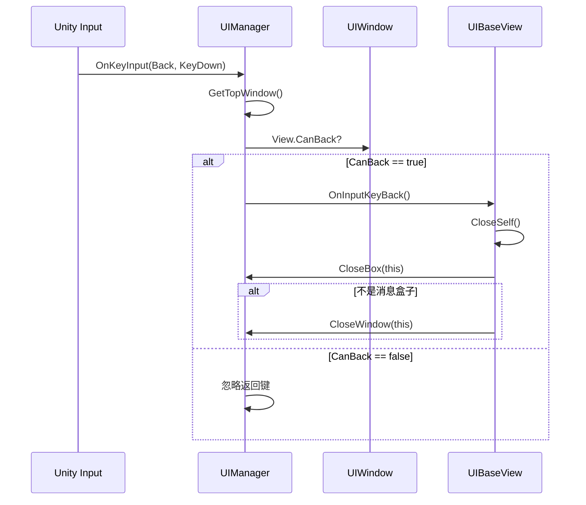
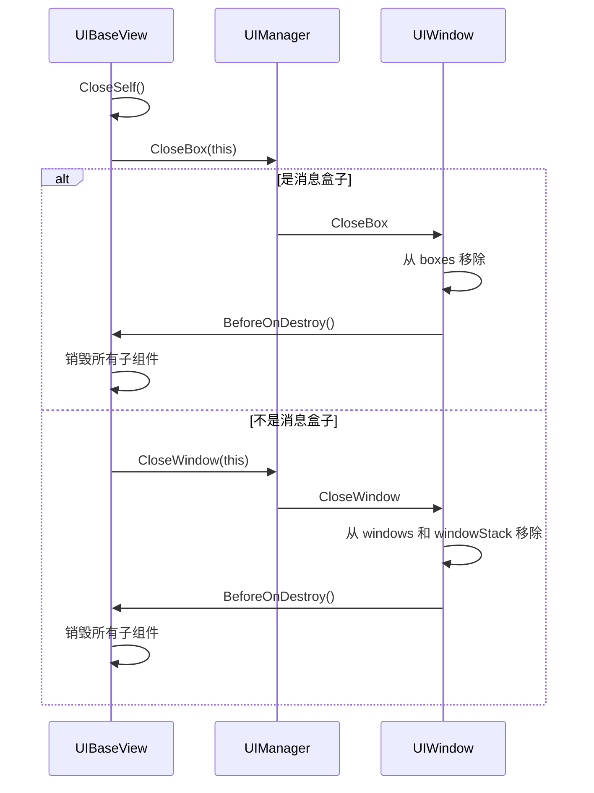

# UIBaseView.cs 注解文档

## 文件基本信息

| 属性 | 值 |
|------|-----|
| **文件名** | UIBaseView.cs |
| **路径** | Assets/Scripts/Code/Module/UI/UIBaseView.cs |
| **所属模块** | 框架层 → Code/Module/UI |
| **文件职责** | UI 视图基类，所有 UI 窗口视图的根类，提供窗口关闭和返回键处理 |

---

## 类/结构体说明

### UIBaseView

| 属性 | 说明 |
|------|------|
| **职责** | 继承自 UIBaseContainer，提供窗口级别的通用功能：CanBack 属性、CloseSelf 方法、返回键处理 |
| **泛型参数** | 无 |
| **继承关系** | `UIBaseView : UIBaseContainer` |
| **实现的接口** | 无直接实现，但可配合 `IOnBeforeCloseWin` 等接口使用 |

**设计模式**: 模板方法模式

```csharp
// 所有 UI 窗口视图都应继承此类
public class MyWindowView : UIBaseView
{
    // 重写 CanBack 决定是否能通过返回键关闭
    public override bool CanBack => true;
    
    // 可选：自定义返回键行为
    public override async ETTask OnInputKeyBack()
    {
        // 自定义逻辑
        await CloseSelf();
    }
}
```

---

## 字段与属性

| 名称 | 类型 | 访问级别 | 说明 |
|------|------|----------|------|
| `CanBack` | `bool` | `public virtual` | 是否允许通过返回键关闭窗口，默认 false |

---

## 方法说明

### CanBack

**签名**:
```csharp
public virtual bool CanBack => false
```

**职责**: 属性 getter，决定窗口是否能通过返回键关闭

**返回值**:
- `true`: 允许返回键关闭
- `false`: 不允许返回键关闭（默认）

**使用示例**:
```csharp
// 主界面不允许直接关闭
public class HomeView : UIBaseView
{
    public override bool CanBack => false;
}

// 弹窗允许关闭
public class PopupView : UIBaseView
{
    public override bool CanBack => true;
}
```

---

### CloseSelf

**签名**:
```csharp
public virtual async ETTask CloseSelf()
```

**职责**: 关闭当前窗口，优先尝试关闭消息盒子，失败则关闭普通窗口

**核心逻辑**:
```
1. 调用 UIManager.Instance.CloseBox(this)
2. 如果返回 false（不是消息盒子）
3. 调用 UIManager.Instance.CloseWindow(this)
```

**使用示例**:
```csharp
// 在窗口内部关闭自身
public class MyView : UIBaseView
{
    private async void OnCloseButtonClick()
    {
        await CloseSelf();
    }
    
    // 或者在某个条件满足时关闭
    private async Task OnTaskCompleted()
    {
        // 完成任务后关闭
        await CloseSelf();
    }
}
```

**调用者**:
- 窗口内部的关闭按钮
- 任务完成后的自动关闭
- `OnInputKeyBack()` 默认实现

---

### OnInputKeyBack

**签名**:
```csharp
public virtual ETTask OnInputKeyBack()
```

**职责**: 处理返回键按下事件，默认实现是关闭自身

**核心逻辑**:
```
1. 调用 CloseSelf()
```

**使用示例**:
```csharp
// 默认行为：关闭自身
public class DefaultView : UIBaseView
{
    // 使用默认实现即可
}

// 自定义行为：先保存数据再关闭
public class EditView : UIBaseView
{
    public override bool CanBack => true;
    
    public override async ETTask OnInputKeyBack()
    {
        // 先保存数据
        await SaveData();
        // 再关闭
        await CloseSelf();
    }
}

// 自定义行为：返回键不关闭，而是返回上一步
public class StepView : UIBaseView
{
    public override bool CanBack => true;
    
    public override async ETTask OnInputKeyBack()
    {
        // 返回上一步而不是关闭
        await GoToPreviousStep();
    }
}
```

---

## 生命周期流程图

### 返回键处理流程



---

### 窗口关闭流程



---

## 与其他模块的交互

```mermaid
graph TB
    subgraph View["UIBaseView"]
        BV[UIBaseView]
    end
    
    subgraph Container["容器基类"]
        BC[UIBaseContainer]
    end
    
    subgraph Managers["管理器"]
        UM[UIManager]
        UIW[UIWindow]
    end
    
    subgraph Interfaces["可选接口"]
        IOBC[IOnBeforeCloseWin]
    end
    
    BV --|> BC
    BV --> UM
    BV --> UIW
    BV ..> IOBC
    
    note right of BV "UIBaseView 是所有 UI<br/>窗口的视图基类，提供<br/>窗口关闭和返回键处理"
    
    style View fill:#e1f5ff
    style Container fill:#fff4e1
    style Managers fill:#e8f5e9
    style Interfaces fill:#fce4ec
```

---

## 学习重点与陷阱

### ✅ 学习重点

1. **继承关系**: UIBaseView 继承自 UIBaseContainer，拥有所有容器功能
2. **CanBack 属性**: 控制返回键是否能关闭窗口，默认 false
3. **CloseSelf 方法**: 统一的窗口关闭入口，自动判断消息盒子或普通窗口
4. **OnInputKeyBack 方法**: 返回键按下时的回调，可自定义行为

### ⚠️ 陷阱与注意事项

| 问题 | 说明 | 解决方案 |
|------|------|----------|
| **CanBack 未重写** | 默认 false，返回键无效 | 需要关闭的窗口记得重写为 true |
| **CloseSelf 未 await** | 异步方法未等待可能导致逻辑错误 | 使用 await 调用 CloseSelf() |
| **OnInputKeyBack 未重写** | 默认直接关闭，可能丢失数据 | 需要保存数据的窗口应重写此方法 |
| **消息盒子混淆** | 不清楚 CloseBox 和 CloseWindow 的区别 | CloseSelf 会自动判断，无需手动选择 |

---

## 最佳实践

### 标准窗口模板

```csharp
public class MyWindowView : UIBaseView, IOnCreate, IOnEnable, IOnDisable, IOnDestroy
{
    // UI 组件
    private UIButton btnClose;
    private UIText txtTitle;
    private UIButton btnSubmit;
    
    // 状态
    private bool isDirty; // 数据是否被修改
    
    public override bool CanBack => true;
    
    public void OnCreate()
    {
        // 添加 UI 组件
        btnClose = AddComponent<UIButton>("btnClose");
        txtTitle = AddComponent<UIText>("txtTitle");
        btnSubmit = AddComponent<UIButton>("btnSubmit");
        
        // 绑定事件
        btnClose.GetComponent().onClick.AddListener(OnCloseClick);
        btnSubmit.GetComponent().onClick.AddListener(OnSubmitClick);
    }
    
    public void OnEnable()
    {
        // 初始化 UI 状态
        txtTitle.SetText("My Window");
        isDirty = false;
    }
    
    public void OnDisable()
    {
        // 清理状态
    }
    
    public void OnDestroy()
    {
        // 释放资源
    }
    
    public override async ETTask OnInputKeyBack()
    {
        if (isDirty)
        {
            // 提示保存
            await ShowSaveDialog();
        }
        else
        {
            await CloseSelf();
        }
    }
    
    private void OnCloseClick()
    {
        CloseSelf().Coroutine();
    }
    
    private async void OnSubmitClick()
    {
        // 提交数据
        await SubmitData();
        isDirty = false;
        await CloseSelf();
    }
    
    private async ETTask ShowSaveDialog()
    {
        // 显示保存对话框
        var result = await UIManager.Instance.OpenWindow<SaveDialogView>("path/to/SaveDialog");
        if (result == DialogResult.Save)
        {
            await SubmitData();
            await CloseSelf();
        }
        else if (result == DialogResult.Discard)
        {
            isDirty = false;
            await CloseSelf();
        }
    }
    
    private async ETTask SubmitData()
    {
        // 提交逻辑
        await TimerManager.Instance.WaitAsync(100);
    }
}
```

### 不可关闭的窗口

```csharp
// 主界面，不允许通过返回键关闭
public class HomeView : UIBaseView
{
    public override bool CanBack => false;
    
    // 返回键完全无效
    public override async ETTask OnInputKeyBack()
    {
        // 空实现，或者播放提示音
        Log.Info("返回键在主界面无效");
    }
}
```

### 带确认的关闭

```csharp
// 编辑界面，关闭前需要确认
public class EditView : UIBaseView
{
    public override bool CanBack => true;
    
    public override async ETTask OnInputKeyBack()
    {
        if (await ShowConfirmDialog("确定要放弃编辑吗？"))
        {
            await CloseSelf();
        }
    }
    
    private async ETTask<bool> ShowConfirmDialog(string message)
    {
        // 打开确认对话框
        var dialog = await UIManager.Instance.OpenWindow<ConfirmDialogView>("path/to/ConfirmDialog", UILayerNames.Popup);
        dialog.SetMessage(message);
        return await dialog.WaitForResult();
    }
}
```

---

## 完整示例：登录窗口

```csharp
public class LoginView : UIBaseView, IOnCreate, IOnEnable, IOnDestroy
{
    private UIInput inputAccount;
    private UIInput inputPassword;
    private UIButton btnLogin;
    private UIButton btnRegister;
    private UIText txtError;
    
    public override bool CanBack => false; // 登录界面不允许返回
    
    public void OnCreate()
    {
        // 添加 UI 组件
        inputAccount = AddComponent<UIInput>("inputAccount");
        inputPassword = AddComponent<UIInput>("inputPassword");
        btnLogin = AddComponent<UIButton>("btnLogin");
        btnRegister = AddComponent<UIButton>("btnRegister");
        txtError = AddComponent<UIText>("txtError");
        
        // 绑定事件
        btnLogin.GetComponent().onClick.AddListener(OnLoginClick);
        btnRegister.GetComponent().onClick.AddListener(OnRegisterClick);
        
        // 隐藏错误提示
        txtError.SetActive(false);
    }
    
    public void OnEnable()
    {
        // 清空输入
        inputAccount.GetComponent().text = "";
        inputPassword.GetComponent().text = "";
        txtError.SetActive(false);
    }
    
    public void OnDestroy()
    {
        // 清理
    }
    
    private async void OnLoginClick()
    {
        var account = inputAccount.GetComponent().text;
        var password = inputPassword.GetComponent().text;
        
        if (string.IsNullOrEmpty(account))
        {
            ShowError("请输入账号");
            return;
        }
        
        if (string.IsNullOrEmpty(password))
        {
            ShowError("请输入密码");
            return;
        }
        
        // 禁用按钮防止重复点击
        btnLogin.SetEnable(false);
        
        try
        {
            // 调用登录接口
            var success = await PlayerManager.Instance.Login(account, password);
            
            if (success)
            {
                // 登录成功，关闭窗口
                await CloseSelf();
            }
            else
            {
                ShowError("账号或密码错误");
            }
        }
        catch (Exception e)
        {
            ShowError("网络错误，请稍后重试");
            Log.Error($"Login error: {e}");
        }
        finally
        {
            btnLogin.SetEnable(true);
        }
    }
    
    private void OnRegisterClick()
    {
        // 打开注册窗口
        UIManager.Instance.OpenWindow<RegisterView>("path/to/RegisterView", UILayerNames.Popup).Coroutine();
    }
    
    private void ShowError(string message)
    {
        txtError.SetText(message);
        txtError.SetActive(true);
        
        // 震动提示
        txtError.Shake(force: 2, during: 300).Coroutine();
    }
}
```

---

## 相关文档

- [UIBaseContainer.cs](./UIBaseContainer.cs.md) - UI 容器基类
- [UIManager.cs](./UIManager.cs.md) - UI 管理器
- [UIWindow.cs](./UIWindow.cs.md) - UI 窗口
- [IOnBeforeCloseWin.cs](./IOnBeforeCloseWin.cs.md) - 关闭前接口

---

*文档由 OpenClaw AI 助手自动生成 | 基于静态代码分析*
