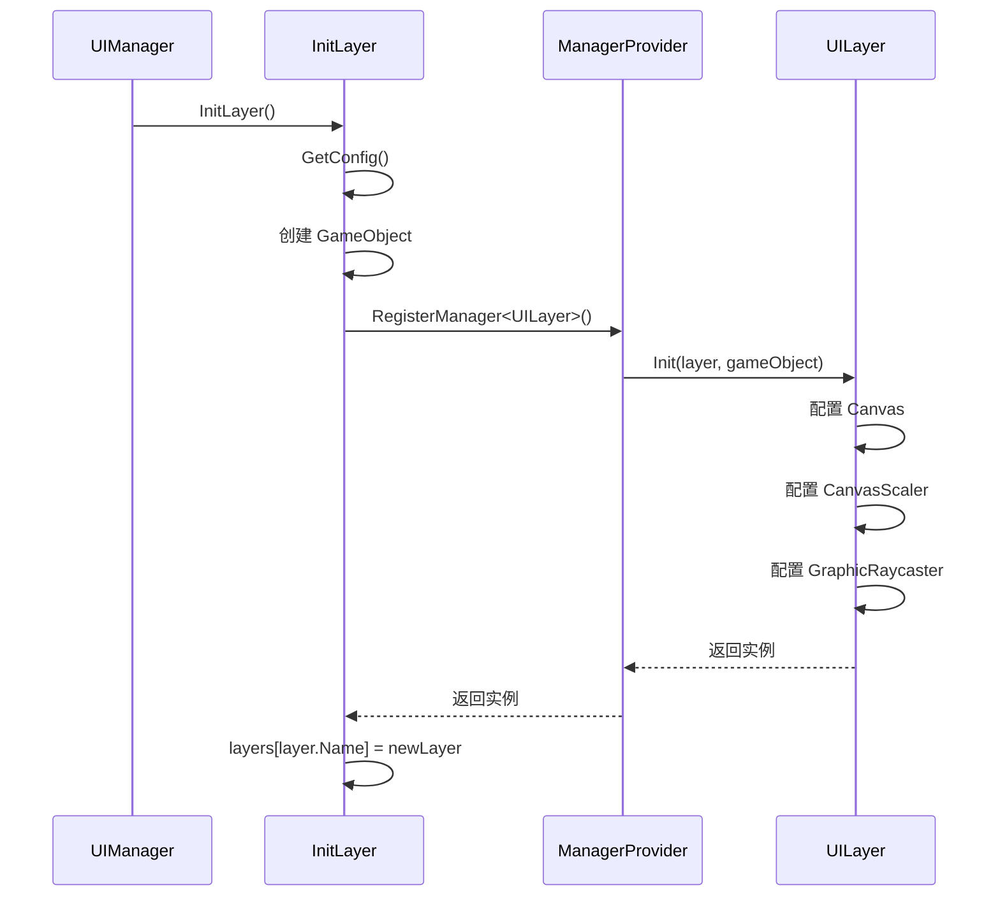

# UIManager.Layers.cs 注解文档

## 文件基本信息

| 属性 | 值 |
|------|-----|
| **文件名** | UIManager.Layers.cs |
| **路径** | Assets/Scripts/Code/Module/UI/UIManager.Layers.cs |
| **所属模块** | 框架层 → Code/Module/UI |
| **文件职责** | UI 层级系统实现，管理所有 UI 层级的创建、配置和销毁 |

---

## 类/结构体说明

### UILayerDefine (结构体)

| 属性 | 说明 |
|------|------|
| **职责** | 定义 UI 层级的配置数据 |
| **泛型参数** | 无 |
| **继承关系** | 无继承 |
| **实现的接口** | 无 |

```csharp
public struct UILayerDefine
{
    public UILayerNames Name;          // 层级名称
    public int PlaneDistance;          // Canvas 平面距离
    public int OrderInLayer;           // Sorting Order
}
```

---

### UIManager (partial) - 层级相关

| 属性 | 说明 |
|------|------|
| **职责** | UIManager 的层级管理部分（partial 类） |
| **泛型参数** | 无 |
| **继承关系** | 无（UIManager 整体无继承） |
| **实现的接口** | 无 |

**文件组织**:
- `UIManager.cs` - 窗口管理核心逻辑
- `UIManager.Layers.cs` - 层级系统实现（本文件）

---

## 字段与属性（按重要程度排序）

| 名称 | 类型 | 访问级别 | 说明 |
|------|------|----------|------|
| `UICamera` | `Camera` | `public` | UI 专用相机 |
| `Resolution` | `Vector2` | `public` | UI 参考分辨率 |
| `layers` | `Dictionary<UILayerNames, UILayer>` | `private` | 所有可用层级的字典 |
| `gameObject` | `GameObject` | `private` | UI 根节点 GameObject |
| `windowStack` | `Dictionary<UILayerNames, LinkedList<string>>` | `private` | 各层级的窗口栈（继承自主类） |

---

## 方法说明（按重要程度排序）

### GetConfig()

**签名**:
```csharp
UILayerDefine[] GetConfig()
```

**职责**: 定义所有 UI 层级的配置

**核心逻辑**:
```
1. 创建 7 个 UILayerDefine 结构体
2. 配置每个层级的 Name/PlaneDistance/OrderInLayer
3. 返回配置数组
```

**配置详情**:

```csharp
// 游戏背景层（最底层）
UILayerDefine gameBackgroundLayer = new UILayerDefine
{
    Name = UILayerNames.GameBackgroundLayer,
    PlaneDistance = 1000,  // 最远
    OrderInLayer = 0,      // 最低
};

// 主界面背景层
UILayerDefine backgroundLayer = new UILayerDefine
{
    Name = UILayerNames.BackgroundLayer,
    PlaneDistance = 900,
    OrderInLayer = 1000,
};

// 游戏内 UI 层
UILayerDefine gameLayer = new UILayerDefine
{
    Name = UILayerNames.GameLayer,
    PlaneDistance = 800,
    OrderInLayer = 1800,
};

// 场景 UI 层
UILayerDefine sceneLayer = new UILayerDefine
{
    Name = UILayerNames.SceneLayer,
    PlaneDistance = 700,
    OrderInLayer = 2000,
};

// 普通 UI 层
UILayerDefine normalLayer = new UILayerDefine
{
    Name = UILayerNames.NormalLayer,
    PlaneDistance = 600,
    OrderInLayer = 3000,
};

// 提示 UI 层
UILayerDefine tipLayer = new UILayerDefine
{
    Name = UILayerNames.TipLayer,
    PlaneDistance = 500,
    OrderInLayer = 4000,
};

// 顶层 UI（最上层）
UILayerDefine topLayer = new UILayerDefine
{
    Name = UILayerNames.TopLayer,
    PlaneDistance = 400,   // 最近
    OrderInLayer = 5000,   // 最高
};
```

**调用者**: `InitLayer()`

---

### InitLayer()

**签名**:
```csharp
private void InitLayer()
```

**职责**: 初始化所有 UI 层级

**核心逻辑**:
```
1. 设置单例 Instance = this
2. 查找 UI 根节点 "Global/UI"
3. 查找 UICamera "Global/UI/UICamera"
4. 设置分辨率 Resolution
5. 初始化 layers 字典
6. 获取配置 GetConfig()
7. 遍历配置，为每个层级：
   - 创建 GameObject
   - 设置 layer = 5 (UI 层)
   - 设置父节点为 UI 根节点
   - 注册 UILayer Manager
   - 初始化 windowStack
```

**调用者**: `UIManager.Init()`

**被调用者**: `ManagerProvider.RegisterManager<UILayer>()`

**代码示例**:
```csharp
private void InitLayer()
{
    Instance = this;
    Log.Info("UILayersComponent Awake");
    
    // 查找 UI 根节点和相机
    var UIRootPath = "Global/UI";
    var uiCameraPath = UIRootPath + "/UICamera";
    this.gameObject = GameObject.Find(UIRootPath);
    this.UICamera = GameObject.Find(uiCameraPath).GetComponent<Camera>();
    
    // 设置分辨率
    this.Resolution = new Vector2(Define.DesignScreenWidth, Define.DesignScreenHeight);
    this.layers = new Dictionary<UILayerNames, UILayer>();
    
    // 创建所有层级
    var uiLayers = GetConfig();
    for (int i = 0; i < uiLayers.Length; i++)
    {
        var layer = uiLayers[i];
        var go = new GameObject(layer.Name.ToString())
        {
            layer = 5  // Unity UI Layer
        };
        var trans = go.transform;
        trans.SetParent(transform, false);
        
        // 注册 UILayer Manager
        UILayer newLayer = ManagerProvider.RegisterManager<UILayer, UILayerDefine, GameObject>(
            layer, go, layer.Name.ToString()
        );
        this.layers[layer.Name] = newLayer;
        
        // 初始化窗口栈
        windowStack[layer.Name] = new LinkedList<string>();
    }
}
```

---

### DestroyLayer()

**签名**:
```csharp
private void DestroyLayer()
```

**职责**: 销毁所有 UI 层级

**核心逻辑**:
```
1. 遍历所有 layers
2. 销毁每个层级的 GameObject
3. 清空 layers 字典
4. 设置 layers = null
```

**调用者**: `UIManager.OnDestroyAsync()`

---

### GetLayer(UILayerNames layer)

**签名**:
```csharp
public UILayer GetLayer(UILayerNames layer)
```

**职责**: 根据层级名称获取 UILayer 实例

**核心逻辑**:
```
1. 从 layers 字典查找
2. 找到则返回，否则返回 null
```

**调用者**: `UIManager.InnerOpenWindowGetGameObject()`, `UIManager.InnerResetWindowLayer()`

**使用示例**:
```csharp
// 获取 NormalLayer
UILayer normalLayer = UIManager.Instance.GetLayer(UILayerNames.NormalLayer);

// 设置 UI 父节点
trans.SetParent(normalLayer.RectTransform, false);
```

---

### RemoveLayer(UILayerNames name)

**签名**:
```csharp
public async ETTask RemoveLayer(UILayerNames name)
```

**职责**: 移除指定层级（包括该层级所有窗口）

**核心逻辑**:
```
1. 关闭该层级所有窗口 DestroyWindowByLayer(name)
2. 移除 Manager ManagerProvider.RemoveManager<UILayer>()
3. 从 layers 字典移除
4. 从 windowStack 移除
```

**调用者**: 动态层级管理场景

---

### SetCanvasScaleEditorPortrait(bool flag)

**签名**:
```csharp
public void SetCanvasScaleEditorPortrait(bool flag)
```

**职责**: Editor 下调整 Canvas 缩放（竖屏模式）

**核心逻辑**:
```
1. 调用 GameLayer/TipLayer/TopLayer/GameBackgroundLayer 的 SetCanvasScaleEditorPortrait
2. 根据 flag 调整 referenceResolution 和 matchWidthOrHeight
```

**调用者**: Editor 脚本

---

## Unity 层级系统

### Canvas 配置

每个 UILayer 包含以下 Unity 组件：

| 组件 | 用途 | 配置 |
|------|------|------|
| `Canvas` | UI 画布 | renderMode=ScreenSpaceCamera |
| `CanvasScaler` | UI 缩放 | ScaleWithScreenSize |
| `GraphicRaycaster` | UI 射线检测 | 默认配置 |

### Canvas 配置详情

```csharp
// Canvas
this.Canvas.renderMode = RenderMode.ScreenSpaceCamera;
this.Canvas.worldCamera = UIManager.Instance.UICamera;
this.Canvas.planeDistance = layer.PlaneDistance;
this.Canvas.sortingLayerName = "UI";
this.Canvas.sortingOrder = layer.OrderInLayer;

// CanvasScaler
this.CanvasScaler.uiScaleMode = CanvasScaler.ScaleMode.ScaleWithScreenSize;
this.CanvasScaler.screenMatchMode = CanvasScaler.ScreenMatchMode.MatchWidthOrHeight;
this.CanvasScaler.referenceResolution = UIManager.Instance.Resolution;
this.CanvasScaler.matchWidthOrHeight = 
    (layer.Name == GameLayer || 宽屏) ? 1 : 0;

// GraphicRaycaster
this.GraphicRaycaster = this.GameObject.AddComponent<GraphicRaycaster>();
```

---

## 阅读指引

### 建议的阅读顺序

1. **看 UILayerDefine 结构体** - 理解层级配置
2. **看 GetConfig()** - 了解 7 个层级的参数
3. **看 InitLayer()** - 理解层级创建流程
4. **看 GetLayer()** - 理解层级获取

### 最值得学习的技术点

1. **Partial 类**: 将 UIManager 拆分到多个文件
2. **结构体配置**: UILayerDefine 轻量级配置数据
3. **Manager 注册**: UILayer 也通过 ManagerProvider 管理
4. **Canvas 配置**: 详细设置 Canvas/CanvasScaler/GraphicRaycaster

---

## UI 层级架构图

```
Global/UI (UIRoot)
├── UICamera
├── GameBackgroundLayer (PlaneDistance=1000, Order=0)
├── BackgroundLayer (PlaneDistance=900, Order=1000)
├── GameLayer (PlaneDistance=800, Order=1800)
├── SceneLayer (PlaneDistance=700, Order=2000)
├── NormalLayer (PlaneDistance=600, Order=3000)
├── TipLayer (PlaneDistance=500, Order=4000)
└── TopLayer (PlaneDistance=400, Order=5000)
```

---

## 层级使用流程



---

## 相关文档

- [UIManager.cs.md](./UIManager.cs.md) - UI 管理器主类
- [UILayerNames.cs.md](./UILayerNames.cs.md) - UI 层级枚举
- [UILayer.cs.md](./UILayer.cs.md) - UILayer 类实现

---

*文档生成时间：2026-02-27 | OpenClaw AI 助手*
