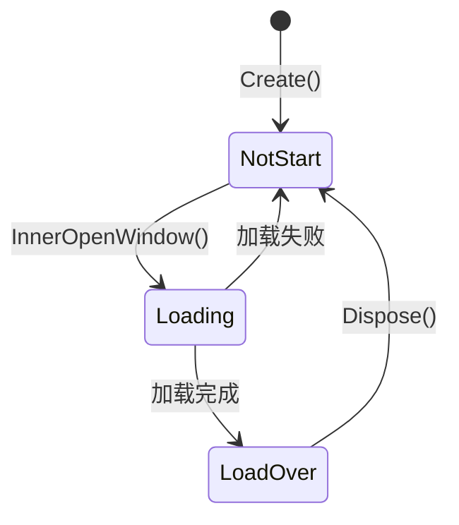

# UIWindow.cs 注解文档

## 文件基本信息

| 属性 | 值 |
|------|-----|
| **文件名** | UIWindow.cs |
| **路径** | Assets/Scripts/Code/Module/UI/UIWindow.cs |
| **所属模块** | 框架层 → Code/Module/UI |
| **文件职责** | 定义 UI 窗口的数据结构和状态管理 |

---

## 类/结构体说明

### UIWindowLoadingState (枚举)

| 属性 | 说明 |
|------|------|
| **职责** | 定义窗口加载状态的枚举 |
| **泛型参数** | 无 |
| **继承关系** | 继承自 `byte` |
| **实现的接口** | 无 |

```csharp
public enum UIWindowLoadingState : byte
{
    NotStart,   // 未开始
    Loading,    // 加载中
    LoadOver,   // 加载完成
}
```

**状态流转**:
```
NotStart → Loading → LoadOver
```

---

### UIWindow (类)

| 属性 | 说明 |
|------|------|
| **职责** | UI 窗口的数据结构，封装窗口的元数据和状态 |
| **泛型参数** | 无 |
| **继承关系** | 无继承 |
| **实现的接口** | `IDisposable` |

**设计模式**: 对象池模式

```csharp
// 从对象池获取实例
public static UIWindow Create()
{
    return ObjectPool.Instance.Fetch<UIWindow>();
}

// 回收到对象池
public void Dispose()
{
    // 重置字段...
    ObjectPool.Instance.Recycle(this);
}
```

---

## 字段与属性（按重要程度排序）

| 名称 | 类型 | 访问级别 | 说明 |
|------|------|----------|------|
| `Name` | `string` | `public` | 窗口名字（类名） |
| `Active` | `bool` | `public` | 是否激活（显示中） |
| `LoadingState` | `UIWindowLoadingState` | `public` | 加载状态（NotStart/Loading/LoadOver） |
| `PrefabPath` | `string` | `public` | 预制体资源路径 |
| `Layer` | `UILayerNames` | `public` | 窗口层级（NormalLayer/TipLayer 等） |
| `View` | `UIBaseView` | `public` | 窗口视图实例 |
| `IsBox` | `bool` | `public` | 是否是消息盒子（多例，关闭即销毁） |

---

## 方法说明（按重要程度排序）

### Create()

**签名**:
```csharp
public static UIWindow Create()
```

**职责**: 从对象池获取 UIWindow 实例

**核心逻辑**:
```
1. 调用 ObjectPool.Instance.Fetch<UIWindow>()
2. 返回复用的实例
```

**调用者**: `UIManager.InitWindow()`

**被调用者**: `ObjectPool.Fetch<T>()`

**使用示例**:
```csharp
UIWindow window = UIWindow.Create();
window.Name = "UILoadingView";
window.PrefabPath = "UI/UILoadingView";
```

---

### Dispose()

**签名**:
```csharp
public void Dispose()
```

**职责**: 重置窗口状态并回收到对象池

**核心逻辑**:
```
1. 重置所有字段为默认值
   - Name = null
   - Active = false
   - LoadingState = NotStart
   - PrefabPath = null
   - Layer = BackgroundLayer
   - View = null
   - IsBox = false
2. 回收到对象池 ObjectPool.Instance.Recycle(this)
```

**调用者**: `UIManager.InnerDestroyWindow()`, `UIManager.DestroyWindow()`

**被调用者**: `ObjectPool.Recycle<T>()`

**注意事项**:
- 必须在窗口销毁时调用，确保对象池正确回收
- 重置所有字段避免脏数据影响下次使用

---

## 对象池集成

### 为什么使用对象池？

UIWindow 是频繁创建/销毁的对象：
- 每次打开窗口都需要创建 UIWindow
- 关闭窗口后可能再次打开
- 使用对象池避免频繁 GC

### 对象池生命周期

```
创建 → 使用 → Dispose → 回收 → (复用) 创建 → ...
   ↓         ↓         ↓         ↓
ObjectPool  Open    Close   ObjectPool
```

### 使用示例

```csharp
// 从对象池获取
UIWindow win = UIWindow.Create();

// 配置窗口
win.Name = "UIAuctionView";
win.PrefabPath = "UI/UIAuctionView";
win.Layer = UILayerNames.NormalLayer;
win.View = new UIAuctionView();

// 使用完毕，回收到对象池
win.Dispose();  // 自动回收，无需手动 Destroy
```

---

## 窗口状态管理

### LoadingState 状态说明

| 状态 | 值 | 说明 | 触发时机 |
|------|-----|------|----------|
| `NotStart` | 0 | 未开始加载 | 窗口刚创建 |
| `Loading` | 1 | 加载中 | 开始加载预制体 |
| `LoadOver` | 2 | 加载完成 | 预制体加载完成 |

### 状态流转图



### Active 状态

| 值 | 说明 | 对应用户操作 |
|----|------|-------------|
| `true` | 窗口已打开且显示 | OpenWindow |
| `false` | 窗口已关闭（可能缓存） | CloseWindow |

**注意**: `Active = false` 不代表窗口被销毁，可能只是隐藏缓存

---

## IsBox 标志

### Window vs Box

| 特性 | Window (IsBox=false) | Box (IsBox=true) |
|------|---------------------|------------------|
| 实例 | 单例 | 多例 |
| 缓存 | 关闭后缓存 | 关闭后销毁 |
| 用途 | 主界面、系统窗口 | 提示框、对话框 |
| 生命周期 | 持久 | 临时 |
| 对象池 | 回收 UIWindow | 回收 UIWindow + 销毁 View |

### 使用示例

```csharp
// Window - 单例
UIWindow win = UIWindow.Create();
win.IsBox = false;  // 默认值
// 关闭后缓存，下次打开复用

// Box - 多例
UIWindow box = UIWindow.Create();
box.IsBox = true;
// 关闭后立即销毁
```

---

## 阅读指引

### 建议的阅读顺序

1. **先看 UIWindowLoadingState 枚举** - 了解窗口状态
2. **再看 UIWindow 字段** - 理解窗口数据结构
3. **最后看 Create/Dispose** - 理解对象池机制

### 最值得学习的技术点

1. **对象池模式**: 避免频繁 GC，提升性能
2. **状态枚举**: 用 byte 枚举节省内存
3. **IDisposable 接口**: 规范资源清理
4. **数据分离**: UIWindow 只存数据，UIBaseView 处理逻辑

---

## 与 UIManager 的协作

### UIManager 中的 UIWindow

```csharp
// UIManager 维护所有窗口
private Dictionary<string, UIWindow> windows;  // {uiName: window}
private Dictionary<UILayerNames, LinkedList<string>> windowStack;  // 层级栈

// 创建窗口
UIWindow target = UIWindow.Create();
target.Name = "UILoadingView";
target.PrefabPath = UILoadingView.PrefabPath;
target.Layer = UILayerNames.TipLayer;
windows[target.Name] = target;

// 获取窗口
UIWindow win = GetWindow("UILoadingView");

// 销毁窗口
win.Dispose();
windows.Remove(win.Name);
```

---

## 相关文档

- [UIManager.cs.md](./UIManager.cs.md) - UI 管理器（使用者）
- [UIBaseView.cs.md](./UIBaseView.cs.md) - UI 视图基类
- [UIBaseContainer.cs.md](./UIBaseContainer.cs.md) - UI 容器基类
- [UILayerNames.cs.md](./UILayerNames.cs.md) - UI 层级枚举

---

*文档生成时间：2026-02-27 | OpenClaw AI 助手*
