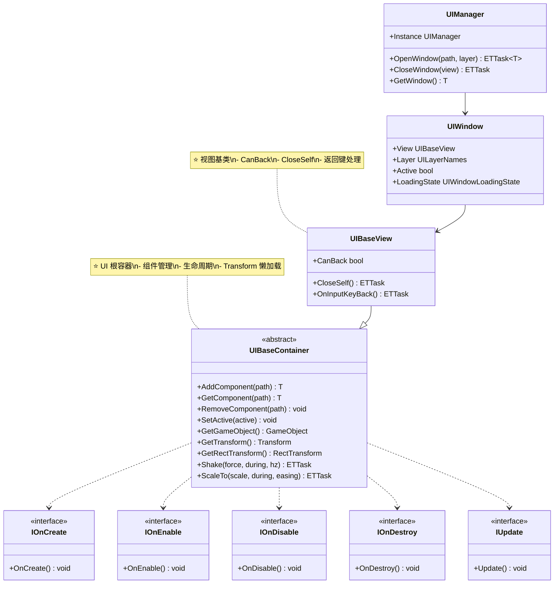
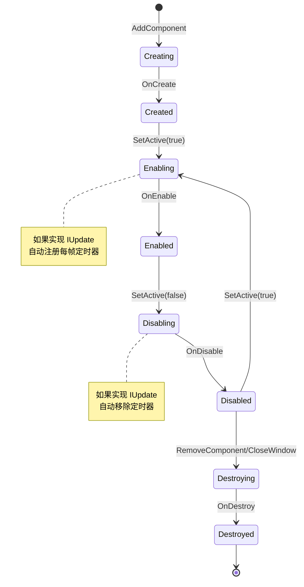

# UI 基类快速参考指南

> **文档版本**: v1.0  
> **生成时间**: 2026-02-28  
> **命名空间**: `TaoTie`

---

## 📑 目录

1. [UI 基类体系](#1-ui 基类体系)
2. [核心类说明](#2-核心类说明)
3. [生命周期](#3-生命周期)
4. [常用 API 速查](#4-常用 api 速查)
5. [代码模板](#5-代码模板)
6. [常见问题](#6-常见问题)

---

## 1. UI 基类体系



**继承关系**:
```
UIBaseContainer (根容器)
    └── UIBaseView (视图基类)
            └── YourWindowView (你的窗口)
```

---

## 2. 核心类说明

### 2.1 UIBaseContainer

**职责**: UI 系统的根容器类，所有 UI 组件的基类

**核心功能**:
- ✅ 组件添加/获取/移除
- ✅ Transform 懒加载
- ✅ 生命周期管理 (OnCreate/OnEnable/OnDisable/OnDestroy)
- ✅ Update 支持 (实现 IUpdate 自动注册每帧更新)
- ✅ 动画支持 (Shake, ScaleTo)
- ✅ I18N 国际化支持

**详细文档**: [UIBaseContainer.cs.md](./UIBaseContainer.cs.md)

---

### 2.2 UIBaseView

**职责**: UI 窗口视图基类，所有窗口视图应继承此类

**核心功能**:
- ✅ `CanBack` 属性：控制返回键是否能关闭窗口
- ✅ `CloseSelf()` 方法：关闭当前窗口
- ✅ `OnInputKeyBack()` 方法：返回键按下回调

**详细文档**: [UIBaseView.cs.md](./UIBaseView.cs.md)

---

### 2.3 UIManager

**职责**: UI 系统核心管理器，负责窗口创建、销毁、层级管理

**核心 API**:
```csharp
// 打开窗口
var view = await UIManager.Instance.OpenWindow<MyView>("path/to/Prefab", UILayerNames.Normal);

// 关闭窗口
await UIManager.Instance.CloseWindow(view);

// 获取窗口
var view = UIManager.Instance.GetWindow<MyView>();

// 检查窗口状态
bool isActive = UIManager.Instance.IsWindowActive<MyView>();
```

**详细文档**: [UIManager.cs.md](./UIManager.cs.md)

---

## 3. 生命周期

### 3.1 完整生命周期流程



### 3.2 生命周期接口

| 接口 | 方法 | 调用时机 | 说明 |
|------|------|----------|------|
| `IOnCreate` | `OnCreate()` | 组件创建时 | 初始化子组件、绑定事件 |
| `IOnEnable` | `OnEnable()` | 激活时 | 设置初始状态、刷新数据 |
| `IOnEnable<P1>` | `OnEnable(P1)` | 带参数激活时 | 支持传入参数 |
| `IOnDisable` | `OnDisable()` | 禁用时 | 清理状态、停止协程 |
| `IOnDestroy` | `OnDestroy()` | 销毁时 | 释放资源、移除监听 |
| `IUpdate` | `Update()` | 每帧 (激活状态) | 每帧更新逻辑 |

### 3.3 生命周期示例

```csharp
public class MyView : UIBaseView, IOnCreate, IOnEnable, IOnDisable, IOnDestroy, IUpdate
{
    private long timerId;
    
    // 1. 创建时调用（仅一次）
    public void OnCreate()
    {
        Log.Info("OnCreate: 初始化子组件");
        var btn = AddComponent<UIButton>("btnSubmit");
        btn.GetComponent().onClick.AddListener(OnClick);
    }
    
    // 2. 每次激活时调用
    public void OnEnable()
    {
        Log.Info("OnEnable: 设置初始状态");
        // 可以多次调用
    }
    
    // 3. 每帧调用（仅当激活时）
    public void Update()
    {
        // 每帧逻辑，如旋转、倒计时等
    }
    
    // 4. 每次禁用时调用
    public void OnDisable()
    {
        Log.Info("OnDisable: 清理状态");
        // 停止协程、清理临时数据
    }
    
    // 5. 销毁时调用（仅一次）
    public void OnDestroy()
    {
        Log.Info("OnDestroy: 释放资源");
        // 移除事件监听、释放资源
    }
    
    private void OnClick()
    {
        Log.Info("Button clicked");
    }
}
```

---

## 4. 常用 API 速查

### 4.1 组件管理

```csharp
// 添加组件
var button = AddComponent<UIButton>("btnSubmit");
var text = AddComponent<UIText>("txtTitle");
var image = AddComponent<UIImage>("imgIcon");

// 添加带参数的组件
var comp = AddComponent<MyComponent, string>("path", "param");

// 获取组件
var btn = GetComponent<UIButton>("btnSubmit");

// 移除组件
RemoveComponent<UIButton>("btnTemp");

// 移除所有组件
RemoveAllComponent("panel");
```

### 4.2 Transform 操作

```csharp
// 获取 GameObject
var go = GetGameObject();

// 获取 Transform
var trans = GetTransform();

// 获取 RectTransform
var rect = GetRectTransform();

// 操作位置
rect.anchoredPosition = Vector2.zero;

// 操作大小
rect.sizeDelta = new Vector2(100, 100);

// 操作缩放
rect.localScale = Vector3.one;
```

### 4.3 激活/禁用

```csharp
// 简单激活
SetActive(true);
SetActive(false);

// 带参数激活（调用 OnEnable<P1>）
SetActive(true, param1);
SetActive(true, param1, param2);
```

### 4.4 动画

```csharp
// 震动
await Shake(force: 1, during: 1000, hz: 50);

// 缩放
await ScaleTo(Vector3.one * 1.2f, during: 500, easing: EasingFunction.Ease.OutBack);

// 组合动画
await ScaleTo(Vector3.one * 1.2f, 200);
await Shake(2, 300, 60);
await ScaleTo(Vector3.one, 200);
```

### 4.5 窗口操作

```csharp
// 打开窗口
var view = await UIManager.Instance.OpenWindow<MyView>("path/to/Prefab", UILayerNames.Normal);

// 关闭窗口
await CloseSelf(); // 在窗口内部调用
await UIManager.Instance.CloseWindow(view); // 在外部调用

// 获取窗口
var view = UIManager.Instance.GetWindow<MyView>();

// 检查状态
bool isActive = UIManager.Instance.IsWindowActive<MyView>();
```

---

## 5. 代码模板

### 5.1 标准窗口模板

```csharp
namespace TaoTie
{
    public class MyWindowView : UIBaseView, IOnCreate, IOnEnable, IOnDisable, IOnDestroy
    {
        #region UI 组件
        
        private UIButton btnClose;
        private UIButton btnSubmit;
        private UIText txtTitle;
        private UIText txtContent;
        
        #endregion
        
        #region 属性
        
        public override bool CanBack => true;
        
        #endregion
        
        #region 生命周期
        
        public void OnCreate()
        {
            // 1. 添加 UI 组件
            btnClose = AddComponent<UIButton>("btnClose");
            btnSubmit = AddComponent<UIButton>("btnSubmit");
            txtTitle = AddComponent<UIText>("txtTitle");
            txtContent = AddComponent<UIText>("txtContent");
            
            // 2. 绑定事件
            btnClose.GetComponent().onClick.AddListener(OnCloseClick);
            btnSubmit.GetComponent().onClick.AddListener(OnSubmitClick);
        }
        
        public void OnEnable()
        {
            // 3. 初始化状态
            txtTitle.SetText("窗口标题");
            txtContent.SetText("窗口内容");
        }
        
        public void OnDisable()
        {
            // 4. 清理状态
        }
        
        public void OnDestroy()
        {
            // 5. 释放资源
        }
        
        #endregion
        
        #region 返回键处理
        
        public override async ETTask OnInputKeyBack()
        {
            await CloseSelf();
        }
        
        #endregion
        
        #region 事件处理
        
        private void OnCloseClick()
        {
            CloseSelf().Coroutine();
        }
        
        private async void OnSubmitClick()
        {
            // 提交逻辑
            await SubmitData();
            await CloseSelf();
        }
        
        #endregion
        
        #region 辅助方法
        
        private async ETTask SubmitData()
        {
            // 业务逻辑
            await TimerManager.Instance.WaitAsync(100);
        }
        
        #endregion
    }
}
```

### 5.2 带数据传递的窗口

```csharp
public class DetailView : UIBaseView, IOnCreate, IOnEnable<ItemData>
{
    private UIText txtName;
    private UIText txtDesc;
    private UIImage imgIcon;
    
    private ItemData currentItem;
    
    public override bool CanBack => true;
    
    public void OnCreate()
    {
        txtName = AddComponent<UIText>("txtName");
        txtDesc = AddComponent<UIText>("txtDesc");
        imgIcon = AddComponent<UIImage>("imgIcon");
    }
    
    // 带参数的 OnEnable
    public void OnEnable(ItemData data)
    {
        currentItem = data;
        txtName.SetText(data.Name);
        txtDesc.SetText(data.Description);
        // imgIcon.SetSprite(data.Icon);
    }
    
    public void OnDisable()
    {
        currentItem = null;
    }
    
    public void OnDestroy()
    {
    }
}

// 使用方式
var data = new ItemData { Name = "物品", Description = "描述" };
var view = await UIManager.Instance.OpenWindow<DetailView>("path/to/DetailView", UILayerNames.Popup);
view.SetActive(true, data); // 传入参数
```

### 5.3 每帧更新的窗口

```csharp
public class CountdownView : UIBaseView, IOnCreate, IOnEnable, IOnDisable, IUpdate
{
    private UIText txtCountdown;
    private int remainingSeconds = 60;
    private bool isRunning = false;
    
    public override bool CanBack => false;
    
    public void OnCreate()
    {
        txtCountdown = AddComponent<UIText>("txtCountdown");
    }
    
    public void OnEnable()
    {
        remainingSeconds = 60;
        isRunning = true;
        UpdateText();
    }
    
    public void OnDisable()
    {
        isRunning = false;
    }
    
    public void OnDestroy()
    {
    }
    
    // 每帧调用
    public void Update()
    {
        if (!isRunning) return;
        
        remainingSeconds--;
        if (remainingSeconds <= 0)
        {
            isRunning = false;
            OnCountdownFinished();
        }
        
        UpdateText();
    }
    
    private void UpdateText()
    {
        txtCountdown.SetText($"倒计时：{remainingSeconds}s");
    }
    
    private void OnCountdownFinished()
    {
        Log.Info("倒计时结束");
        CloseSelf().Coroutine();
    }
}
```

---

## 6. 常见问题

### Q1: 如何获取 Unity 原生组件？

```csharp
// 方式 1: 使用 UIMonoBehaviour 包装
var mono = AddComponent<UIMonoBehaviour<Image>>("imgIcon");
var image = mono.GetComponent();

// 方式 2: 直接从 GameObject 获取
var go = GetGameObject();
var image = go.GetComponentInChildren<Image>();
```

### Q2: 如何在子组件中访问父容器？

```csharp
public class ChildComponent : UIBaseContainer, IOnCreate
{
    public void OnCreate()
    {
        // parent 是 protected 字段，可以访问
        var parent = this.parent;
        
        // 或者通过路径获取
        var parentView = parent as UIBaseView;
    }
}
```

### Q3: 如何处理异步加载？

```csharp
public class AsyncView : UIBaseView, IOnCreate
{
    public void OnCreate()
    {
        // 异步加载逻辑在 OnCreate 中启动
        LoadDataAsync().Coroutine();
    }
    
    private async ETTask LoadDataAsync()
    {
        // 等待资源加载
        await ResourcesManager.Instance.LoadAsync<GameObject>("path");
        
        // 更新 UI
        SetActive(true);
    }
}
```

### Q4: CanBack 什么时候用 true，什么时候用 false？

| 场景 | CanBack | 说明 |
|------|---------|------|
| 主界面 | `false` | 不允许直接退出 |
| 弹窗 | `true` | 允许关闭 |
| 编辑界面 | `true` (配合确认) | 需要确认是否保存 |
| 剧情对话 | `false` | 强制观看 |
| 设置界面 | `true` | 允许直接关闭 |

### Q5: 如何调试 UI 路径问题？

```csharp
// 在编辑器模式下，路径错误会记录 Log
// 检查 Hierarchy 中的物体名称是否与 path 一致

// 示例：
// Hierarchy: Panel/BtnSubmit
// 代码：AddComponent<UIButton>("BtnSubmit")  // 相对于 Panel

// 如果找不到，检查:
// 1. 物体名称是否拼写正确
// 2. 路径是否相对于父容器
// 3. ReferenceCollector 是否已生成
```

---

## 相关文档

- [UIBaseContainer.cs.md](./UIBaseContainer.cs.md) - UI 容器基类详细文档
- [UIBaseView.cs.md](./UIBaseView.cs.md) - UI 视图基类详细文档
- [UIManager.cs.md](./UIManager.cs.md) - UI 管理器详细文档
- [UIWindow.cs.md](./UIWindow.cs.md) - UI 窗口详细文档
- [UILayer.cs.md](./UILayer.cs.md) - UI 层级详细文档

---

*文档由 OpenClaw AI 助手自动生成 | 基于静态代码分析*
