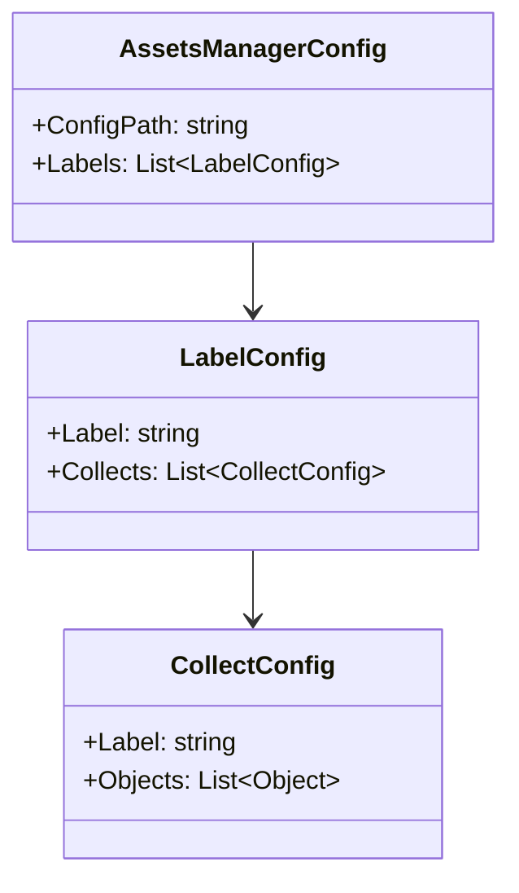

# AssetsManagerConfig.cs 注解文档

## 文件基本信息

| 属性 | 值 |
|------|-----|
| **文件名** | AssetsManagerConfig.cs |
| **路径** | Assets/Scripts/Editor/ArtEditor/AssetsManager/Config/AssetsManagerConfig.cs |
| **所属模块** | Editor 工具 → 美术编辑器 → 资产管理 → 配置 |
| **文件职责** | 资产管理器的 ScriptableObject 配置，定义资源目录结构 |

---

## 类/结构体说明

### AssetsManagerConfig

| 属性 | 说明 |
|------|------|
| **职责** | 作为 Unity ScriptableObject 配置资产，存储资源目录结构配置，供资产管理工具使用 |
| **泛型参数** | 无 |
| **继承关系** | 继承自 `SerializedScriptableObject` |
| **实现的接口** | 无 |

**设计模式**: ScriptableObject 配置模式

```csharp
// 创建菜单入口
[CreateAssetMenu(fileName = "AssetsManagerConfig", menuName = "Create AssetsManagerConfig", order = 1)]
public class AssetsManagerConfig : SerializedScriptableObject
```

**依赖条件**: 需要 Odin Inspector 插件 (`#if ODIN_INSPECTOR`)

---

## 字段与属性

| 名称 | 类型 | 访问级别 | 说明 |
|------|------|----------|------|
| `ConfigPath` | `string` (const) | `public const` | 配置文件的默认保存路径 |
| `Labels` | `List<LabelConfig>` | `public` | 目录结构配置列表，包含所有资源标签分类 |

---

## 方法说明

本类为纯数据配置类，无方法。

---

## 配置结构



**配置层级**:
1. **AssetsManagerConfig** - 根配置
2. **LabelConfig** - 大类标签 (如"角色"、"场景"、"UI")
3. **CollectConfig** - 小类标签 (如"主角"、"NPC"、"BOSS")

---

## 使用示例

### 创建配置

```csharp
// 通过 Unity 菜单创建
// 菜单路径：Assets → Create → Create AssetsManagerConfig

// 代码方式创建
var config = ScriptableObject.CreateInstance<AssetsManagerConfig>();

// 添加大类标签
var roleLabel = new LabelConfig
{
    Label = "角色"
};

// 添加小类配置
roleLabel.Collects.Add(new CollectConfig
{
    Label = "主角",
    Objects = new List<Object> { /* 添加文件夹 */ }
});

config.Labels.Add(roleLabel);

// 保存配置
AssetDatabase.CreateAsset(config, AssetsManagerConfig.ConfigPath);
AssetDatabase.SaveAssets();
```

### 加载配置

```csharp
// 加载已有配置
var config = AssetDatabase.LoadAssetAtPath<AssetsManagerConfig>(
    AssetsManagerConfig.ConfigPath
);

// 遍历所有标签
foreach (var label in config.Labels)
{
    Debug.Log($"大类：{label.Label}");
    foreach (var collect in label.Collects)
    {
        Debug.Log($"  小类：{collect.Label}");
        Debug.Log($"  文件夹数：{collect.Objects.Count}");
    }
}
```

---

## 相关文档

- [LabelConfig.cs.md](./LabelConfig.cs.md) - 标签配置结构
- [CollectConfig.cs.md](./CollectConfig.cs.md) - 收集配置结构
- [AssetsManagerWindow.cs.md](../AssetsManagerWindow.cs.md) - 资产管理窗口

---

*最后更新：2026-03-02*
