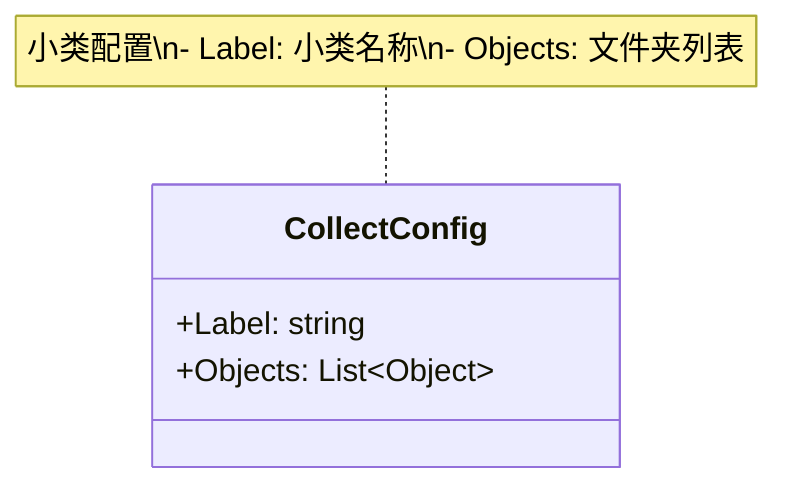

# CollectConfig.cs 注解文档

## 文件基本信息

| 属性 | 值 |
|------|-----|
| **文件名** | CollectConfig.cs |
| **路径** | Assets/Scripts/Editor/ArtEditor/AssetsManager/Config/CollectConfig.cs |
| **所属模块** | Editor 工具 → 美术编辑器 → 资产管理 → 配置 |
| **文件职责** | 定义资源收集配置，指定小类标签及其包含的文件夹 |

---

## 类/结构体说明

### CollectConfig

| 属性 | 说明 |
|------|------|
| **职责** | 定义小类资源收集配置，包含小类标签名称和对应的文件夹列表 |
| **泛型参数** | 无 |
| **继承关系** | 无继承 |
| **实现的接口** | 无 |

**设计模式**: 配置数据模式

```csharp
// Odin Inspector 序列化特性
[Serializable]
public class CollectConfig
```

**依赖条件**: 需要 Odin Inspector 插件 (`#if ODIN_INSPECTOR`)

---

## 字段与属性

| 名称 | 类型 | 访问级别 | 说明 |
|------|------|----------|------|
| `Label` | `string` | `public` | 小类标签名称，用于细分资源分类 |
| `Objects` | `List<Object>` | `public` | 包含的文件夹对象列表，指定资源所在目录 |

---

## 方法说明

本类为纯数据配置类，无方法。

---

## 配置结构



---

## 使用示例

```csharp
// 创建小类配置
var collectConfig = new CollectConfig
{
    Label = "主角",
    Objects = new List<Object>
    {
        // 通过 Editor 拖拽添加文件夹
        // AssetDatabase.LoadAssetAtPath<Object>("Assets/AssetsPackage/Characters/Player")
    }
};

// 添加到 LabelConfig
var labelConfig = new LabelConfig
{
    Label = "角色"
};
labelConfig.Collects.Add(collectConfig);

// 在 Unity Inspector 中配置:
// 1. 创建 AssetsManagerConfig 配置资产
// 2. 展开 Labels 列表
// 3. 添加 LabelConfig，设置 Label = "角色"
// 4. 展开 Collects 列表
// 5. 添加 CollectConfig，设置 Label = "主角"
// 6. 在 Objects 列表中拖入目标文件夹
```

---

## 配置层级关系

```
AssetsManagerConfig (根配置)
└── Labels (List<LabelConfig>)
    └── LabelConfig (大类)
        └── Collects (List<CollectConfig>)
            └── CollectConfig (小类)
                └── Objects (List<Object>)
                    └── 文件夹路径
```

**示例**:
```
AssetsManagerConfig
├── Labels[0]: "角色"
│   ├── Collects[0]: "主角"
│   │   └── Objects[0]: "Assets/AssetsPackage/Characters/Player"
│   └── Collects[1]: "NPC"
│       └── Objects[0]: "Assets/AssetsPackage/Characters/NPC"
└── Labels[1]: "场景"
    └── Collects[0]: "家园"
        └── Objects[0]: "Assets/AssetsPackage/Maps/Home"
```

---

## 相关文档

- [LabelConfig.cs.md](./LabelConfig.cs.md) - 标签配置结构
- [AssetsManagerConfig.cs.md](./AssetsManagerConfig.cs.md) - 资产管理配置主类

---

*最后更新：2026-03-02*
