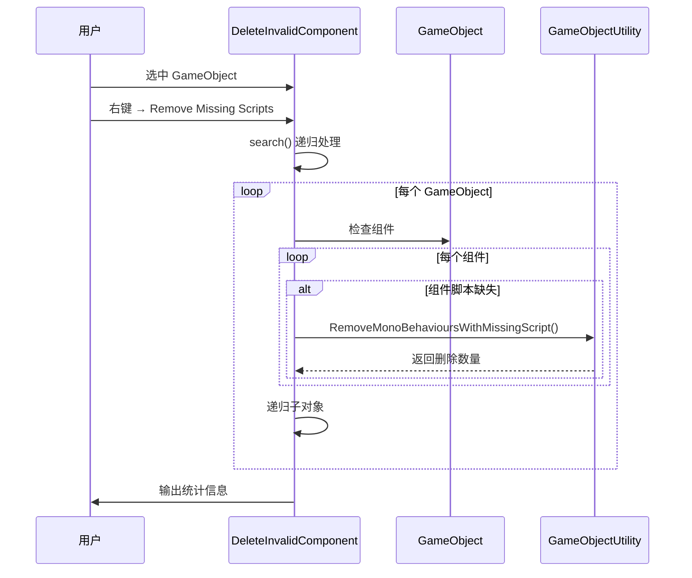

# DeleteInvalidComponent.cs 注解文档

## 文件基本信息

| 属性 | 值 |
|------|-----|
| **文件名** | DeleteInvalidComponent.cs |
| **路径** | Assets/Scripts/Editor/ArtEditor/AssetsManager/DeleteInvalidComponent.cs |
| **所属模块** | Editor → ArtEditor/AssetsManager |
| **文件职责** | 清理 GameObject 上缺失的脚本组件 (Missing Script) |
| **依赖插件** | Odin Inspector |

---

## 类/结构体说明

### DeleteInvalidComponent

| 属性 | 说明 |
|------|------|
| **职责** | 提供 Editor 窗口和菜单命令，批量清理 GameObject 上的 Missing Script 组件 |
| **泛型参数** | 无 |
| **继承关系** | 继承 `EditorWindow` |
| **命名空间** | `TaoTie` |

**设计模式**: Editor 窗口 + 递归遍历 + 批处理

```csharp
// Editor 窗口
public class DeleteInvalidComponent : EditorWindow
{
    enum DeleteType : uint
    {
        None = 1 << 0,
        Script = 1 << 1
    }
    
    DeleteType filterType = DeleteType.None;
    List<GameObject> m_toFilterMeshs = new List<GameObject>();
    static int m_goCount;
    static int m_missingCount;
}
```

---

## 字段与属性

| 名称 | 类型 | 访问级别 | 说明 |
|------|------|----------|------|
| `filterType` | `DeleteType` | `private` | 过滤类型枚举 (当前未使用) |
| `m_toFilterMeshs` | `List<GameObject>` | `private` | 待处理的 GameObject 列表 |
| `m_goCount` | `int` | `static` | 统计处理的 GameObject 总数 |
| `m_missingCount` | `int` | `static` | 统计删除的 Missing Script 数量 |

### DeleteType 枚举

| 值 | 名称 | 说明 |
|----|------|------|
| `1` | `None` | 无过滤 |
| `2` | `Script` | 脚本类型 |

---

## 方法说明

### ShowWindow()

**签名**:
```csharp
[MenuItem("Tools/工具/TA/remove invalid component")]
private static void ShowWindow()
```

**职责**: 打开清理无效组件工具窗口

**核心逻辑**:
```
1. 调用 GetWindow<DeleteInvalidComponent>() 打开窗口
2. 设置窗口标题为 "Mesh Filter"
3. 显示窗口
```

**调用者**: Unity Editor 菜单 "Tools/工具/TA/remove invalid component"

---

### OnGUI()

**签名**:
```csharp
private void OnGUI()
```

**职责**: 绘制窗口 UI 并执行批量清理

**核心逻辑**:
```
1. 记录开始时间
2. 清空待处理列表
3. 绘制"确定"按钮
4. 点击按钮时:
   - 搜索 AssetsPackage 目录下所有 GameObject
   - 添加到 m_toFilterMeshs 列表
   - 调用 search() 递归清理
   - 输出统计信息 (耗时/数量)
```

**调用者**: Unity Editor (窗口绘制时自动调用)

---

### Apply()

**签名**:
```csharp
[MenuItem("GameObject/Remove Missing Scripts")]
static void Apply()
```

**职责**: 清理选中 GameObject 的 Missing Scripts

**核心逻辑**:
```
1. 记录开始时间
2. 重置计数器
3. 遍历选中的 GameObject (Selection.gameObjects)
4. 调用 search() 递归清理
5. 输出统计信息
6. 保存 Assets 和场景
```

**调用者**: Unity Editor 右键菜单 "GameObject/Remove Missing Scripts"

---

### search()

**签名**:
```csharp
static void search(GameObject go)
```

**职责**: 递归搜索并清理 GameObject 及其子对象的 Missing Scripts

**核心逻辑**:
```
1. 计数器 m_goCount++
2. 调用 GameObjectUtility.RemoveMonoBehavioursWithMissingScript(go)
   - 删除所有 Missing Script 组件
   - 返回删除数量
3. 累加删除计数 m_missingCount
4. 递归遍历所有子 Transform
```

**核心 API**: `GameObjectUtility.RemoveMonoBehavioursWithMissingScript()`
- Unity 内置方法，专门用于清理 Missing Script
- 自动删除脚本引用丢失的 MonoBehaviour 组件

**调用者**: `Apply()`, `OnGUI()`

---

## Missing Script 清理流程



---

## 使用示例

### 示例 1: 清理选中对象

```csharp
// 1. 在 Hierarchy 中选中需要清理的 GameObject
// 2. 右键菜单 → Remove Missing Scripts
// 3. 等待处理完成
// 4. 查看 Console 输出

// Console 输出示例:
// Searched in 50 GameObjects, found and removed 12 missing scripts. Took 45.2 ms.
```

### 示例 2: 批量清理整个项目

```csharp
// 1. 打开窗口：Tools/工具/TA/remove invalid component
// 2. 点击"确定"按钮
// 3. 自动扫描 AssetsPackage 目录下所有 GameObject
// 4. 批量清理 Missing Scripts
// 5. 查看统计信息
```

### 示例 3: 代码调用

```csharp
// 清理单个 GameObject 的 Missing Scripts
int removedCount = GameObjectUtility.RemoveMonoBehavioursWithMissingScript(targetGO);
Debug.Log($"Removed {removedCount} missing scripts");
```

---

## 什么是 Missing Script?

**Missing Script** 是指 GameObject 上挂载的 MonoBehaviour 组件，但其对应的脚本文件已被删除或移动，导致 Unity 无法找到脚本定义。

**表现**:
- Inspector 中显示 "Missing (Mono Script)"
- 组件无法编辑
- 可能导致运行时错误

**产生原因**:
1. 脚本文件被删除
2. 脚本文件被移动到其他目录
3. 脚本命名空间/类名被修改
4. 版本控制合并冲突

**解决方案**:
- 使用此工具批量清理
- 或手动在 Inspector 中移除组件

---

## 注意事项

### ⚠️ 依赖插件

此工具使用 Odin Inspector 的 `OdinEditorWindow`，但核心功能 (`Apply()` 方法) 不依赖 Odin。

### ⚠️ 不可逆操作

清理 Missing Script 是不可逆操作，建议：
- 操作前备份场景/预制体
- 确认 Missing Script 确实不需要恢复

### ⚠️ 性能

批量处理大量 GameObject 时可能较慢，建议：
- 分批处理
- 避免在运行时执行

---

## 相关文档

- [ReplaceShader.cs.md](./ReplaceShader.cs.md) - Shader 替换工具
- [MeshManager.cs.md](./MeshManager.cs.md) - 模型处理工具
- [RemoveFace.cs.md](./RemoveFace.cs.md) - 减面工具

---

*文档生成时间：2026-03-02 | Editor 工具文档*
