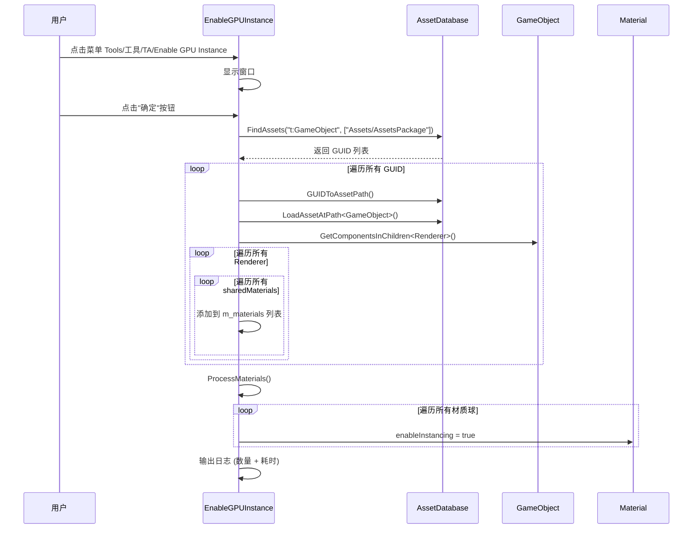

# EnableGPUInstance.cs 注解文档

## 文件基本信息

| 属性 | 值 |
|------|-----|
| **文件名** | EnableGPUInstance.cs |
| **路径** | Assets/Scripts/Editor/ArtEditor/AssetsManager/EnableGPUInstance.cs |
| **所属模块** | Editor 工具 → 美术编辑器 → 资产管理 |
| **文件职责** | 批量启用材质球的 GPU Instancing 功能，优化渲染性能 |

---

## 类/结构体说明

### EnableGPUInstance

| 属性 | 说明 |
|------|------|
| **职责** | Unity Editor 窗口工具，用于批量查找并启用 AssetsPackage 目录下所有材质球的 GPU Instancing |
| **泛型参数** | 无 |
| **继承关系** | 继承自 `EditorWindow` |
| **实现的接口** | 无 |

**设计模式**: Editor 工具窗口模式

```csharp
// Editor 窗口菜单入口
[MenuItem("Tools/工具/TA/Enable GPU Instance")]
private static void ShowWindow()
```

---

## 字段与属性

| 名称 | 类型 | 访问级别 | 说明 |
|------|------|----------|------|
| `m_materials` | `List<Material>` | `private` | 存储找到的所有材质球列表 |

---

## 方法说明

### ShowWindow()

**签名**:
```csharp
[MenuItem("Tools/工具/TA/Enable GPU Instance")]
private static void ShowWindow()
```

**职责**: 创建并显示 Editor 窗口

**核心逻辑**:
```
1. 获取窗口实例 GetWindow<EnableGPUInstance>()
2. 设置窗口标题 "Enable GPU Instance"
3. 显示窗口
```

**调用者**: Unity Editor 菜单点击

---

### OnGUI()

**签名**:
```csharp
private void OnGUI()
```

**职责**: 绘制 Editor 窗口界面，处理用户交互

**核心逻辑**:
```
1. 记录开始时间
2. 清空材质球列表
3. 绘制"确定"按钮
4. 点击按钮时:
   - 搜索 Assets/AssetsPackage 目录下所有 GameObject
   - 获取每个 GameObject 的所有 Renderer 组件
   - 收集所有材质球到 m_materials 列表
   - 调用 ProcessMaterials() 启用 GPU Instancing
   - 记录并输出耗时
```

**调用者**: Unity Editor 自动调用

**被调用者**: `ProcessMaterials()`

---

### ProcessMaterials()

**签名**:
```csharp
void ProcessMaterials()
```

**职责**: 遍历所有材质球，启用 GPU Instancing

**核心逻辑**:
```
1. 遍历 m_materials 列表
2. 对每个材质球设置 material.enableInstancing = true
```

**调用者**: `OnGUI()`

---

## 核心流程

### GPU Instancing 启用流程



---

## 使用示例

### 使用场景

当项目中有大量相同材质球的渲染对象时，启用 GPU Instancing 可以显著降低 DrawCall，提升渲染性能。

### 操作步骤

1. 在 Unity Editor 中，点击菜单 `Tools` → `工具` → `TA` → `Enable GPU Instance`
2. 在弹出的窗口中点击"确定"按钮
3. 等待处理完成，查看 Console 输出的日志

### 输出日志示例

```
found and enable 1250 material's GPU Instance. Took 3542.5 ms.
```

---

## 技术要点

### GPU Instancing 原理

GPU Instancing 是 Unity 的渲染优化技术，允许 GPU 在一次 DrawCall 中渲染多个使用相同材质球的对象。

**适用场景**:
- 大量相同材质的物体（如草地、树木、子弹等）
- 静态或动态批处理无法优化的场景

**启用条件**:
- 材质球必须支持 GPU Instancing
- 对象使用相同的材质球实例
- 着色器支持 instancing

### 性能影响

| 优化前 | 优化后 |
|--------|--------|
| 每个物体一个 DrawCall | 相同材质的物体共享 DrawCall |
| CPU 提交开销大 | CPU 开销显著降低 |
| 大量重复状态设置 | 状态设置一次性完成 |

---

## 注意事项

### ⚠️ 使用限制

| 问题 | 说明 | 解决方案 |
|------|------|----------|
| **材质球变体** | 不同材质球实例无法合并 | 确保使用相同的材质球资源 |
| **着色器支持** | 部分着色器不支持 instancing | 检查材质球 Inspector 中的"Enable GPU Instancing"选项 |
| **动态对象** | 移动/旋转/缩放不同的对象可以 instancing | 通过 MaterialPropertyBlock 传递差异数据 |

### 💡 最佳实践

```csharp
// ✅ 推荐：在材质球导入后自动启用
// 可以在 AssetPostprocessor 中自动处理

// ✅ 检查材质球是否支持 instancing
if (material.SupportsInstancing())
{
    material.enableInstancing = true;
}

// ✅ 使用 MaterialPropertyBlock 传递差异化数据
var block = new MaterialPropertyBlock();
block.SetColor("_Color", color);
renderer.SetPropertyBlock(block);
```

---

## 相关文档

- [Unity GPU Instancing 官方文档](https://docs.unity3d.com/Manual/GPUInstancing.html)
- [AssetsManagerConfig.cs.md](./Config/AssetsManagerConfig.cs.md) - 资产管理配置
- [ResourceCheckTool.cs.md](../Resource/ResourceCheckTool.cs.md) - 资源检查工具

---

*文档生成时间：2026-03-02 | OpenClaw AI 助手*
