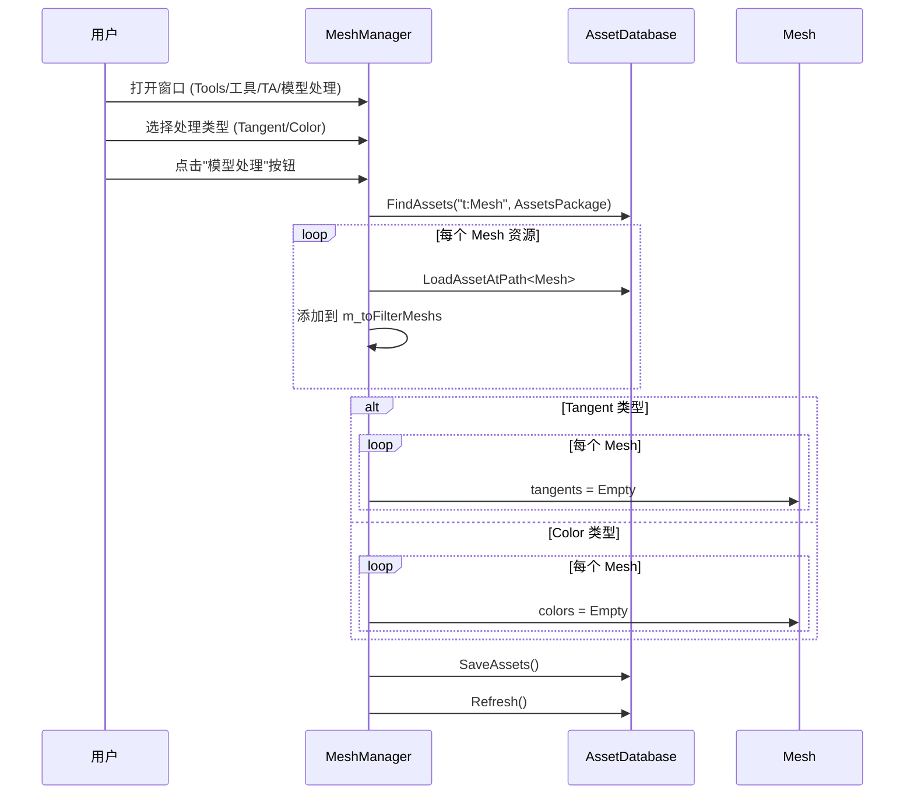

# MeshManager.cs 注解文档

## 文件基本信息

| 属性 | 值 |
|------|-----|
| **文件名** | MeshManager.cs |
| **路径** | Assets/Scripts/Editor/ArtEditor/AssetsManager/MeshManager.cs |
| **所属模块** | Editor → ArtEditor/AssetsManager |
| **文件职责** | 网格数据处理工具 - 清理切线/颜色等顶点属性 |
| **依赖插件** | Odin Inspector |

---

## 类/结构体说明

### MeshManager

| 属性 | 说明 |
|------|------|
| **职责** | 提供 Editor 窗口，批量处理 Mesh 的顶点属性 (切线/颜色/法线) |
| **泛型参数** | 无 |
| **继承关系** | 继承 `EditorWindow` |
| **命名空间** | `TaoTie` |

**设计模式**: Editor 窗口 + 位掩码枚举 + 批处理

```csharp
// Editor 窗口
public class MeshManager : EditorWindow
{
    enum FilterType : uint
    {
        None = 1 << 0,    // 无
        Normal = 1 << 1,  // 法线
        Tangent = 1 << 2, // 切线
        Color = 1 << 3    // 颜色
    }
    
    FilterType filterType = FilterType.None;
    List<Mesh> m_toFilterMeshs = new List<Mesh>();
}
```

---

## 字段与属性

### FilterType 枚举

| 值 | 名称 | 说明 |
|----|------|------|
| `1` | `None` | 无处理 |
| `2` | `Normal` | 法线处理 |
| `4` | `Tangent` | 切线处理 |
| `8` | `Color` | 颜色处理 |

**位掩码设计**: 支持多选组合 (如 `Tangent | Color = 12`)

### 字段说明

| 名称 | 类型 | 访问级别 | 说明 |
|------|------|----------|------|
| `filterType` | `FilterType` | `private` | 当前选择的处理类型 |
| `m_toFilterMeshs` | `List<Mesh>` | `private` | 待处理的 Mesh 列表 |

---

## 方法说明

### ShowWindow()

**签名**:
```csharp
[MenuItem("Tools/工具/TA/模型处理")]
private static void ShowWindow()
```

**职责**: 打开模型处理工具窗口

**核心逻辑**:
```
1. 调用 GetWindow<MeshManager>() 打开窗口
2. 设置窗口标题为 "Mesh Filter"
3. 显示窗口
```

**调用者**: Unity Editor 菜单 "Tools/工具/TA/模型处理"

---

### OnGUI()

**签名**:
```csharp
private void OnGUI()
```

**职责**: 绘制窗口 UI 并执行处理

**核心逻辑**:
```
1. 清空待处理列表
2. 调用 ChooseFilterType() 绘制类型选择
3. 调用 DoMeshFilter() 绘制处理按钮
4. 保存 Assets 和刷新数据库
```

**调用者**: Unity Editor (窗口绘制时自动调用)

---

### ChooseFilterType()

**签名**:
```csharp
private void ChooseFilterType()
```

**职责**: 绘制处理类型选择 UI

**核心逻辑**:
```
1. 绘制水平布局
2. 显示标签"处理类型"
3. 使用 EditorGUILayout.EnumPopup 显示 FilterType 枚举选择
4. 支持位掩码多选
```

**调用者**: `OnGUI()`

---

### DoMeshFilter()

**签名**:
```csharp
private void DoMeshFilter()
```

**职责**: 绘制处理按钮并执行 Mesh 处理

**核心逻辑**:
```
1. 绘制水平布局
2. 绘制"模型处理"按钮
3. 点击按钮时:
   - 搜索 AssetsPackage 目录下所有 Mesh
   - 加载并添加到 m_toFilterMeshs 列表
   - 根据 filterType 调用对应处理方法
4. 处理类型分支:
   - Normal: 未实现
   - Tangent: 调用 DoProcessTangent()
   - Color: 调用 DoProcessColor()
   - Default: 记录错误日志
```

**调用者**: `OnGUI()`

---

### DoProcessTangent()

**签名**:
```csharp
private void DoProcessTangent()
```

**职责**: 清理所有 Mesh 的切线数据

**核心逻辑**:
```
1. 遍历 m_toFilterMeshs 列表
2. 检查 mesh.tangents.Length > 0
3. 如果存在切线 → 设置为空数组 Array.Empty<Vector4>()
```

**效果**: 移除 Mesh 的所有切线信息，减小文件大小

**调用者**: `DoMeshFilter()`

---

### DoProcessColor()

**签名**:
```csharp
private void DoProcessColor()
```

**职责**: 清理所有 Mesh 的顶点颜色数据

**核心逻辑**:
```
1. 遍历 m_toFilterMeshs 列表
2. 检查 mesh.colors.Length > 0
3. 如果存在颜色 → 设置为空数组 Array.Empty<Color>()
```

**效果**: 移除 Mesh 的所有顶点颜色信息，减小文件大小

**调用者**: `DoMeshFilter()`

---

## Mesh 处理流程



---

## 使用示例

### 示例 1: 清理切线数据

```csharp
// 1. 打开窗口：Tools/工具/TA/模型处理
// 2. 在"处理类型"下拉框选择"Tangent"
// 3. 点击"模型处理"按钮
// 4. 等待处理完成
// 5. 所有 Mesh 的切线数据被清空
```

### 示例 2: 清理顶点颜色

```csharp
// 1. 打开窗口：Tools/工具/TA/模型处理
// 2. 在"处理类型"下拉框选择"Color"
// 3. 点击"模型处理"按钮
// 4. 等待处理完成
// 5. 所有 Mesh 的顶点颜色被清空
```

### 示例 3: 代码调用

```csharp
// 手动清理单个 Mesh 的切线
var mesh = targetMesh;
if (mesh.tangents.Length > 0)
{
    mesh.tangents = Array.Empty<Vector4>();
    EditorUtility.SetDirty(mesh);
    AssetDatabase.SaveAssetIfDirty(mesh);
}

// 手动清理单个 Mesh 的颜色
if (mesh.colors.Length > 0)
{
    mesh.colors = Array.Empty<Color>();
    EditorUtility.SetDirty(mesh);
    AssetDatabase.SaveAssetIfDirty(mesh);
}
```

---

## 为什么要清理顶点属性?

### 切线 (Tangent)

**用途**: 用于法线贴图计算，定义 UV 方向

**清理场景**:
- 模型不需要法线贴图
- 使用自定义着色器不依赖切线
- 减小模型文件大小
- 优化内存占用

### 顶点颜色 (Color)

**用途**: 存储顶点级别的颜色信息，用于特殊效果

**清理场景**:
- 模型不使用顶点颜色
- 使用贴图代替颜色信息
- 减小模型文件大小
- 避免意外影响材质

### 法线 (Normal)

**用途**: 定义顶点朝向，用于光照计算

**注意**: 当前代码中 `Normal` 类型未实现处理逻辑

---

## 注意事项

### ⚠️ 不可逆操作

清理顶点属性是不可逆的：
- 切线/颜色数据一旦删除无法恢复
- 操作前建议备份重要模型
- 确认模型确实不需要这些属性

### ⚠️ 影响范围

此工具处理 `Assets/AssetsPackage` 目录下**所有** Mesh：
- 可能影响大量模型
- 建议先在小范围测试
- 确认无误后再批量处理

### ⚠️ 法线处理未实现

`FilterType.Normal` 枚举值已定义，但 `DoMeshFilter()` 中未实现对应逻辑。

---

## 相关文档

- [ReplaceShader.cs.md](./ReplaceShader.cs.md) - Shader 替换工具
- [DeleteInvalidComponent.cs.md](./DeleteInvalidComponent.cs.md) - 无效组件清理工具
- [RemoveFace.cs.md](./RemoveFace.cs.md) - 减面工具

---

*文档生成时间：2026-03-02 | Editor 工具文档*
