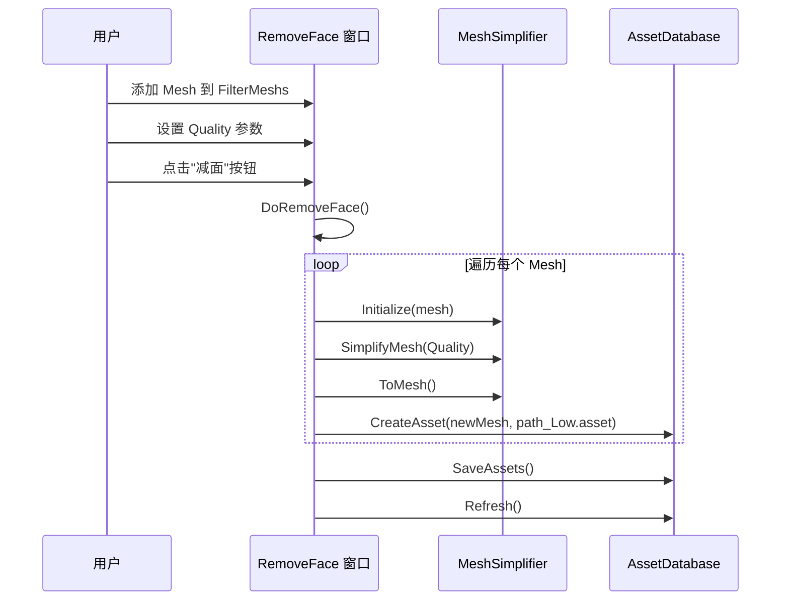

# RemoveFace.cs 注解文档

## 文件基本信息

| 属性 | 值 |
|------|-----|
| **文件名** | RemoveFace.cs |
| **路径** | Assets/Scripts/Editor/ArtEditor/AssetsManager/RemoveFace.cs |
| **所属模块** | Editor → ArtEditor/AssetsManager |
| **文件职责** | 美术编辑器工具 - 网格减面处理窗口 (需 Odin Inspector) |
| **编译条件** | `#if ODIN_INSPECTOR` (需安装 Odin Inspector 插件) |

---

## 类/结构体说明

### RemoveFace

| 属性 | 说明 |
|------|------|
| **职责** | 提供 Unity Editor 窗口，用于批量处理 Mesh 减面 (LOD 生成) |
| **泛型参数** | 无 |
| **继承关系** | 继承 `OdinEditorWindow` |
| **命名空间** | `TaoTie` |

**设计模式**: Editor 窗口 + 批处理

```csharp
// Odin Editor 窗口
public class RemoveFace : OdinEditorWindow
{
    [Range(0f, 1f)]
    public float Quality = 1;  // 减面质量 (0-1)
    public List<Mesh> FilterMeshs = new List<Mesh>();  // 待处理的 Mesh 列表
}
```

---

## 字段与属性

| 名称 | 类型 | 访问级别 | 说明 |
|------|------|----------|------|
| `Quality` | `float` | `public` | 减面质量参数，范围 0-1 (1=原始质量，0=最低质量) |
| `FilterMeshs` | `List<Mesh>` | `public` | 待处理的 Mesh 列表，由用户在窗口中指定 |

---

## 方法说明

### OpenWindow()

**签名**:
```csharp
[MenuItem("Tools/工具/TA/减面", false, 160)]
public static void OpenWindow()
```

**职责**: 打开减面工具窗口

**核心逻辑**:
```
1. 调用 GetWindow(typeof(RemoveFace)) 打开窗口
```

**调用者**: Unity Editor 菜单 "Tools/工具/TA/减面"

---

### Process()

**签名**:
```csharp
[Button("减面")]
private void Process()
```

**职责**: 执行减面处理按钮回调

**核心逻辑**:
```
1. 调用 DoRemoveFace() 执行减面
```

**调用者**: Odin Inspector 按钮点击事件

---

### DoRemoveFace()

**签名**:
```csharp
private void DoRemoveFace()
```

**职责**: 执行网格减面处理

**核心逻辑**:
```
1. 遍历 FilterMeshs 列表中的每个 Mesh
2. 检查 Mesh 是否为 null → 是则记录错误日志
3. 创建 MeshSimplifier 并初始化 Mesh
4. 调用 SimplifyMesh(Quality) 执行减面
5. 导出简化后的 Mesh: ToMesh()
6. 生成新文件路径：原路径 + "_Low.asset"
7. 创建新 Asset: AssetDatabase.CreateAsset()
8. 保存 Assets 和刷新数据库
9. 保存打开的场景
```

**依赖库**: `UnityMeshSimplifier` (第三方网格简化库)

**使用示例**:
```csharp
// 1. 打开窗口：Tools/工具/TA/减面
// 2. 在 FilterMeshs 列表中添加需要减面的 Mesh
// 3. 调整 Quality 参数 (0-1)
// 4. 点击"减面"按钮
// 5. 生成 Low 版本 Mesh 文件 (原文件名_Low.asset)
```

---

## 减面处理流程



---

## 使用示例

### 示例 1: 批量生成 LOD 网格

```csharp
// 1. 打开减面窗口
// 菜单：Tools/工具/TA/减面

// 2. 在 Inspector 中添加需要减面的 Mesh
// 将 Mesh 资源拖拽到 FilterMeshs 列表

// 3. 设置减面质量
// Quality = 0.5f (50% 面数)

// 4. 点击"减面"按钮
// 自动生成 xxx_Low.asset 文件
```

### 示例 2: 代码调用减面

```csharp
// 注意：此功能需 Odin Inspector 插件
// 且当前代码已被注释 (#if ODIN_INSPECTOR)

var window = GetWindow<RemoveFace>();
window.Quality = 0.3f;
window.FilterMeshs.Add(targetMesh);
window.DoRemoveFace();
```

---

## 注意事项

### ⚠️ 编译条件

此文件使用条件编译，仅在安装 Odin Inspector 时可用：

```csharp
#if ODIN_INSPECTOR
// ... 代码 ...
#endif
```

### ⚠️ 依赖库

需要 `UnityMeshSimplifier` 库支持：
- GitHub: https://github.com/Whinarn/UnityMeshSimplifier
- 用于执行网格简化算法

### ⚠️ 文件命名

生成的低模文件命名规则：
```
原文件：Assets/Models/Character.asset
生成：Assets/Models/Character_Low.asset
```

---

## 相关文档

- [MeshManager.cs.md](./MeshManager.cs.md) - 模型处理工具 (切线/颜色处理)
- [AssetsManagerConfig.cs.md](./Config/AssetsManagerConfig.cs.md) - 资产管理配置
- [AssetsManagerWindow.cs.md](./AssetsManagerWindow.cs.md) - 模型库窗口

---

*文档生成时间：2026-03-02 | Editor 工具文档*
