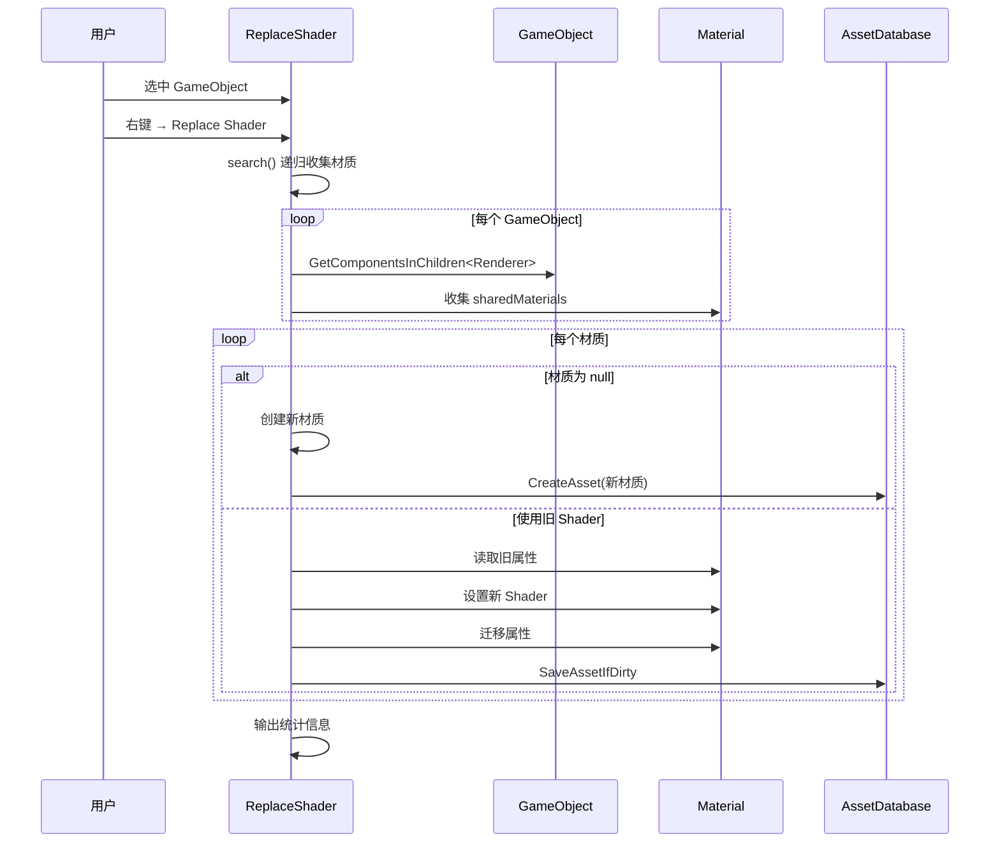

# ReplaceShader.cs 注解文档

## 文件基本信息

| 属性 | 值 |
|------|-----|
| **文件名** | ReplaceShader.cs |
| **路径** | Assets/Scripts/Editor/ArtEditor/AssetsManager/ReplaceShader.cs |
| **所属模块** | Editor → ArtEditor/AssetsManager |
| **文件职责** | 材质 Shader 批量替换工具，支持材质属性迁移 |

---

## 类/结构体说明

### ReplaceShader

| 属性 | 说明 |
|------|------|
| **职责** | 批量替换 GameObject 上的材质 Shader，并迁移材质属性 |
| **泛型参数** | 无 |
| **继承关系** | 继承 `EditorWindow` |
| **命名空间** | 全局命名空间 |

**设计模式**: Editor 窗口 + 递归遍历 + 批处理

```csharp
// Editor 窗口
public class ReplaceShader : EditorWindow
{
    static int m_goCount;        // 处理的 GameObject 数量
    static int m_materialCount;  // 处理的材质数量
}
```

---

## 字段与属性

| 名称 | 类型 | 访问级别 | 说明 |
|------|------|----------|------|
| `m_goCount` | `int` | `static` | 统计处理的 GameObject 总数 |
| `m_materialCount` | `int` | `static` | 统计处理的材质总数 |

---

## 方法说明

### Apply()

**签名**:
```csharp
[MenuItem("GameObject/Replace Shader")]
static void Apply()
```

**职责**: 替换选中 GameObject 的材质 Shader (从 URP Lit 到 Elysia/S_ForwardLightPixel)

**核心逻辑**:
```
1. 记录开始时间
2. 遍历选中的 GameObject (Selection.gameObjects)
3. 递归搜索所有子对象的 Renderer 组件
4. 收集所有材质到 materials 列表
5. 查找目标 Shader: "Elysia/S_ForwardLightPixel"
6. 查找源 Shader: "Universal Render Pipeline/Lit"
7. 遍历材质列表:
   - 如果材质为 null → 创建新材质
   - 如果材质使用旧 Shader → 迁移属性到新 Shader
8. 记录处理统计信息 (耗时/数量)
9. 保存 Assets 和场景
```

**Shader 属性迁移映射**:

| 旧 Shader 属性 | 新 Shader 属性 | 说明 |
|---------------|---------------|------|
| `_MainTex` | `_BaseColorTex` | 主纹理 |
| `_BumpMap` | `_NormalTex` | 法线贴图 |
| `_EmissionMap` | `_EmissionTex` | 自发光贴图 |
| `_BaseColor` | `_BaseColorTint` | 基础颜色 |
| `_EmissionColor` | `_EmissionTint` | 自发光颜色 |
| `_Cutoff` | `_AlphaCut` | 透明度阈值 |
| `1 - _Smoothness` | `_RoughnessScale` | 粗糙度 (反向) |
| `_Metallic` | `_MetallicScale` | 金属度 |
| `Specular` | `_SpecularScale` | 高光 |
| `_BumpScale` | `_NormalScale` | 法线强度 |
| `_OcclusionStrength` | `_AOScale` | 环境光遮蔽 |

**调用者**: Unity Editor 右键菜单 "GameObject/Replace Shader"

---

### search()

**签名**:
```csharp
static void search(GameObject go, ref List<Material> materials)
```

**职责**: 递归搜索 GameObject 及其子对象的所有材质

**核心逻辑**:
```
1. 计数器 m_goCount++
2. 获取所有 Renderer 组件 (GetComponentsInChildren<Renderer>)
3. 收集所有 sharedMaterials
4. 累加材质计数 m_materialCount
5. 添加到 materials 列表
6. 递归遍历所有子 Transform
```

**调用者**: `Apply()`

---

### ComputeAssetHash()

**签名**:
```csharp
static string ComputeAssetHash(string assetPath)
```

**职责**: 计算资源文件的 MD5 哈希值 (包含依赖项)

**核心逻辑**:
```
1. 检查文件是否存在
2. 读取资源文件字节
3. 读取 .meta 文件字节
4. 获取所有依赖项 (AssetDatabase.GetDependencies)
5. 读取每个依赖项的字节和 meta
6. 计算 MD5 哈希
7. 返回十六进制字符串
```

**调用者**: 材质创建时生成唯一文件名

---

### GetAssetBytes()

**签名**:
```csharp
static byte[] GetAssetBytes(string assetPath)
```

**职责**: 读取资源文件及其 meta 文件的字节数组

**核心逻辑**:
```
1. 检查文件是否存在
2. 读取资源文件字节
3. 读取 .meta 文件字节
4. 合并返回
```

**调用者**: `ComputeAssetHash()`

---

### ComputeHash()

**签名**:
```csharp
static string ComputeHash(byte[] buffer)
```

**职责**: 计算字节数组的 MD5 哈希值

**核心逻辑**:
```
1. 检查 buffer 有效性
2. 使用 MD5.ComputeHash()
3. 转换为十六进制字符串
4. 返回结果
```

**调用者**: `ComputeAssetHash()`

---

### CalculateMD5Hash()

**签名**:
```csharp
public static string CalculateMD5Hash(string input)
```

**职责**: 计算字符串的 MD5 哈希值

**核心逻辑**:
```
1. 创建 MD5 实例
2. 将输入字符串编码为 UTF-8 字节
3. 计算哈希值
4. 转换为十六进制字符串
5. 返回结果
```

**调用者**: 创建新材质时生成唯一文件名

**使用示例**:
```csharp
string hash = CalculateMD5Hash("Packages/com.p4.artresource/Material/" + DateTime.Now);
// 返回： "a1b2c3d4e5f6..." (32 字符十六进制)
```

---

## Shader 替换流程



---

## 使用示例

### 示例 1: 批量替换 Shader

```csharp
// 1. 在 Hierarchy 中选中需要处理的 GameObject
// 2. 右键菜单 → Replace Shader
// 3. 等待处理完成
// 4. 查看 Console 输出统计信息

// Console 输出示例:
// Searched in 150 GameObjects, found and replace 45 materials. Took 234.5 ms.
```

### 示例 2: 代码调用

```csharp
// 获取目标 GameObject
var go = Selection.activeGameObject;

// 调用替换方法 (需手动触发菜单或反射调用)
// 注意：Apply() 是静态方法，通过菜单触发
```

---

## 注意事项

### ⚠️ Shader 依赖

此工具假设项目中存在以下 Shader：
- **源 Shader**: `Universal Render Pipeline/Lit` (URP 标准 Lit Shader)
- **目标 Shader**: `Elysia/S_ForwardLightPixel` (自定义 Shader)

如果 Shader 不存在，会记录错误日志。

### ⚠️ 材质属性映射

属性迁移基于特定 Shader 的属性名称映射。如果目标 Shader 属性名称不同，需要修改映射代码。

### ⚠️ 文件生成

新创建的材质保存在 `Assets/Materials/` 目录，文件名使用 MD5 哈希确保唯一性。

### ⚠️ 性能

处理大量 GameObject 时可能较慢，建议分批处理。

---

## 相关文档

- [MeshManager.cs.md](./MeshManager.cs.md) - 模型处理工具
- [DeleteInvalidComponent.cs.md](./DeleteInvalidComponent.cs.md) - 无效组件清理工具
- [AssetsManagerWindow.cs.md](./AssetsManagerWindow.cs.md) - 模型库窗口

---

*文档生成时间：2026-03-02 | Editor 工具文档*
