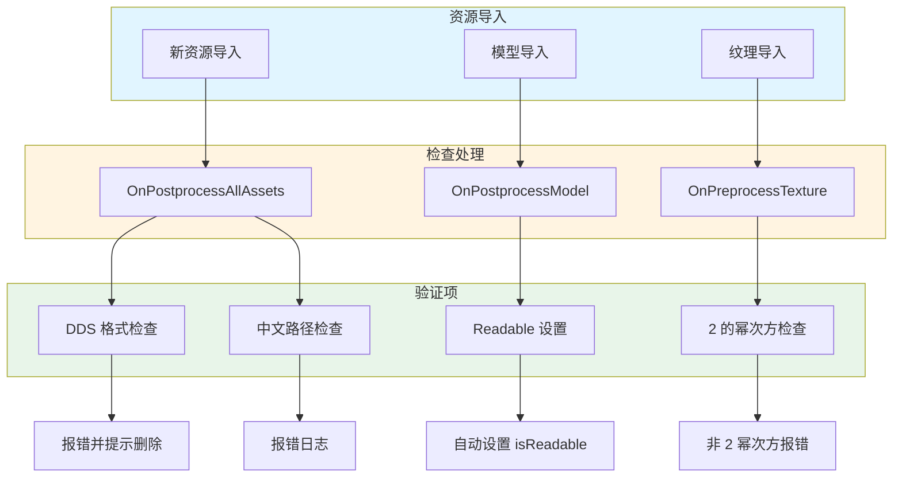

# AssetImportMgr.cs 文档

> **文件路径**: `Assets/Scripts/Editor/ArtEditor/Atlas/AssetImportMgr.cs`  
> **命名空间**: `TaoTie`  
> **文档生成时间**: 2026-03-02  
> **文件类型**: Unity 资源导入处理器

---

## 📋 文件信息表

| 属性 | 值 |
|------|------|
| **类名** | `AssetImportMgr` |
| **基类** | `AssetPostprocessor` |
| **所在程序集** | Editor |
| **依赖命名空间** | `UnityEditor`, `UnityEngine`, `System.IO`, `System.Text.RegularExpressions` |
| **功能分类** | 资源导入规范检查 |

---

## 🎯 类说明

**核心职责**: 在资源导入时自动检查和规范资源设置，确保符合项目规范。

**解决的核心问题**: 
- 防止 DDS 格式纹理导入 (不支持)
- 检测路径中的中文字符
- 自动设置模型的可读性 (Readable)
- 检查纹理尺寸是否为 2 的幂次方

**如果没有这个模块**: 资源规范需要人工检查，容易遗漏导致运行时问题。

---

## 📦 字段与属性

| 字段名 | 类型 | 说明 |
|--------|------|------|
| `pattern` | `static string` | 中文字符正则表达式 `[\u4e00-\u9fbb]` |

---

## 🔧 方法说明

### 静态回调方法

#### OnPostprocessAllAssets()
```csharp
static void OnPostprocessAllAssets(
    string[] importedAssets,
    string[] deletedAssets,
    string[] movedAssets,
    string[] movedFromAssetPaths)
```
**功能**: 资源导入/删除/移动后的统一检查  
**检查项**:
1. **DDS 格式检查**: 发现 .dds 文件报错并提示删除
2. **空格检查**: 路径包含空格时记录 (当前已注释)
3. **中文检查**: 路径包含中文时报错

**触发时机**: 任何资源导入、删除、移动操作后自动触发

---

### 实例回调方法

#### OnPostprocessModel()
```csharp
public void OnPostprocessModel(GameObject o)
```
**功能**: 模型导入后自动处理  
**逻辑**:
1. 检查路径是否包含 "Assets"
2. 检查路径是否包含 "ReadEnable"
3. 根据路径设置 `ModelImporter.isReadable`
4. 如有变更则保存并重新导入

**应用场景**: 需要读取模型顶点数据的资源放在 "ReadEnable" 目录

---

#### OnPreprocessTexture()
```csharp
public void OnPreprocessTexture()
```
**功能**: 纹理导入前自动检查  
**检查项**:
1. 排除立方体贴图 (TextureCube)
2. 检查 AssetsPackage 目录下 (UI 除外) 的纹理
3. 验证纹理尺寸是否为宽高相同的 2 的幂次方

**报错条件**: 
- 非 UI 资源
- 在 AssetsPackage 目录下
- 尺寸不是 2 的幂次方或宽高不同

---

## 🔄 核心流程图



---

## 💡 使用示例

### 模型可读性自动设置
```
目录结构:
Assets/AssetsPackage/Character/ReadEnable/hero.fbx  → isReadable = true
Assets/AssetsPackage/Character/hero.fbx             → isReadable = false

操作: 将模型放入对应目录，导入时自动设置
```

### 纹理尺寸规范
```
合规纹理:
- 512x512 ✓
- 1024x1024 ✓
- 2048x2048 ✓

违规纹理 (会报错):
- 512x256 ✗ (宽高不同)
- 600x600 ✗ (不是 2 的幂次方)
- 1024x512 ✗ (宽高不同)
```

### 路径规范检查
```
违规路径 (会报错):
- Assets/AssetsPackage/角色/hero.png  (包含中文)
- Assets/AssetsPackage/Textures/hero.dds  (DDS 格式)

合规路径:
- Assets/AssetsPackage/Character/hero.png
- Assets/AssetsPackage/UI/Textures/icon.png  (UI 资源豁免 2 幂次方检查)
```

---

## 🔗 相关文档链接

| 文档 | 说明 |
|------|------|
| [AltasEditor.cs](../AltasEditor.cs.md) | 编辑器工具集 |
| [AtlasHelper.cs](./AtlasHelper.cs.md) | 图集处理工具 |
| [ImportUtil.cs](../../Common/Helper/ImportUtil.cs.md) | 导入工具类 |

---

## ⚠️ 注意事项

| 问题 | 说明 | 解决方案 |
|------|------|----------|
| **DDS 格式** | 项目不支持 DDS | 转换为 PNG/TGA 格式 |
| **中文路径** | 可能导致跨平台问题 | 使用英文路径命名 |
| **2 的幂次方** | UI 资源豁免 | UI 散图可放宽要求 |
| **Readable 设置** | 增加内存占用 | 仅在需要时放入 ReadEnable 目录 |

---

*文档由 OpenClaw AI 助手自动生成 | 基于静态代码分析*
