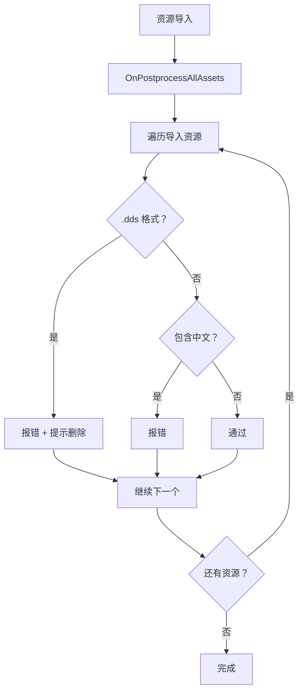
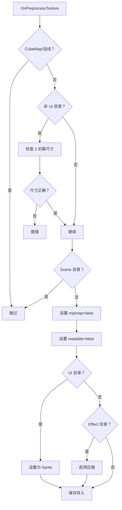

# AssetImportMgr.cs 注解文档

## 文件基本信息

| 属性 | 值 |
|------|-----|
| **文件名** | AssetImportMgr.cs |
| **路径** | Assets/Scripts/Editor/ArtEditor/Atlas/AssetImportMgr.cs |
| **所属模块** | Editor → ArtEditor/Atlas |
| **文件职责** | 资源导入自动化管理与校验 |

---

## 类说明

### AssetImportMgr

| 属性 | 说明 |
|------|------|
| **职责** | Unity 资源导入处理器，自动校验和配置导入的资源 (模型、纹理等) |
| **类型** | `AssetPostprocessor` |
| **命名空间** | `TaoTie` |

**继承关系**:
```
AssetPostprocessor → ScriptableObject → Object
```

**设计模式**: 事件处理器模式

**触发时机**:
- 资源导入时自动触发
- 资源删除时自动触发
- 资源移动时自动触发

---

## 常量说明

| 名称 | 类型 | 值 | 说明 |
|------|------|-----|------|
| `pattern` | `string` | `"[\u4e00-\u9fbb]"` | 中文字符正则表达式 |

---

## 回调方法说明

### OnPostprocessAllAssets

**签名**:
```csharp
static void OnPostprocessAllAssets(
    string[] importedAssets,
    string[] deletedAssets,
    string[] movedAssets,
    string[] movedFromAssetPaths)
```

**职责**: 资源批量导入后的校验处理

**触发时机**: 任何资源导入/删除/移动操作完成后

**核心逻辑**:
```
1. 遍历所有导入的资源
2. 检查 .dds 格式 → 报错并提示删除
3. 检查路径空格 → 警告 (已注释)
4. 检查中文路径 → 报错
```

**校验规则**:

| 检查项 | 规则 | 处理 |
|--------|------|------|
| DDS 格式 | 不支持 .dds | 报错 + 弹窗提示删除 |
| 路径空格 | 不能包含空格 | 警告 (当前已注释) |
| 中文字符 | 路径不能包含中文 | 报错 |

**使用示例**:
```
// 当导入 texture.dds 时:
// 控制台输出：纹理不支持.dds，请用其它格式:Assets/.../texture.dds
// 弹窗提示：纹理不支持.dds，请转为 png、tga 等其它格式，或者删除
```

---

### OnPostprocessModel

**签名**:
```csharp
public void OnPostprocessModel(GameObject o)
```

**职责**: 模型导入后的处理

**触发时机**: 模型资源 (.fbx, .obj 等) 导入完成后

**核心逻辑**:
```
1. 检查路径是否包含 "Assets"
2. 获取 ModelImporter
3. 检查路径是否包含 "ReadEnable"
   - 是：设置 isReadable = true
   - 否：设置 isReadable = false
4. 如果有变化，保存并重新导入
```

**Readable 规则**:
| 路径包含 | isReadable | 说明 |
|----------|-----------|------|
| `ReadEnable` | `true` | 需要读取模型数据 (如运行时修改网格) |
| 其他 | `false` | 默认不可读 (节省内存) |

---

### OnPreprocessTexture

**签名**:
```csharp
public void OnPreprocessTexture()
```

**职责**: 纹理导入前的预处理

**触发时机**: 纹理资源导入前

**核心逻辑**:
```
1. 检查路径有效性
2. 跳过 CubeMap 和法线贴图
3. 检查非 UI 资源尺寸 (必须为 2 的幂次方且宽高相同)
4. 跳过 Scene 目录 (光照贴图等特殊资源)
5. 强制设置:
   - mipmapEnabled = false
   - isReadable = false
6. UI 资源自动设置为 Sprite 类型
7. Effect 资源启用压缩
8. 保存并重新导入
```

**校验规则**:

### 尺寸校验 (非 UI 资源)

```csharp
// 检查条件：Assets/AssetsPackage 且不在 UI 目录
if (!assetPath.Contains("Assets/AssetsPackage/UI") && 
    assetPath.Contains("Assets/AssetsPackage"))
{
    // 必须为 2 的幂次方且宽高相同
    if (!ImportUtil.WidthAndHeightIsPowerOfTwo(width, height) || 
        width != height)
    {
        Debug.LogError("检测到纹理尺寸不为宽高相同的 2 的幂次方");
    }
}
```

### 类型自动设置

| 路径 | 自动设置 |
|------|---------|
| `Assets/AssetsPackage/UI` | TextureImporterType.Sprite |
| `Assets/AssetsPackage/Effect` | 启用压缩 |
| `Scene/` | 跳过处理 (光照贴图等) |
| 法线贴图 | 跳过处理 |

### 强制设置

| 属性 | 值 | 说明 |
|------|-----|------|
| `mipmapEnabled` | `false` | 禁用 MIP 映射 |
| `isReadable` | `false` | 禁用 CPU 读取 |

---

## Mermaid 流程图

### 资源导入校验流程



### 纹理预处理流程



---

## 使用示例

### 自动校验示例

**场景 1: 导入 DDS 纹理**
```
操作：将 texture.dds 放入 Assets/AssetsPackage/Textures/
结果：
  - 控制台：纹理不支持.dds，请用其它格式:Assets/AssetsPackage/Textures/texture.dds
  - 弹窗：提示删除文件
```

**场景 2: 导入中文路径资源**
```
操作：将图片放入 Assets/AssetsPackage/纹理/image.png
结果：
  - 控制台：路径不能包含中文：Assets/AssetsPackage/纹理/image.png
```

**场景 3: 导入非 2 的幂纹理**
```
操作：导入 100x100 的纹理到 Assets/AssetsPackage/Textures/
结果：
  - 控制台：检测到纹理尺寸不为宽高相同的 2 的幂次方 路径 = Assets/...
```

**场景 4: 导入模型**
```
操作：导入 model.fbx
默认：isReadable = false

操作：导入 model.fbx 到 Assets/Models/ReadEnable/
结果：isReadable = true (可读取网格数据)
```

---

## 注意事项

### 性能考虑

- `OnPostprocessAllAssets` 是静态方法，批量处理所有资源
- `OnPreprocessTexture` 对每个纹理单独调用
- 使用 `SaveAndReimport()` 会触发重新导入，谨慎使用

### 兼容性

- 尺寸校验仅针对 `Assets/AssetsPackage` 目录
- Scene 目录的资源被排除 (光照贴图等特殊格式)
- UI 资源自动转为 Sprite 类型以支持图集打包

### 扩展建议

- 路径空格检查当前已注释，可根据需要启用
- 可添加更多格式校验 (如音频、视频等)
- 可添加自动修复功能 (如自动转换 DDS 为 PNG)

---

## 相关文档链接

- [AtlasHelper.cs.md](./AtlasHelper.cs.md) - 图集生成工具
- [ImportUtil.cs](../../Common/Helper/ImportUtil.cs) - 导入工具类
- [Unity AssetPostprocessor 官方文档](https://docs.unity3d.com/ScriptReference/AssetPostprocessor.html)

---

*文档生成时间：2026-03-02 | OpenClaw AI 助手*
