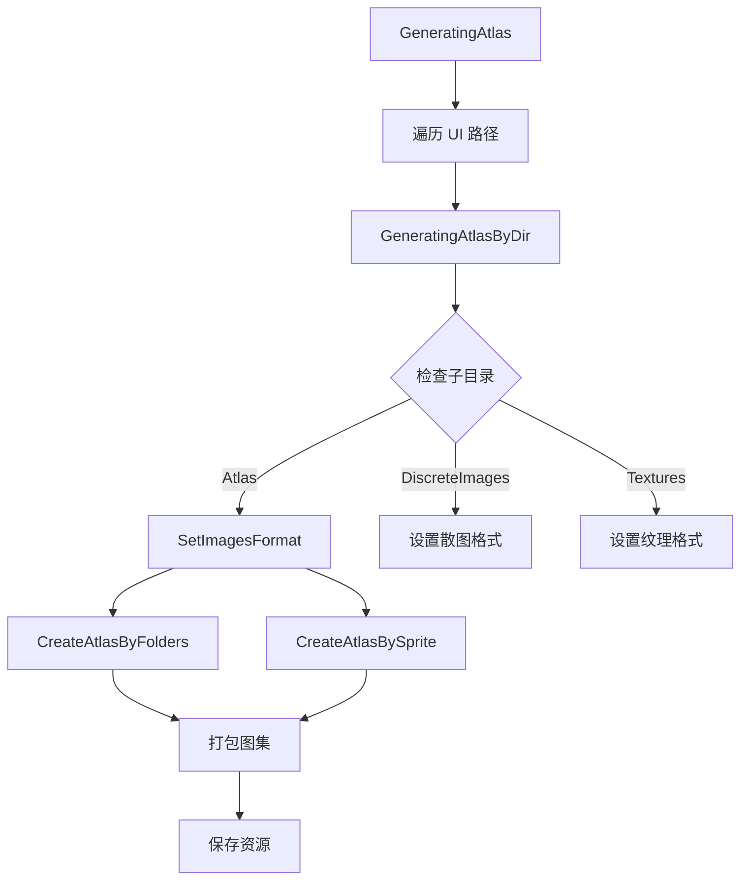
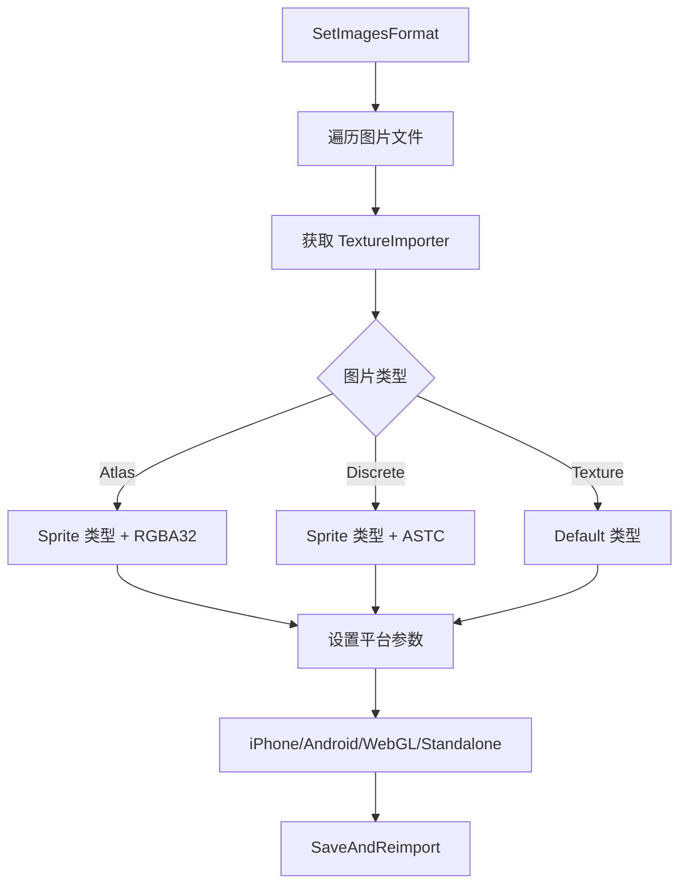

# AtlasHelper.cs 注解文档

## 文件基本信息

| 属性 | 值 |
|------|-----|
| **文件名** | AtlasHelper.cs |
| **路径** | Assets/Scripts/Editor/ArtEditor/Atlas/AtlasHelper.cs |
| **所属模块** | Editor → ArtEditor/Atlas |
| **文件职责** | 图集生成与纹理导入设置管理工具 |

---

## 类说明

### AtlasHelper

| 属性 | 说明 |
|------|------|
| **职责** | Unity 编辑器工具类，负责自动生成 SpriteAtlas 图集、配置纹理导入参数、批量设置平台纹理格式 |
| **类型** | `static class` |
| **命名空间** | `TaoTie` |

**设计模式**: 工具类模式（静态方法集合）

---

## 常量与配置

### 目录常量

| 名称 | 值 | 说明 |
|------|-----|------|
| `AtlasName` | `"Atlas"` | 图集目录名称 |
| `TextureName` | `"Textures"` | 纹理目录名称 |
| `DiscreteImagesName` | `"DiscreteImages"` | 散图目录名称 |

### UI 路径配置

```csharp
public static readonly string[] uipaths = {"UI", "UIGame", /*"UIHall"*/};
```

### 平台最大纹理尺寸

| 平台 | 最大尺寸 |
|------|---------|
| Standalone | 4096 |
| iPhone | 2048 |
| Android | 2048 |
| WebGL | 1024 |

---

## 枚举类型

### ImageType

| 值 | 说明 |
|------|------|
| `Atlas` | 图集类型 - 用于打图集的散图 |
| `DiscreteImages` | 散图类型 - 独立使用的图片 |
| `Texture` | 纹理类型 - 非 Sprite 类型的纹理 |

---

## 方法说明

### GeneratingAtlas()

**签名**:
```csharp
public static void GeneratingAtlas()
```

**职责**: 批量生成 UI 目录下所有图集

**核心逻辑**:
```
1. 遍历 uipaths 数组 (UI, UIGame)
2. 对每个目录下的子目录调用 GeneratingAtlasByDir()
3. 保存并刷新资源数据库
```

**调用者**: Unity Editor 菜单或手动调用

**使用示例**:
```csharp
// 在 Unity 编辑器中生成所有 UI 图集
AtlasHelper.GeneratingAtlas();
```

---

### GeneratingAtlasByDir(DirectoryInfo dirInfo)

**签名**:
```csharp
public static void GeneratingAtlasByDir(DirectoryInfo dirInfo)
```

**职责**: 根据目录结构生成图集

**核心逻辑**:
```
1. 检查目录是否包含 Atlas/DiscreteImages/Texture 子目录
2. 如果有 Atlas 目录:
   - 设置图片格式
   - 对每个子文件夹创建独立图集
   - 将 Atlas 目录根部的散图打成一个图集
3. 如果有 DiscreteImages 目录: 设置散图格式
4. 如果有 Texture 目录: 设置纹理格式
```

**目录结构要求**:
```
UI/
├── PanelName/
│   ├── Atlas/           # 打图集的散图
│   │   ├── SubFolder1/  # 子文件夹会生成独立图集
│   │   └── sprite.png   # 根部散图会合并成一个图集
│   ├── DiscreteImages/  # 独立散图
│   └── Textures/        # 非 Sprite 纹理
```

---

### SetImagesFormat(DirectoryInfo, ImageType)

**签名**:
```csharp
public static void SetImagesFormat(DirectoryInfo discreteImagesDirInfo, ImageType type = ImageType.Atlas)
```

**职责**: 批量设置图片导入格式

**核心逻辑**:
```
1. 遍历目录下所有图片文件
2. 获取 TextureImporter
3. 根据 ImageType 设置:
   - Atlas: Sprite 类型，RGBA32 格式，Clamp 环绕
   - DiscreteImages: Sprite 类型，ASTC 压缩
   - Texture: Default 类型（非 Sprite）
4. 配置各平台设置 (iPhone/Android/WebGL/Standalone)
5. 保存并重新导入
```

**平台纹理格式**:
| 平台 | Atlas 格式 | 其他格式 |
|------|-----------|---------|
| iPhone | RGBA32/ASTC_6x6 | ASTC_6x6 |
| Android | RGBA32/ASTC_6x6 | ASTC_6x6 |
| WebGL | RGBA32/ASTC_6x6 | DXT5 |
| Standalone | RGBA32/ASTC_6x6 | DXT5 |

---

### CreateAtlasBySprite(DirectoryInfo)

**签名**:
```csharp
private static void CreateAtlasBySprite(DirectoryInfo dirInfo)
```

**职责**: 将 Atlas 目录根部的散图打成一个图集

**核心逻辑**:
```
1. 收集 Atlas 目录根部所有 .png 文件
2. 创建或获取 SpriteAtlas 资源
3. 添加散图到图集
4. 打包图集
```

---

### CreateAtlasByFolders(DirectoryInfo, DirectoryInfo)

**签名**:
```csharp
private static void CreateAtlasByFolders(DirectoryInfo dirInfo, DirectoryInfo atlasDir)
```

**职责**: 为 Atlas 目录下的每个子文件夹创建独立图集

**核心逻辑**:
```
1. 获取子文件夹路径
2. 创建命名格式为 "Atlas_{文件夹名}.spriteatlas" 的图集
3. 将整个文件夹添加到图集
4. 打包图集
```

---

### SetSpriteAtlas(SpriteAtlas, string, bool)

**签名**:
```csharp
private static void SetSpriteAtlas(SpriteAtlas atlas, string atlasPath, bool readWrite = false)
```

**职责**: 配置 SpriteAtlas 参数

**核心逻辑**:
```
1. 设置打包参数 (blockOffset=1, 不旋转，非紧密打包，padding=2)
2. 设置纹理参数 (不可读，无 MIP，sRGB，双线性过滤)
3. 设置各平台最大尺寸和格式
4. Uncompressed 目录使用 RGBA32 格式
```

---

### AddPackAtlas(SpriteAtlas, Object[])

**签名**:
```csharp
private static void AddPackAtlas(SpriteAtlas atlas, Object[] spt)
```

**职责**: 添加对象到图集并打包

**核心逻辑**:
```
1. 调用 SpriteAtlasExtensions.Add() 添加对象
2. 调用 PackAtlas() 打包
```

---

### PackAtlas(SpriteAtlas)

**签名**:
```csharp
private static void PackAtlas(SpriteAtlas atlas)
```

**职责**: 执行图集打包

**核心逻辑**:
```
1. 调用 UnityEditor.U2D.SpriteAtlasUtility.PackAtlases()
```

---

### GetOrCreateAtlas(string, string)

**签名**:
```csharp
private static SpriteAtlas GetOrCreateAtlas(string fullName, string atlasName)
```

**职责**: 获取或创建 SpriteAtlas 资源

**核心逻辑**:
```
1. 尝试加载现有图集
2. 如果不存在则创建新图集
3. 如果存在则清空原有内容
4. 返回图集引用
```

---

### ClearAllAtlas()

**签名**:
```csharp
public static void ClearAllAtlas()
```

**职责**: 清理所有图集资源

**核心逻辑**:
```
1. 遍历 UI 路径
2. 查找所有 .spriteatlas 文件
3. 删除图集资源
4. 保存并刷新
```

**使用场景**: 重新生成图集前先清理旧图集

---

### SettingPNG()

**签名**:
```csharp
public static void SettingPNG()
```

**职责**: 批量设置非 UI 资源的纹理格式

**核心逻辑**:
```
1. 遍历 AssetsPackage 下所有子目录
2. 跳过 UI、Tmp、Fonts、FmodBanks、Shaders 目录
3. 对每个文件设置平台纹理格式
4. Android/iPhone: ASTC_6x6
5. WebGL/Standalone: DXT5 (根据尺寸调整)
```

---

### SetSceneTextures()

**签名**:
```csharp
public static void SetSceneTextures()
```

**职责**: 设置场景纹理导入参数

**核心逻辑**:
```
1. 查找 Scenes/和 SceneObject/目录下的所有纹理
2. 设置各平台格式和最大尺寸
3. Shadowmask 类型使用特殊格式
4. 特殊 GUID 纹理使用 2048 尺寸
```

---

### GetTextureDXT5Size(TextureImporter, string, int)

**签名**:
```csharp
private static int GetTextureDXT5Size(TextureImporter textureImporter, string path, int maxSize)
```

**职责**: 计算 DXT5 格式的最大纹理尺寸

**核心逻辑**:
```
1. 获取纹理实际宽高
2. 如果宽高都是 2 的幂，返回较小值
3. 否则计算最近的 2 的幂
4. 不超过 maxSize 限制
```

---

## Mermaid 流程图

### 图集生成流程



### 纹理导入设置流程



---

## 使用示例

### 生成所有 UI 图集

```csharp
// 在 Unity 编辑器中执行
AtlasHelper.GeneratingAtlas();
```

### 清理所有图集

```csharp
// 重新生成前先清理
AtlasHelper.ClearAllAtlas();
AtlasHelper.GeneratingAtlas();
```

### 设置场景纹理

```csharp
// 批量设置场景纹理格式
AtlasHelper.SetSceneTextures();
```

### 设置 PNG 压缩

```csharp
// 批量压缩非 UI 资源
AtlasHelper.SettingPNG();
```

---

## 相关文档链接

- [AssetImportMgr.cs.md](./AssetImportMgr.cs.md) - 资源导入管理器
- [ReplaceImage.cs.md](./ReplaceImage.cs.md) - 图片替换工具
- [CheckEmptyImage.cs.md](./CheckEmptyImage.cs.md) - 空图片检查工具
- [Unity SpriteAtlas 官方文档](https://docs.unity3d.com/Manual/class-SpriteAtlas.html)

---

*文档生成时间：2026-03-02 | OpenClaw AI 助手*
