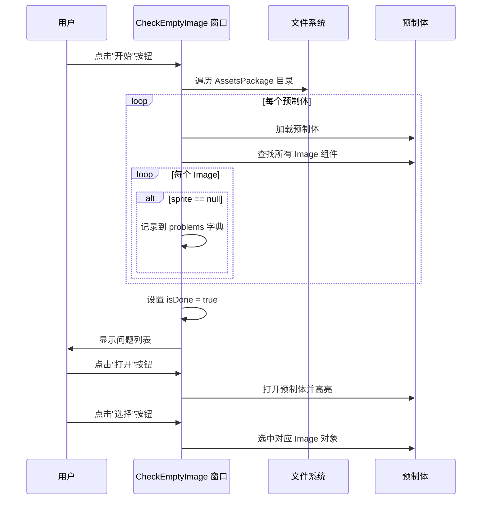

# CheckEmptyImage.cs 文档

> **文件路径**: `Assets/Scripts/Editor/ArtEditor/Atlas/CheckEmptyImage.cs`  
> **命名空间**: `TaoTie`  
> **文档生成时间**: 2026-03-02  
> **文件类型**: Unity 编辑器窗口

---

## 📋 文件信息表

| 属性 | 值 |
|------|------|
| **类名** | `CheckEmptyImage` |
| **基类** | `EditorWindow` |
| **所在程序集** | Editor |
| **依赖命名空间** | `UnityEditor`, `UnityEngine`, `UnityEngine.UI` |
| **功能分类** | 预制体检查工具 |

---

## 🎯 类说明

**核心职责**: 检查预制体中是否有 Image 组件丢失了 Sprite 引用 (空 Image)。

**解决的核心问题**: 
- 发现预制体中未设置 Sprite 的 Image 组件
- 快速定位问题预制体和具体 Image 对象
- 避免因空 Image 导致的渲染问题

**如果没有这个模块**: 需要手动检查每个预制体，容易遗漏空 Image 导致运行时显示异常。

---

## 📦 字段与属性

| 字段名 | 类型 | 说明 |
|--------|------|------|
| `problems` | `Dictionary<string, List<string>>` | 问题预制体字典 (路径 → Image 路径列表) |
| `scrollPosition` | `Vector2` | 滚动视图位置 |
| `isDone` | `bool` | 检查是否完成 |
| `curOpenPrefab` | `GameObject` | 当前打开的预制体 |
| `curOpenPrefabKey` | `string` | 当前预制体路径键 |
| `curSelectTextKey` | `string` | 当前选中的 Image 路径 |

---

## 🔧 方法说明

### OnGUI()
```csharp
private void OnGUI()
```
**功能**: 绘制编辑器窗口 UI  
**UI 布局**:
1. 顶部：红色"开始"按钮
2. 中部：滚动问题列表
3. 每个问题项显示预制体路径和"打开"按钮
4. 展开显示该预制体中所有空 Image 的路径和"选择"按钮

---

#### Start()
```csharp
private void Start()
```
**功能**: 执行检查逻辑  
**流程**:
1. 遍历 AssetsPackage 目录下所有预制体
2. 打开每个预制体并检查所有 Image 组件
3. 记录 sprite 为 null 的 Image 组件路径
4. 设置 isDone = true 标记完成

---

## 🔄 核心流程图



---

## 💡 使用示例

### 检查空 Image
```
1. 打开菜单 `Tools/工具/UI/检查丢失 image`
2. 点击窗口中的"开始"按钮
3. 等待检查完成
4. 查看问题预制体列表
```

### 定位问题 Image
```
1. 在问题列表中找到目标预制体
2. 点击"打开"按钮 → 预制体在 Project 窗口高亮并在 Hierarchy 打开
3. 展开预制体项查看空 Image 路径列表
4. 点击"选择"按钮 → 在 Hierarchy 中选中该 Image 对象
5. 在 Inspector 中设置正确的 Sprite
```

---

## 🔗 相关文档链接

| 文档 | 说明 |
|------|------|
| [AltasEditor.cs](../AltasEditor.cs.md) | 编辑器菜单入口 |
| [CheckUnuseImage.cs](./CheckUnuseImage.cs.md) | 未使用图片检查 |
| [ReplaceImage.cs](./ReplaceImage.cs.md) | Sprite 替换工具 |

---

## ⚠️ 注意事项

| 问题 | 说明 | 解决方案 |
|------|------|----------|
| **检查范围** | 仅检查 AssetsPackage 目录 | 其他目录需手动检查 |
| **动态 Image** | 运行时设置的 Image 会被误报 | 人工确认是否为动态设置 |
| **窗口尺寸** | 固定 900x600 | 大量问题需滚动查看 |

---

*文档由 OpenClaw AI 助手自动生成 | 基于静态代码分析*
