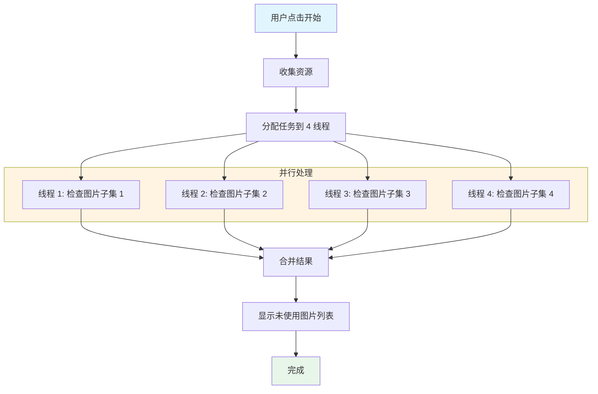

# CheckUnuseImage.cs 文档

> **文件路径**: `Assets/Scripts/Editor/ArtEditor/Atlas/CheckUnuseImage.cs`  
> **命名空间**: `TaoTie`  
> **文档生成时间**: 2026-03-02  
> **文件类型**: Unity 编辑器窗口

---

## 📋 文件信息表

| 属性 | 值 |
|------|------|
| **类名** | `CheckUnuseImage` |
| **基类** | `EditorWindow` |
| **所在程序集** | Editor |
| **依赖命名空间** | `UnityEditor`, `UnityEngine`, `System.IO`, `System.Text.RegularExpressions` |
| **功能分类** | 未使用资源检查工具 |
| **线程数** | 4 个并行线程 |

---

## 🎯 类说明

**核心职责**: 查找项目中未被任何资源或代码引用的图片文件。

**解决的核心问题**: 
- 发现并清理未使用的图片资源
- 减少包体大小
- 保持项目资源整洁

**如果没有这个模块**: 未使用图片难以发现，导致包体冗余，增加下载和加载时间。

---

## 📦 字段与属性

| 字段名 | 类型 | 说明 |
|--------|------|------|
| `Results` | `static List<string>` | 未使用图片路径结果列表 |
| `_updateDelegate` | `EditorApplication.CallbackFunction` | 编辑器更新回调 |
| `scrollPosition` | `Vector2` | 滚动视图位置 |
| `ThreadCount` | `const int` | 并行线程数 (4) |
| `watch` | `Stopwatch` | 性能计时器 |
| `isDone` | `bool` | 检查是否完成 |

### 内部类：ThreadPars
```csharp
public class ThreadPars
```
**功能**: 线程参数封装  
**字段**:
- `assetContents`: 资源文件内容列表
- `codeContents`: 代码文件内容列表
- `imagePaths`: 图片路径列表
- `imageGUIDPaths`: 图片 GUID 列表

---

## 🔧 方法说明

### ThreadFind()
```csharp
private static List<string> ThreadFind(ThreadPars par)
```
**功能**: 在线程中查找未使用的图片  
**逻辑**:
1. 遍历图片路径列表
2. 获取图片的 GUID
3. 在所有资源文件中搜索该 GUID
4. 在代码文件中搜索图片路径匹配
5. 未找到任何引用则加入结果列表

**匹配策略**:
- 资源引用：通过 GUID 匹配
- 代码引用：通过路径字符串正则匹配

---

#### OnGUI()
```csharp
private void OnGUI()
```
**功能**: 绘制编辑器窗口 UI  
**UI 布局**:
1. 顶部："开始"按钮
2. 中部：滚动显示未使用图片列表
3. 每个图片显示完整路径

---

#### Start()
```csharp
private void Start()
```
**功能**: 启动多线程检查  
**流程**:
1. 收集所有图片资源
2. 收集所有资源文件内容
3. 收集所有代码文件内容
4. 分配任务到 4 个线程并行处理
5. 等待所有线程完成
6. 合并结果并显示

---

## 🔄 核心流程图



---

## 💡 使用示例

### 查找未使用图片
```
1. 打开菜单 `Tools/工具/UI/查找未使用的图片`
2. 点击窗口中的"开始"按钮
3. 等待多线程检查完成 (查看 Console 耗时)
4. 查看未使用图片列表
5. 手动确认后可安全删除
```

### 结果处理
```
检查结果分为两类引用:
1. 资源引用 (.prefab, .unity 等) - 通过 GUID 匹配
2. 代码引用 (.cs 文件) - 通过路径字符串匹配

未找到任何引用的图片可安全删除
```

---

## 🔗 相关文档链接

| 文档 | 说明 |
|------|------|
| [AltasEditor.cs](../AltasEditor.cs.md) | 编辑器菜单入口 |
| [CheckEmptyImage.cs](./CheckEmptyImage.cs.md) | 空 Image 检查 |
| [ReplaceImage.cs](./ReplaceImage.cs.md) | Sprite 替换工具 |

---

## ⚠️ 注意事项

| 问题 | 说明 | 解决方案 |
|------|------|----------|
| **动态加载** | Resources.Load 等动态加载无法检测 | 人工确认是否动态加载 |
| **代码字符串** | 路径拼接的字符串可能漏检 | 检查代码中的路径构建逻辑 |
| **检查耗时** | 大量资源时较慢 | 使用 4 线程加速，耐心等待 |
| **误删风险** | 可能误判未使用 | 删除前人工确认，版本控制备份 |

---

*文档由 OpenClaw AI 助手自动生成 | 基于静态代码分析*
