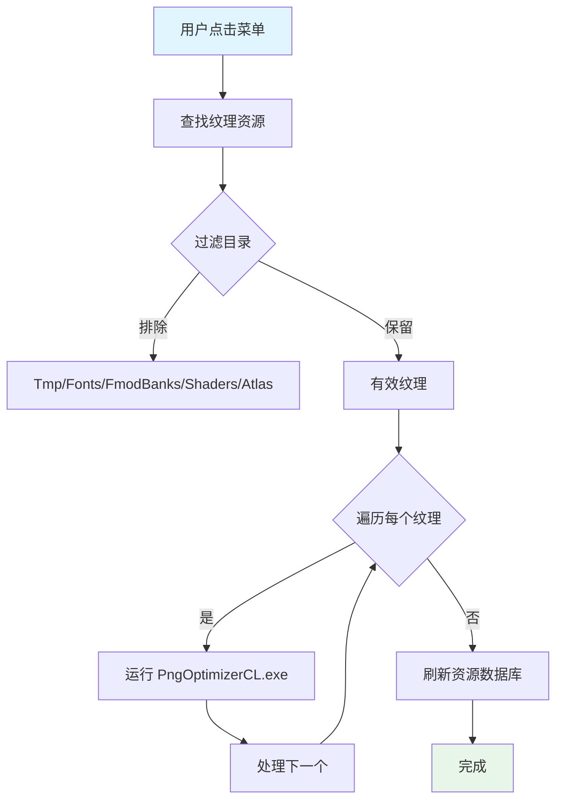

# PngOptimizerCL.cs 文档

> **文件路径**: `Assets/Scripts/Editor/ArtEditor/Atlas/PngOptimizerCL.cs`  
> **命名空间**: `TaoTie`  
> **文档生成时间**: 2026-03-02  
> **文件类型**: Unity 编辑器工具 (仅 Windows)

---

## 📋 文件信息表

| 属性 | 值 |
|------|------|
| **类名** | `PngOptimizerCL` |
| **所在程序集** | Editor |
| **平台限制** | `UNITY_EDITOR_WIN` (仅 Windows 编辑器) |
| **依赖命名空间** | `UnityEditor`, `UnityEngine`, `System.IO` |
| **功能分类** | 图片批量压缩工具 |

---

## 🎯 类说明

**核心职责**: 使用外部工具 PngOptimizerCL 批量压缩项目中的 PNG 图片资源。

**解决的核心问题**: 
- 减少 PNG 图片文件大小
- 批量处理大量图片资源
- 自动化压缩流程

**如果没有这个模块**: 需要手动使用外部工具逐张压缩图片，效率低下。

---

## 📦 字段与属性

| 字段名 | 类型 | 说明 |
|--------|------|------|
| `program` | `const string` | PngOptimizerCL 可执行文件路径 `Tools/PngOptimizerCL/PngOptimizerCL.exe` |

---

## 🔧 方法说明

### ProcessImage()
```csharp
[MenuItem("Tools/工具/TA/批量压缩图片", false, 100)]
public static void ProcessImage()
```
**功能**: 批量压缩 AssetsPackage 和 Resources 目录下的所有纹理  
**流程**:
1. 获取工作空间路径 (Application.dataPath 的父目录)
2. 查找所有纹理资源 (排除 Tmp/Fonts/FmodBanks/Shaders/Atlas 目录)
3. 调用 PngOptimizerCL.exe 压缩每个文件
4. 刷新资源数据库

**排除目录**:
- `Tmp` - 临时文件
- `Fonts` - 字体文件
- `FmodBanks` - 音频库
- `Shaders` - 着色器
- `/Atlas/` - 已打包的图集

---

## 🔄 核心流程图



---

## 💡 使用示例

### 批量压缩图片
```
1. 确保 Tools/PngOptimizerCL/PngOptimizerCL.exe 存在
2. 点击菜单 `Tools/工具/TA/批量压缩图片`
3. 等待压缩完成 (查看 Console 日志)
4. 资源数据库自动刷新
```

### 命令行参数
```bash
# 工具调用示例
PngOptimizerCL.exe -file:"Assets/AssetsPackage/UI/Textures/icon.png"
```

---

## 🔗 相关文档链接

| 文档 | 说明 |
|------|------|
| [AltasEditor.cs](../AltasEditor.cs.md) | 编辑器工具集 |
| [BashUtil.cs](../../Common/Helper/BashUtil.cs.md) | 命令行工具类 |
| [AtlasHelper.cs](./AtlasHelper.cs.md) | 图集处理工具 |

---

## ⚠️ 注意事项

| 问题 | 说明 | 解决方案 |
|------|------|----------|
| **平台限制** | 仅 Windows 可用 | Mac/Linux 需使用其他工具 |
| **外部依赖** | 需要 PngOptimizerCL.exe | 确保 Tools 目录包含该文件 |
| **压缩时间** | 大量图片耗时较长 | 建议在空闲时间运行 |
| **备份建议** | 压缩不可逆 | 操作前建议版本控制备份 |

---

*文档由 OpenClaw AI 助手自动生成 | 基于静态代码分析*
