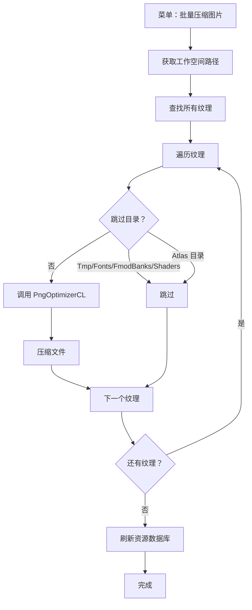

# PngOptimizerCL.cs 注解文档

## 文件基本信息

| 属性 | 值 |
|------|-----|
| **文件名** | PngOptimizerCL.cs |
| **路径** | Assets/Scripts/Editor/ArtEditor/Atlas/PngOptimizerCL.cs |
| **所属模块** | Editor → ArtEditor/Atlas |
| **文件职责** | 使用 PngOptimizerCL 工具批量压缩 PNG 图片 |

---

## 类说明

### PngOptimizerCL

| 属性 | 说明 |
|------|------|
| **职责** | 调用外部命令行工具 PngOptimizerCL.exe 批量压缩项目中的 PNG 图片 |
| **类型** | `static class` |
| **命名空间** | `TaoTie` |
| **平台限制** | 仅 Windows (`#if UNITY_EDITOR_WIN`) |

**设计模式**: 工具类模式 + 外部进程调用

---

## 常量说明

| 名称 | 类型 | 值 | 说明 |
|------|------|-----|------|
| `program` | `string` | `"Tools/PngOptimizerCL/PngOptimizerCL.exe"` | PngOptimizerCL 可执行文件路径 |

---

## 方法说明

### ProcessImage()

**签名**:
```csharp
[MenuItem("Tools/工具/TA/批量压缩图片", false, 100)]
public static void ProcessImage()
```

**职责**: 批量压缩项目中的所有纹理图片

**菜单路径**: `Tools → 工具 → TA → 批量压缩图片`

**核心逻辑**:
```
1. 获取工作空间路径 (项目根目录)
2. 查找所有纹理资源:
   - 搜索范围：Assets/AssetsPackage, Assets/Resources
   - 类型：Texture (t:Texture)
3. 遍历每个纹理:
   a. 跳过 Tmp/Fonts/FmodBanks/Shaders 目录
   b. 跳过 Atlas 目录 (图集资源)
   c. 调用 PngOptimizerCL.exe 压缩文件
4. 刷新资源数据库
```

**跳过目录**:
| 目录 | 说明 |
|------|------|
| `Tmp` | 临时文件 |
| `Fonts` | 字体资源 |
| `FmodBanks` | FMOD 音频资源 |
| `Shaders` | 着色器文件 |
| `/Atlas/` | 已打包的图集 |

**命令行调用**:
```bash
Tools/PngOptimizerCL/PngOptimizerCL.exe -file:"Assets/AssetsPackage/Textures/image.png"
```

---

## Mermaid 流程图

### 批量压缩流程



---

## 使用示例

### 通过菜单使用

1. 在 Unity 编辑器顶部菜单选择：`Tools → 工具 → TA → 批量压缩图片`
2. 等待处理完成 (控制台会显示进度)
3. 资源数据库自动刷新

### 通过代码调用

```csharp
// 在 Unity 编辑器中
#if UNITY_EDITOR_WIN
PngOptimizerCL.ProcessImage();
#endif
```

---

## 外部工具说明

### PngOptimizerCL

**官网**: https://github.com/pelock/PngOptimizerCL

**功能**: 命令行版 PNG 优化器，可无损压缩 PNG 文件

**常用参数**:
```bash
# 压缩单个文件
PngOptimizerCL.exe -file:"input.png"

# 压缩整个目录
PngOptimizerCL.exe -dir:"path/to/folder"

# 保留原始文件备份
PngOptimizerCL.exe -file:"input.png" -keeporiginal
```

**压缩效果**:
- 无损压缩，不影响图片质量
- 通常可减少 20-50% 文件大小
- 移除 PNG 中的元数据和 gamma 信息

---

## 注意事项

### 平台限制

```csharp
#if UNITY_EDITOR_WIN
// 仅 Windows 编辑器可用
#endif
```

- 依赖 Windows 可执行文件 (.exe)
- Mac/Linux 用户需要替代方案

### 文件要求

- PngOptimizerCL.exe 必须位于 `Tools/PngOptimizerCL/` 目录
- 需要确保文件有执行权限

### 性能考虑

- 每个文件单独调用命令行，大量文件时较慢
- 建议分批处理或离线处理

### 安全

- 直接修改源文件，建议先备份
- 跳过 Atlas 目录避免破坏已打包图集

---

## 扩展建议

### Mac/Linux 支持

```csharp
#if UNITY_EDITOR_WIN
private const string program = "Tools/PngOptimizerCL/PngOptimizerCL.exe";
#elif UNITY_EDITOR_OSX
private const string program = "Tools/PngOptimizerCL/PngOptimizerCL";
#endif
```

### 批量优化

```csharp
// 改为一次性处理整个目录
BashUtil.RunCommand(workSpace, program, $"-dir:\"Assets/AssetsPackage\"");
```

### 进度显示

```csharp
// 添加进度条
int total = guids.Length;
int current = 0;
foreach (var guid in guids)
{
    current++;
    EditorUtility.DisplayProgressBar("压缩进度", $"{current}/{total}", (float)current/total);
    // ...
}
EditorUtility.ClearProgressBar();
```

---

## 相关文档链接

- [AtlasHelper.cs.md](./AtlasHelper.cs.md) - 图集生成工具
- [BashUtil.cs](../../Common/Helper/BashUtil.cs) - 命令行工具类
- [PngOptimizerCL 官方仓库](https://github.com/pelock/PngOptimizerCL)

---

*文档生成时间：2026-03-02 | OpenClaw AI 助手*
