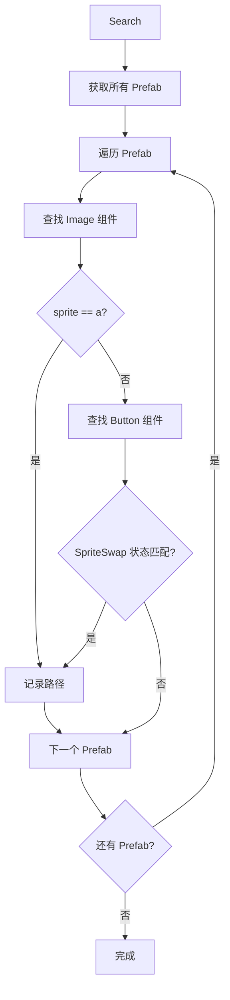
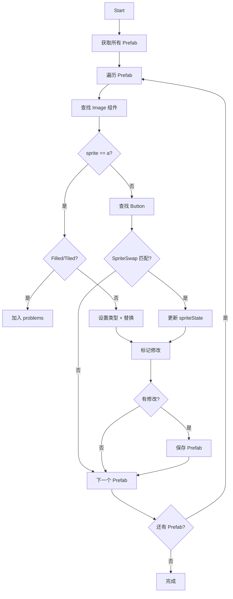

# ReplaceImage.cs 注解文档

## 文件基本信息

| 属性 | 值 |
|------|-----|
| **文件名** | ReplaceImage.cs |
| **路径** | Assets/Scripts/Editor/ArtEditor/Atlas/ReplaceImage.cs |
| **所属模块** | Editor → ArtEditor/Atlas |
| **文件职责** | Prefab 图片批量搜索与替换工具 |

---

## 类说明

### ReplaceImage

| 属性 | 说明 |
|------|------|
| **职责** | Unity Editor 窗口工具，用于在 Prefab 中批量搜索和替换 Sprite 图片 |
| **类型** | `EditorWindow` |
| **命名空间** | `TaoTie` |

**继承关系**:
```
EditorWindow → ScriptableObject → Object
```

**设计模式**: 工具窗口模式

---

## 字段说明

| 名称 | 类型 | 访问级别 | 说明 |
|------|------|----------|------|
| `a` | `Sprite` | `private` | 要搜索的源图片 |
| `b` | `Sprite` | `private` | 要替换的目标图片 |
| `isDone` | `bool` | `private` | 操作是否完成标志 |
| `curOpenPrefab` | `GameObject` | `private` | 当前打开的 Prefab 对象 |
| `curOpenPrefabKey` | `string` | `private` | 当前打开 Prefab 的路径 |
| `curSelectTextKey` | `string` | `private` | 当前选中的组件路径 |
| `scrollPosition` | `Vector2` | `private` | 滚动视图位置 |
| `record` | `Dictionary<string, List<string>>` | `private` | 记录匹配结果 (Prefab 路径 → 组件路径列表) |
| `problems` | `Dictionary<string, List<string>>` | `private` | 记录无法处理的问题 (如 Filled/Tiled 类型) |
| `res` | `List<string>` | `private` | 结果路径列表 |

---

## 方法说明

### ResetData()

**签名**:
```csharp
private void ResetData()
```

**职责**: 重置所有数据状态

**核心逻辑**:
```
1. 清空当前打开 Prefab 引用
2. 清空记录字典
3. 清空问题字典
4. 清空结果列表
5. 重置完成标志
```

---

### OnGUI()

**签名**:
```csharp
private void OnGUI()
```

**职责**: 绘制编辑器窗口界面

**界面布局**:
```
┌─────────────────────────────────────┐
│  搜索图片：[Sprite 字段]  替换图片：[Sprite 字段]  │
│  [搜索按钮] [开始替换按钮]                        │
│  ─────────────────────────────────               │
│  滚动视图：                                      │
│  ├─ Prefab: path/to/prefab [打开]               │
│  │   ├─ Component/Path [选择] ☚                │
│  │   └─ ...                                     │
│  ├─ 不能判断的 Prefab (problems)                │
│  └─ 结果路径列表                                 │
└─────────────────────────────────────┘
```

**交互逻辑**:
```
1. 绘制 Sprite 输入字段
2. 绘制搜索和开始按钮
3. 如果完成，显示结果列表
4. 支持点击打开 Prefab
5. 支持选择并高亮组件
```

---

### DrawPrefabItem(string, List<string>)

**签名**:
```csharp
private void DrawPrefabItem(string title, List<string> list)
```

**职责**: 绘制单个 Prefab 项目及其组件列表

**核心逻辑**:
```
1. 绘制 Prefab 路径和打开按钮
2. 如果当前打开的是此 Prefab:
   - 遍历组件路径列表
   - 绘制每个组件路径和选择按钮
   - 高亮当前选中的组件
```

---

### Search()

**签名**:
```csharp
private void Search()
```

**职责**: 搜索所有使用指定 Sprite 的 Prefab

**核心逻辑**:
```
1. 获取所有 Prefab 路径 (UIAssetUtils.GetAllPrefabs)
2. 遍历每个 Prefab:
   a. 加载 Prefab 对象
   b. 查找所有 Image 组件
      - 如果 sprite == a，记录路径
   c. 查找所有 Button 组件
      - 检查 SpriteSwap 过渡状态
      - 如果任何状态 sprite == a，记录路径
3. 显示进度条
4. 标记完成并显示通知
```

**检查的 Button 状态**:
- highlightedSprite (高亮)
- pressedSprite (按下)
- selectedSprite (选中)
- disabledSprite (禁用)

---

### Start()

**签名**:
```csharp
private void Start()
```

**职责**: 执行图片替换操作

**核心逻辑**:
```
1. 获取所有 Prefab 路径
2. 遍历每个 Prefab:
   a. 加载 Prefab 对象
   b. 查找所有 Image 组件
      - 如果 sprite == a:
        * 检查是否为 Filled/Tiled 类型 → 加入 problems
        * 根据目标图片 border 设置 Image 类型
        * 替换 sprite
        * 标记为已修改
   c. 查找所有 Button 组件
      - 检查 SpriteSwap 状态
      - 替换匹配的 sprite
      - 更新 spriteState
   d. 如果有修改，保存 Prefab
3. 显示进度条
4. 显示完成通知
```

**类型自动判断**:
```csharp
if (b.border.w > 0 || b.border.x > 0 || b.border.y > 0 || b.border.z > 0)
{
    Images[k].type = Image.Type.Sliced;  // 九宫格
}
else
{
    Images[k].type = Image.Type.Simple;  // 简单
}
```

---

### AddRecord(string, Transform)

**签名**:
```csharp
void AddRecord(string cur, Transform tran)
```

**职责**: 添加匹配记录

**核心逻辑**:
```
1. 如果 Prefab 路径不存在于字典，创建新列表
2. 添加组件路径到列表
```

---

### AddProblem(string, Transform)

**签名**:
```csharp
void AddProblem(string cur, Transform tran)
```

**职责**: 添加问题记录 (无法自动处理的情况)

**核心逻辑**:
```
1. 如果 Prefab 路径不存在于字典，创建新列表
2. 添加组件路径到问题列表
```

---

### GetProblemFullPath(Transform)

**签名**:
```csharp
string GetProblemFullPath(Transform tran)
```

**职责**: 获取组件在 Prefab 中的完整层级路径

**核心逻辑**:
```
1. 从当前 Transform 开始
2. 向上遍历父节点
3. 拼接路径 "Parent/Child/Component"
4. 排除根节点
```

**示例输出**:
```
Panel/Background/Image
Button/Text
```

---

## Mermaid 流程图

### 搜索流程



### 替换流程



---

## 使用示例

### 打开工具窗口

```csharp
// 在 Unity 编辑器中
var window = EditorWindow.GetWindow<ReplaceImage>();
window.Show();
```

### 搜索图片

1. 在 "搜索图片" 字段拖入要查找的 Sprite
2. 点击 "搜索" 按钮
3. 查看结果列表

### 替换图片

1. 在 "搜索图片" 字段拖入源 Sprite
2. 在 "替换图片" 字段拖入目标 Sprite
3. 点击 "开始" 按钮
4. 等待处理完成

### 查看和定位

1. 在结果列表中点击 "打开" 按钮打开 Prefab
2. 点击组件路径旁的 "选择" 按钮定位组件
3. ☚ 标记表示当前选中的组件

---

## 注意事项

### 限制

- **不支持 Filled/Tiled 类型**: 这些类型的 Image 会被加入 problems 列表，需要手动处理
- **仅处理 SpriteSwap 过渡**: Button 的其他过渡类型不会被检查

### 性能

- 使用进度条显示处理进度
- 批量处理所有 Prefab，适合大规模替换

### 安全

- 自动保存修改的 Prefab
- 问题项会被记录但不会修改

---

## 相关文档链接

- [AtlasHelper.cs.md](./AtlasHelper.cs.md) - 图集生成工具
- [CheckEmptyImage.cs.md](./CheckEmptyImage.cs.md) - 空图片检查工具
- [UIAssetUtils.cs](../../Common/Helper/UIAssetUtils.cs) - UI 资源工具类

---

*文档生成时间：2026-03-02 | OpenClaw AI 助手*
