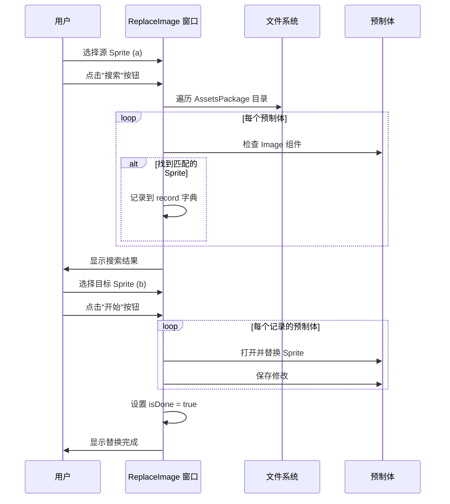

# ReplaceImage.cs 文档

> **文件路径**: `Assets/Scripts/Editor/ArtEditor/Atlas/ReplaceImage.cs`  
> **命名空间**: `TaoTie`  
> **文档生成时间**: 2026-03-02  
> **文件类型**: Unity 编辑器窗口

---

## 📋 文件信息表

| 属性 | 值 |
|------|------|
| **类名** | `ReplaceImage` |
| **基类** | `EditorWindow` |
| **所在程序集** | Editor |
| **依赖命名空间** | `UnityEditor`, `UnityEngine`, `System.IO`, `UnityEngine.UI` |
| **功能分类** | Sprite 批量替换工具 |

---

## 🎯 类说明

**核心职责**: 提供 Unity 编辑器中批量搜索和替换 Sprite 的可视化工具窗口。

**解决的核心问题**: 
- 在大量预制体中查找使用特定 Sprite 的位置
- 批量替换预制体中的 Sprite 引用
- 记录替换历史和问题预制体

**如果没有这个模块**: 需要手动打开每个预制体查找和替换 Sprite，效率极低。

---

## 📦 字段与属性

| 字段名 | 类型 | 说明 |
|--------|------|------|
| `a` | `Sprite` | 要搜索的源 Sprite |
| `b` | `Sprite` | 用于替换的目标 Sprite |
| `isDone` | `bool` | 搜索/替换是否完成 |
| `curOpenPrefab` | `GameObject` | 当前打开的预制体 |
| `curOpenPrefabKey` | `string` | 当前预制体的路径键 |
| `curSelectTextKey` | `string` | 当前选中的文本键 |
| `scrollPosition` | `Vector2` | 滚动视图位置 |
| `record` | `Dictionary<string, List<string>>` | 记录每个预制体中找到的 Sprite 路径 |
| `problems` | `Dictionary<string, List<string>>` | 记录无法判断的预制体 |
| `res` | `List<string>` | 搜索结果列表 |

---

## 🔧 方法说明

### 核心方法

#### ResetData()
```csharp
private void ResetData()
```
**功能**: 重置所有数据状态  
**操作**:
- 清空当前预制体引用
- 清空 record、problems、res 字典/列表
- 重置 isDone 标志

---

#### OnGUI()
```csharp
private void OnGUI()
```
**功能**: 绘制编辑器窗口 UI  
**UI 布局**:
1. 顶部：源 Sprite 和目标 Sprite 选择框
2. 中部：搜索和开始按钮
3. 底部：滚动结果显示区域

---

#### Search()
```csharp
private void Search()
```
**功能**: 搜索所有使用源 Sprite 的预制体  
**流程**:
1. 遍历 AssetsPackage 目录下的所有预制体
2. 检查每个 Image 组件的 sprite 属性
3. 记录匹配结果到 record 字典

---

#### Start()
```csharp
private void Start()
```
**功能**: 执行批量替换操作  
**流程**:
1. 遍历 record 中记录的所有预制体
2. 打开预制体并查找所有 Image 组件
3. 将匹配的 Sprite 替换为目标 Sprite
4. 保存预制体并记录结果

---

#### DrawPrefabItem()
```csharp
private void DrawPrefabItem(string title, List<string> items)
```
**功能**: 绘制单个预制体项的 UI 显示  
**参数**:
- `title`: 预制体路径
- `items`: 找到的 Sprite 路径列表

---

## 🔄 核心流程图



---

## 💡 使用示例

### 批量替换 Sprite
```
1. 打开菜单 `Tools/工具/UI/搜索或批量替换 Sprite`
2. 在"搜索图片"字段选择要查找的 Sprite
3. 点击"搜索"按钮，等待搜索完成
4. 在"替换图片"字段选择新的 Sprite
5. 点击"开始"按钮执行批量替换
6. 查看替换结果和不能判断的预制体列表
```

### 查看替换记录
```
替换完成后，窗口会显示:
- 成功替换的预制体列表 (绿色)
- 不能判断的预制体列表 (红色)
- 每个预制体中找到的 Sprite 路径
```

---

## 🔗 相关文档链接

| 文档 | 说明 |
|------|------|
| [AltasEditor.cs](../AltasEditor.cs.md) | 编辑器菜单入口 |
| [AtlasHelper.cs](./AtlasHelper.cs.md) | 图集处理工具 |
| [AssetImportMgr.cs](./AssetImportMgr.cs.md) | 资源导入管理 |

---

## ⚠️ 注意事项

| 问题 | 说明 | 解决方案 |
|------|------|----------|
| **备份预制体** | 批量替换有风险 | 操作前建议版本控制备份 |
| **窗口尺寸** | 固定 900x600 | 大量结果时需滚动查看 |
| **替换确认** | 替换后无法撤销 | 替换前仔细检查目标 Sprite |

---

*文档由 OpenClaw AI 助手自动生成 | 基于静态代码分析*
