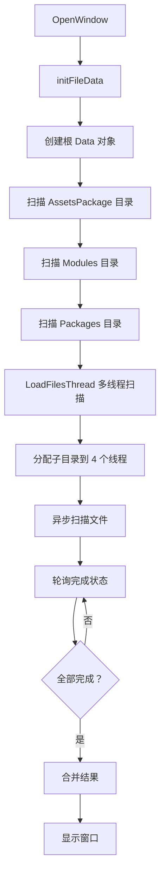
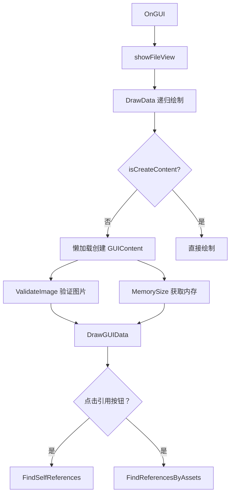

# ArtToolsWindow.cs 注解文档

## 文件基本信息

| 属性 | 值 |
|------|-----|
| **文件名** | ArtToolsWindow.cs |
| **路径** | Assets/Scripts/Editor/ArtEditor/Resource/ArtToolsWindow.cs |
| **所属模块** | Editor → ArtEditor → Resource |
| **文件职责** | 美术资源分析工具窗口，扫描 AssetsPackage 目录并展示资源占用情况（硬盘/内存） |

---

## 类/结构体说明

### ArtToolsWindow

| 属性 | 说明 |
|------|------|
| **职责** | Unity Editor 扩展窗口，提供资源扫描、展示、搜索功能，支持多线程扫描和内存/硬盘占用分析 |
| **泛型参数** | 无 |
| **继承关系** | 继承 `EditorWindow` |
| **实现的接口** | 无 |

**设计模式**: 单例窗口 + 多线程扫描 + 懒加载

```csharp
// 窗口打开方式
[MenuItem("Tools/Art Tools")]
public static void OpenWindow()
{
    showWin = true;
    initFileData();
}
```

### Data (内部类)

| 属性 | 说明 |
|------|------|
| **职责** | 文件夹/资源数据结构，用于树形展示 |
| **字段** | `indent`, `content`, `assetPath`, `childs`, `fileSize`, `fileMemorySize`, `isIllegalImage`, `isExpand`, `isSearch` |

---

## 字段与属性（按重要程度排序）

| 名称 | 类型 | 访问级别 | 说明 |
|------|------|----------|------|
| `data` | `Data` | `private static` | 根目录数据，包含所有资源树形结构 |
| `selectData` | `Data` | `private static` | 当前选中的数据项 |
| `showWin` | `bool` | `private static` | 窗口是否显示标志 |
| `searchWord` | `string` | `private static` | 搜索关键词 |
| `ThreadCount` | `int` | `private const` | 多线程扫描线程数 (固定为 4) |

---

## 方法说明（按重要程度排序）

### OpenWindow()

**签名**:
```csharp
public static void OpenWindow()
```

**职责**: 打开 Art Tools 窗口并初始化数据

**核心逻辑**:
```
1. 设置 showWin = true
2. 调用 initFileData() 扫描资源
```

**调用者**: MenuItem 菜单项

---

### initFileData()

**签名**:
```csharp
private static void initFileData()
```

**职责**: 初始化资源数据结构，扫描 AssetsPackage 目录

**核心逻辑**:
```
1. 检查 showWin 标志，未显示则返回
2. 创建根 Data 对象
3. 扫描 Assets/AssetsPackage 目录
4. 扫描 Modules/*/AssetsPackage 目录
5. 扫描 Packages/*/AssetsPackage 目录
6. 调用 LoadFilesThread() 进行多线程扫描
```

**调用者**: `OpenWindow()`, `InitializeOnLoadMethod()`, `OnScriptsReloaded()`

---

### LoadFilesThread(Data root)

**签名**:
```csharp
private static long LoadFilesThread(Data root)
```

**职责**: 多线程扫描资源文件，计算硬盘和内存占用

**核心逻辑**:
```
1. 创建 4 个线程的 ThreadPars 数组
2. 将子目录分配到不同线程
3. 启动异步扫描任务
4. 通过 EditorApplication.update 轮询完成状态
5. 显示进度条
6. 完成后合并结果并显示窗口
```

**调用者**: `initFileData()`

**被调用者**: `ThreadFind()`

---

### DrawGUIData(Data data)

**签名**:
```csharp
private static void DrawGUIData(Data data)
```

**职责**: 绘制单个资源项的 GUI 界面

**核心逻辑**:
```
1. 检查 isSearch 标志
2. 懒加载创建 GUIContent
3. 绘制资源图标和名称
4. 显示硬盘占用和内存占用
5. 提供"引用"和"被引用"按钮
6. 标红显示非法图片（>256x256）
```

**调用者**: `DrawData()`

**被调用者**: `FindSelfReferences()`, `FindReferencesByAssets()`

---

### FindSelfReferences(string assetPath)

**签名**:
```csharp
private static void FindSelfReferences(string assetPath)
```

**职责**: 查找指定资源引用了哪些其他资源

**核心逻辑**:
```
1. 判断是目录还是文件
2. 目录 → 调用 Finddependent.FindFolderDependentByArtToolsWindow()
3. 文件 → 调用 Finddependent.FindAssetDependentByArtToolsWindow()
```

**调用者**: `DrawGUIData()` (点击"引用"按钮)

---

### FindReferencesByAssets(string assetPath)

**签名**:
```csharp
private static void FindReferencesByAssets(string assetPath)
```

**职责**: 查找指定资源被哪些其他资源引用

**核心逻辑**:
```
1. 调用 ResourceCheckTool.FindThread(assetPath)
```

**调用者**: `DrawGUIData()` (点击"被引用"按钮)

---

### FileSize(string path)

**签名**:
```csharp
private static long FileSize(string path)
```

**职责**: 获取资源文件在硬盘上的占用大小

**核心逻辑**:
```
1. 创建 FileInfo 对象
2. 返回 fi.Length
```

---

### MemorySize(string path)

**签名**:
```csharp
private static long MemorySize(string path)
```

**职责**: 获取资源在内存中的占用大小

**核心逻辑**:
```
1. 替换 Modules 为 Packages
2. 使用 AssetDatabase.LoadAssetAtPath 加载资源
3. 使用 Profiler.GetRuntimeMemorySizeLong 获取内存大小
```

---

### ValidateImage(string path)

**签名**:
```csharp
private static bool ValidateImage(string path)
```

**职责**: 验证图片是否超过 256x256（针对 Atlas 资源）

**核心逻辑**:
```
1. 检查路径是否包含 AtlasName
2. 加载 Texture 资源
3. 检查 width 或 height 是否 > 256
4. 返回验证结果
```

---

### searchData()

**签名**:
```csharp
private static void searchData()
```

**职责**: 执行资源搜索

**核心逻辑**:
```
1. 调用 searchDataPath(data, searchWord)
2. 递归标记匹配的资源为 isSearch = true
```

---

## Mermaid 流程图

### 资源扫描流程



### 资源展示流程



---

## 使用示例

### 打开窗口

```csharp
// 通过菜单打开
// Tools → Art Tools

// 或代码调用
ArtToolsWindow.OpenWindow();
```

### 查看资源占用

```
1. 窗口自动扫描 AssetsPackage 目录
2. 树形展示所有资源
3. 每个资源显示:
   - 硬盘占用 (第一个数值)
   - 内存占用 (第二个数值)
4. 红色背景表示图片超过 256x256
```

### 查找资源引用

```
1. 点击资源行的"引用"按钮 → 查看该资源引用了哪些其他资源
2. 点击资源行的"被引用"按钮 → 查看哪些资源引用了该资源
```

### 搜索资源

```
1. 在搜索框输入关键词
2. 点击"搜索"按钮
3. 树形视图仅显示匹配的资源
```

---

## 相关文档链接

- [[FindReferences.cs.md]] - 资源引用查找工具
- [[ResourceCheckTool.cs.md]] - 资源检查工具
- [[Finddependent.cs.md]] - 依赖分析工具
- [[AtlasHelper.cs.md]] - Atlas 工具类

---

*文档生成时间：2026-03-02*
