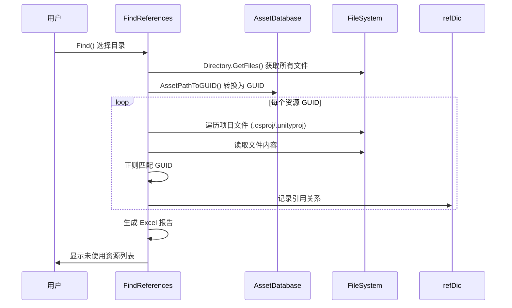

# FindReferences.cs 注解文档

## 文件基本信息

| 属性 | 值 |
|------|-----|
| **文件名** | FindReferences.cs |
| **路径** | Assets/Scripts/Editor/ArtEditor/Resource/FindReferences.cs |
| **所属模块** | Editor → ArtEditor → Resource |
| **文件职责** | 资源引用查找工具，分析资源使用情况，标记未使用的资源 |
| **依赖** | EPPlus (Excel 读写库) |

---

## 类/结构体说明

### FindReferences

| 属性 | 说明 |
|------|------|
| **职责** | 分析指定目录下资源的引用情况，导出未使用资源报告到 Excel |
| **继承关系** | `EditorWindow` (Unity 编辑器窗口基类) |
| **使用场景** | 美术人员查找未使用的资源，进行资源清理和优化 |

---

## 字段与属性

| 名称 | 类型 | 访问级别 | 说明 |
|------|------|----------|------|
| `refDic` | `Dictionary<string, List<string>>` | `static` | 引用关系字典：资源 GUID → 引用该资源的文件列表 |
| `showWin` | `bool` | `static` | 是否显示结果窗口 |

---

## 方法说明

### Find()

**签名**:
```csharp
static public void Find(bool canSeleted = true, bool _showWin = true)
```

**职责**: 启动资源引用查找

**核心逻辑**:
```
1. 设置序列化模式为 ForceText (便于文本分析)
2. 确定查找路径:
   - 如果有选中物体且 canSeleted=true → 使用选中物体路径
   - 否则默认 "Assets/AssetsPackage"
3. 弹出文件夹选择对话框 (如果 canSeleted=true)
4. 调用 FindByArtToolsWindow() 开始分析
```

**调用者**: 菜单命令或其他编辑器工具

---

### FindByArtToolsWindow()

**签名**:
```csharp
public static void FindByArtToolsWindow(string path)
```

**职责**: 通过美术工具窗口启动分析

**核心逻辑**:
```
1. 获取目录下所有文件 Directory.GetFiles()
2. 调用 FindAssetsByArtToolsWindow() 分析文件
```

**调用者**: `Find()`

---

### FindAssetsByArtToolsWindow()

**签名**:
```csharp
public static void FindAssetsByArtToolsWindow(string[] assetsPath)
```

**职责**: 分析资源文件的引用关系

**核心逻辑**:
```
1. 转换文件路径为 GUID 列表 (跳过.meta 文件)
2. 检查 GUID 列表是否为空
3. 如果是目录，展开目录下所有文件
4. 构建检查列表 checkAssetPaths
5. 遍历所有项目文件 (.csproj, .unityproj)
6. 对每个 GUID 调用 FindReference() 查找引用
7. 生成结果报告
```

**调用者**: `FindByArtToolsWindow()`

**被调用者**: `FindReference()`

---

### FindReference()

**签名**:
```csharp
static void FindReference(string guid, Dictionary<string, int> checkAssetPaths, 
    string[] projectFiles)
```

**职责**: 查找指定 GUID 资源的引用

**核心逻辑**:
```
1. 获取资源路径 AssetDatabase.GUIDToAssetPath()
2. 跳过无效路径
3. 遍历所有项目文件
4. 读取文件内容
5. 使用正则表达式查找 GUID 引用
6. 记录引用该资源的文件路径到 refDic
```

**调用者**: `FindAssetsByArtToolsWindow()`

---

### GetRelativeAssetsPath()

**签名**:
```csharp
static string GetRelativeAssetsPath(string path)
```

**职责**: 获取相对于 Assets 目录的路径

**核心逻辑**:
```
1. 检查路径是否包含 "Assets/"
2. 如果是，返回 "Assets/" 后的子路径
3. 否则返回原路径
```

**调用者**: `FindAssetsByArtToolsWindow()`

---

## 引用分析流程



---

## 使用示例

### 示例 1: 分析选中资源

```csharp
// 1. 在 Project 窗口选中一个或多个资源
// 2. 执行菜单命令 (如果有) 或调用:
FindReferences.Find(canSeleted: true, showWin: true);

// 结果：分析选中资源的使用情况
```

### 示例 2: 分析整个资源包

```csharp
// 1. 不选中任何资源
// 2. 调用:
FindReferences.Find(canSeleted: true, showWin: true);
// 3. 在弹出的对话框中选择 Assets/AssetsPackage 目录

// 结果：分析整个资源包的使用情况，导出 Excel 报告
```

### 示例 3: 静默分析

```csharp
// 不显示结果窗口，仅生成数据
FindReferences.Find(canSeleted: false, showWin: false);
```

---

## 输出格式

### Excel 报告结构

| 列名 | 说明 |
|------|------|
| 资源路径 | 资源的相对路径 |
| GUID | 资源的唯一标识符 |
| 引用次数 | 被引用的次数 |
| 引用文件 | 引用该资源的文件列表 |
| 类型 | 资源类型 (.prefab/.unity/.mat/.asset) |

### 未使用资源标记

- 引用次数 = 0 的资源标记为"未使用"
- 可在 Excel 中筛选和排序

---

## 支持的文件类型

### 分析目标 (查找这些文件的使用情况)

- `.prefab` - Prefab 资源
- `.unity` - 场景文件
- `.mat` - 材质资源
- `.asset` - ScriptableObject 等资源

### 引用源 (在这些文件中查找引用)

- `.csproj` - C# 项目文件
- `.unityproj` - Unity 项目文件
- `.prefab` - Prefab 文件 (文本格式)
- `.unity` - 场景文件 (文本格式)
- `.mat` - 材质文件 (文本格式)
- `.controller` - Animator Controller
- 其他文本格式资源

---

## 注意事项

### ⚠️ 序列化模式

工具会自动设置 `EditorSettings.serializationMode = SerializationMode.ForceText`，确保资源以文本格式存储，便于分析。

### ⚠️ 分析性能

- 大型项目分析可能需要较长时间
- 建议按需分析特定目录，而非整个项目
- 分析结果缓存于 `refDic` 字典

### ⚠️ EPPlus 依赖

需要安装 EPPlus 库用于 Excel 导出:
```
Package: EPPlus
用途：读写 Excel 文件 (.xlsx)
```

---

## 相关文档

- [ResourceCheckTool.cs.md](./ResourceCheckTool.cs.md) - 资源检查工具
- [AssetsManagerConfig.cs.md](../AssetsManager/Config/AssetsManagerConfig.cs.md) - 资源配置管理

---

*文档生成时间：2026-03-02 | OpenClaw AI 助手*
